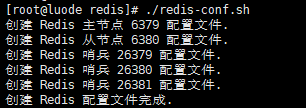
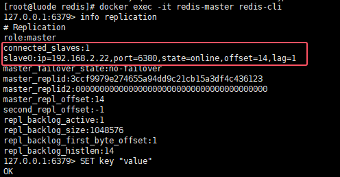
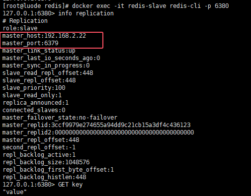
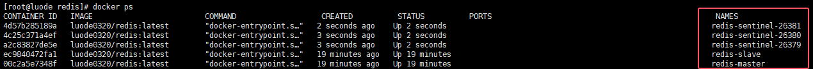
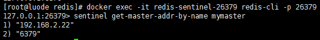
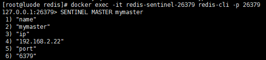
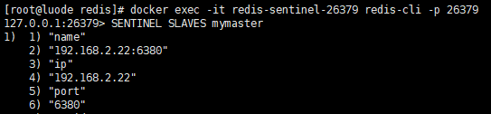
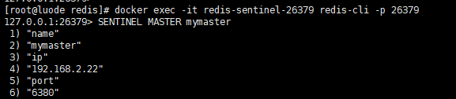

### 部署哨兵

我们可以使用 `luode0320/redis:latest` 容器来部署一个简单的 Redis 哨兵模式环境。

通常所说的“哨兵模式”实际上指的是 **Redis 哨兵结合主从复制**来实现高可用性和自动故障转移。

### 步骤 1: 准备 Docker 环境

首先，确保你的 Docker 环境已经安装好，并且可以正常使用。

- 你也可以来我这里下载离线包, 用sh脚本一键安装 -> [docker](https://github.com/luode0320/docker)

### 步骤 2: 创建 Redis 配置文件

我们需要创建 Redis 配置文件，一个用于主节点，一个用于从节点, 一个用于配置 3 个哨兵节点。

- 我默认部署在一台服务器上, 注意ip地址的调整

```sh
cd /usr/local/src
mkdir -p redis
cd redis
vi redis-conf.sh
```

```sh
#!/bin/bash

# 创建目录
cd /usr/local/src
mkdir -p redis

# 主节点
IP="192.168.2.22"
PORT=6379

#################### 主节点配置文件: 容器内部都用6379端口 #################### 
cat > redis/redis-master.conf <<EOF
port 6379
bind 0.0.0.0
# 关闭保护模式, Redis可以不设置密码
protected-mode no
EOF

echo "创建 Redis 主节点 6379 配置文件."
chmod 777 redis/redis-master.conf

#################### 从节点配置文件: 容器内部都用6379端口 #################### 
cat > redis/redis-slave.conf <<EOF
port 6380
bind 0.0.0.0
# 关闭保护模式, Redis可以不设置密码
protected-mode no

# 设置从节点, 并指定主节点
slaveof $IP $PORT

# 启用 AOF 持久化, 每秒+不强制同步+达到 100% 时重写+文件最小大小+RDB格式作为AOF文件的前缀
appendonly yes
appendfsync everysec
no-appendfsync-on-rewrite no
auto-aof-rewrite-percentage 100
auto-aof-rewrite-min-size 64mb
aof-use-rdb-preamble yes
appendfilename "appendonly.aof"
# 设置 RDB 持久化, 频率+是否压缩 RDB 文件+计算文件的校验和+文件保存目录+文件名
save 900 1
save 300 10
save 60 10000
rdbcompression yes
rdbchecksum yes 
dbfilename "dump.rdb"
EOF
echo "创建 Redis 从节点 6380 配置文件."
chmod 777 redis/redis-slave.conf

#################### 哨兵配置 26379 文件 #################### 
cat > redis/redis-sentinel-26379.conf <<EOF
port 26379
# 主节点 IP 地址并命名为 mymaster,2个哨兵同意
sentinel monitor mymaster 192.168.2.22 6379 2  
# 10000ms没有收到主节点响应，则认为该主节点已宕机
sentinel down-after-milliseconds mymaster 10000 
# 180000ms内未能完成故障转移，则放弃本次故障转移
sentinel failover-timeout mymaster 180000 
# 同时有1个从节点可以与新的主节点同步
sentinel parallel-syncs mymaster 1 
EOF
echo "创建 Redis 哨兵 26379 配置文件."

#################### 哨兵配置 26380 文件 #################### 
cat > redis/redis-sentinel-26380.conf <<EOF
port 26380
# 主节点 IP 地址并命名为 mymaster,2个哨兵同意
sentinel monitor mymaster 192.168.2.22 6379 2  
# 10000ms没有收到主节点响应，则认为该主节点已宕机
sentinel down-after-milliseconds mymaster 10000 
# 180000ms内未能完成故障转移，则放弃本次故障转移
sentinel failover-timeout mymaster 180000 
# 同时有1个从节点可以与新的主节点同步
sentinel parallel-syncs mymaster 1 
EOF
echo "创建 Redis 哨兵 26380 配置文件."

#################### 哨兵配置 26381 文件 #################### 
cat > redis/redis-sentinel-26381.conf <<EOF
port 26381
# 主节点 IP 地址并命名为 mymaster,2个哨兵同意
sentinel monitor mymaster 192.168.2.22 6379 2  
# 10000ms没有收到主节点响应，则认为该主节点已宕机
sentinel down-after-milliseconds mymaster 10000 
# 180000ms内未能完成故障转移，则放弃本次故障转移
sentinel failover-timeout mymaster 180000 
# 同时有1个从节点可以与新的主节点同步
sentinel parallel-syncs mymaster 1 
EOF

echo "创建 Redis 哨兵 26381 配置文件."

echo "创建 Redis 配置文件完成."
```

```sh
chmod 777 redis-conf.sh
./redis-conf.sh
```



### 步骤 3: 启动主从

```sh
# 启动主节点
docker run -d \
  --net host \
  --restart=always \
  --name redis-master \
  -p 6379:6379 \
  -v "/usr/local/src/redis/master:/data" \
  -v "/usr/local/src/redis/redis-master.conf:/etc/redis/redis.conf" \
  luode0320/redis:latest \
  redis-server /etc/redis/redis.conf
  
# 启动从节点
docker run -d \
  --net host \
  --restart=always \
  --name redis-slave \
  -p 6380:6380 \
  -v "/usr/local/src/redis/slave:/data" \
  -v "/usr/local/src/redis/redis-slave.conf:/etc/redis/redis.conf" \
  luode0320/redis:latest \
  redis-server /etc/redis/redis.conf
```

### 步骤 4: 验证主从

1. **验证主节点**： 使用 `redis-cli` 连接到主节点，并查看从节点信息。

```sh
# 验证
docker exec -it redis-master redis-cli info replication 
# 设置一个key
docker exec -it redis-master redis-cli SET key "value"
```



2. 验证从节点：

```sh
# 验证
docker exec -it redis-slave redis-cli -p 6380 info replication 
# 查询
docker exec -it redis-slave redis-cli -p 6380 GET key
# 从节点尝试设置一个key, 会报错, 默认只读
docker exec -it redis-slave redis-cli -p 6380 SET key0 "value"
# (error) READONLY You can't write against a read only replica.
```



### 步骤 5: 启动哨兵

启动三个哨兵实例，确保至少有两个哨兵实例可以达成一致：

```sh
# 第一个哨兵实例 -> 26379
docker run -d \
  --net host \
  --restart=always \
  --name redis-sentinel-26379 \
  -p 26379:26379 \
  -v "/usr/local/src/redis/sentinel-26379:/data" \
  -v "/usr/local/src/redis/redis-sentinel-26379.conf:/etc/redis/redis.conf" \
  luode0320/redis:latest \
  redis-sentinel /etc/redis/redis.conf
  
# 第二个哨兵实例 -> 26380
docker run -d \
  --net host \
  --restart=always \
  --name redis-sentinel-26380 \
  -p 26380:26380 \
  -v "/usr/local/src/redis/sentinel-26380:/data" \
  -v "/usr/local/src/redis/redis-sentinel-26380.conf:/etc/redis/redis.conf" \
  luode0320/redis:latest \
  redis-sentinel /etc/redis/redis.conf
  
# 第三个哨兵实例 -> 26381
docker run -d \
  --net host \
  --restart=always \
  --name redis-sentinel-26381 \
  -p 26381:26381 \
  -v "/usr/local/src/redis/sentinel-26381:/data" \
  -v "/usr/local/src/redis/redis-sentinel-26381.conf:/etc/redis/redis.conf" \
  luode0320/redis:latest \
  redis-sentinel /etc/redis/redis.conf
```



### 步骤 6: 验证哨兵状态

1. 使用 `redis-cli` 连接到任意一个哨兵实例，输出应显示主节点的 IP 地址和端口：

```sh
docker exec -it redis-sentinel-26379 redis-cli -p 26379 sentinel get-master-addr-by-name mymaster
```



2. 使用 Redis CLI 检查哨兵状态

   ```sh
   docker exec -it redis-sentinel-26379 redis-cli -p 26379 SENTINEL SENTINELS mymaster
   ```

```sh
   1)  1) "name"
       2) "fcb0cb65d08948ba4d5042376b2a29f2d3d244ee"
       3) "ip"
       4) "192.168.2.22"
       5) "port"
       6) "26381"
       7) "runid"
       8) "fcb0cb65d08948ba4d5042376b2a29f2d3d244ee"
       9) "flags"
      10) "sentinel"
   2)  1) "name"
       2) "58bcb39ea386f322fbd3fac21b7394b242303a30"
       3) "ip"
       4) "192.168.2.22"
       5) "port"
       6) "26380"
       7) "runid"
       8) "58bcb39ea386f322fbd3fac21b7394b242303a30"
       9) "flags"
      10) "sentinel"
```

```sh
   docker exec -it redis-sentinel-26380 redis-cli -p 26380 SENTINEL SENTINELS mymaster
```

   ```sh
1)  1) "name"
       2) "fcb0cb65d08948ba4d5042376b2a29f2d3d244ee"
       3) "ip"
       4) "192.168.2.22"
       5) "port"
       6) "26381"
       7) "runid"
       8) "fcb0cb65d08948ba4d5042376b2a29f2d3d244ee"
       9) "flags"
      10) "sentinel"
   2)  1) "name"
       2) "015c6696a973696455c6ac3510ff28109dd52eb6"
       3) "ip"
       4) "192.168.2.22"
       5) "port"
       6) "26379"
       7) "runid"
       8) "015c6696a973696455c6ac3510ff28109dd52eb6"
       9) "flags"
      10) "sentinel"
   ```

3. 查看主节点

   ```sh
   docker exec -it redis-sentinel-26379 redis-cli -p 26379 SENTINEL MASTER mymaster
   ```



4. 查看从节点信息

   ```sh
   docker exec -it redis-sentinel-26379 redis-cli -p 26379 SENTINEL SLAVES mymaster
   ```



### 步骤 7: 停止主节点测试切换

1. 停止主节点

   ```sh
   docker stop redis-master
   ```

2. 再次查看主节点

   ```sh
   docker exec -it redis-sentinel-26379 redis-cli -p 26379 SENTINEL MASTER mymaster
   ```



主节点自动由 6379 转换成了 6380。