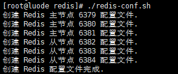
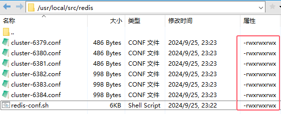
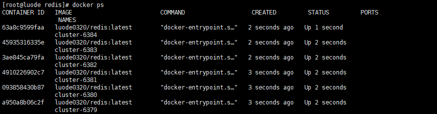
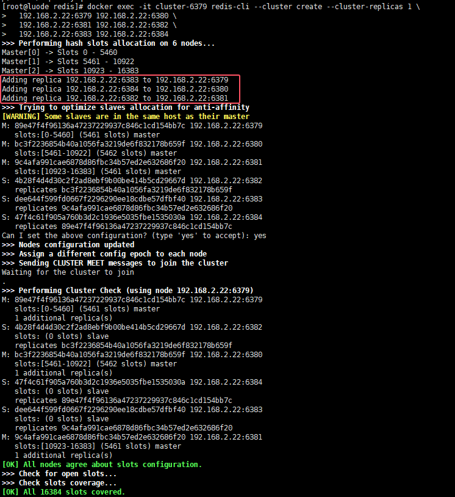
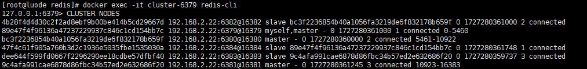
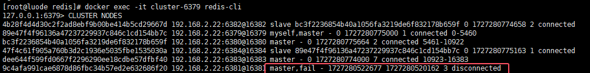
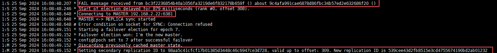
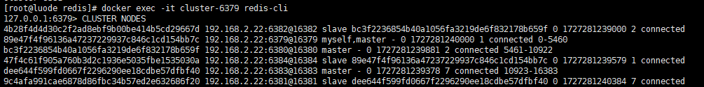

### 部署切片集群

我们可以使用 `luode0320/redis:latest` 容器来部署一个简单的 Redis 切片集群环境。

- 这是 7.0 + 的Redis。
- 在 Redis 7.0 及更高版本中，从节点配置主节点的方式有所变化。
- 在旧版本中，可以使用 `cluster-replica-of` 指令直接在配置文件中指定主节点的 IP 和端口。
- 在 Redis 7.0 及更高版本中，从节点会通过集群内部的机制自动发现其应该复制的主节点。
- 是通过集群初始化的命令来连接各个节点的。

### 步骤 1: 准备 Docker 环境

首先，确保你的 Docker 环境已经安装好，并且可以正常使用。

- 你也可以来我这里下载离线包, 用sh脚本一键安装 -> [docker](https://github.com/luode0320/docker)

### 步骤 2: 创建 Redis 配置文件

我们需要创建 Redis 配置文件，使用六个节点（三个主节点和三个从节点）来构建一个简单的集群。

- 我默认部署在一台服务器上, 注意ip地址的调整
- 从节点默认就是只读模式，无需额外配置。

```sh
cd /usr/local/src
mkdir -p redis
cd redis
vi redis-conf.sh
```

```sh
#!/bin/bash

# 创建目录
cd /usr/local/src
mkdir -p redis

############################## 主节点 6379 配置文件 ##############################
cat > redis/cluster-6379.conf <<EOF
port 6379
bind 0.0.0.0
# 关闭保护模式, Redis可以不设置密码
protected-mode no

# 开启切片集群
cluster-enabled yes
# 指定 Redis 集群使用的配置文件名,集群发生改变时，会更新这个配置文件
cluster-config-file cluster-6379.conf
# 节点被认为不可达的时间(毫秒)
cluster-node-timeout 5000
# 自动故障转移相关设置, 只要从节点足够新，就可以被提升为主节点
cluster-require-full-coverage no
cluster-replica-validity-factor 100
EOF
echo "创建 Redis 主节点 6379 配置文件."
chmod 777 redis/cluster-6379.conf

############################## 主节点 6380 配置文件 ##############################
cat > redis/cluster-6380.conf <<EOF
port 6380
bind 0.0.0.0
# 关闭保护模式, Redis可以不设置密码
protected-mode no

# 开启切片集群
cluster-enabled yes
# 指定 Redis 集群使用的配置文件名,集群发生改变时，会更新这个配置文件
cluster-config-file cluster-6380.conf
# 节点被认为不可达的时间(毫秒)
cluster-node-timeout 5000
# 自动故障转移相关设置, 只要从节点足够新，就可以被提升为主节点
cluster-require-full-coverage no
cluster-replica-validity-factor 100
EOF
echo "创建 Redis 主节点 6380 配置文件."
chmod 777 redis/cluster-6380.conf

############################## 主节点 6381 配置文件 ##############################
cat > redis/cluster-6381.conf <<EOF
port 6381
bind 0.0.0.0
# 关闭保护模式, Redis可以不设置密码
protected-mode no

# 开启切片集群
cluster-enabled yes
# 指定 Redis 集群使用的配置文件名,集群发生改变时，会更新这个配置文件
cluster-config-file cluster-6381.conf
# 节点被认为不可达的时间(毫秒)
cluster-node-timeout 5000
# 自动故障转移相关设置, 只要从节点足够新，就可以被提升为主节点
cluster-require-full-coverage no
cluster-replica-validity-factor 100
EOF
echo "创建 Redis 主节点 6381 配置文件."
chmod 777 redis/cluster-6381.conf
########### 主节点配置完成 #############


############################## 从节点 6382 配置文件 ##############################
cat > redis/cluster-6382.conf <<EOF
port 6382
bind 0.0.0.0
# 关闭保护模式, Redis可以不设置密码
protected-mode no

# 开启切片集群
cluster-enabled yes
# 指定 Redis 集群使用的配置文件名,集群发生改变时，会更新这个配置文件
cluster-config-file cluster-6382.conf
# 节点被认为不可达的时间(毫秒)
cluster-node-timeout 5000
# 自动故障转移相关设置, 只要从节点足够新，就可以被提升为主节点
cluster-require-full-coverage no
cluster-replica-validity-factor 100

# 启用 AOF 持久化, 每秒+不强制同步+达到 100% 时重写+文件最小大小+RDB格式作为AOF文件的前缀
appendonly yes
appendfsync everysec
no-appendfsync-on-rewrite no
auto-aof-rewrite-percentage 100
auto-aof-rewrite-min-size 64mb
aof-use-rdb-preamble yes
appendfilename "appendonly.aof"
# 设置 RDB 持久化, 频率+是否压缩 RDB 文件+计算文件的校验和+文件保存目录+文件名
save 900 1
save 300 10
save 60 10000
rdbcompression yes
rdbchecksum yes 
dbfilename "dump.rdb"
EOF
echo "创建 Redis 从节点 6382 配置文件."
chmod 777 redis/cluster-6382.conf

############################## 从节点 6383 配置文件 ##############################
cat > redis/cluster-6383.conf <<EOF
port 6383
bind 0.0.0.0
# 关闭保护模式, Redis可以不设置密码
protected-mode no

# 开启切片集群
cluster-enabled yes
# 指定 Redis 集群使用的配置文件名,集群发生改变时，会更新这个配置文件
cluster-config-file cluster-6383.conf
# 节点被认为不可达的时间(毫秒)
cluster-node-timeout 5000
# 自动故障转移相关设置, 只要从节点足够新，就可以被提升为主节点
cluster-require-full-coverage no
cluster-replica-validity-factor 100

# 启用 AOF 持久化, 每秒+不强制同步+达到 100% 时重写+文件最小大小+RDB格式作为AOF文件的前缀
appendonly yes
appendfsync everysec
no-appendfsync-on-rewrite no
auto-aof-rewrite-percentage 100
auto-aof-rewrite-min-size 64mb
aof-use-rdb-preamble yes
appendfilename "appendonly.aof"
# 设置 RDB 持久化, 频率+是否压缩 RDB 文件+计算文件的校验和+文件保存目录+文件名
save 900 1
save 300 10
save 60 10000
rdbcompression yes
rdbchecksum yes 
dbfilename "dump.rdb"
EOF
echo "创建 Redis 从节点 6383 配置文件."
chmod 777 redis/cluster-6383.conf

############################## 从节点 6384 配置文件 ##############################
cat > redis/cluster-6384.conf <<EOF
port 6384
bind 0.0.0.0
# 关闭保护模式, Redis可以不设置密码
protected-mode no

# 开启切片集群
cluster-enabled yes
# 指定 Redis 集群使用的配置文件名,集群发生改变时，会更新这个配置文件
cluster-config-file cluster-6384.conf
# 节点被认为不可达的时间(毫秒)
cluster-node-timeout 5000
# 自动故障转移相关设置, 只要从节点足够新，就可以被提升为主节点
cluster-require-full-coverage no
cluster-replica-validity-factor 100

# 启用 AOF 持久化, 每秒+不强制同步+达到 100% 时重写+文件最小大小+RDB格式作为AOF文件的前缀
appendonly yes
appendfsync everysec
no-appendfsync-on-rewrite no
auto-aof-rewrite-percentage 100
auto-aof-rewrite-min-size 64mb
aof-use-rdb-preamble yes
appendfilename "appendonly.aof"
# 设置 RDB 持久化, 频率+是否压缩 RDB 文件+计算文件的校验和+文件保存目录+文件名
save 900 1
save 300 10
save 60 10000
rdbcompression yes
rdbchecksum yes 
dbfilename "dump.rdb"
EOF
echo "创建 Redis 从节点 6384 配置文件."
chmod 777 redis/cluster-6384.conf
########## 从节点配置完成 ##############

echo "创建 Redis 配置文件完成."
```

```sh
chmod 777 redis-conf.sh
./redis-conf.sh
```





### 步骤 3: 启动

```sh
docker run -d \
  --net host \
  --restart=always \
  --name cluster-6379 \
  -p 6379:6379 \
  -v "/usr/local/src/redis/cluster-6379:/data" \
  -v "/usr/local/src/redis/cluster-6379.conf:/etc/redis/redis.conf" \
  luode0320/redis:latest \
  redis-server /etc/redis/redis.conf
  
docker run -d \
  --net host \
  --restart=always \
  --name cluster-6380 \
  -p 6380:6380 \
  -v "/usr/local/src/redis/cluster-6380:/data" \
  -v "/usr/local/src/redis/cluster-6380.conf:/etc/redis/redis.conf" \
  luode0320/redis:latest \
  redis-server /etc/redis/redis.conf
  
docker run -d \
  --net host \
  --restart=always \
  --name cluster-6381 \
  -p 6381:6381 \
  -v "/usr/local/src/redis/cluster-6381:/data" \
  -v "/usr/local/src/redis/cluster-6381.conf:/etc/redis/redis.conf" \
  luode0320/redis:latest \
  redis-server /etc/redis/redis.conf
  
docker run -d \
  --net host \
  --restart=always \
  --name cluster-6382 \
  -p 6382:6382 \
  -v "/usr/local/src/redis/cluster-6382:/data" \
  -v "/usr/local/src/redis/cluster-6382.conf:/etc/redis/redis.conf" \
  luode0320/redis:latest \
  redis-server /etc/redis/redis.conf
  
docker run -d \
  --net host \
  --restart=always \
  --name cluster-6383 \
  -p 6383:6383 \
  -v "/usr/local/src/redis/cluster-6383:/data" \
  -v "/usr/local/src/redis/cluster-6383.conf:/etc/redis/redis.conf" \
  luode0320/redis:latest \
  redis-server /etc/redis/redis.conf
  
docker run -d \
  --net host \
  --restart=always \
  --name cluster-6384 \
  -p 6384:6384 \
  -v "/usr/local/src/redis/cluster-6384:/data" \
  -v "/usr/local/src/redis/cluster-6384.conf:/etc/redis/redis.conf" \
  luode0320/redis:latest \
  redis-server /etc/redis/redis.conf
```



**此时, 节点之间是没有任何联系的, 还没有成立集群。**

### 步骤 4: 初始化集群

用第一个节点初始化集群, 设置每个主节点一个从节点：

```sh
docker exec -it cluster-6379 redis-cli --cluster create --cluster-replicas 1 \
  192.168.2.22:6379 192.168.2.22:6380 \
  192.168.2.22:6381 192.168.2.22:6382 \
  192.168.2.22:6383 192.168.2.22:6384
```



主节点: 6379 6380 6381

从节点: 6383 6384 6382

### 步骤 5: 验证集群状态

使用 `INFO` 或者 `CLUSTER NODES` 命令来验证集群的状态：

```sh
docker exec -it cluster-6379 redis-cli CLUSTER NODES
```



### 步骤 6: 测试故障转移

1. 为了测试故障转移，你可以停止一个主节点，然后观察集群的行为

   ```sh
   docker stop cluster-6381
   ```

2. 再次观察集群

   ```sh
   docker exec -it cluster-6379 redis-cli CLUSTER NODES
   ```



我们看到了 6381 的节点被标记为fail, 并且 6383 的节点被提升为主节点。

3. 然后观察6383节点的日志，查看是否有从节点被提升为主节点的消息

   ```sh
   docker logs -f cluster-6383
   ```

   

    1. 接收到关于节点 `9c4afa991cae6878d86fbc34b57ed2e632686f20` 的失败消息
    2. 选举延迟 879 毫秒
    3. 尝试连接到故障节点 6381
    4. 同步连接失败, 无法响应连接请求
    5. 开始故障转移选举, 选举的 epoch 为 7
    6. 选举获胜并成为新主节点, 成为新的主节点
        - 配置版本号（configEpoch）设置为 7。
        - 清除之前缓存的主节点状态。
        - 设置了新的复制 ID。


4. 我们再次启动主动停止的 6381 节点

   ```sh
   docker start cluster-6381
   ```

5. 再次观察集群

   ```sh
   docker exec -it cluster-6379 redis-cli CLUSTER NODES
   ```



6381 变更为从节点, 他与 6383 的版本都是 7, 说明是挂在 6383 的从节点。 


