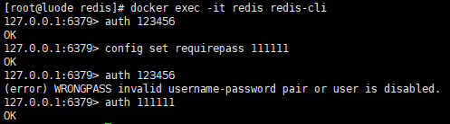

### 如何设置密码及验证密码

1. Redis的节点:

   ```sh
   docker run -d \
   --restart=always \
   --name redis \
   -p 6379:6379 \
   luode0320/redis:latest \
   --requirepass 123456
   ```

2. 修改密码

   ```sh
   # 用旧密码授权
   auth 123456
   
   # 设置新密码
   config set requirepass 111111
   
   # 再次用旧密码授权: 会失败
   auth 123456
   
   # 新密码授权: 成功
   auth 111111
   ```

