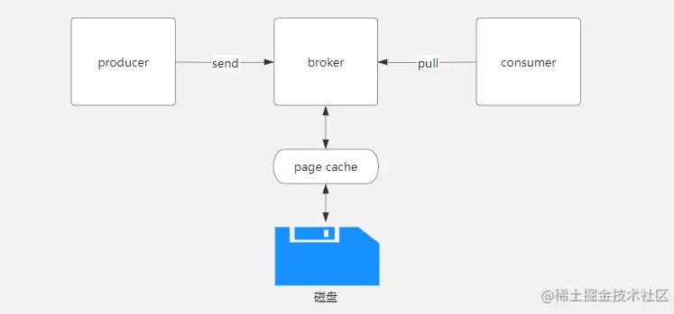

# 消息发送和接收流程

1. kafka生产者生产好消息后，会将消息发送到broker节点
2. broker对数据进行存储，kafka的消息是顺序存储在磁盘上，以主题(topic)，分区(partition)的逻辑进行划分，消息最终存储在日志文件中
3. 消费者会循环从broker拉取消息。

那么从上图的图中可以看出kafka丢消息可能存在的三个地方分别为：

- 生产者到broker
- broker到磁盘
- 消费者

# Kafka丢消息怎么处理

Kafka存在丢消息的问题，消息丢失会发生在Broker，Producer和Consumer三种。

## Producer生产者

> producer生产者是通过ack机制，处理消息丢失

- **acks=0**，producer不等待broker的响应，效率最高，但是消息很可能会丢。
- **acks=1**，leader
  broker收到消息后，不等待其他follower副本的响应，即返回ack。也可以理解为ack数为1。此时，如果follower副本还没有收到leader同步的消息leader就挂了，那么消息可能会丢失。
- **acks=-1**，leader broker收到消息后，挂起，等待所有ISR的列表follower副本返回结果后，再返回ack。这种配置下，只有leader写入数据到pagecache是不会返回ack的，还需要所有ISR的列表follower副本返回“成功”才会触发ack。

**上面提到了ISR的列表的follower副本，需要配合另一个参数才能更好的保证ack的有效性:**

- ISR是Broker维护的一个“可靠的follower列表”，in-sync Replica列表，broker的配置包含一个参数：**min.insync.replicas**。
- 该参数表示ISR中最少的副本数, 默认值是1。
- 也就是说, 如果你部署的集群是6个节点, 理论上有5个副本, 但是你没有配置**min.insync.replicas**
- 就算配置了**acks=-1**, 依旧只有1个副本同步就会返回成功的响应

## Broker服务端(不推荐)

> Broker服务端是通过日志持久化配置, 处理消息丢失
>
> - 实际上一般不会是因为这个出现丢失, 而且也不会用这个方式来处理
>
> - 因为一般是通过kafka集群的方式, 使得数据有多个副本来保证服务端消息不丢失

**日志刷盘策略**: 

- 消息的刷盘过程，为了提高性能，减少刷盘次数，kafka采用了批量刷盘的做法。即，按照一定的消息量，和时间间隔进行刷盘。

- 将数据存储到linux操作系统种，会先存储到页缓存（Page cache）中，按照时间或者其他条件进行刷盘，或者通过`fsync`命令强制刷盘。

- 数据在page cache中时，如果系统挂掉，数据会丢失。
- **log.flush.interval.ms**:
  - 这个配置项指定了Kafka多久将消息缓冲区的数据刷新到磁盘一次，无论缓冲区是否已满。
  - 这是一个基于时间的刷盘策略。例如，你可以设置`log.flush.interval.ms=1000`来指示Kafka每隔1000毫秒将消息刷盘一次。
- **log.flush.interval.messages**:
  - 此配置项指定了消息缓冲区累积了多少条消息后会触发一次刷盘操作。
  - 这是一个基于消息数量的刷盘策略。例如，配置`log.flush.interval.messages=10000`来指示Kafka收集了10000条消息将刷盘一次。

## Consumer消费者

> Consumer消费者是手动提交offset偏移量, 处理消息丢失

消费者丢失消息的情况出现在, 消费没有成功, 但是offset偏移量却提交了

- 这种情况只有在设置为自动提交的时候才会出现
- 因为如果手动提交, 我们出现发现了错误是不会提交offset的, 下次消费依然会重新消费这条消息
- 那么只有设置为提交自动, 到了自动提交的时间提交了offset偏移量, 但是消费者最终消费失败, 导致消息丢失

像这种情况在Java中, 我们需要手动提交offset偏移量

如果是go中, 实际上不管是手动还是自动, **都需要调用提交标志**, 所以不会出现这种情况