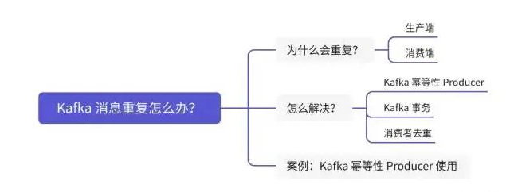

# Kafka重复消费

> 通常，消息消费时候都会设置一定重试次数来避免网络波动造成的影响，同时带来副作用是可能出现消息重复。

## 生产者消息重复示例

- 对于一个消息A, 正常情况下不会发送失败, 就算发送失败了也会重试发送

- 但是在异常情况下, 比如网络超时, 实际上服务端可能已经**成功**将信息持久化, 但是业务网络问题生产者超时, 导致**触发重试, 出现了重复**的消息

  

**解决方案:**

消息重复的问题需要幂等`enable.idempotence`的支持:

- `enable.idempotence` 是 Kafka 生产者配置中的一个关键参数，它控制着生产者是否开启幂等性生产功能。
- 幂等默认是false关闭的
- **前提条件**：要启用幂等性，生产者必须满足以下条件：
  - `acks` 参数必须设置为 `"-1"`，这意味着所有参与复制的副本都必须确认消息，以确保消息被持久化。
- 启用幂等性后，Kafka 生产者会在内部跟踪已发送但尚未确认的消息，并在发生重试时避免重复发送这些消息，从而防止消息在分区中重复出现
- 当然这会增加内存消耗

## 消费者重复消费示例

- 对于一个消息A, 正常情况下不会消费失败, 就算失败了理论上重试不会影响最终的结果

- 但是在异常情况下, 比如有事务问题、网络超时, 最终导致重试

  - 如果消费失败但消费程序中修改的数据没有回滚, 导致重试再次消费数据和预期不一样
  - 如果消费没有失败, 数据被修改是正常的, 但是处理时间超时, 导致重试再次消费数据和预期不一样

  

**解决方案:**

消费者自己保证事务回滚 + 手动提交offset偏移量

- 消费如果出现错误, 消费者逻辑需要自行处理回滚的问题

- 手动提交offset偏移量, java需要手动调用提交, go只需要标记提交开启自动提交即可

  

> 在这两个示例中, 生产者只需要配置即可, 重点还是在消费者

# 重复消费的根本原因

> 消息重复消费的根本原因都在于：**已经消费了数据，但是offset没有成功提交。**

其中很大一部分原因在于发生了**再均衡**:

1. 消费者宕机、重启等。导致消息已经消费但是没有提交offset。

2. 有新的消费者加入或者移除，发生了rebalance。再次消费的时候，消费者会根据提交的偏移量来，于是重复消费了数据。

3. 消息处理耗时，或者消费者拉取的消息量太多，处理耗时，超过了**max.poll.interval.ms**的配置时间，导致认为当前消费者已经死掉，触发再均衡。
   - **max.poll.interval.ms:** 两次拉取消息的间隔，默认5分钟；通过消费组管理消费者时，该配置指定拉取消息线程最长空闲时间
   - 若超过这个时间间隔没有发起poll操作，则消费组认为该消费者已离开了消费组，将进行再均衡操作（将分区消息分配给组内其他消费者成员消费）
     - 可以将再均衡理解为: kafka会断开所有消费者连接, 重新建立连接, 类似于重启消费者
     -  这样就会出现**重启后**重复拉取之前没有提交, 但是已经再处理/超时的消息(重启消费者不会打断已经再执行的消费程序)

## 消费者宕机、重启解决方案:

由于网络问题，重复消费不可避免，因此，消费者需要实现消费幂等。

- 查询后更新: 对于需要更新修改的数据, 先用前置条件查询后, 再修改

- 数据库唯一键幂等: 保证插入数据不会出现重复
- redis缓存: 利用中间件缓存最近已经消费成功的记录 

## 新的消费者加入发生再均衡

> 与消费者宕机、重启的解决方案一致

## 消息处理超时

>  处理耗时，超过了**max.poll.interval.ms**的配置时间，导致认为当前消费者已经死掉，触发再均衡

上面说的3种方式依旧是通用的解决方案

但是超时需要有补充的解决方案

- 优化消费者消费性能(废话)
- 延长**max.poll.interval.ms**配置的超时时间, 让消费者心跳超时时间长一点
- `max.poll.records`参数的默认值是500。这意味着在没有特别配置的情况下，Kafka消费者在每次调用`poll()`方法时，最多能获取500条消息。
  - 如果消费太慢超时, 可以适当降低这个数值, 让消费不会超时(虽然性能还是很拉跨, 但是至少能用)