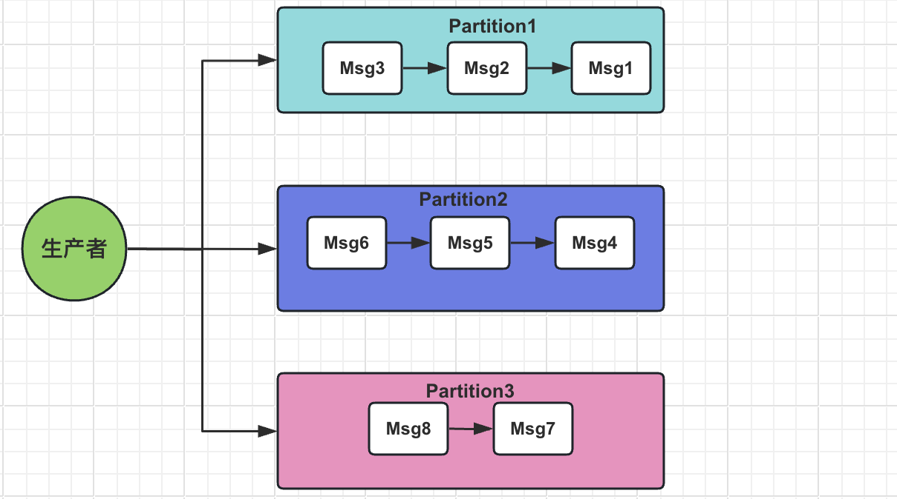
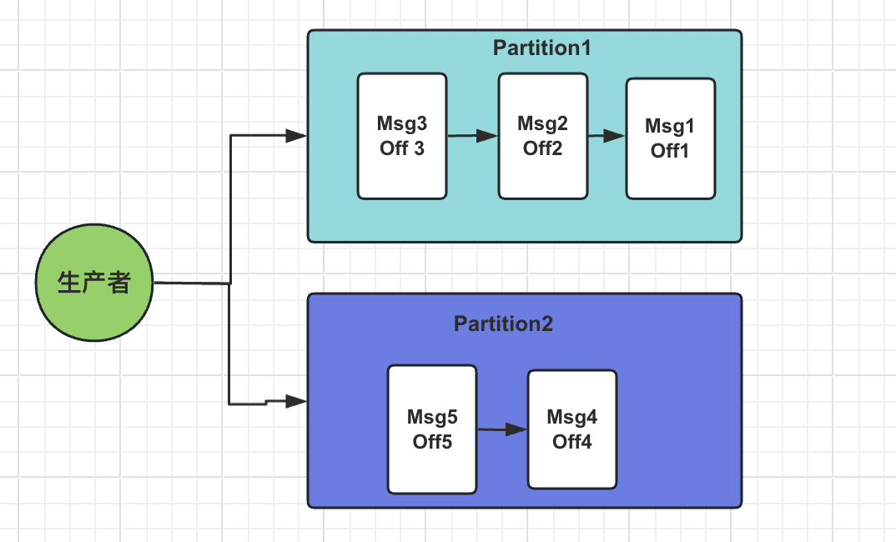
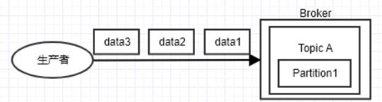
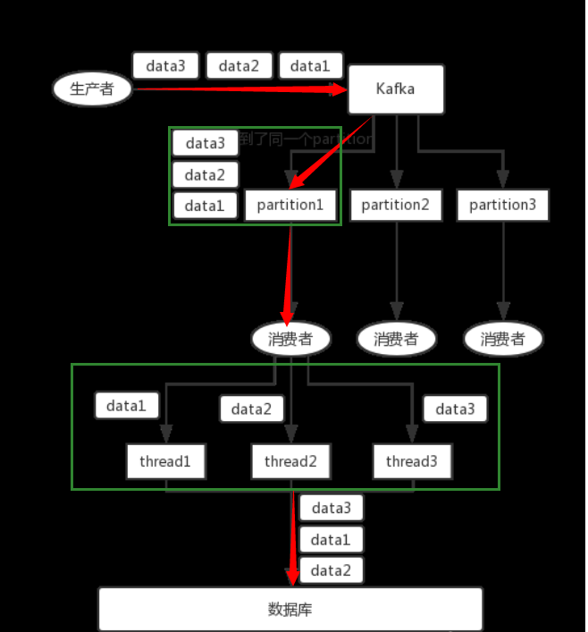
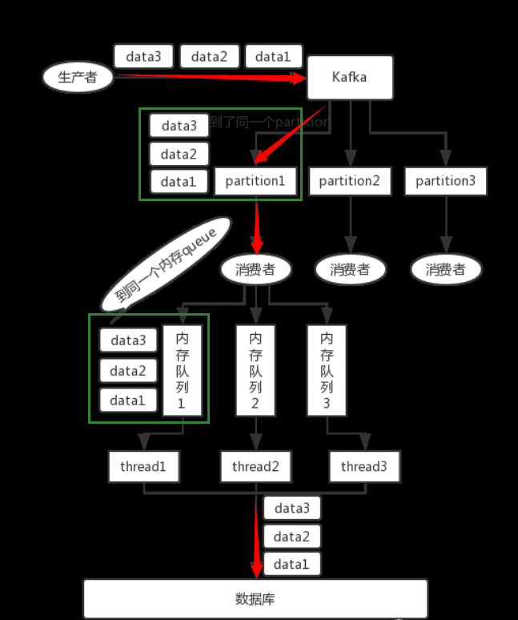

# 简介

> Kafka采用了分区（Partition）的设计，确保了单一分区内消息的严格顺序。

在分布式系统中，消息顺序消费扮演着至关重要的角色。

- 金融交易系统中，账户间的转账操作必须严格按照发出请求的顺序进行处理，否则可能导致资金不匹配


每个分区内部的消息是由一个生产者不断追加的，因此消费者可以从分区的开始位置顺序消费这些消息。

此外，Kafka允许用户通过自定义分区策略，依据消息键（Key）将具有顺序要求的消息路由到特定分区，从而在多分区环境下仍然能够相对保证消息顺序消费。


# Kafka中的消息顺序保证原理

在Kafka中，消息顺序性的保障主要依托于其独特的分区（Partition）机制以及消息键（Key）的使用。

## 分区的作用

Kafka的主题（Topic）可以被划分为多个分区，每个分区都是一个独立的顺序日志存储。

如下图所示，每个分区内部的消息按照其生成的先后顺序排列，形成一个有序链表结构。



当生产者向主题发送消息时，可以选择指定消息的键（Key）。

若未指定或Key为空，消息将在各个分区间平均分布；

若指定了Key，Kafka会根据Key和分区数计算出一个哈希值，确保具有相同Key的消息会被发送到同一个分区，从而确保这些消息在分区内部是有序的。


### 单分区内的消息顺序性保证

在单个Kafka分区中，消息的顺序性得到了严格的保证。

新产生的消息总是附加到分区日志的末端，消费者按照消息在分区中的物理顺序进行消费。

如下图所示，每个分区内部的消息具有明确的偏移量（`Offset`），消费者按照递增的Offset顺序消费消息。



### 利用键（Key）实现消息到特定分区的路由策略

通过为消息设置Key，Kafka可以确保具有相同Key的消息被路由到同一个分区，这就为实现消息顺序消费提供了基础。

以下是一个简单的键路由策略的伪代码表示：

```java
// 获取分区总数
List<PartitionInfo> partitions = cluster.partitionsForTopic(topic);
int numPartitions = partitions.size();

// 假设key是String类型，可以根据业务需求转换key类型并计算分区索引
if (key instanceof String) {
    int partition = Math.abs(key.hashCode() % numPartitions); // 简单的哈希取模分区策略
    // 或者实现更复杂的逻辑，比如根据key的某些特性路由到固定分区
    return partition;
} else {
    // 如果没有key，或者key不是预期类型，可以采用默认的轮询方式
    return counter.getAndIncrement() % numPartitions;
}
```

通过上述策略，我们可以根据业务需求将相关联的消息路由到特定分区，从而在该分区范围内保证消息的顺序消费。

而在全局层面，需要业务逻辑本身支持消息的局部顺序性，并通过合理设置分区数和消费者数量，兼顾消息顺序与处理效率之间的平衡。


## 全局有序

由于Kafka的一个Topic可以分为了多个Partition，Producer发送消息的时候，是分散在不同 Partition的。

当Producer按顺序发消息给Broker，但进入Kafka之后，这些消息就不一定进到哪个Partition，会导致顺序是乱的。

因此要满足全局有序，需要1个Topic只能对应1个Partition。



如果多线程消费但是消费的业务逻辑不保证顺序会出现下图所示，消费端造成的消费乱序:



所以对应的consumer消费者也要使用**单线程**或者自定义实现**保证消费顺序的线程模型**


## 局部有序

要满足局部有序，只需要在发消息的时候指定Partition Key，Kafka对其进行Hash计算，根据计算结果决定放入哪个Partition。

这样Partition Key相同的消息会放在同一个Partition。此时，Partition的数量仍然可以设置多个，提升Topic的整体吞吐量。

如下图所示，在不增加partition分区数量的情况下想提高消费速度，可以考虑再次hash唯一标识（例如订单orderId）到不同的线程上，多个消费者线程并发处理消息（保证局部有序）。



这个时候就需要根据业务的属性, 对不同的消息进行分类处理了。


# 消息发送重试对顺序消息的影响

**示例1:** 

- 对于一个有着先后顺序的消息A、B，正常情况下应该是A先发送完成后再发送B

- 但是在异常情况下，在A发送失败的情况下，B发送成功，而A由于重试机制在B发送完成之后重试发送成功了。这时对于本身顺序为AB的消息顺序变成了BA。


解决方案:

严格的顺序消费还需要`max.in.flight.requests.per.connection`参数的支持:

- 在较早的版本中，该值默认为5, 在2.0及之后的版本中，该值的默认设置改为了1，以简化消息顺序性和幂等性的管理。

- 该参数指定了生产者在收到服务器响应之前可以发送多少个消息。它的值越高，就会占用越多的内存，同时也会提升吞吐量。
- 把它设为1就可以保证消息是按照发送的顺序写入服务器的。


**示例2:**

- 对于一个消息A, 正常情况下不会发送失败, 就算发送失败了也会重试发送

- 但是在异常情况下, 比如网络超时, 实际上服务端可能已经成功将信息持久化, 但是业务网络问题生产者超时, 导致触发重试, 出现了重复的消息

  

解决方案:

消息重复的问题需要幂等`enable.idempotence`的支持:

- `enable.idempotence` 是 Kafka 生产者配置中的一个关键参数，它控制着生产者是否开启幂等性生产功能。
- 幂等默认是false关闭的
- **前提条件**：要启用幂等性，生产者必须满足以下条件：
  - `acks` 参数必须设置为 `"-1"`，这意味着所有参与复制的副本都必须确认消息，以确保消息被持久化。
- 启用幂等性后，Kafka 生产者会在内部跟踪已发送但尚未确认的消息，并在发生重试时避免重复发送这些消息，从而防止消息在分区中重复出现
- 当然这会增加内存消耗


# 消息重复消费对顺序消息的影响

在前面我们已经解决了消息不会重复生产的问题, 至少保证了服务端内部消息不会重复, 但是还剩下一个问题, 就是重复消费

> 消息重复消费的根本原因都在于：**已经消费了数据，但是offset没有成功提交。**


**示例1:**

- 一个账户因同一条转账消息被重复消费而被错误地扣款两次，尽管每次消费都是按照消息的原始顺序进行的，但这显然违反了业务规则。


解决方案:

- 查询后更新: 对于需要更新修改的数据, 先用前置条件查询后, 再修改
- 数据库唯一键幂等: 保证插入数据不会出现重复
- redis缓存: 利用中间件缓存最近已经消费成功的记录 
- 延长**max.poll.interval.ms**配置的超时时间, 让消费者心跳超时时间长一点
- `max.poll.records`参数的默认值是500。这意味着在没有特别配置的情况下，Kafka消费者在每次调用`poll()`方法时，最多能获取500条消息。
  - 如果消费太慢超时, 可以适当降低这个数值, 让消费不会超时(虽然性能还是很拉跨, 但是至少能用)