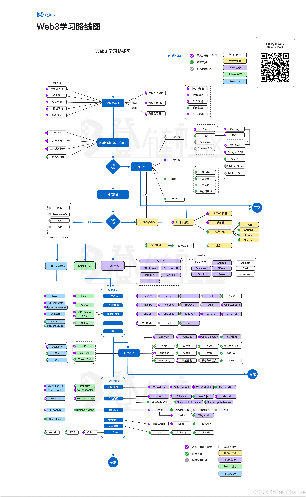

### 1. 区块链基础

- **基础知识**：理解区块链的基本概念，包括什么是区块链、其工作原理、区块链的特点和优势。
- **历史发展**：了解区块链的发展历程，从比特币的诞生到现代区块链的应用。
- **分类**：学习区块链的不同类型，如公有链、联盟链、私有链等。
- **信任模型**：探讨区块链如何解决信任问题，特别是去中心化带来的信任机制。

### 2. 比特币核心技术

- **比特币白皮书**：阅读中本聪的原始比特币白皮书，了解比特币的设计初衷和技术架构。
- **非对称加密**：学习比特币中的公钥密码学，包括公钥、私钥和数字签名。
- **哈希函数**：理解SHA-256等哈希函数在比特币中的作用。
- **UTXO模型**：学习未花费交易输出（UTXO）模型，它是比特币交易的核心概念。
- **挖矿机制**：了解比特币的挖矿过程，包括工作量证明（PoW）共识算法。

### 3. 以太坊核心技术

- **以太坊白皮书**：阅读以太坊的白皮书，了解其设计理念和技术架构。
- **智能合约**：学习以太坊智能合约的基础知识，包括Solidity语言。
- **以太坊虚拟机（EVM）**：理解以太坊虚拟机的工作原理，以及如何在其上执行智能合约。
- **账户模型**：了解以太坊中的账户模型，包括外部账户和合约账户的区别。
- **Gas机制**：学习Gas的概念及其在以太坊交易中的作用。

### 4. Hyperledger Fabric 等联盟链学习了解

- **Hyperledger Fabric**：学习Hyperledger Fabric的核心组件，如通道（Channels）、链码（Chaincode）等。
- **联盟链特点**：了解联盟链与公有链的区别，以及联盟链的优势和应用场景。
- **权限管理**：学习如何在联盟链中管理权限和隐私。
- **案例研究**：研究一些实际的Hyperledger Fabric应用案例。

### 5. Solidity 智能合约开发

- **Solidity基础**：学习Solidity语言的基础语法，包括变量、数据类型、函数等。
- **智能合约设计**：学习如何设计安全的智能合约，避免常见的安全漏洞。
- **测试和调试**：掌握智能合约的测试方法，包括单元测试、集成测试等。
- **部署和交互**：学习如何部署智能合约到以太坊网络，并与之交互。

### 6. Web3 技术学习与实践

- **Web3库**：学习如何使用Web3.js、Ethers.js等库与以太坊节点进行交互。
- **前端集成**：学习如何在前端应用中集成Web3，例如使用React或Vue.js构建dApp。
- **用户认证**：了解如何使用Metamask等钱包进行用户认证。
- **API设计**：学习如何设计RESTful API来处理与区块链的交互逻辑。

### 7. IPFS、跨链等热门技术学习

- **IPFS**：学习去中心化的文件存储系统IPFS，以及如何在dApp中使用IPFS存储静态资源。
- **跨链技术**：了解不同区块链之间如何通过跨链技术实现互操作性。
- **预言机**：学习预言机的作用及其在智能合约中的应用。
- **Layer 2解决方案**：了解以太坊等区块链的扩展方案，如侧链、状态通道等。

### 8. 核心项目源码解读

- **开源项目分析**：挑选一些知名的区块链项目，如以太坊、Hyperledger Fabric等，分析其核心代码。
- **贡献代码**：尝试修复开源项目中的bug或提出新的特性。
- **技术文档撰写**：学习如何撰写清晰的技术文档，以提高代码的可读性和可维护性。

### 9. 参与开源项目/项目实战

- **开源社区**：加入GitHub等平台上的开源区块链项目，积极参与讨论和贡献。
- **项目实战**：尝试构建自己的小规模DApp或智能合约项目，以加深理解和实践经验。
- **竞赛和Hackathon**：参加区块链相关的编程竞赛和黑客马拉松活动，与其他开发者交流并合作。

### 10.DApp开发技术栈

- 后端：Go 语言或其他语言，用于与 Ethereum 网络进行交互。
- 前端：现代 Web 开发框架React、Vue.js、Angular等，用于构建用户界面和与后端智能合约进行交互。
- 智能合约：Solidity，用于编写运行在 Ethereum 区块链上的智能合约。

