# 比特币核心技术解读

[官网: https://bitcoin.org/zh_CN/](https://bitcoin.org/zh_CN/)

# 比特币系统

比特币是在 2009 年由中本聪发明的一个数字货币，主要是为了反抗中心化的银行体系，因为其精巧的系统设计和安全性，价值也在迅速提升。

同时，因为它并不与真实世界的身份绑定，具备强大的匿名性，也被用于非法交易、洗钱、勒索等恶意行为，引起了一些争议。

作为一个去中心化的区块链系统，所有人都可以访问，也可以在本地维护一个节点参与到比特币网络中。


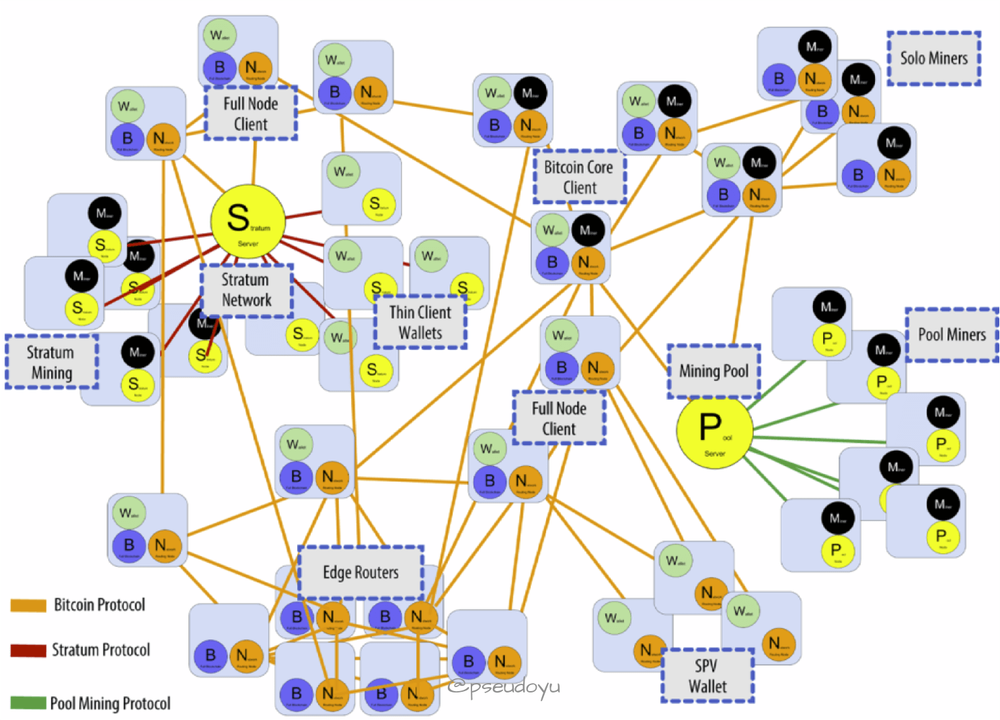


节点分为全节点和轻节点两种:

-
早期所有的节点都是全节点，但随着数据量越来越大，运行在手机或平板等设备上的比特币客户端不需要存储整个区块链的信息，称为`Simplified Payment Verification(SPV)`
节点，也叫轻节点。
    - 轻节点不需要一直在线，也不需要保留整个区块链（数据量庞大），只需要保留每个区块的块头；
    - 且只需要保存与自己有关的区块，而不需要保存链上全部交易；
    - 因为并没有保存全部信息，无法验证大多数交易的合法性和网上发布的新区块的正确性，只能检验与自己有关的区块；
    - 可以通过`Merkle Proof`验证一笔交易存在，但不能确认一笔交易不存在；
    - 可以验证挖矿的难度，因为保存在块头中。

- `Bitcoin Core`客户端就是一个全节点。全节点一直在线，维护着完整的区块链信息；
    - 因为其内存里维护着完整的`UTXO`集合(所有未花费的交易输出的集合)
        - 所以通过验证整个区块链的区块和交易信息（从创世区块到最新区块）来验证交易的合法性；
    - 也会决定哪些交易会被打包到区块中；
    - 验证交易即挖矿，可以决定沿着哪条链继续挖，在出现等长的分叉时，也会选择哪一个分叉；
    - 同时监听别的矿工挖出来的区块，验证合法性。

# 交易验证方式

> 下面通过一个示例来讲解一下全节点和轻节点的交易验证方式。

假如要验证一个位于 block 300,000 的交易 T

**全节点验证过程**

1. **构建UTXO集**：全节点从创世区块开始遍历，直到第300,000个区块，构建完整的UTXO集。
2. **查找交易T**：全节点在UTXO集中查找交易T引用的未花费输出。
3. **验证交易T**：全节点确保交易T引用的输出未被其他交易花费，并且交易签名有效。
4. **确认交易T**：全节点确认交易T所在的区块已被至少6个后续区块确认。

**轻节点验证过程**

1. **请求交易详情**：轻节点向全节点请求交易T的详细信息，包括交易本身和Merkle路径。
2. **Merkle路径验证**：轻节点接收Merkle路径，并使用这些哈希值来验证交易T的存在性和完整性。
3. **确认交易T**：轻节点等待至少6个后续区块来确认交易T所在的区块。

# 区块链结构

区块链是由顺序链接起来的区块组成的一种数据结构，可以存于单文件或者数据库中，`Bitcoin Client`客户端使用 Google 的`LevelDB`
数据库存储数据。

- 每一个区块都指向前一个区块，任何一个区块进行了修改的话，其所有后面的区块都会受到影响
- 所以想要篡改一个区块的话需要同时篡改之后的所有区块，这需要大量的算力，往往成本大于收益，因此极大地保障了安全性。

### 区块结构

每个区块通常包含以下部分：

1. **区块头**（Block Header）：包含了元数据，用于识别和验证区块。
2. **交易数据**（Transactions）：区块的实际内容，通常是一组交易记录。

### 区块头的组成部分(Block Header)

区块头是区块的重要组成部分，它包含了一些关键信息，用于确保区块的安全性和完整性。区块头通常包含以下字段：

- **Version (4 bytes)**：指示了区块的版本号，用于标识区块的格式和兼容性。
- **Previous Block Hash (32 bytes)**：前一个区块的哈希值，用于链接当前区块到区块链中。
- **Merkle Tree Root (32 bytes)**：Merkle树的根哈希值，用于快速验证区块中的交易。
- **Timestamp (4 bytes)**：区块创建的时间戳，记录了区块创建的大致时间。
- **Difficulty Target (4 bytes)**：难度目标，定义了创建新区块所需的计算难度 (hash(xx) < target) 。
- **Nonce (4 bytes)**：一个随机数，用于工作量证明算法中寻找满足难度目标的哈希值

### 区块哈希值的计算

区块哈希值是通过两次SHA-256哈希运算计算得出的，即 `SHA256(SHA256(Block Header))`。

- 这个哈希值是区块的唯一标识符，用于验证区块的完整性和防止篡改。
- 区块哈希值不在区块结构中直接存储，而是由节点根据区块头的内容计算得出。

### 区块高度(Block Height)

区块高度是一个区块在区块链中的位置标识，通常是从创世区块开始的区块编号。例如，创世区块的高度为0，紧随其后的区块高度为1，以此类推。

### 交易数据(Transactions)

每个区块还包含了一系列交易记录，这些交易记录可以是转账、智能合约调用等。

交易数据的大小可以变化，通常以字节为单位计量。

比特币中的交易数据通常使用可变长度的编码来表示交易的数量，因此交易计数器的长度可以从1到9字节不等。

### 存储方式

比特币客户端（如Bitcoin Core）使用Google的LevelDB数据库来存储区块链数据。

LevelDB是一个键值存储系统，适合用于存储大量数据，并能够高效地检索这些数据。

# 默克尔树(Merkle Tree)

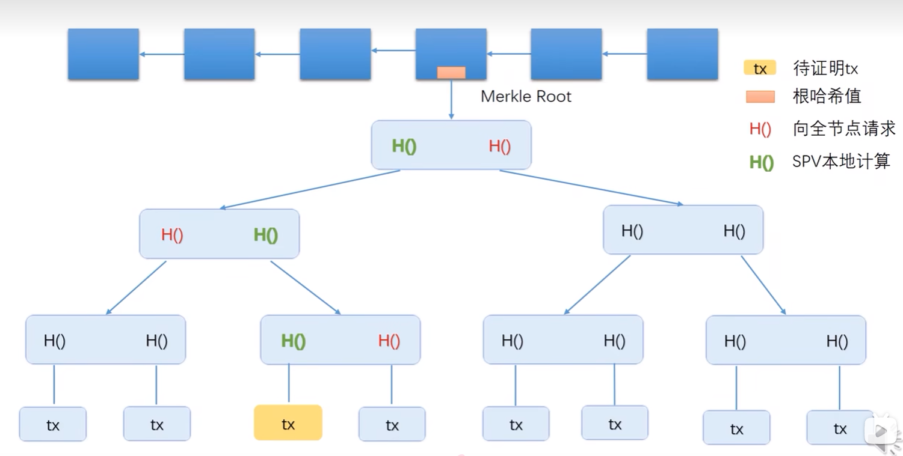

`Merkle Tree`默克尔树是区块链中很重要的一个数据结构，主要通过哈希算法来验证较大数据集

（也是通过双重哈希的方式`SHA256(SHA256(Block Header))`），结构如下图所示：

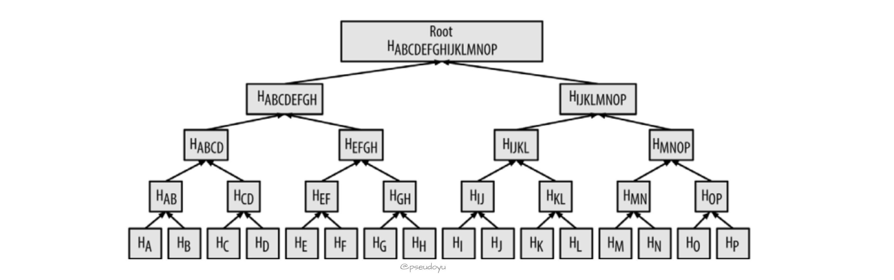

通过`Merkle Tree`的方式可以很快地验证一个交易存在于某个区块中（算法复杂度为`LogN`）

例如，如果要验证一个交易 K 存在于区块中，只需要访问很少的节点:

- 虚线表示存在交易 K 的区块。
- 蓝色表示不存在交易 K 的区块。

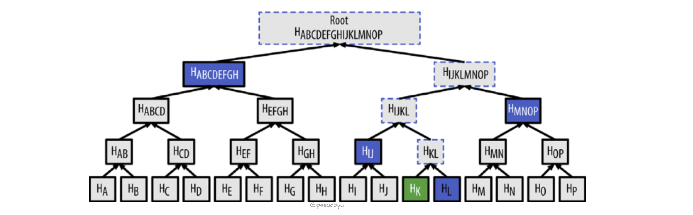

因为比特币网络中存在大量交易，这种方式能够极大提高效率，如下图所示：

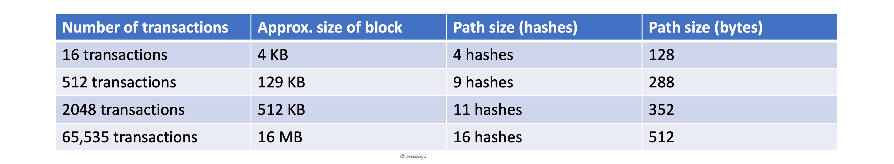

因为轻节点（例如手机上的比特币钱包）不保存整个区块链数据，通过`Merkle Tree`
结构可以很方便地查找交易，轻节点会构造一个`Bloom filter`布隆过滤器来得到与自身相关的交易：

1. 首先，初始化布隆过滤器为空值，获取钱包中的所有地址，创建一个检索模式来匹配与这个交易输出相关的地址，将检索模式加入布隆过滤器；
2. 然后布隆过滤器被发送至各个节点（通过`filterload`消息）；
3. 节点收到后会发送一个包含符合条件的区块头和符合交易的`Merkle Path`的`merkleblock`消息和一个包含过滤结果的`tx`消息。

过程中，轻节点会使用`Merkle Path`来链接交易与区块，并通过区块头来组成区块链，从而能够验证交易存在于区块链中。

使用布隆过滤器会返回符合筛选条件的结果，也会存在着一些误报，因此返回了很多不相关的结果，也能够在轻节点向其他节点请求相关地址时保护了隐私性。

# 比特币网络

比特币系统运行在一个 P2P 点对点网络上，节点之间是平等的，没有身份、权限的区别；没有中心化的服务器，网络也没有层级区分。

每个节点都要维护一个等待上链的交易的集合，每个区块大小为 1M，因此需要几秒才能够穿到大多数的节点。

- 假设一个节点监听到了 A->B 的交易，会将其写入集合
- 如果同时又发现了一个 A->C 的双花攻击，则不会再写入
- 而如果监听到同样一笔 A->B 的交易或者同一个币来源的 A->C 的交易，则会将该集合中 A->B 的交易删除。

# 比特币共识协议

比特币作为一个人人都可以参与的开发系统，需要解决恶意节点的威胁，解决思路为工作量证明机制，也就是算力投票机制

- 当产生一笔新交易，广播新的数据记录，全网执行共识算法，即矿工挖矿来验证记录，即求解随机数
- 率先解出难题的矿工获得记账权，产生新区块，然后对外广播新区块，其他节点验证通过后加至主链。

# 钱包

作为一个数字货币系统，比特币有自己的钱包系统，主要由私钥、公钥和钱包地址三个部分组成。

> 生成钱包地址的过程如下：

1. 采用`ECDSA(Elliptic Curve Digital Signature Algorithm)`椭圆曲线算法，利用私钥生成对应的公钥
2. 公钥很长且难以输入和记忆，因此再通过`SHA256`和`RIPEMD160`算法得到一个公钥哈希值
3. 最后再用`Base58Check`进行处理，得到一个可读性较强的钱包地址

# 交易过程


有了钱包（和资产）后，就可以开始交易了。我们来通过一个典型的比特币交易来理解这一流程：

- A 和 B 都拥有一个比特币钱包地址（可以用 Bitcoin Client 生成，原理如上）
- 假设 A 要给 B 转账 5 个 BTC，A 需要得到 B 的钱包地址，然后用自己的私钥对`A->B转账5个BTC`这笔交易签名
    - （因为 A 的私钥仅有自己知道，所以拥有私钥则是拥有钱包资产的归属权）
- 然后发布这笔交易，在比特币系统中发起交易需要支付小额矿工费作为交易手续费；
- 矿工会开始验证这笔交易的合法性，得到六个确认后交易就可以被比特币账本所接受，整个验证过程大约 10 分钟。

> 矿工为什么要消耗大量算力来验证交易呢？

矿工在验证过程中可以得到出块奖励和矿工费，出块奖励会四年递减，因此，后期主要激励是矿工费。

> 为什么验证要 10 分钟呢？

比特币其实并不是绝对安全的，新交易容易受到一些恶意攻击，而通过控制挖矿难度把验证过程控制在 10
分钟左右则可以很大程度上阻止恶意攻击，这只是一种概率上的保证。

> 比特币系统中怎么避免双重花费呢？

比特币采用了一种叫`UTXO(Unspent Transaction Outputs)`未使用的交易输出的概念，当一个用户收到一笔 BTC 交易时，会计入`UTXO`中。

- A 想要给 B 转账 5 个 BTC，A 的这 5 个 BTC 可能来自于两个`UTXO`(2 BTC + 3 BTC)
- 因此 A 在转账给 B 时，矿工需要检验的是这两笔`UTXO`在这笔交易之前有没有被花掉，如果检测已经被花费了，则交易不合法。

### 未花费的交易输出(UTXO)

- **UTXO**：未花费的交易输出，是比特币交易的基础。每一笔交易的输出都成为下一笔交易的输入，形成一条连续的链条。只有未被使用的输出才被视为有效的输入。
- **UTXO ID**：UTXO具有唯一的ID，由交易哈希和输出索引组成。例如，Transaction 4的output0的UTXO ID由Transaction 4的哈希和输出索引0组成。
- **UTXO的生命周期**：UTXO在交易中被创建，在后续交易中被消费。当一笔交易的所有输出都被消费时，UTXO就被认为已经“花掉了”。

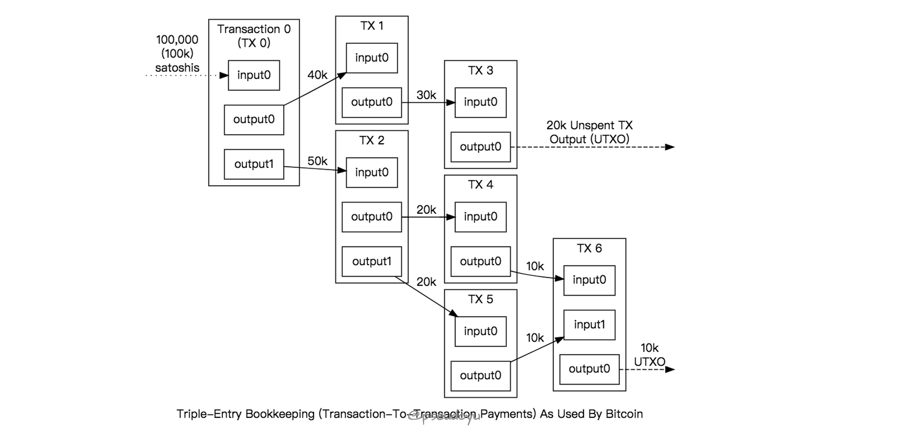

此外`UTXO`有一个很重要的特性，不可分割:

- 假如 A 有 20 个 BTC，他想转账 5 个 BTC 给 B
- 那交易会先将 20 个 BTC 作为输入，然后产生两个输出，**一个向 B 转账 5 个 BTC，一个返还给 A 剩下的 15 个 BTC**
- 因此，A 又拥有了一笔价值为 15 BTC 的 `UTXO`；
- 如果单个`UTXO`不够支付，则可以组合多个形成输入，但总额一定要大于交易额。

> 矿工怎么验证交易发起者有足够的余额呢？

这个问题看起来很简单，第一反应是像支付宝这样查询一下余额是否足够就可以。

但比特币是一种基于交易的账本模式，并没有帐户概念，因此并不能直接查询余额，要想知道一个帐户的剩余资产，则需要回顾以前所有的交易，并且找到所有`UTXO`
并相加。

# 交易模型

> 上文讲了一个交易是怎么发生的，那比特币交易由哪些部分组成呢？

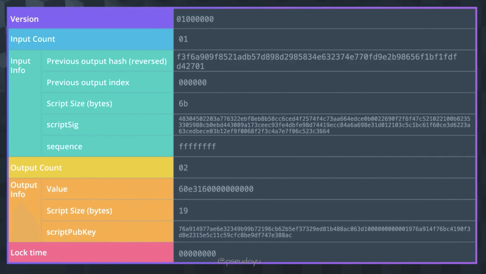

**版本（Version）**

- **Version**: 这一列显示的是交易的版本号，通常是01000000，表示这是一个标准的比特币交易。

**输入计数（Input Count）**

- **Input Count**: 这一列显示了交易中有多少个输入。在这个例子中，交易有1个输入。

**输入信息（Input Info）**

- **Previous output hash (reversed)**: 这是上一笔交易的输出哈希值，用于追踪资金来源。由于比特币的哈希函数是反向的，所以这里显示的是反转后的哈希值。
- **Previous output index**: 这是上一笔交易的输出索引，用于确定哪个输出正在被消耗。
- **Script Size (bytes)**: 这是脚本Sig的字节数。
- **scriptSig**: 这是签名脚本，包含对上一笔交易的签名和公钥。
- **sequence**: sequence字段通常设置为ffffffff，表示这是一个不可逆的交易。

**输出计数（Output Count）**

- **Output Count**: 这一列显示了交易有多少个输出。在这个例子中，交易有2个输出。

**输出信息（Output Info）**

- **Value**: 这是交易金额，以satoshi（聪）为单位。在这个例子中，输出的价值是60e316000000000000。
- **Script Size (bytes)**: 这是脚本PubKey的字节数。
- **scriptPubKey**: 这是公共脚本，用于接收方验证交易的有效性。

**锁定时间（Lock time）**

- **Lock time**: 这是锁定时间，用于设定交易生效的时间点。在这个例子中，锁定时间为0，意味着交易立即生效。

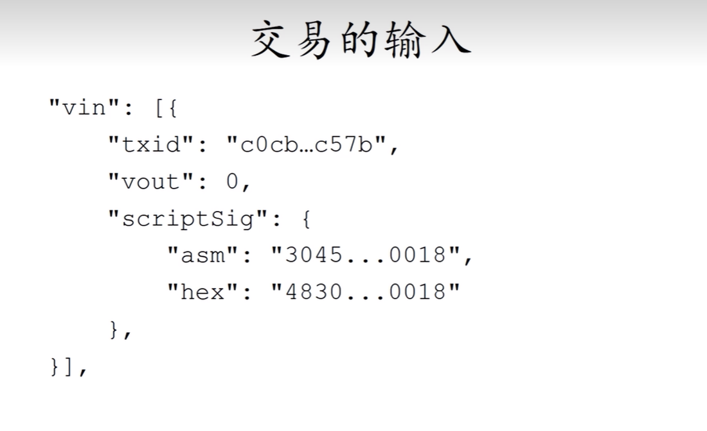

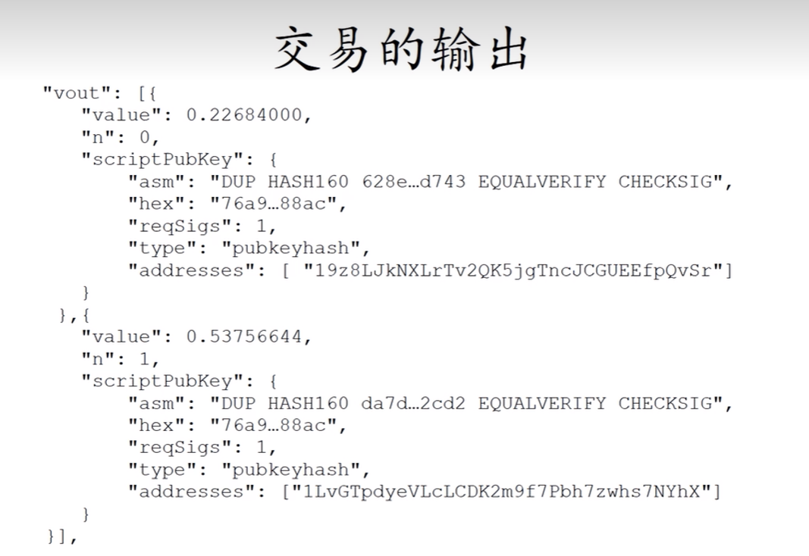

# 比特币脚本

在交易中有提到`scriptSig`和`scriptPubKey`，那什么是比特币脚本呢？

比特币脚本是记录在每个交易中的指令列表，当脚本被执行时可以检验交易是否有效、比特币是否可以使用等。

一个典型的脚本如下

```javascript
<sig> <pubKey> OP_DUP OP_HASH160 <pubKeyHash> OP_EQUALVERIFY OP_CHECKSIG
```

比特币脚本是基于栈从左至右执行的，使用`Opcodes`对数据进行操作

在上面这个脚本语言中

- <>包含的是要被推入 stack 的数据
- 没有<>包括、以 OP_ 为前缀的是操作符（OP 可省略），脚本也可以嵌入数据永久记录在链上（不超过 40
  bytes），所记录的数据不会影响`UTXO`。

在交易中，`<sig> <pubKey>`是`scriptSig`，`OP_DUP OP_HASH160 <pubKeyHash> OP_EQUALVERIFY OP_CHECKSIG`部分是`scriptPubKey`。

跟大多数编程语言相比，比特币脚本是非图灵完备的，没有循环或复杂的流程控制，执行起来很简单，不论在哪里执行结果都是确定性的，也不会保存状态，且脚本与脚本之间是相互独立的。

因为以上特征，虽然比特币脚本相对安全，但没办法处理很复杂的逻辑，因此不适合用来处理一些复杂的业务

**`Ethereum`所提供的智能合约就在这一点上实现了创新性的突破，因此诞生了很多去中心化应用。**


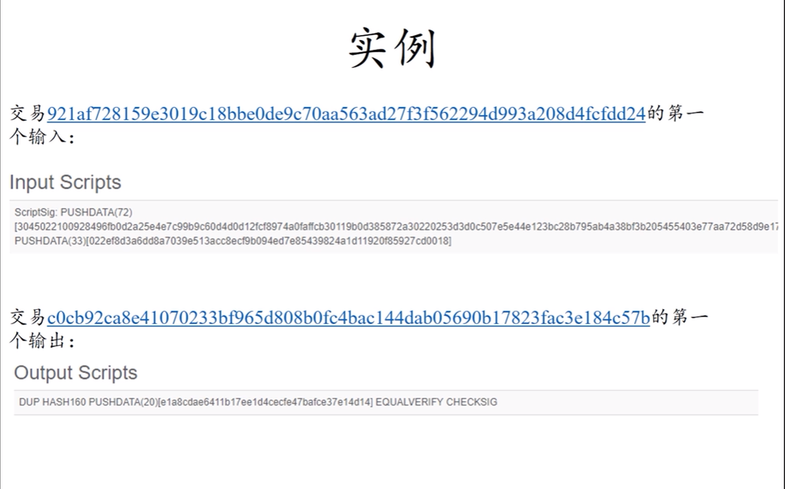

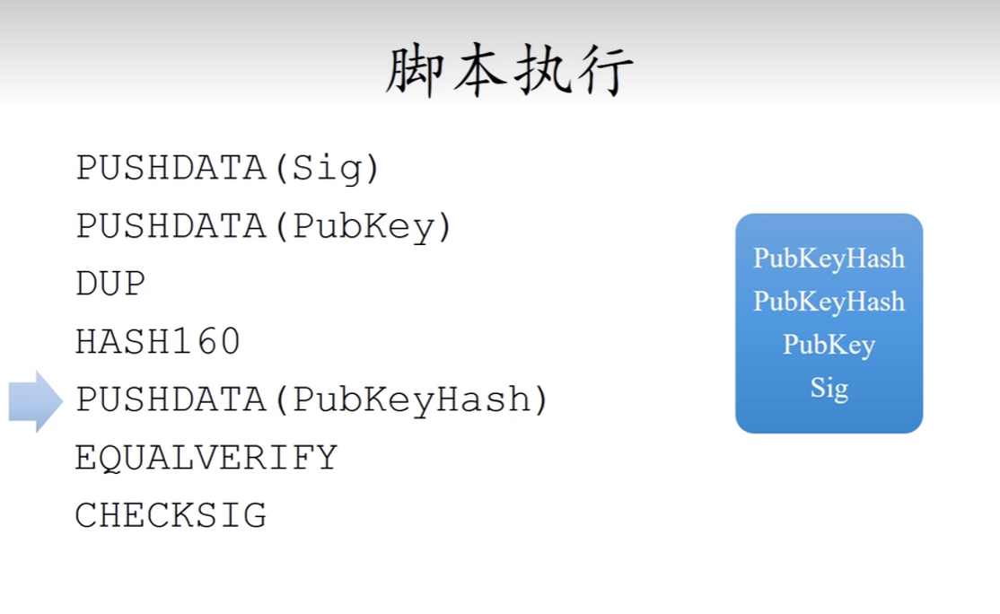

# 挖矿

在上文对整个交易过程中提到了挖矿，接下来我们详细讲一下。

- 有的节点为了得到出块奖励和矿工费，赚取收益，因此会对交易进行验证，称为矿工挖矿。

- 出块奖励由`coinbase`比特币基地创建，每四年会递减，从 2009 年的 25 个，到现在已经减少为 6.5 个。

**挖矿其实是一个不断尝试随机数以达到某个设定目标值的过程**

- 如小于某个 target 目标值，这个难度是人为设置来调整验证时间、提升安全性的，而不是解决数学难题。

- 矿工们会不断尝试这个值，成功率很低，但是尝试次数可以很多，因此，算力强的节点有成比例的优势，更容易解出难题。

> 那挖矿难度为什么要进行调整呢？

因为在比特币系统中，出块时间太短容易出现分叉，如果分叉过多则会影响系统达成共识，危害系统安全性。

比特币系统通过难度调整把出块速度稳定在 10 分钟左右，从而防止交易被算改。


> 挖矿难度是如何调整的呢？

系统会在每产生 2016 个区块时（约两周）调整一次目标阈值，存在块头中，全网所有节点需要遵从新的难度进行挖矿，如果恶意节点不调整代码中的
target 目标的话，诚实的矿工则不会认可。

**目标阈值 = 目标阈值 * (产生 2016 个区块的实际时间 / 产生 2016 个区块的预计时间)**

比特币诞生之初，矿工很少，挖矿难度也较低，大多都是用家用电脑（CPU）直接挖矿；

随着越来越多的人参与到比特币生态中，挖矿的难度也越来越高，慢慢开始用一些算力较强的 GPU
进行挖矿，也有一些专用的`ASIC(Application Specific Integrated circuit)`专用挖矿芯片以及矿机随着市场需求逐步诞生；

而现在也出现了很多大型矿池，集合了全网大量算力进行集中挖矿。

在这种大型矿池系统中，`Pool Manager`担任了全节点的作用，而集合的大量矿工会一起计算哈希值，最后通过工作量证明机制来分配收益。

但算力过于集中容易产生一些中心化风险，如某个大型矿池达到了全网 51% 以上算力的话就可以对交易进行回滚或者对某些交易进行抵制等。

# 分叉

比特币系统中，也会有未达成一致性意见的情况发生，称为分叉。

- 分叉是主要分为两种类型，一种是状态分叉，往往是一些节点故意进行的；
- 另一种称为协议分叉，也就是说对比特币协议产生了一些分歧。
    - 协议分叉又可以分为两种类型，一种叫硬分叉，也就是对于协议的部分内容产生了不可兼容的修改，比如将比特币的块大小由 1M 调整为
      4M，这种分叉方式是永久的，从某个节点开始形成了两条平行发展的链，比如`Bitcoin Classic`，形成了两种币。
    - 另一种则叫软分叉，比如还是调整比特币的块大小，但是从 1M 调整为
      0.5M，这样调整后，就会出现新节点挖小区块，旧的节点挖大的区块的情况，软分叉是非永久性的，比较典型的例子是对 coinbase
      的内容进行修改以及`P2SH(Pay to Script Hash)`产生的分叉。

# 客户端(Bitcoin Core)

`Bitcoin Core`是比特币的实现，又被称为`Bitcoin-QT`或`Satoshi-client`，可以通过这个客户端连接至比特币网络、验证区块链、发送与接收比特币等。

有`Mainnet`、`Testnet`和`Regnet`三个网络，可以进行切换。

提供了一个`Debug Console`来与比特币区块链直接进行交互，常见操作如下：

> Blockchain

- getblockchaininfo: 返回有关区块链处理的各种状态信息
- getblockcount: 返回区块链中的块数
- verifychain: 验证区块链数据库

> Hash

- getblockhash: 返回所提供的区块哈希值
- getnetworkhashps: 基于指定数量的最近块，返回每秒网络哈希数
- getbestblockhash: 返回最佳块的哈希值

> Blocks

- getblock: 返回块信息的详细信息
- getblockheader: 返回有关区块头信息
- generate: 立即将指定数量的块挖矿到钱包中的一个地址

> Wallet

- getwalletinfo: 返回一个对象，该对象包含有关钱包状态的各种信息
- listwallets: 返回当前加载的钱包列表
- walletpassphrasechange: 更改钱包密码

> Mempool

- getmempoolinfo: 返回内存池活动状态的详细信息
- getrawmempool: 返回内存池中的所有交易详细信息
- getmempoolentry: 返回给定交易的内存池数据

> Transaction

- getchaintxstats: 计算关于链中交易总数和速率的统计数据
- getrawtransaction: 返回原始交易数据
- listtransactions: 返回给定帐户的交易列表

> Signature

- signrawtransaction: 签署原始交易的输入
- signmessage: 使用地址的私钥对信息进行签名
- dumpprivkey: 获取私钥

> Network

- getnetworkinfo: 返回 P2P 网络的状态信息
- getpeerinfo: 返回每个连接网络节点的数据
- getconnectioncount: 返回节点的连接数

> Mining

- getmininginfo: 返回包含挖掘相关信息的对象
- getblocktemplate: 返回构造块所需的数据
- prioritisetransaction: 以较高或较低的优先级接受交易进入挖掘的块