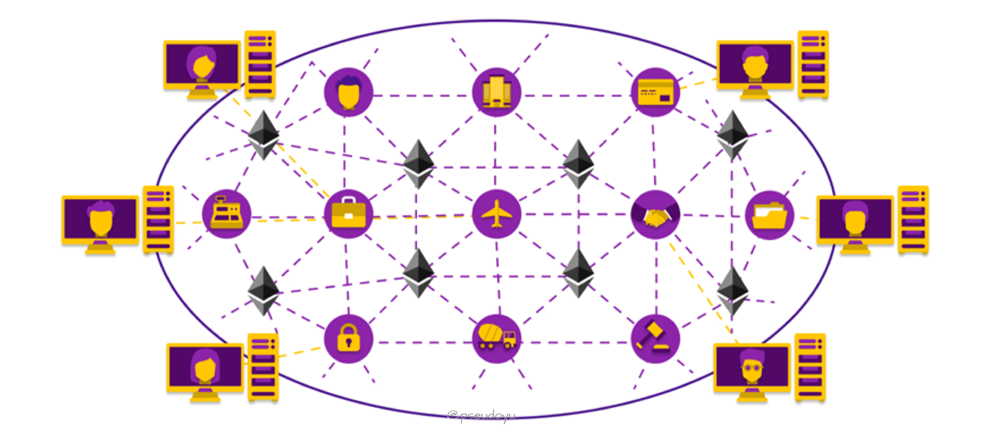
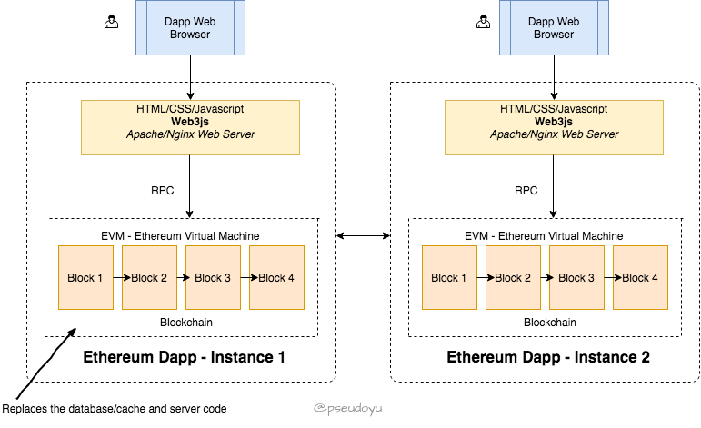
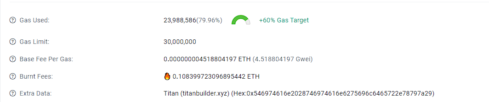
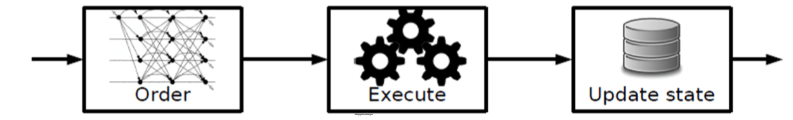
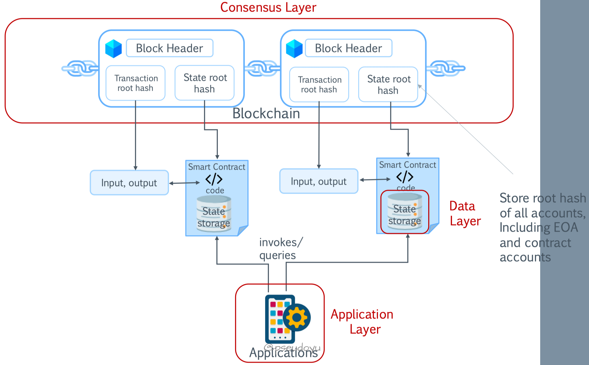

### Ethereum 核心技术解读

### 前言

比特币作为一种去中心化的数字货币，是极其成功的，但受限于比特币脚本（非图灵完备，只能处理一些简单的逻辑），并不能处理很复杂的业务。

而`Ethereum`引入了智能合约，使去中心化的概念能够应用于更丰富的应用场景，因此也被称为区块链 2.0。

[官网: https://ethereum.org/zh/](https://ethereum.org/zh/)

### Ethereum 系统

2014 年 1 月，俄罗斯开发者 **Vitalik Buterin** 发布了以太坊白皮书并成立团队，旨在创造一个集成更通用的脚本语言的区块链平台。

其中一位成员 Dr. Gavin Wood 发布了一份黄皮书，涉及`Ethereum Virtual Machin(EVM)`以太坊虚拟的相关技术，这就是`Ethereum`的诞生。



简单来说，`Ethereum`是一个开源的去中心化系统，使用区块链来存储系统状态变化，因此也被称为“世界计算机”；

它支持开发者在区块链上部署运行不可变的程序，称为智能合约，因此可以支持广泛的应用场景；

它使用数字货币`Ether`来衡量系统资源消耗，激励更多人参与`Ethereum`系统建设。

### 去中心化应用 DApp

狭义来说，DApp 其实就是一个集成了用户界面、支持智能合约、运行于以太坊区块链上的应用。



如上图所示，`Ethereum`应用实例部署在区块链网络上（智能合约运行于区块链虚拟机中），而 Web 程序只需要通过`Web3.js`
对区块链网络进行`RPC`远程调用，这样用户就可以通过浏览器（DApp 浏览器或 MetaMask 等插件工具）访问去中心化服务应用了。

### 账本

`Ethereum`区块链是一个去中心化的账本（数据库），网络中的所有交易都会存储在区块链中，所有节点都要本地保存一份数据，并且确保每一笔交易的可信度；所有的交易都是公开且不可篡改的，网络中的所有节点都可以查看和验证。

### 账户

当我们需要登录一个网站或系统（比如邮箱）时，往往需要一个帐号和一个密码，密码通过加密算法以暗文的形式存储在中心化的数据库中。

然而，以太坊是一个去中心化的系统，那是怎么生成账户的呢？

和比特币系统原理类似

1. 首先生成一个仅有自己知道的私钥，假设为`sk`，采用`ECDSA(Elliptic Curve Digital Signature Algorithm)`
   椭圆曲线算法生成对应的公钥`pk`
2. 采用`keccak256`算法对公钥`pk`求哈希值
3. 截取后 160 位作为以太坊的地址

用户的私钥和地址一起组成了以太坊的账户，可以存储余额、发起交易等（比特币的余额是通过计算所有的`UTXO`得到的，而不是像以太坊一样存储在账户中）。

其实`Ethereum`账户分为两种类型，上述方式生成的叫`Externally Owned Accounts(EOA)`
，外部账户，也就是常规用户拥有的账户，主要是用来发送/接收`Ether`代币或者向智能合约发送交易（即调用智能合约）。

而另一种则是`Contract Accounts`，合约账户，不同于外部账户，这种账户是没有对应的私钥的，而是在部署合约的时候生成的，存储智能合约代码。

值得注意的是，合约账户必须要被外部账户或者其他合约调用才能够发送或接收`Ether`，而不能自己主动执行交易。

### 钱包

存储和管理`Ethereum`账户的软件/插件称为钱包，提供了诸如交易签名、余额管理等功能。

钱包生成主要有两种方式，非确定性随机生成或根据随机种子生成。

### 手续费(Gas)

`Ethereum`网络上的操作也需要“手续费”，称为`Gas`，在区块链上部署智能合约以及转账都需要消耗一定单位的`Gas`
，这也是鼓励矿工参与`Ethereum`网络建设的激励机制，从而使整个网络更加安全、可靠。

每个交易都可以设置相应的`Gas`量和`Gas`的价格，设置较高的`Gas`费则往往矿工会更快处理你的交易

但为了预防交易多次执行消耗大量`Gas`费，可以通过`Gas Limit`来设置限制。



`Gas`相关信息可以通过 [Ethereum Gas Tracker](https://etherscan.io/gastracker) 工具进行查询。

```
If START_GAS * GAS_PRICE > caller.balance, halt
Deduct START_GAS * GAS_PRICE from caller.balance
Set GAS = START_GAS
Run code, deducting from GAS
For negative values, add to GAS_REFUND
After termination, add GAS_REFUND to caller.balance
```

### 智能合约

上文提到，`Ethereum`区块链不仅仅存储交易信息，还会存储与执行智能合约代码。

智能合约控制应用和交易逻辑，`Ethereum`系统中的智能合约采用专属`Solidity`语言，语法类似于`JavaScript`
，除此之外，还有`Vyper`、`Bamboo`等编程语言。智能合约代码会被编译为字节码并部署至区块链中，一旦上链则不可以再编辑。

`EVM`作为一个智能合约执行环境，能够保障执行结果的确定性。

#### 智能合约示例：众筹

让我们想象一个更复杂的场景，假设我要众筹 10000 元开发一个新产品，通过现有众筹平台需要支付不菲的手续费，而且很难解决信任问题

于是，可以通过一个众筹的 DApp 来解决这个问题。

先为众筹设置一些规则

1. 每个想参与众筹的人可以捐款 10-10000 元的金额
2. 如果目标金额达成了，金额会通过智能合约发送给我（即众筹发起人）
3. 如果目标在一定时间内（如 1 个月）没有达成，众筹的资金会原路返回至众筹用户
4. 也可以设置一些规则，比如一周后，如果目标金额没有达成，用户可以申请退款

因为这些众筹条款是通过智能合约实现并部署在公开的区块链上的，即使是发起者也不能篡改条款，且任何人都可以查看，解决了信任问题。

完整代码可以点击这里查看(
附录)：[Demo](https://www.toshblocks.com/solidity/complete-example-crowd-funding-smart-contract/)

### 交易

在`Ethereum`中，一个典型的交易是怎么样的呢？

1. 开发者部署智能合约至区块链
2. DApp 实例化合约、传入相应值以执行合约
3. DApp 对交易进行数字签名
4. 本地对交易进行验证
5. 广播交易至网络中
6. 矿工节点接收交易并进行验证
7. 矿工节点确认可信区块后广播至网络中
8. 本地节点与网络进行同步，接收新区块

### 架构



`Ethereum`采用的是一种`Order - Execute - Validate - Update State`的系统架构。

在这种架构下，当产生一笔新的交易，矿工会进行`PoW`工作量证明机制的运算；

验证完成后，将区块通过`gossip`协议广播至网络中；网络中的其他节点接收到新区块后，也会对区块进行验证；

最终，提交至区块链，更新状态。

具体来看，`Ethereum`系统有共识层、数据层、应用层等核心组件，其交互逻辑如下：



这张图展示了以太坊区块链系统的三个核心层次：共识层、数据层和应用层之间的交互关系。我们逐层来看它们的作用和功能：

**共识层（Consensus Layer）**

- Block Header: 区块头包含了重要的元数据，例如：
    - **Transaction root hash**: 所有交易的默克尔根哈希，代表了区块内的所有交易。
    - **State root hash**: 当前状态树的默克尔根哈希，记录了所有账户的状态变化。

**数据层（Data Layer）**

- **Smart Contract code**: 智能合约代码存储在数据层，负责处理智能合约的执行逻辑。
- **State storage**: 存储着智能合约的状态数据，包括输入和输出。
- **Store root hash of all accounts, Including EOA and contract accounts**: 数据层存储了所有账户（包括外部拥有者账户EOA和合约账户）的根哈希。

**应用层（Application Layer）**

- **Applications**: 在应用层，开发者可以构建各种基于以太坊的应用程序，利用底层的数据和共识服务。

**交互逻辑**

- **Transaction root hash** 和 **state root hash** 是通过共识层传递给数据层的，用于更新智能合约的状态存储。
- **Smart Contract code** 被调用来处理输入和输出，然后更新状态存储。
- **State storage** 的根哈希会被发送回共识层，形成一个闭环，确保整个系统的状态一致性。
- 最终，应用程序可以通过查询数据层来访问和使用智能合约的信息。

### 总结

以上就是对`Ethereum`核心技术的一些解读，智能合约的引入给区块链的应用带来了更多可能性，但仍有很多安全性、隐私性和效率问题需要考虑。

针对复杂的企业级应用场景，联盟链是更好的选择，后续将会对`Hyperledger Fabric`进行详尽的分析，敬请期待！

### 众筹智能合约示例

```javascript
pragma solidity 0.4.8; // 设置 Solidity 编译器版本为 0.4.8

contract CrowdFunder { // 定义一个名为 CrowdFunder 的智能合约
    address public creator; // 创建者地址
    address public fundRecipient; // 基金接受者地址（与创建者可能不同）
    uint public minimumToRaise; // 至少要筹集的资金量，否则所有人都退款
    string campaignUrl; // 活动网址
    byte constant version = 1; // 合约版本号
    
    // 枚举类型定义
    enum State {
        Fundraising, // 筹资阶段
        ExpiredRefund, // 到期退款
        Successful, // 成功完成
        Closed // 关闭
    }
    
    // 结构体定义
    struct Contribution {
        uint amount; // 投资金额
        address contributor; // 投资人地址
    }
    
    // 状态变量
    State public state = State.Fundraising; // 初始化为筹资阶段
    uint public totalRaised; // 已筹集总额
    uint public currentBalance; // 当前余额
    uint public raiseBy; // 筹资截止时间
    uint public completeAt; // 筹资结束时间
    Contribution[] contributions; // 投资列表
    
    event LogFundingReceived(address addr, uint amount, uint currentTotal); // 记录投资收到的事件
    event LogWinnerPaid(address winnerAddress); // 记录支付赢家的事件
    event LogFunderInitialized( // 记录众筹初始化的事件
        address creator,
        address fundRecipient,
        string url,
        uint _minimumToRaise, // 最低筹款额
        uint256 raiseby // 截止日期
    );
    
    modifier inState(State _state) { // 确保操作处于指定状态的修饰符
        if (state != _state) throw;
        _;
    }
    
    modifier isCreator() { // 确保操作由创建者发起的修饰符
        if (msg.sender != creator) throw;
        _;
    }
    
    // 等待 1 小时后才能销毁合同
    modifier atEndOfLifecycle() {
        if(!((state == State.ExpiredRefund || state == State.Successful) && completeAt + 1 hours < now)) {
            throw;
        }
        _;
    }
    
    function CrowdFunder( // 构造函数
        uint timeInHoursForFundraising, // 筹资时间（小时）
        string _campaignUrl, // 活动网址
        address _fundRecipient, // 基金接受者地址
        uint _minimumToRaise) // 最低筹款额
    {
        creator = msg.sender; // 设置创建者地址
        fundRecipient = _fundRecipient; // 设置基金接受者地址
        campaignUrl = _campaignUrl; // 设置活动网址
        minimumToRaise = _minimumToRaise * 1000000000000000000; // 转换为 Wei 单位
        raiseBy = now + (timeInHoursForFundraising * 1 hours); // 设置截止时间
        currentBalance = 0; // 初始化当前余额
        LogFunderInitialized(
            creator,
            fundRecipient,
            campaignUrl,
            minimumToRaise,
            raiseBy); // 触发众筹初始化事件
    }
    
    function contribute() // 投资函数
    public
    inState(State.Fundraising) payable returns (uint256) // 只允许在筹资阶段，且可支付
    {
        contributions.push( // 添加新的贡献项
            Contribution({
                amount: msg.value, // 投资金额
                contributor: msg.sender // 投资人地址
                }) // 使用数组以便迭代
            );
        totalRaised += msg.value; // 更新已筹集总额
        currentBalance = totalRaised; // 更新当前余额
        LogFundingReceived(msg.sender, msg.value, totalRaised); // 触发投资收到事件
        
        checkIfFundingCompleteOrExpired(); // 检查是否已完成或已过期
        return contributions.length - 1; // 返回贡献 ID
    }
    
    function checkIfFundingCompleteOrExpired() internal { // 内部函数检查是否完成或已过期
        if (totalRaised > minimumToRaise) { // 如果已筹集资金大于最低限额
            state = State.Successful; // 更改状态为成功
            payOut(); // 支付奖金
            
            // 可以在这里激励触发状态改变的人
        } else if (now > raiseBy) { // 如果已过期
            state = State.ExpiredRefund; // 更改为到期退款状态
            // 投资者现在可以通过调用 getRefund(id) 获取退款
        }
        completeAt = now; // 更新结束时间
    }
    
    function payOut() // 发放奖金函数
    public
    inState(State.Successful) { // 只允许在成功状态下调用
        if(!fundRecipient.send(this.balance)) { // 如果无法转账给基金接受者
            throw;
        }
        state = State.Closed; // 更改为关闭状态
        currentBalance = 0; // 清空当前余额
        LogWinnerPaid(fundRecipient); // 触发支付赢家事件
    }
    
    function getRefund(uint256 id) // 获取退款函数
    public
    inState(State.ExpiredRefund) // 只允许在到期退款状态下调用
    returns (bool) { // 返回布尔值表示是否成功退款
        if (contributions.length <= id || id < 0 || contributions[id].amount == 0) { // 如果贡献 ID 不合法
            throw;
        }
        
        uint amountToRefund = contributions[id].amount; // 计算退款金额
        contributions[id].amount = 0; // 清空贡献金额
        
        if(!contributions[id].contributor.send(amountToRefund)) { // 如果无法退款给投资人
            contributions[id].amount = amountToRefund; // 恢复贡献金额
            return false; // 表示退款失败
        } else {
            totalRaised -= amountToRefund; // 减少已筹集总额
            currentBalance = totalRaised; // 更新当前余额
        }
        
        return true; // 表示退款成功
    }
    
    function removeContract() // 移除合约函数
    public
    isCreator() // 只允许创建者调用
    atEndOfLifecycle() { // 等待生命周期结束后调用
        selfdestruct(msg.sender); // 自毁合约并将余额转给创建者
        // 创建者得到未领取的所有资金
    }
    
    function () { throw; } // 默认函数
}
```

### 投票智能合约示例

```javascript
pragma solidity ^0.4.9;

// 这是一个投票与委托的智能合约。
contract Ballot {
    // 定义一个结构体，表示单个选民的信息。
    struct Voter {
        uint weight; // 权重，可以通过委托累积
        bool voted;  // 如果为真，则该人已经投票
        address delegate; // 委托给的人
        uint vote;   // 投票的提案索引
    }

    // 定义一个结构体，表示单个提案的信息。
    struct Proposal {
        bytes32 name;   // 简短名称（最多32字节）
        uint voteCount; // 投票数
    }

    // 记录主席的地址。
    address public chairperson;

    // 使用一个映射来存储每个地址对应的选民信息。
    mapping(address => Voter) public voters;

    // 使用一个动态数组来存储所有的提案信息。
    Proposal[] public proposals;

    // 构造函数，用于创建一个新的投票。
    function Ballot(bytes32[] proposalNames) {
        chairperson = msg.sender;
        voters[chairperson].weight = 1;

        // 遍历传入的提案名称列表，并将它们添加到提案数组中。
        for (uint i = 0; i < proposalNames.length; i++) {
            // 创建一个新的提案对象并将其添加到提案数组末尾。
            proposals.push(Proposal({
                name: proposalNames[i],
                voteCount: 0
            }));
        }
    }

    // 授予指定选民投票权。
    function giveRightToVote(address voter) {
        if (msg.sender != chairperson || voters[voter].voted) {
            // 如果消息发送者不是主席或者选民已投票，则抛出异常。
            throw;
        }
        voters[voter].weight = 1;
    }

    // 将自己的投票权委托给其他选民。
    function delegate(address to) {
        // 获取当前选民的信息。
        Voter sender = voters[msg.sender];
        if (sender.voted)
            throw;

        // 检查被委托人的委托情况，如果存在循环委托则不允许。
        // 注意：在以太坊智能合约中，循环操作可能会导致交易失败，因此需要谨慎使用。
        while (
            voters[to].delegate != address(0) &&
            voters[to].delegate != msg.sender
        ) {
            to = voters[to].delegate;
        }

        // 如果发现循环委托，则抛出异常。
        if (to == msg.sender) {
            throw;
        }

        // 更新选民的状态，标记其已投票并将委托给to。
        sender.voted = true;
        sender.delegate = to;

        // 获取被委托人的信息。
        Voter delegate = voters[to];

        // 如果被委托人已经投票，则直接累加权重；否则增加其权重。
        if (delegate.voted) {
            proposals[delegate.vote].voteCount += sender.weight;
        } else {
            delegate.weight += sender.weight;
        }
    }

    // 投票支持某个提案。
    function vote(uint proposal) {
        Voter sender = voters[msg.sender];
        if (sender.voted)
            throw;
        sender.voted = true;
        sender.vote = proposal;

        // 如果提案索引超出范围，则会自动抛出异常并回滚所有更改。
        proposals[proposal].voteCount += sender.weight;
    }

    // 计算获胜的提案。
    function winningProposal() constant
            returns (uint winningProposal)
    {
        uint winningVoteCount = 0;
        for (uint p = 0; p < proposals.length; p++) {
            if (proposals[p].voteCount > winningVoteCount) {
                winningVoteCount = proposals[p].voteCount;
                winningProposal = p;
            }
        }
    }

    // 返回获胜者的名称。
    function winnerName() constant
            returns (bytes32 winnerName)
    {
        winnerName = proposals[winningProposal()].name;
    }
}
```

