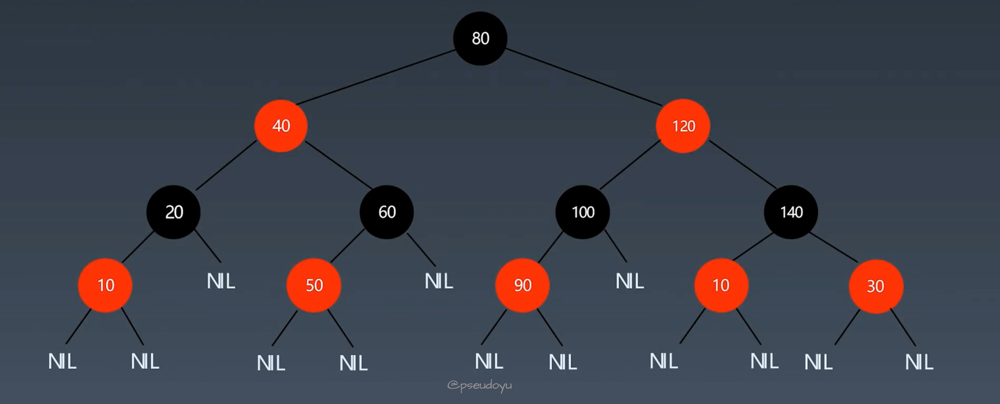
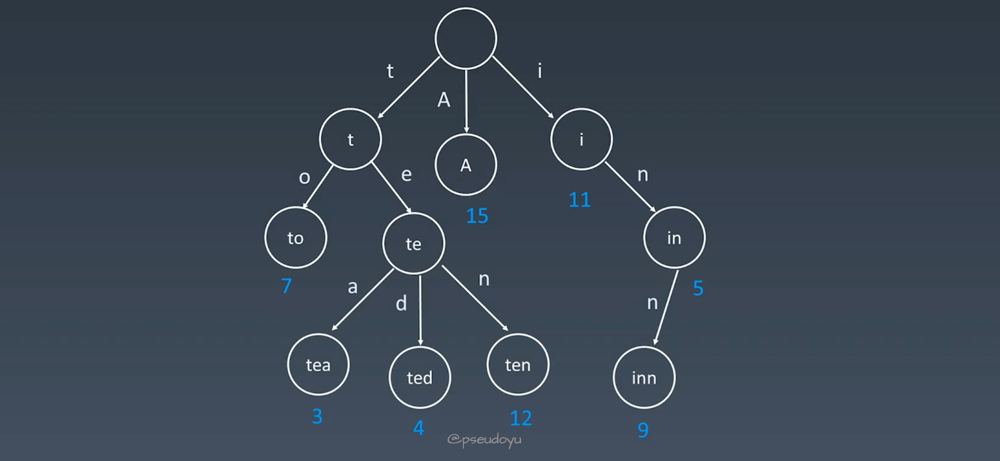
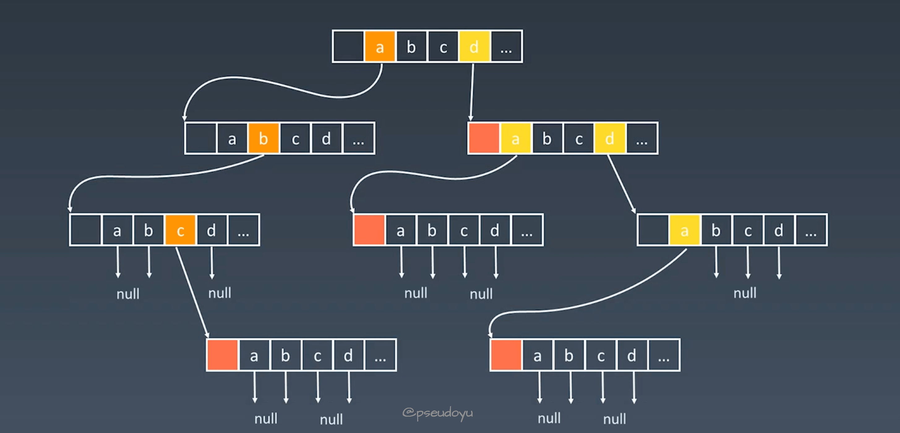
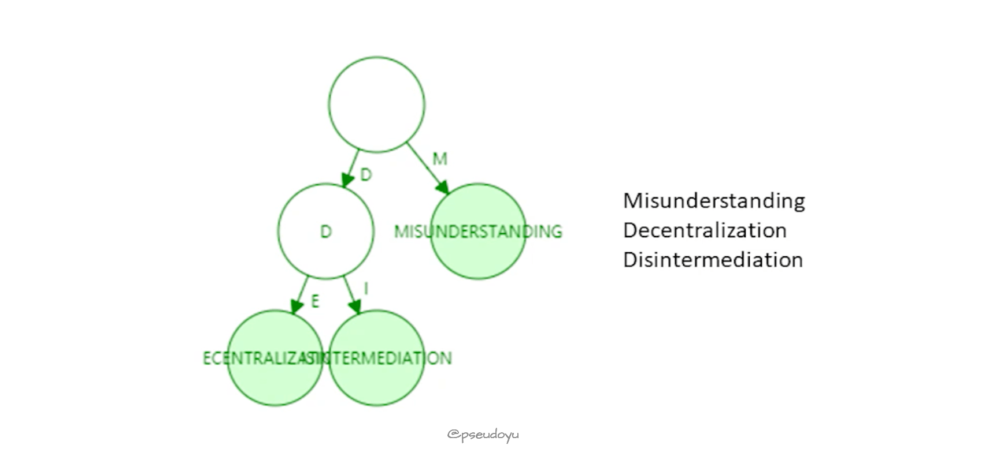
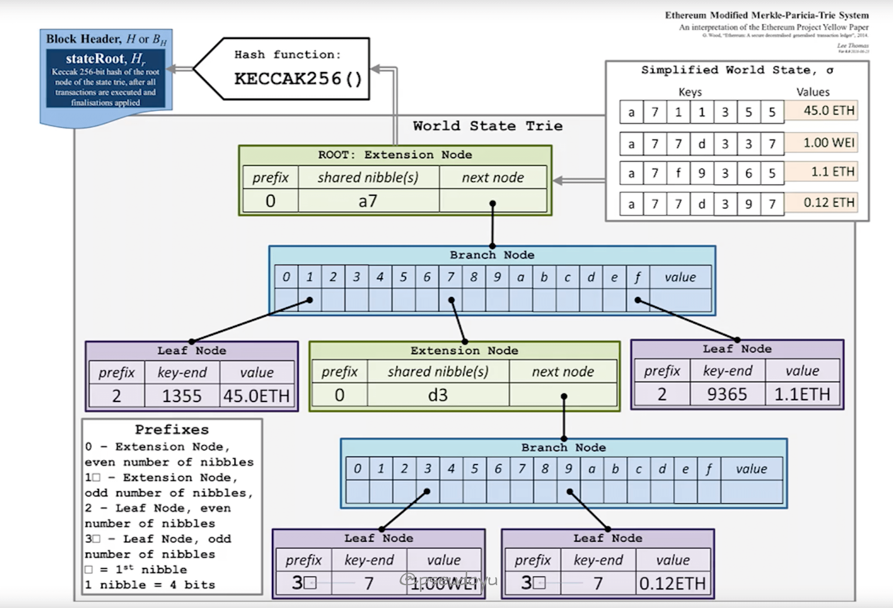

### Ethereum MPT(Merkle Patricia Tries) 详解

将项目智能合约状态树中的数据结构从红黑树改为字典树，并对比一下两个数据结构的性能

- Trie 字典树主要参照的是 Ethereum 官方的 Java 实现
- Red-Black Tree 红黑树则是自己实现，本文则是对两个数据结构的理论和实际表现对比的记录。

### Red-Black Tree - 红黑树

红黑树是一种近似平衡的二叉查找树，含有红黑结点，能够确保任何一个结点的左右子树高度差小于两倍。



#### 性质

必须满足以下五个性质：

1. 结点为红色或黑色
2. 根结点为黑色
3. 叶子结点（NIL）为黑色
4. 每个红色节点的两个子结点为黑色
5. 任意一个结点到每个叶子结点的路径都包含相同数量的黑色结点

红黑树并不是完美平衡的，但是左子树和右子树的层数是相等的，因此，也成为黑色完美平衡。

因为是近似平衡的，所以旋转的频次会降低，维护成本下降，时间复杂度维持在 LogN。

#### 操作

红黑树主要通过三种操作来保持自平衡：

- 左旋
- 右旋
- 变色

#### 与 AVL 的对比

- AVL 提供了更快的查找操作（因为完美平衡）
- 红黑树提供了更快的插入和删除操作
- AVL 存储的结点信息更多（平衡因子与高度），因此占存储空间更大
- 读操作多、写操作少的时候用 AVL 更合适，多用于数据库；
- 当写操作较多时一般使用红黑树，简洁好实现，多用于各类高级语言的库中，如 map、set 等

#### 代码实现

因为红黑树较为复杂，实现代码上传至 GitHub 供学习查看。

[red-black-tree-java](https://github.com/luode0320/red-black-tree-java)

### Trie - 字典树

Trie 被称为字典树，又称单词查找树或键树，常用于统计和排序大量的字符串，如搜索引擎的文本磁盘统计等。

它能够最大限度减少无谓的字符串比较，查询效率较高。



#### 性质

1. 结点不存完整单词
2. 从根结点到某一结点，路径上经过的字符连接起来为该结点对应的字符串
3. 每个结点的所有子结点路径代表的字符都不相同
4. 结点可以存储额外信息，如词频等

#### 结点内部实现



字典树的高度较低，但占用的存储空间较大，核心思想是空间换时间。

利用字符串的公共前缀来降低查询时间的开销以达到提高效率的目的，可以很天然地解决单词联想等业务场景。

#### 代码实现

```java
/**
 * 定义字典树（Trie）类
 */
class Trie {
    // 子节点数组，每个节点最多有26个子节点，分别对应26个英文字母
    private Trie[] children;
    // 标记当前节点是否为某个单词的结尾
    private boolean isEnd;

    /**
     * Trie 构造函数
     */
    public Trie() {
        // 初始化子节点数组
        children = new Trie[26];
        // 初始化是否为单词结尾标志
        isEnd = false;
    }

    /**
     * 将一个单词插入到字典树中
     *
     * @param word 要插入的单词
     */
    public void insert(String word) {
        // 从根节点开始
        Trie node = this;
        
        // 遍历单词中的每一个字符
        for (int i = 0; i < word.length(); i++) {
            // 获取当前字符
            char ch = word.charAt(i);
            // 计算字符在子节点数组中的索引
            int index = ch - 'a';
            // 如果当前索引对应的子节点为 null，则创建一个新的 Trie 节点
            if (node.children[index] == null) {
                node.children[index] = new Trie();
            }
            // 移动到下一个节点
            node = node.children[index];
        }
        
        // 标记最后一个节点为单词的结尾
        node.isEnd = true;
    }

    /**
     * 搜索字典树中是否存在指定的单词
     *
     * @param word 要搜索的单词
     * @return 如果单词存在，则返回 true；否则返回 false
     */
    public boolean search(String word) {
        // 寻找单词的前缀节点
        Trie node = searchPrefix(word);
        // 检查节点是否存在且是否标记为单词结尾
        return node != null && node.isEnd;
    }

    /**
     * 寻找指定前缀的节点
     *
     * @param prefix 要搜索的前缀
     * @return 如果前缀存在，则返回对应的节点；否则返回 null
     */
    private Trie searchPrefix(String prefix) {
        // 从根节点开始
        Trie node = this;
        
        // 遍历前缀中的每一个字符
        for (int i = 0; i < prefix.length(); i++) {
            // 获取当前字符
            char ch = prefix.charAt(i);
            // 计算字符在子节点数组中的索引
            int index = ch - 'a';
            // 如果当前索引对应的子节点为 null，则返回 null
            if (node.children[index] == null) {
                return null;
            }
            // 移动到下一个节点
            node = node.children[index];
        }
        
        // 返回最后一个节点
        return node;
    }    
    
    /**
     * 搜索字典树中是否存在指定的前缀
     *
     * @param prefix 要搜索的前缀
     * @return 如果前缀存在，则返回 true；否则返回 false
     */
    public boolean startsWith(String prefix) {
        // 寻找前缀的节点
        return searchPrefix(prefix) != null;
    }
}
```

### 默克尔压缩字典树(Merkle Patricia Tries)

#### 以太坊账户状态存储方式

1. 使用 Key-Value 的哈希表存储在每次出块时都会有新交易打包进块中，从而改变 merkle tree，但事实上只有一小部分账户发生改变，成本过高
2. 直接用 merkle tree 存放账户，要改内容时直接改 merkle tree 也不可行，因为 merkle tree 没有提供一个高校的查找和更新方法
3. 使用 sorted merkle tree 也不可行，因为新增账户产生的账户地址是随机的，需要插入重新排序

#### MPT 结构

利用了 Trie 结构的特点

1. 打乱顺序后 Trie 结构不变，天然排序，即使插入新值也不影响，适用于以太坊 account-base 账户基础的结构
2. 具有很好的更新局部性，更新时不用遍历整棵树

但是 Trie 结构比较浪费存储空间，当键值对分布稀疏时效率较低，而以太坊的账户地址是 40 位十六进制数，地址约为 2^160
种，极其稀疏（防止哈希碰撞）。

因此，需要对 Trie 结构进行路径压缩，也就是 Pactricia Trie，经过压缩后，树的高度明显减少，空间和效率都得到提升。



#### Modified MPT 结构

而以太坊真正采用的是 Modified MPT 结构，其结构如下



每次发布新的区块时，状态树中的新节点的值会发生变化，并不是更改原值，而是新建一些分支，保留原来的状态（因此可以实现回滚）。

在以太坊系统中，分叉是常态，orphan block 中的数据都要向前回滚，而由于 ETH 中有智能合约，为了支持智能合约的回滚，必须保持之前的状态。

#### 代码实现

代码参照以太坊的 Java 实现。

[ethereum/ethereumj - GitHub](https://github.com/ethereum/ethereumj/tree/develop/ethereumj-core/src/main/java/org/ethereum/trie)

## 总结

以上就是对`Ethereum MPT` 与红黑树数据结构的解析，在刷 LeetCode 痛苦的时候想过很多次这些学了也用不到，没想到那么快就有了应用场景，还是要好好理解和实践呀！
