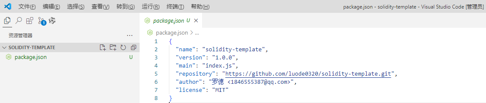
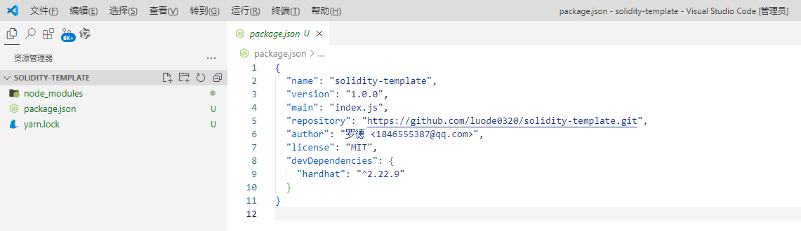
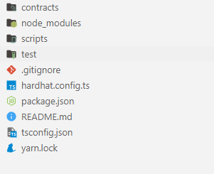

## 创建新的 Hardhat 项目

创建一个文件夹用于存放项目, 此教程使用 `solidity-tamplate`, 因为后续将会把这个项目作为 solidity 智能合约卡法的模板。

## 1. 初始化项目(solidity-tamplate)

```sh
yarn init
```



## 2.安装hardhat

```sh
yarn add --dev hardhat 
```



## 3.初始化Hardhat脚手架

```sh
$ yarn hardhat
yarn run v1.22.22
$ E:\solidity-template\node_modules\.bin\hardhat
888    888                      888 888               888
888    888                      888 888               888
888    888                      888 888               888
8888888888  8888b.  888d888 .d88888 88888b.   8888b.  888888
888    888     "88b 888P"  d88" 888 888 "88b     "88b 888
888    888 .d888888 888    888  888 888  888 .d888888 888
888    888 888  888 888    Y88b 888 888  888 888  888 Y88b.
888    888 "Y888888 888     "Y88888 888  888 "Y888888  "Y888

Welcome to Hardhat v2.22.9

? What do you want to do? ...
> Create a JavaScript project
  Create a TypeScript project
  Create a TypeScript project (with Viem)
  Create an empty hardhat.config.js
  Quit
```

我们选择 `Create a TypeScript project` 初始化, 因为 `TypeScript ` 是强类型的, 我们可以看到结构的定义。



1. **contracts**：存放你的智能合约源码。在这里，你可以创建`.sol`文件来编写Solidity智能合约。
2. **ignition**：Ignition是Hardhat的一个插件，用于加速本地开发环境的启动速度。我们不使用, 删除。
3. **node_modules**：存储项目依赖项的文件夹。当使用`yarn`或`npm`安装依赖项时，它们会被下载到这里。
4. **test**: 存放测试合约的测试代码。在这里可以编写测试的脚本。
5. **.gitignore**：用于指定哪些文件或文件夹应该被Git忽略。这对于避免不必要的文件（如编译生成的文件、日志文件等）进入版本控制系统非常有用。
6. **hardhat.config.ts**：Hardhat项目的配置文件。在这里，你可以指定编译器设置、网络配置、测试策略等。
7. **package.json**：记录项目依赖项、版本和其他元数据的文件。当你使用`yarn`或`npm`安装新包时，它们会被添加到这个文件中。
8. **README.md**：项目说明文件，通常包含项目简介、安装和使用说明等内容。


 


