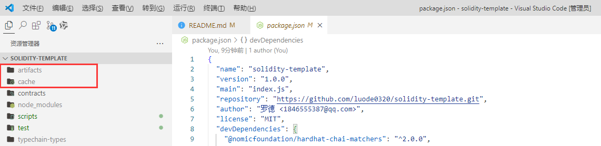

## 编写和编译合约

我们创建一个简单的智能合约，合约实现代币转让。

代币合约最常用于兑换或价值存储。 这里，我们不深入讨论合约的 `Solidity` 代码，但是一些实现逻辑你需要知道：

- 代币有固定发行总量。
- 所有发行总量都分配给了部署合约的地址。
- 任何人都可以接收代币。
- 任何人拥有代币的人都可以转让代币。
- 代币不可分割。 你可以转让1、2、3或37个代币，但不能转让2.5个代币。

> 你可能听说过[ERC20](https://learnblockchain.cn/tags/ERC20)，它是以太坊中的代币标准。
>
>  USDC，BNB之类的代币都遵循ERC20标准，使这些代币都可以与任何能处理ERC20代币的软件兼容。
>
>  **为了简单起见，我们要构建的代币不是ERC20**。

## 编写合约

我们现在先不学习 solidity 的语法, 我们想看一个实例。

首先一个名为 `contracts` 的目录内创建一个名为`Token.sol`的文件(我们已经删除了初始化默认创建的合约 `contracts\Lock.sol`)

```solidity
// SPDX-License-Identifier: MIT
pragma solidity ^0.8.9;

// This is the main building block for smart contracts.
contract Token {
    // `public` 修饰符使得这些变量可以从合约外部读取。
    string public name = "My Hardhat Token"; // 代币全名
    string public symbol = "MBT";			// 代币简写名

    // 固定发行量，保存在一个无符号整型里, 10w。
    uint256 public totalSupply = 1000000;

    // 一个地址类型变量用于存储以太坊账户。
    address public owner; // 合约所有者==谁创建的这个合约

    // map 映射是一种键值对映射。这里我们存储每个账户的余额。
    mapping(address => uint256) balances;

    /**
     * 合约构造函数
     *
     * `constructor` 只在创建合约时执行一次。
     */
    constructor() {
        // 总供应量分配给交易发送方，即部署合约的账户。
        balances[msg.sender] = totalSupply;
        owner = msg.sender;
    }

    /**
     * 代币转账功能。
     *
     * `external` 修饰符使得该函数只能从合约外部调用。
     */
    function transfer(address to, uint256 amount) external {
        // 检查交易发送方是否有足够的代币。
        // 如果 `require` 的第一个参数为 `false`，则交易将会回退, 并返回错误信息
        require(balances[msg.sender] >= amount, "Not enough tokens");

        // 执行转账操作。
        balances[msg.sender] -= amount; // 合约所有者 - 转账数量
        balances[to] += amount;			// 代币接收者 + 转账数量
    }

    /**
     * 返回指定账户的代币余额，这是一个只读函数。
     *
     * `view` 修饰符表明该函数不会修改合约的状态，
     * 这使得我们可以不通过执行交易就能调用它。
     */
    function balanceOf(address account) external view returns (uint256) {
    	// 返回一个账户所拥有的代币数量 
        return balances[account];
    }
}
```

> `*.sol` 是 Solidity 合约文件的后缀。 我们建议将文件名与其包含的合约名一致，这是一种常见的做法。

## 编译合约

**实际上后续运行时, 如果没有编译会默认帮我们编译, 所以这一步我们了解即可。**

要编译合约，请在终端中运行 `npx hardhat compile` 。 `compile`任务是内置任务之一。

```sh
yarn hardhat compile
```



不必管他, 就和所有语言都需要编译一样。

