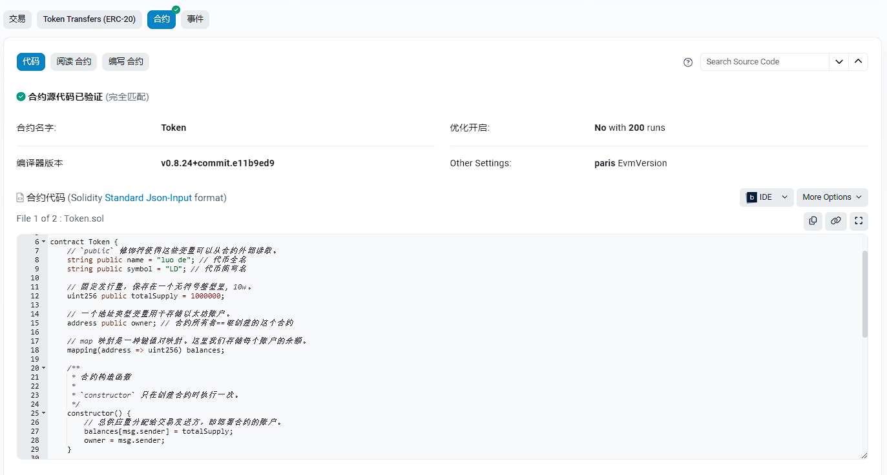

# 验证合约

验证合约的目的是可以让其他人看到我们和合约的源码。



# 添加一个条目

需要在`hardhat.config.js` 文件中添加一个访问以太坊区块链条目。

```js
import "@nomicfoundation/hardhat-toolbox";
import "@nomicfoundation/hardhat-verify";
import dotenv from "dotenv";

// 加载环境变量
dotenv.config();

// 测试网的 URL
const RPC_URL: string = process.env.RPC_URL!;
// 我们自己的钱包私钥
const PRIVATE_KEY: string = process.env.PRIVATE_KEY!;
// Etherscan 区块链浏览器 API 密钥
const ETHERSCAN_API_KEY: string = process.env.ETHERSCAN_API_KEY!;

// Hardhat 配置类型
import type { HardhatUserConfig } from "hardhat/config";

const config: HardhatUserConfig = {
  solidity: "0.8.24",
  networks: {
    sepolia: {
      // Sepolia 网络的 RPC URL
      url: RPC_URL,
      // 用于连接 Sepolia 网络的账户私钥
      accounts: [PRIVATE_KEY],
      // Sepolia 网络的链 ID
      chainId: 11155111
    },
  },
  // Etherscan 配置，用于访问以太坊区块链数据
  etherscan: {
    apiKey: ETHERSCAN_API_KEY,
  },
};

export default config;
```

**特别注意, 我们添加了 `hardhat-verify` 模块, 用于验证合约。**

# 补充区块链浏览器API密钥

**.env**文件

```env
RPC_URL=https://sepolia.infura.io/v3/<去 https://infura.io 注册后的key>
PRIVATE_KEY=<我们的钱包私钥>
ETHERSCAN_API_KEY=<去 https://etherscan.io 区块链浏览器注册后的API密钥>
```

# 验证合约

之前的部署我们已经拿到了合约的地址:

```
$ yarn hardhat run scripts/deploy.ts --network sepolia
yarn run v1.22.22
$ E:\solidity-template\node_modules\.bin\hardhat run scripts/deploy.ts --network sepolia
_________________________启动部署________________________________
部署地址: 0xf6960DdBF90799E746d3AaD737a15Ca6f86dfaE1
账户余额 balance(wei): 923537050720014401
账户余额 balance(eth): 0.923537050720014401
_________________________部署合约________________________________
合约地址: 0x3630b802427B38595885D3349c2cC6B1ABF192C6
_________________________合约调用________________________________
owner: 获取合约所有者地址: 0xf6960DdBF90799E746d3AaD737a15Ca6f86dfaE1
balanceOf(): 合约所有者的代币: 1000000

transfer(): 代币转账...

balanceOf(): 新账户代币: 1000000
balanceOf(): 合约所有者的代币: 1000000
Done in 29.63s.
```

验证合约:

```
$ yarn hardhat verify --network sepolia --contract contracts/Contract.sol:Contract 0x3630b802427B38595885D3349c2cC6B1ABF192C6
yarn run v1.22.22
$ E:\solidity-template\node_modules\.bin\hardhat verify --network sepolia --contract contracts/Contract.sol:Contract 0x3630b802427B38595885D3349c2cC6B1ABF192C6
[INFO] Sourcify Verification Skipped: Sourcify verification is currently disabled. To enable it, add the following entry to your Hardhat configuration:

sourcify: {
  enabled: true
}

Or set 'enabled' to false to hide this message.

For more information, visit https://hardhat.org/hardhat-runner/plugins/nomicfoundation-hardhat-verify#verifying-on-sourcify
Successfully submitted source code for contract
contracts/Contract.sol:Contract at 0x3630b802427B38595885D3349c2cC6B1ABF192C6
for verification on the block explorer. Waiting for verification result...

Successfully verified contract Contract on the block explorer.
https://sepolia.etherscan.io/address/0x3630b802427B38595885D3349c2cC6B1ABF192C6#code

Done in 24.42s.
```

**注意: 重复验证相同的合约, 可能会出现异常提醒。**