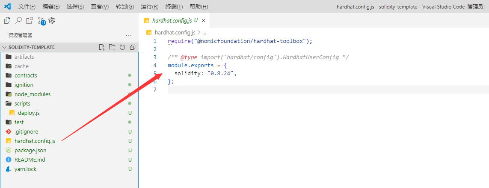

## 部署到远程网络

具有真实价值的以太坊网络被称为“主网”，然后还有一些不具有真实价值但能够很好地模拟主网的网络，它可以被其他人共享阶段的环境。

-
这些被称为“测试网”，以太坊有多个[测试网](https://learnblockchain.cn/docs/hardhat/tutorial/(https://decert.me/tutorial/solidity/ethereum/evm_network#区块链网络))，
例如_Goerli_ 和 *Sepolia*。

- 截止到 2024.8.26 号, 我们建议你将合约部署到 *Sepolia* 测试网。

- 在应用软件层，部署到测试网与部署到主网相同。 唯一的区别是你连接到哪个网络。

## 添加一个`network`条目

要部署到诸如主网或任何测试网之类的线上网络，你需要在`hardhat.config.js` 文件中添加一个`network`条目。



在此示例中，我们将使用Sepolia，但你可以类似地添加其他网络：

```js
// 这个插件提供了一系列工具，包括用于测试的实用程序、部署脚本、类型定义等。
require("@nomicfoundation/hardhat-toolbox");
// 引入环境变量配置，用于安全管理敏感信息
require("dotenv").config();

// 测试网的 url
const RPC_URL = process.env.RPC_URL;
// 我们自己的钱包私钥
const PRIVATE_KEY = process.env.PRIVATE_KEY;

/** @type import('hardhat/config').HardhatUserConfig */
module.exports = {
  solidity: "0.8.24",
  networks: {
    sepolia: {
      // Sepolia网络的RPC URL
      url: RPC_URL,
      // 用于连接Sepolia网络的账户私钥
      accounts: [PRIVATE_KEY],
      // Sepolia 网络的链ID
      chainId: 11155111,
      // 区块链浏览器
      browserURL: 'https://sepolia.etherscan.io',
    }
  }
};
```

## 创建一个环境变量

当然, 此时我们必须创建一个 `.env` 环境变量文件, 因为涉及到我们的私钥, 并且我们需要安装引入环境变量的依赖。

```sh
yarn add --dev dotenv
```

**.env**文件

```env
RPC_URL=https://sepolia.infura.io/v3/<去 https://infura.io 注册后的key>
PRIVATE_KEY=<我们的钱包私钥>
```

很遗憾的是, 截止 2024.8.26号, 如果我们想要获取测试币, 我们的主网必要要有0.01个ETH才可以获取测试币。

## 获取测试币

- [水龙头获取测试币](https://faucets.chain.link/sepolia)
- 当然你可以去闲鱼上买, 一个 sepolia 测试网的测试币大概是 1 元

## 部署

### 1. ignotion部署

```sh
$ yarn hardhat ignition deploy ./ignition/modules/deploy.js --network
yarn run v1.22.22
$ E:\solidity-template\node_modules\.bin\hardhat ignition deploy ./ignition/modules/deploy.js --network sepolia
√ Confirm deploy to network sepolia (11155111)? ... yes
Hardhat Ignition 🚀

Deploying [ deploy ]

Batch #1
  Executed deploy#Token

[ LockModule ] successfully deployed 🚀

Deployed Addresses

deploy#Token - 0x6b79913C29652362b8FCFc225bC3304BecaA013C

info Visit https://yarnpkg.com/en/docs/cli/run for documentation about this command.
Done in 92.58s.
```

### 2. script脚本部署

```js
$ yarn hardhat run scripts/deploy.js --network sepolia
yarn run v1.22.22
$ E:\solidity-template\node_modules\.bin\hardhat run scripts/deploy.js --network sepolia
部署合约帐户地址: 0xf6960DdBF90799E746d3AaD737a15Ca6f86dfaE1
账户余额 balance(Wei): 1044414409825542929
账户余额 balance(ETH): 1.044414409825542929
___________________________________________________________
部署合约...
合约地址: 0xAE8be154553d3b9ebEF90cc9698840c86DbC955c
Done in 17.71s.
```

如果一切顺利，你应该看到已部署的合约地址, 这可能会等待一段时间。

- 你可以去 [测试网](https://sepolia.etherscan.io) 查询合约部署情况。

## 运行出错

### 1. Connect Timeout Error

[GitHub 修复超时解决方案](https://github.com/smartcontractkit/full-blockchain-solidity-course-js/discussions/2247#discussioncomment-5496669)

`hardhat.config.js` 文件

```js
// 修复超时的问题
// https://github.com/smartcontractkit/full-blockchain-solidity-course-js/discussions/2247#discussioncomment-5496669
const { ProxyAgent, setGlobalDispatcher } = require("undici");
const proxyAgent = new ProxyAgent("http://127.0.0.1:7890");
setGlobalDispatcher(proxyAgent);
```

添加依赖:

```sh
yarn add --dev undici
```

运行:

```sh
# ignition
yarn hardhat ignition deploy ./ignition/modules/deploy.js --network
# script
yarn hardhat run scripts/deploy.js --network sepolia
```

