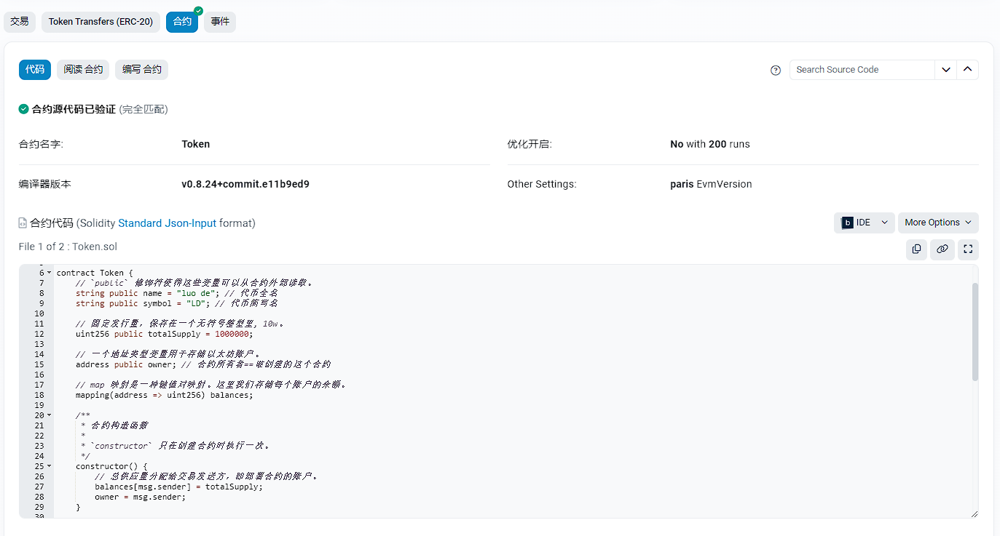

# 验证合约

验证合约的目的是可以让其他人看到我们和合约的源码。



# 添加一个条目

需要在`hardhat.config.js` 文件中添加一个访问以太坊区块链条目。

```js
// 这个插件提供了一系列工具，包括用于测试的实用程序、部署脚本、类型定义等。
require("@nomicfoundation/hardhat-toolbox");
// 这个插件提供了验证智能合约的功能，可以在区块链浏览器上查看合约的源代码和编译器版本。
require("@nomicfoundation/hardhat-verify");
// 引入环境变量配置，用于安全管理敏感信息
require("dotenv").config();

// 测试网的 url
const RPC_URL = process.env.RPC_URL;
// 我们自己的钱包私钥
const PRIVATE_KEY = process.env.PRIVATE_KEY;
// Etherscan 区块链浏览器 API密钥
const ETHERSCAN_API_KEY = process.env.ETHERSCAN_API_KEY;

/** @type import('hardhat/config').HardhatUserConfig */
module.exports = {
  solidity: "0.8.24",
  networks: {
    sepolia: {
      // Sepolia网络的RPC URL
      url: RPC_URL,
      // 用于连接Sepolia网络的账户私钥
      accounts: [PRIVATE_KEY],
      // Sepolia 网络的链ID
      chainId: 11155111,
      // 区块链浏览器
      browserURL: 'https://sepolia.etherscan.io',
    }
  },

  // Etherscan配置，用于访问以太坊区块链数据
  etherscan: {
    // Etherscan API密钥
    apiKey: ETHERSCAN_API_KEY,
  },
};
```

**特别注意, 我们添加了 `hardhat-verify` 模块, 用于验证合约。**

# 补充区块链浏览器API密钥

**.env**文件

```env
RPC_URL=https://sepolia.infura.io/v3/<去 https://infura.io 注册后的key>
PRIVATE_KEY=<我们的钱包私钥>
ETHERSCAN_API_KEY=<去 https://etherscan.io 区块链浏览器注册后的API密钥>
```

# 验证合约

之前的部署我们已经拿到了合约的地址:

```
$ yarn hardhat run scripts/deploy.js --network sepolia
yarn run v1.22.22
$ E:\solidity-template\node_modules\.bin\hardhat run scripts/deploy.js --network sepolia
部署合约帐户地址: 0xf6960DdBF90799E746d3AaD737a15Ca6f86dfaE1
账户余额 balance(Wei): 1044414409825542929
账户余额 balance(ETH): 1.044414409825542929
___________________________________________________________
部署合约...
合约地址: 0xAE8be154553d3b9ebEF90cc9698840c86DbC955c
Done in 17.71s.
```

验证合约:

```
$ yarn hardhat verify --network sepolia --contract contracts/Token.sol:Token 0xAE8be154553d3b9ebEF90cc9698840c86DbC955c
yarn run v1.22.22
$ E:\solidity-template\node_modules\.bin\hardhat verify --network sepolia --contract contracts/Token.sol:Token 0xAE8be154553d3b9ebEF90cc9698840c86DbC955c
[INFO] Sourcify Verification Skipped: Sourcify verification is currently disabled. To enable it, add the following entry to your Hardhat configuration:

sourcify: {
  enabled: true
}

Or set 'enabled' to false to hide this message.

For more information, visit https://hardhat.org/hardhat-runner/plugins/nomicfoundation-hardhat-verify#verifying-on-sourcify
Successfully submitted source code for contract
contracts/Token.sol:Token at 0xAE8be154553d3b9ebEF90cc9698840c86DbC955c
for verification on the block explorer. Waiting for verification result...

Successfully verified contract Token on the block explorer.
https://sepolia.etherscan.io/address/0xAE8be154553d3b9ebEF90cc9698840c86DbC955c#code

Done in 21.52s.
```

**注意: 重复验证相同的合约, 可能会出现异常提醒。**