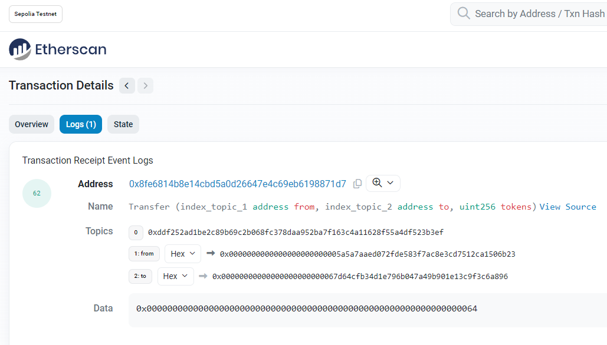

## 项目源码

[https://github.com/luode0320/solidity-demo](https://github.com/luode0320/solidity-demo)

## 事件

`Solidity`中的事件（`event`）是`EVM`上日志的抽象，它具有两个特点：

- 响应：应用程序（[`ethers.js`](https://learnblockchain.cn/docs/ethers.js/api-contract.html#id18)）可以通过`RPC`
  接口订阅和监听这些事件，并在前端做响应。
- 经济：事件是`EVM`上比较经济的存储数据的方式，每个大概消耗2,000 `gas`；相比之下，链上存储一个新变量至少需要20,000 `gas`。

我们用转账ERC20代币为例来介绍`Solidity`中的事件（`event`）。

### 声明事件

事件的声明由`event`关键字开头，接着是事件名称，括号里面写好事件需要记录的变量类型和变量名。以`ERC20`代币合约的`Transfer`
事件为例：

```solidity
event Transfer(address indexed from, address indexed to, uint256 value);
```

我们可以看到，`Transfer`事件共记录了3个变量:

- `from`: 代币的转账地址
- ``to`: 接收地址
- `value`: 转账数量

其中`from`和`to`前面带有`indexed`关键字，他们会保存在以太坊虚拟机日志的`topics`中，方便之后检索。

每个事件最多可以有三个 `indexed` 变量, 可以被 `indexed` 修饰的类型

1. **`address`**: 地址类型可以被 `indexed`。
2. **`uint256`**: 无符号整数类型可以被 `indexed`。
3. **`bytes32`**: 字节类型可以被 `indexed`，通常用于存储哈希值或其他固定长度的数据。

### 释放事件

我们可以在函数里使用 `emit` 释放事件。在下面的例子中，每次用`_transfer()`函数进行转账操作的时候，都会释放`Transfer`
事件，并记录相应的变量。

```solidity
// 定义_transfer函数，执行转账逻辑
function _transfer(
    address from,
    address to,
    uint256 amount
) external {

    _balances[from] = 10000000; // 给转账地址一些初始代币

    _balances[from] -=  amount; // from地址减去转账数量
    _balances[to] += amount; // to地址加上转账数量

    // 释放事件
    emit Transfer(from, to, amount);
}
```

## EVM日志 `Log`

以太坊虚拟机（EVM）用日志`Log`来存储`Solidity`事件，每条日志记录都包含主题`topics`和数据`data`两部分。

我们尝试用`_transfer()`函数在`Sepolia`测试网络上转账100代币，可以在`Etherscan`
上查询到相应的`tx`：[网址](https://sepolia.etherscan.io/tx/0xb07dcd9943662e2e8b17c7add370f046401962ce24d0690a61bb249a385dc8c9#eventlog)。

点击`Logs`按钮，就能看到事件明细：



1. **Address**：这是触发事件的日志的合约地址。
2. **Name**：事件名称及其参数列表。在这个例子中，事件名为 "Transfer"，它有三个参数：src（源地址）、dst（目标地址）和
   wad（金额）。这表明这是一个 ERC20 代币转移事件。
3. Topics：日志的主题。主题通常用于索引和过滤日志。对于 ERC20 事件，第一个主题通常是事件签名哈希，第二个主题是 src 地址，第三个主题是
   dst 地址，最后一个主题是事件的数据哈希。
    - Topic 0 是事件签名哈希，表示 "Transfer" 事件。`keccak256("Transfer(address,address,uint256)")`
    - Topic 1 是 src 地址，这里是 `0x8c85518f...`。
    - Topic 2 是 dst 地址，这里是 `0x00000000...`，这意味着接收方是零地址，即销毁代币。
4. **Data**：事件的具体数据。在这个例子中，data 字段包含了 wad（金额）的信息。
    - 事件中不带 `indexed`的参数会被存储在 `data` 部分中，可以理解为事件的“值”。`data` 部分的变量不能被直接检索，但可以存储任意大小的数据。

## 完整代码

```solidity
// SPDX-License-Identifier: MIT
pragma solidity ^0.8.21;

contract Events {
    // 定义_balances映射变量，记录每个地址的持币数量
    mapping(address => uint256) public _balances;

    // 定义Transfer event，记录transfer交易的转账地址，接收地址和转账数量
    event Transfer(address indexed from, address indexed to, uint256 value);

    // 定义_transfer函数，执行转账逻辑
    function _transfer(address from, address to, uint256 amount) external {
        _balances[from] = 10000000; // 给转账地址一些初始代币
        _balances[to] = 10000000; // 给转账地址一些初始代币

        _balances[from] -= amount; // from地址减去转账数量
        _balances[to] += amount; // to地址加上转账数量

        // 释放事件
        emit Transfer(from, to, amount);
    }
}

```

## 部署调试合约

修改 `.env` 中

```
# 部署的合约名称
DEPLOY_CONTRACT_NAME=InsertionSort
```

编写调试逻辑 `scripts\deploy.ts`:

```ts
import { ethers } from "hardhat";
import dotenv from "dotenv";

// 加载环境变量
dotenv.config();

// 需要部署的合约名称
const contractName: string = process.env.DEPLOY_CONTRACT_NAME!;

// 调用合约方法
async function exec(contract: any) {
    const onTransfer = (from: any, to: any, value: any, event: any) => {
        console.log(`事件监听器: ${from} => ${to}: ${value}`);
    }
    // 设置事件监听器
    contract.on("Transfer", onTransfer);

    // 创建新账户
    const [deployer, newAccount] = await ethers.getSigners();

    // 转账
    console.log("Transfer: 代币转账...");
    await contract._transfer(deployer.address, newAccount.address, 10000);
    console.log(`${deployer.address} 转账 ${newAccount.address} 10000 个代币`);

    const balanceAfterTransfer = await contract._balances(deployer.address);
    const newAccountBalance = await contract._balances(newAccount.address);
    console.log(`${deployer.address} 获取转账后的余额:`, balanceAfterTransfer.toString());
    console.log(`${newAccount.address} 获取转账后的余额:`, newAccountBalance.toString());

    // 设置堵塞, 因为监听是 4s 轮询的方式, 所以需要等待 4s
    await new Promise(res => setTimeout(() => res(null), 5000));
    // 移除事件监听器
    contract.removeListener("Transfer", onTransfer);
}

// 定义一个异步函数 main，用于部署合约。
async function main() {
    console.log("_________________________启动部署________________________________");
    const [deployer] = await ethers.getSigners();
    console.log("部署地址:", deployer.address);

    // 获取账户的余额
    const balance = await deployer.provider.getBalance(deployer.address);
    // 将余额转换为以太币 (ETH)
    console.log("账户余额 balance(wei):", balance.toString());
    const balanceInEther = ethers.formatEther(balance);
    console.log("账户余额 balance(eth):", balanceInEther);

    console.log("_________________________部署合约________________________________");
    // 获取合约工厂。
    const contractFactory = await ethers.getContractFactory(contractName);
    // 部署合约
    const contract = await contractFactory.deploy();
    //  等待部署完成
    await contract.waitForDeployment()
    console.log(`合约地址: ${contract.target}`);

    console.log("_________________________合约调用________________________________");
    await exec(contract);
}

// 执行 main 函数，并处理可能发生的错误。
main()
    .then(() => process.exit(0)) // 如果部署成功，则退出进程。
    .catch(error => {
        console.error(error); // 如果发生错误，则输出错误信息。
        process.exit(1); // 退出进程，并返回错误代码 1。
    });
```

运行结果:

```sh
$ yarn hardhat run scripts/deploy.ts 
yarn run v1.22.22
$ E:\solidity-demo\12.事件event\node_modules\.bin\hardhat run scripts/deploy.ts
Compiled 1 Solidity file successfully (evm target: paris).
_________________________启动部署________________________________
部署地址: 0xf39Fd6e51aad88F6F4ce6aB8827279cffFb92266
账户余额 balance(wei): 10000000000000000000000
账户余额 balance(eth): 10000.0
_________________________部署合约________________________________
合约地址: 0x5FbDB2315678afecb367f032d93F642f64180aa3
_________________________合约调用________________________________
Transfer: 代币转账...
0xf39Fd6e51aad88F6F4ce6aB8827279cffFb92266 转账 0x70997970C51812dc3A010C7d01b50e0d17dc79C8 10000 个代币
0xf39Fd6e51aad88F6F4ce6aB8827279cffFb92266 获取转账后的余额: 9990000
0x70997970C51812dc3A010C7d01b50e0d17dc79C8 获取转账后的余额: 10010000
事件监听器: 0xf39Fd6e51aad88F6F4ce6aB8827279cffFb92266 => 0x70997970C51812dc3A010C7d01b50e0d17dc79C8: 10000
Done in 7.88s.
```

## 总结

这一讲，我们介绍了如何使用和查询`Solidity`中的事件。很多链上分析工具包括`Nansen`和`Dune Analysis`都是基于事件工作的。

