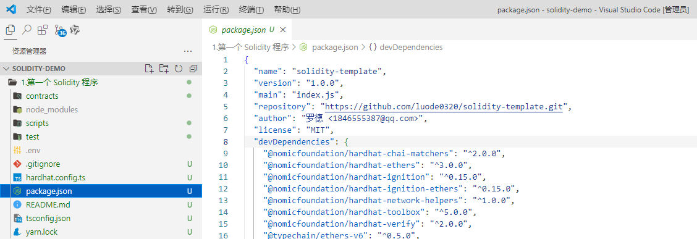

## 项目源码

[https://github.com/luode0320/solidity-demo](https://github.com/luode0320/solidity-demo)

## 创建目录并下载模板

- 目录: 第一个 Solidity 程序
- 模板: [solidity-template](https://github.com/luode0320/solidity-template)
- 安装依赖: `yarn`
- 重命名 `.env.exampl`  ->  `.env`, 并配置api key



## 第一个 Solidity 程序

重命名 `Contract.sol`  -> `HelloWeb3.sol`:

```solidity
// SPDX-License-Identifier: MIT
// 指定 Solidity 编译器版本大于 0.8.21
pragma solidity ^0.8.21;

// 定义了一个名为 HelloWeb3 的智能合约
contract HelloWeb3 {
    // 定义了一个公共 ( public) 的可读写的字符串 (string) 状态变量，其初始值为 "Hello Web3!"
    string public _string = "Hello Web3!";
}
```

## 部署调试合约

修改 `.env` 中

```
# 部署的合约名称
DEPLOY_CONTRACT_NAME=HelloWeb3
```

编写调试逻辑 `scripts\deploy.ts`:

```js
import { ethers } from "hardhat";
import dotenv from "dotenv";

// 加载环境变量
dotenv.config();

// 需要部署的合约名称
const contractName: string = process.env.DEPLOY_CONTRACT_NAME!;

// 调用合约方法
async function exec(contract: any) {
    const _string = await contract._string();
    console.log("_string: 获取一个公共变量:", _string);
}

// 定义一个异步函数 main，用于部署合约。
async function main() {
    console.log("_________________________启动部署________________________________");
    const [deployer] = await ethers.getSigners();
    console.log("部署地址:", deployer.address);

    // 获取账户的余额
    const balance = await deployer.provider.getBalance(deployer.address);
    // 将余额转换为以太币 (ETH)
    console.log("账户余额 balance(wei):", balance.toString());
    const balanceInEther = ethers.formatEther(balance);
    console.log("账户余额 balance(eth):", balanceInEther);

    console.log("_________________________部署合约________________________________");
    // 获取合约工厂。
    const contractFactory = await ethers.getContractFactory(contractName);
    // 部署合约
    const contract = await contractFactory.deploy();
    //  等待部署完成
    await contract.waitForDeployment()
    console.log(`合约地址: ${contract.target}`);

    console.log("_________________________合约调用________________________________");
    await exec(contract);
}

// 执行 main 函数，并处理可能发生的错误。
main()
    .then(() => process.exit(0)) // 如果部署成功，则退出进程。
    .catch(error => {
        console.error(error); // 如果发生错误，则输出错误信息。
        process.exit(1); // 退出进程，并返回错误代码 1。
    });
```

部署调试:

```sh
$ yarn hardhat run scripts/deploy.ts
yarn run v1.22.22
$ "E:\solidity-demo\1.第一个 Solidity 程序\node_modules\.bin\hardhat" run scripts/deploy.ts
Compiled 1 Solidity file successfully (evm target: paris).
_________________________启动部署________________________________
部署地址: 0xf39Fd6e51aad88F6F4ce6aB8827279cffFb92266
账户余额 balance(wei): 10000000000000000000000
账户余额 balance(eth): 10000.0
_________________________部署合约________________________________
合约地址: 0x5FbDB2315678afecb367f032d93F642f64180aa3
_________________________合约调用________________________________
_string: 获取一个公共变量: Hello Web3!
Done in 3.20s.
```