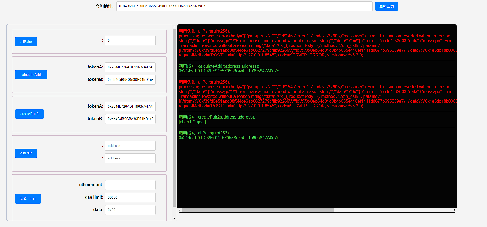

## 项目源码

[https://github.com/luode0320/solidity-demo](https://github.com/luode0320/solidity-demo)

## CREATE2

`CREATE2` 操作码使我们在智能合约部署在以太坊网络之前就能预测合约的地址。

`Uniswap`创建`Pair`合约用的就是`CREATE2`而不是`CREATE`。这一讲，我将介绍`CREATE2`的用法

### CREATE如何计算地址

智能合约可以由其他合约和普通账户利用`CREATE`操作码创建。 在这两种情况下，新合约的地址都以相同的方式计算：

- 创建者的地址(通常为部署的钱包地址或者合约地址)和`nonce`(
  该地址发送交易的总数,对于合约账户是创建的合约总数,每创建一个合约nonce+1)的哈希

```sh
新地址 = hash(创建者地址, nonce)
```

创建者地址不会变，但`nonce`可能会随时间而改变，因此用`CREATE`创建的合约地址不好预测。

### CREATE2如何计算地址

`CREATE2`的目的是为了让合约地址独立于未来的事件。不管未来区块链上发生了什么，你都可以把合约部署在事先计算好的地址上。

用`CREATE2`创建的合约地址由4个部分决定：

- `0xFF`：一个常数，避免和`CREATE`冲突
- `CreatorAddress`: 调用 CREATE2 的当前合约（创建合约）地址。
- `salt`（盐）：一个创建者指定的`bytes32`类型的值，它的主要目的是用来影响新创建的合约的地址。
- `initcode`: 新合约的初始字节码（合约的Creation Code和构造函数的参数）。

```sh
新地址 = hash("0xFF",创建者地址, salt, initcode)
```

`CREATE2` 确保，如果创建者使用 `CREATE2` 和提供的 `salt` 部署给定的合约`initcode`，它将存储在 `新地址` 中。

## 如何使用`CREATE2`

`CREATE2`的用法和之前讲的`CREATE`类似，同样是`new`一个合约，并传入新合约构造函数所需的参数，只不过要多传一个`salt`参数：

```sh
Contract x = new Contract{salt: _salt, value: _value}(params)
```

其中`Contract`是要创建的合约名，`x`是合约对象（地址），`_salt`是指定的盐；如果构造函数是`payable`，可以创建时转入`_value`
数量的`ETH`，`params`是新合约构造函数的参数。

## 极简Uniswap2

跟上一讲类似，我们用`CREATE2`来实现极简`Uniswap`。

### `Pair`

```solidity
contract Pair{
    address public factory; // 工厂合约地址
    address public token0; // 代币1
    address public token1; // 代币2

    constructor() payable {
        factory = msg.sender;
    }

    // 工厂在部署时调用一次
    function initialize(address _token0, address _token1) external {
        require(msg.sender == factory, 'UniswapV2: FORBIDDEN'); // sufficient check
        token0 = _token0;
        token1 = _token1;
    }
}
```

`Pair`合约很简单，包含3个状态变量：`factory`，`token0`和`token1`。

构造函数`constructor`在部署时将`factory`赋值为工厂合约地址。`initialize`函数会在`Pair`
合约创建的时候被工厂合约调用一次，将`token0`和`token1`更新为币对中两种代币的地址。

### `PairFactory2`

```solidity
contract PairFactory2{
    mapping(address => mapping(address => address)) public getPair; // 通过两个代币地址查Pair地址
    address[] public allPairs; // 保存所有Pair地址

    function createPair2(address tokenA, address tokenB) external returns (address pairAddr) {
        require(tokenA != tokenB, 'IDENTICAL_ADDRESSES'); //避免tokenA和tokenB相同产生的冲突
        // 用tokenA和tokenB地址计算salt
        (address token0, address token1) = tokenA < tokenB ? (tokenA, tokenB) : (tokenB, tokenA); //将tokenA和tokenB按大小排序
        bytes32 salt = keccak256(abi.encodePacked(token0, token1));
        // 用create2部署新合约
        Pair pair = new Pair{salt: salt}(); 
        // 调用新合约的initialize方法
        pair.initialize(tokenA, tokenB);
        // 更新地址map
        pairAddr = address(pair);
        allPairs.push(pairAddr);
        getPair[tokenA][tokenB] = pairAddr;
        getPair[tokenB][tokenA] = pairAddr;
    }
}
```

工厂合约（`PairFactory2`）有两个状态变量`getPair`是两个代币地址到币对地址的`map`，方便根据代币找到币对地址；`allPairs`
是币对地址的数组，存储了所有币对地址。

`PairFactory2`合约只有一个`createPair2`函数，使用`CREATE2`根据输入的两个代币地址`tokenA`和`tokenB`来创建新的`Pair`合约。其中

```solidity
Pair pair = new Pair{salt: salt}(); 
```

就是利用`CREATE2`创建合约的代码，非常简单，而`salt`为`token1`和`token2`的`hash`：

```sh
bytes32 salt = keccak256(abi.encodePacked(token0, token1));
```

### 事先计算`Pair`地址

```solidity
// 提前计算pair合约地址
function calculateAddr(address tokenA, address tokenB) public view returns(address predictedAddress){
    require(tokenA != tokenB, 'IDENTICAL_ADDRESSES'); //避免tokenA和tokenB相同产生的冲突
    // 计算用tokenA和tokenB地址计算salt
    (address token0, address token1) = tokenA < tokenB ? (tokenA, tokenB) : (tokenB, tokenA); //将tokenA和tokenB按大小排序
    bytes32 salt = keccak256(abi.encodePacked(token0, token1));
    // 计算合约地址方法 hash()
    predictedAddress = address(uint160(uint(keccak256(abi.encodePacked(
        bytes1(0xff),
        address(this),
        salt,
        keccak256(type(Pair).creationCode)
        )))));
}
```

我们写了一个`calculateAddr`函数来事先计算`tokenA`和`tokenB`将会生成的`Pair`地址。

通过它，我们可以验证我们事先计算的地址和实际地址是否相同。

大家可以部署好`PairFactory2`合约，然后用下面两个地址作为参数调用`createPair2`，看看创建的币对地址是什么，是否与事先计算的地址一样：

```sh
WBNB地址: 0x2c44b726ADF1963cA47Af88B284C06f30380fC78
BSC链上的PEOPLE地址: 0xbb4CdB9CBd36B01bD1cBaEBF2De08d9173bc095c
```

#### 如果部署合约构造函数中存在参数

例如当create2合约时：

> Pair pair = new Pair{salt: salt}(address(this));

计算时，需要将参数和initcode一起进行打包：

> ~~keccak256(type(Pair).creationCode)~~ => keccak256(abi.encodePacked(type(Pair).creationCode, abi.encode(address(
> this))))

```solidity
predictedAddress = address(uint160(uint(keccak256(abi.encodePacked(
                bytes1(0xff),
                address(this),
                salt,
                keccak256(abi.encodePacked(type(Pair).creationCode, abi.encode(address(this))))
            )))));
```

## create2的实际应用场景

1. 交易所为新用户预留创建钱包合约地址。

2. 由 `CREATE2` 驱动的 `factory` 合约，在`Uniswap V2`中交易对的创建是在 `Factory`中调用`CREATE2`完成。

   这样做的好处是: 它可以得到一个确定的`pair`地址, 使得 `Router`中就可以通过 `(tokenA, tokenB)` 计算出`pair`地址,
   不再需要执行一次 `Factory.getPair(tokenA, tokenB)` 的跨合约调用。

## 完整代码

```solidity
// SPDX-License-Identifier: MIT
pragma solidity ^0.8.21;

contract Pair {
    address public factory; // 工厂合约地址
    address public token0; // 代币1
    address public token1; // 代币2

    constructor() payable {
        factory = msg.sender;
    }

    function initialize(address _token0, address _token1) external {
        require(msg.sender == factory, "UniswapV2: FORBIDDEN"); // sufficient check
        token0 = _token0;
        token1 = _token1;
    }
}

```

```solidity
// SPDX-License-Identifier: MIT
pragma solidity ^0.8.21;

import "./Pair.sol";

contract PairFactory2 {
    mapping(address => mapping(address => address)) public getPair; // 通过两个代币地址查Pair地址
    address[] public allPairs; // 保存所有Pair地址

    function createPair2(
        address tokenA,
        address tokenB
    ) external returns (address pairAddr) {
        require(tokenA != tokenB, "IDENTICAL_ADDRESSES"); //避免tokenA和tokenB相同产生的冲突
        // 计算用tokenA和tokenB地址计算salt
        (address token0, address token1) = tokenA < tokenB
            ? (tokenA, tokenB)
            : (tokenB, tokenA); //将tokenA和tokenB按大小排序
        bytes32 salt = keccak256(abi.encodePacked(token0, token1));
        // 用create2部署新合约
        Pair pair = new Pair{salt: salt}();
        // 调用新合约的initialize方法
        pair.initialize(tokenA, tokenB);
        // 更新地址map
        pairAddr = address(pair);
        allPairs.push(pairAddr);
        getPair[tokenA][tokenB] = pairAddr;
        getPair[tokenB][tokenA] = pairAddr;

        return (pairAddr);
    }

    // 提前计算pair合约地址
    function calculateAddr(
        address tokenA,
        address tokenB
    ) public view returns (address predictedAddress) {
        require(tokenA != tokenB, "IDENTICAL_ADDRESSES"); //避免tokenA和tokenB相同产生的冲突
        // 计算用tokenA和tokenB地址计算salt
        (address token0, address token1) = tokenA < tokenB
            ? (tokenA, tokenB)
            : (tokenB, tokenA); //将tokenA和tokenB按大小排序
        bytes32 salt = keccak256(abi.encodePacked(token0, token1));
        // 计算合约地址方法 hash()
        predictedAddress = address(
            uint160(
                uint(
                    keccak256(
                        abi.encodePacked(
                            bytes1(0xff),
                            address(this),
                            salt,
                            keccak256(type(Pair).creationCode)
                        )
                    )
                )
            )
        );
    }
}

```

## 调试

启动本地网络节点:

```sh
yarn hardhat node
```

部署PairFactory合约:

````sh
yarn hardhat run scripts/deploy.ts --network localhost
````

```sh
yarn run v1.22.22
$ E:\solidity-demo\25.CREATE2\node_modules\.bin\hardhat run scripts/deploy.ts --network localhost
Compiled 2 Solidity files successfully (evm target: paris).
当前网络: localhost
_________________________启动部署________________________________
部署地址: 0xf39Fd6e51aad88F6F4ce6aB8827279cffFb92266
账户余额 balance(wei): 9862982876981976688766
账户余额 balance(eth): 9862.982876981976688766
_________________________部署合约________________________________
合约地址: 0xFD6F7A6a5c21A3f503EBaE7a473639974379c351
生成调试 html,请用 Live Server 调试: E:\solidity-demo\25.CREATE2\index.html
Done in 2.76s.
```



## 总结

这一讲，我们介绍了`CREATE2`操作码的原理，使用方法，并用它完成了极简版的`Uniswap`并提前计算币对合约地址。

`CREATE2`让我们可以在部署合约前确定它的合约地址，这也是一些`layer2`项目的基础。