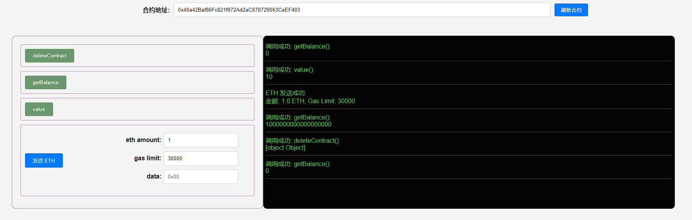

## 项目源码

[https://github.com/luode0320/solidity-demo](https://github.com/luode0320/solidity-demo)

## selfdestruct

`selfdestruct`命令可以用来删除智能合约，并将该合约剩余`ETH`转到指定地址。

`selfdestruct`是为了应对合约出错的极端情况而设计的。它最早被命名为`suicide`
（自杀），但是这个词太敏感。为了保护抑郁的程序员，改名为`selfdestruct`；

在 [v0.8.18](https://blog.soliditylang.org/2023/02/01/solidity-0.8.18-release-announcement/) 版本中，`selfdestruct`
关键字被标记为「不再建议使用」，在一些情况下它会导致预期之外的合约语义，但由于目前还没有代替方案，目前只是对开发者做了编译阶段的警告，相关内容可以查看 [EIP-6049](https://eips.ethereum.org/EIPS/eip-6049)。

然而，在以太坊坎昆（Cancun）升级中，[EIP-6780](https://eips.ethereum.org/EIPS/eip-6780)被纳入升级以实现对`Verkle Tree`
更好的支持。EIP-6780减少了`SELFDESTRUCT`操作码的功能。

根据提案描述，当前`SELFDESTRUCT`仅会被用来将合约中的ETH转移到指定地址，而原先的删除功能只有在`合约创建-自毁`
这两个操作处在同一笔交易时才能生效。所以目前来说：

1. 已经部署的合约无法被`SELFDESTRUCT`了。

2. 如果要使用原先的`SELFDESTRUCT`功能，必须在同一笔交易中创建并`SELFDESTRUCT`。

   通常情况下，我们不会在一个事务中创建一个合约并立即执行 `SELFDESTRUCT`，因为这确实没有什么实际的意义

### 如何使用`selfdestruct`

`selfdestruct`使用起来非常简单：

```solidity
selfdestruct(_addr)；
```

其中`_addr`是接收合约中剩余`ETH`的地址。`_addr` 地址不需要有`receive()`或`fallback()`也能接收`ETH`。

### Demo-转移ETH功能

以下合约在坎昆升级前可以完成合约的自毁，在坎昆升级后仅能实现内部ETH余额的转移。

```solidity
contract DeleteContract {

    uint public value = 10;

    constructor() payable {}

    receive() external payable {}

    function deleteContract() external {
        // 调用selfdestruct销毁合约，并把剩余的ETH转给msg.sender
        selfdestruct(payable(msg.sender));
    }

    function getBalance() external view returns(uint balance){
        balance = address(this).balance;
    }
}
```

在`DeleteContract`合约中，我们写了一个`public`状态变量`value`，两个函数：

- `getBalance()`用于获取合约`ETH`余额
- `deleteContract()`用于自毁合约，并把`ETH`转入给发起人。

部署好合约后，我们向`DeleteContract`合约转入1 `ETH`。这时，`getBalance()`会返回1 `ETH`，`value`变量是10。

当我们调用`deleteContract()`函数，合约将触发`selfdestruct`操作。

**在坎昆升级前，合约会被自毁。但是在升级后，合约依然存在，只是将合约包含的ETH转移到指定地址，而合约依然能够调用。**

### 注意事项

1. 对外提供合约销毁接口时，最好设置为只有合约所有者可以调用，可以使用函数修饰符`onlyOwner`进行函数声明。
2. 当合约中有`selfdestruct`功能时常常会带来安全问题和信任问题，合约中的selfdestruct功能会为攻击者打开攻击向量(
   例如使用`selfdestruct`向一个合约频繁转入token进行攻击，这将大大节省了GAS的费用，虽然很少人这么做)，此外，此功能还会降低用户对合约的信心。

## 完整代码

```solidity
// SPDX-License-Identifier: MIT
pragma solidity ^0.8.21;

// selfdestruct: 删除合约，并强制将合约剩余的ETH转入指定账户

contract DeleteContract {

    uint public value = 10;

    constructor() payable {}

    receive() external payable {}

    function deleteContract() external {
        // 调用selfdestruct销毁合约，并把剩余的ETH转给msg.sender
        selfdestruct(payable(msg.sender));
    }

    function getBalance() external view returns(uint balance){
        balance = address(this).balance;
    }
}

```

## 调试

启动本地网络节点:

```sh
yarn hardhat node
```

部署PairFactory合约:

````sh
yarn hardhat run scripts/deploy.ts --network localhost
````

```sh
yarn run v1.22.22
$ E:\solidity-demo\26.删除合约\node_modules\.bin\hardhat run scripts/deploy.ts --network localhost
Warning: "selfdestruct" has been deprecated. Note that, starting from the Cancun hard fork, the underlying opcode no longer deletes the code and data associated with an account and only transfers its Ether to the beneficiary, unless executed in the same transaction in which the contract was created (see EIP-6780). Any use in newly deployed contracts is strongly discouraged 
even if the new behavior is taken into account. Future changes to the EVM might further reduce the functionality of the opcode.
  --> contracts/DeleteContract.sol:16:9:
   |
16 |         selfdestruct(payable(msg.sender));
   |         ^^^^^^^^^^^^


Compiled 1 Solidity file successfully (evm target: paris).
当前网络: localhost
_________________________启动部署________________________________
部署地址: 0xf39Fd6e51aad88F6F4ce6aB8827279cffFb92266
账户余额 balance(wei): 9862979637605950773758
账户余额 balance(eth): 9862.979637605950773758
_________________________部署合约________________________________
合约地址: 0x40a42Baf86Fc821f972Ad2aC878729063CeEF403
生成调试 html,请用 Live Server 调试: E:\solidity-demo\26.删除合约\index.html
Done in 2.91s.
```



## 总结

`selfdestruct`是智能合约的紧急按钮，销毁合约并将剩余`ETH`转移到指定账户。

当著名的`The DAO`攻击发生时，以太坊的创始人们一定后悔过没有在合约里加入`selfdestruct`来停止黑客的攻击吧。

在坎昆升级后，`selfdestruct`的作用也逐渐发生了改变，什么都不是一成不变的，还是要保持学习。