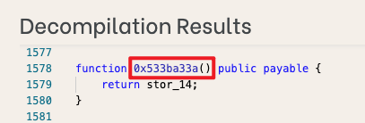
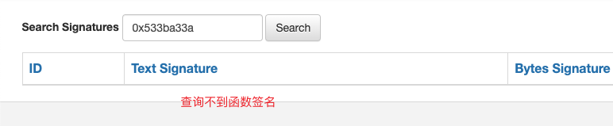
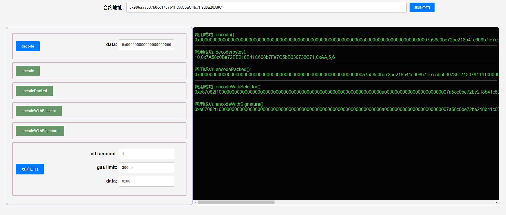

## 项目源码

[https://github.com/luode0320/solidity-demo](https://github.com/luode0320/solidity-demo)

## ABI编码

`ABI` (Application Binary Interface，应用二进制接口)是与以太坊智能合约交互的标准。

数据基于他们的类型编码；并且由于编码后不包含类型信息，解码时需要注明它们的类型。

`Solidity`中，`ABI编码`有4个函数：

- `abi.encode`: 将一组参数编码成一个字节数组，这个字节数组可以用于函数调用或数据传输
- `abi.encodePacked`: 将一组参数编码成一个字节数组，但与 `abi.encode` 不同的是，它不会进行自动填充, 节省存储空间
- `abi.encodeWithSignature`: 编码带有函数签名（signature）的参数，通常用于函数调用
- `abi.encodeWithSelector`: 编码带有函数选择器（selector）的参数，通常用于函数调用

而`ABI解码`有1个函数：

- `abi.decode`，用于解码`abi.encode`的数据。

我们将编码4个变量，他们的类型分别是`uint256`（别名 uint）, `address`, `string`, `uint256[2]`：

```solidity
uint x = 10;
address addr = 0x7A58c0Be72BE218B41C608b7Fe7C5bB630736C71;
string name = "0xAA";
uint[2] array = [5, 6]; 
```

### `abi.encode`

将给定参数利用[ABI规则](https://learnblockchain.cn/docs/solidity/abi-spec.html)编码。`ABI`
被设计出来跟智能合约交互，他将每个参数填充为32字节的数据，并拼接在一起。

如果你要和合约交互，你要用的就是`abi.encode`。

```solidity
function encode() public view returns(bytes memory result) {
    result = abi.encode(x, addr, name, array);
}
```

编码的结果为

```
0x000000000000000000000000000000000000000000000000000000000000000a0000000000000000000000007a58c0be72be218b41c608b7fe7c5bb630736c7100000000000000000000000000000000000000000000000000000000000000a00000000000000000000000000000000000000000000000000000000000000005000000000000000000000000000000000000000000000000000000000000000600000000000000000000000000000000000000000000000000000000000000043078414100000000000000000000000000000000000000000000000000000000
```

由于`abi.encode`将每个数据都填充为32字节，中间有很多`0`。

### `abi.encodePacked`

将给定参数根据其所需最低空间编码。它类似 `abi.encode`，但是会把其中填充的很多`0`省略。比如，只用1字节来编码`uint8`类型。

当你想省空间，并且不与合约交互的时候，可以使用`abi.encodePacked`，例如算一些数据的`hash`时。

```solidity
function encodePacked() public view returns(bytes memory result) {
    result = abi.encodePacked(x, addr, name, array);
}
```

编码的结果为

```
0x000000000000000000000000000000000000000000000000000000000000000a7a58c0be72be218b41c608b7fe7c5bb630736c713078414100000000000000000000000000000000000000000000000000000000000000050000000000000000000000000000000000000000000000000000000000000006
```

由于`abi.encodePacked`对编码进行了压缩，长度比`abi.encode`短很多。

### `abi.encodeWithSignature`

与`abi.encode`功能类似，只不过第一个参数为`函数签名`，比如`"foo(uint256,address,string,uint256[2])"`。当调用其他合约的时候可以使用。

```solidity
function encodeWithSignature() public view returns(bytes memory result) {
    result = abi.encodeWithSignature("foo(uint256,address,string,uint256[2])", x, addr, name, array);
}
```

编码的结果为

```
0xe87082f1000000000000000000000000000000000000000000000000000000000000000a0000000000000000000000007a58c0be72be218b41c608b7fe7c5bb630736c7100000000000000000000000000000000000000000000000000000000000000a00000000000000000000000000000000000000000000000000000000000000005000000000000000000000000000000000000000000000000000000000000000600000000000000000000000000000000000000000000000000000000000000043078414100000000000000000000000000000000000000000000000000000000
```

等同于在`abi.encode`
编码结果前加上了4字节的`函数选择器`[说明](https://www.wtf.academy/docs/solidity-102/ABIEncode#fn-说明)。

[说明](https://www.wtf.academy/docs/solidity-102/ABIEncode#fn-说明): 函数选择器就是通过函数名和参数进行签名处理(
Keccak–Sha3)来标识函数，可以用于不同合约之间的函数调用

### `abi.encodeWithSelector`

与`abi.encodeWithSignature`功能类似，只不过第一个参数为`函数选择器`，为 `函数签名` Keccak哈希的前4个字节。

```solidity
function encodeWithSelector() public view returns(bytes memory result) {
    result = abi.encodeWithSelector(bytes4(keccak256("foo(uint256,address,string,uint256[2])")), x, addr, name, array);
}
```

编码的结果为

```
0xe87082f1000000000000000000000000000000000000000000000000000000000000000a0000000000000000000000007a58c0be72be218b41c608b7fe7c5bb630736c7100000000000000000000000000000000000000000000000000000000000000a00000000000000000000000000000000000000000000000000000000000000005000000000000000000000000000000000000000000000000000000000000000600000000000000000000000000000000000000000000000000000000000000043078414100000000000000000000000000000000000000000000000000000000
```

与`abi.encodeWithSignature`结果一样。

`abi.encodeWithSignature` 方法内部包含了 `abi.encodeWithSelector` 的功能。具体来说，`abi.encodeWithSignature`
方法不仅会将参数编码，还会自动计算并添加函数选择器（function selector），而这个函数选择器是基于函数签名（function
signature）计算出来的。

## ABI解码

### `abi.decode`

`abi.decode`用于解码`abi.encode`生成的二进制编码，将它还原成原本的参数。

```solidity
function decode(bytes memory data) public pure returns(uint dx, address daddr, string memory dname, uint[2] memory darray) {
    (dx, daddr, dname, darray) = abi.decode(data, (uint, address, string, uint[2]));
}
```

## ABI的使用场景

1. 在合约开发中，ABI常配合call来实现对合约的底层调用。

```solidity
bytes4 selector = contract.getValue.selector;

bytes memory data = abi.encodeWithSelector(selector, _x);
(bool success, bytes memory returnedData) = address(contract).staticcall(data);
require(success);

return abi.decode(returnedData, (uint256));
```

2. ethers.js中常用ABI实现合约的导入和函数调用。

```solidity
const wavePortalContract = new ethers.Contract(contractAddress, contractABI, signer);
	/*
    * 从智能合约中调用getAllWaves方法
    */
const waves = await wavePortalContract.getAllWaves();
```

3. 对不开源合约进行反编译后，某些函数无法查到函数签名，可通过ABI进行调用。
    - 0x533ba33a() 是一个反编译后显示的函数，只有函数编码后的结果，并且无法查到函数签名





这种情况无法通过构造interface接口或contract来进行调用


这种情况下，就可以通过ABI函数选择器来调用

```solidity
bytes memory data = abi.encodeWithSelector(bytes4(0x533ba33a));

(bool success, bytes memory returnedData) = address(contract).staticcall(data);
require(success);

return abi.decode(returnedData, (uint256));
```

## 完整代码

```solidity
// SPDX-License-Identifier: MIT
pragma solidity ^0.8.21;

contract ABIEncode {
    // 定义状态变量
    uint x = 10; // 一个整数类型的变量
    address addr = 0x7A58c0Be72BE218B41C608b7Fe7C5bB630736C71; // 一个地址类型的变量
    string name = "0xAA"; // 一个字符串类型的变量
    uint[2] array = [5, 6]; // 一个包含两个元素的整数数组

    // 使用 abi.encode 编码数据
    function encode() public view returns (bytes memory result) {
        // 将状态变量编码成字节数组，并返回
        result = abi.encode(x, addr, name, array);
    }

    // 使用 abi.encodePacked 编码数据
    function encodePacked() public view returns (bytes memory result) {
        // 将状态变量编码成字节数组，不进行填充，并返回
        result = abi.encodePacked(x, addr, string(name), array);
    }

    // 使用 abi.encodeWithSignature 编码数据
    function encodeWithSignature() public view returns (bytes memory result) {
        // 使用函数签名计算函数选择器，并将状态变量编码成字节数组，附加函数选择器，并返回
        result = abi.encodeWithSignature(
            "foo(uint256,address,string,uint256[2])", // 函数签名
            x, // 第一个参数
            addr, // 第二个参数
            name, // 第三个参数
            array // 第四个参数
        );
    }

    // 使用 abi.encodeWithSelector 编码数据
    function encodeWithSelector() public view returns (bytes memory result) {
        // 手动计算函数选择器，并将状态变量编码成字节数组，附加函数选择器，并返回
        result = abi.encodeWithSelector(
            bytes4(keccak256("foo(uint256,address,string,uint256[2])")), // 函数选择器
            x, // 第一个参数
            addr, // 第二个参数
            name, // 第三个参数
            array // 第四个参数
        );
    }

    // 解码数据
    function decode(
        bytes memory data
    )
        public
        pure
        returns (
            uint dx,
            address daddr,
            string memory dname,
            uint[2] memory darray
        )
    {
        // 将字节数组解码回原始类型
        (dx, daddr, dname, darray) = abi.decode(
            data, // 待解码的字节数组
            (uint, address, string, uint[2]) // 解码的目标类型元组
        );
    }
}

```

## 调试

启动本地网络节点:

```sh
yarn hardhat node
```

部署PairFactory合约:

````sh
yarn hardhat run scripts/deploy.ts --network localhost
````

```sh
yarn run v1.22.22
$ E:\solidity-demo\27.ABI编码解码\node_modules\.bin\hardhat run scripts/deploy.ts --network localhost
Compiled 1 Solidity file successfully (evm target: paris).
当前网络: localhost
_________________________启动部署________________________________
部署地址: 0xf39Fd6e51aad88F6F4ce6aB8827279cffFb92266
账户余额 balance(wei): 9863979471409949444190
账户余额 balance(eth): 9863.97947140994944419
_________________________部署合约________________________________
合约地址: 0x986aaa537b8cc170761FDAC6aC4fc7F9d8a20A8C
生成调试 html,请用 Live Server 调试: E:\solidity-demo\27.ABI编码解码\index.html
Done in 3.15s.
```



## 总结

在以太坊中，数据必须编码成字节码才能和智能合约交互。这一讲，我们介绍了4种`abi编码`方法和1种`abi解码`方法。