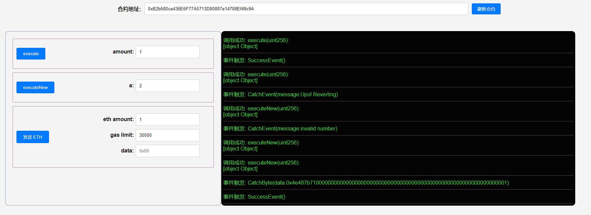

## 项目源码

[https://github.com/luode0320/solidity-demo](https://github.com/luode0320/solidity-demo)

## try-catch

`try-catch`是现代编程语言几乎都有的处理异常的一种标准方式，`Solidity`0.6版本也添加了它。

这一讲，我们将介绍如何利用`try-catch`处理智能合约中的异常。

在`Solidity`中，`try-catch`只能被用于`external`函数或创建合约时`constructor`（被视为`external`函数）的调用。

## 语法

```solidity
try externalContract.f() {
    // call成功的情况下 运行一些代码
} catch {
    // call失败的情况下 运行一些代码
}
```

其中`externalContract.f()`是某个外部合约的函数调用，`try`模块在调用成功的情况下运行，而`catch`模块则在调用失败时运行。

同样可以使用`this.f()`来替代`externalContract.f()`，`this.f()`也被视作为外部调用，但不可在构造函数中使用，因为此时合约还未创建。

如果调用的函数有返回值，那么必须在`try`之后声明`returns(returnType val)`，并且在`try`模块中可以使用返回的变量；

如果是创建合约，那么返回值是新创建的合约变量。

```solidity
try externalContract.f() returns(returnType val){
    // call成功的情况下 运行一些代码
} catch {
    // call失败的情况下 运行一些代码
}
```

另外，`catch`模块支持捕获特殊的异常原因：

```solidity
try externalContract.f() returns(returnType){
    // call成功的情况下 运行一些代码
} catch Error(string memory /*reason*/) {
    // 捕获revert("reasonString") 和 require(false, "reasonString")
} catch Panic(uint /*errorCode*/) {
    // 捕获Panic导致的错误 例如assert失败 溢出 除零 数组访问越界
} catch (bytes memory /*lowLevelData*/) {
    // 如果发生了revert且上面2个异常类型匹配都失败了 会进入该分支
    // 例如revert() require(false) revert自定义类型的error
}
```

## `try-catch`实战

### `OnlyEven`

我们创建一个外部合约`OnlyEven`，并使用`try-catch`来处理异常：

```solidity
contract OnlyEven{
    constructor(uint a){
        require(a != 0, "invalid number");
        assert(a != 1);
    }

    function onlyEven(uint256 b) external pure returns(bool success){
        // 输入奇数时revert
        require(b % 2 == 0, "Ups! Reverting");
        success = true;
    }
}
```

`OnlyEven`合约包含一个构造函数和一个`onlyEven`函数。

- 构造函数有一个参数`a`，当`a=0`时，`require`会抛出异常；当`a=1`时，`assert`会抛出异常；其他情况均正常。
- `onlyEven`函数有一个参数`b`，当`b`为奇数时，`require`会抛出异常。

### 处理外部函数调用异常

首先，在`TryCatch`合约中定义一些事件和状态变量：

```solidity
// 成功event
event SuccessEvent();

// 失败event
event CatchEvent(string message);
event CatchByte(bytes data);

// 声明OnlyEven合约变量
OnlyEven even;

constructor() {
    even = new OnlyEven(2);
}
```

`SuccessEvent`是调用成功会释放的事件，而`CatchEvent`和`CatchByte`是抛出异常时会释放的事件，分别对应`require/revert`
和`assert`异常的情况。

`even`是个`OnlyEven`合约类型的状态变量。

然后我们在`execute`函数中使用`try-catch`处理调用外部函数`onlyEven`中的异常：

```solidity
// 在external call中使用try-catch
function execute(uint amount) external returns (bool success) {
    try even.onlyEven(amount) returns(bool _success){
        // call成功的情况下
        emit SuccessEvent();
        return _success;
    } catch Error(string memory reason){
        // call不成功的情况下
        emit CatchEvent(reason);
    }
}
```

### 处理合约创建异常

这里，我们利用`try-catch`来处理合约创建时的异常。只需要把`try`模块改写为`OnlyEven`合约的创建就行：

```solidity
// 在创建新合约中使用try-catch （合约创建被视为external call）
// executeNew(0)会失败并释放`CatchEvent`
// executeNew(1)会失败并释放`CatchByte`
// executeNew(2)会成功并释放`SuccessEvent`
function executeNew(uint a) external returns (bool success) {
    try new OnlyEven(a) returns(OnlyEven _even){
        // call成功的情况下
        emit SuccessEvent();
        success = _even.onlyEven(a);
    } catch Error(string memory reason) {
        // catch失败的 revert() 和 require()
        emit CatchEvent(reason);
    } catch (bytes memory reason) {
        // catch失败的 assert()
        emit CatchByte(reason);
    }
}
```

## 完整代码

```solidity
// SPDX-License-Identifier: MIT
pragma solidity ^0.8.21;

contract OnlyEven{
    constructor(uint a){
        require(a != 0, "invalid number");
        assert(a != 1);
    }

    function onlyEven(uint256 b) external pure returns(bool success){
        // 输入奇数时revert
        require(b % 2 == 0, "Ups! Reverting");
        success = true;
    }
}

contract TryCatch {
    // 成功event
    event SuccessEvent();
    // 失败event
    event CatchEvent(string message);
    event CatchByte(bytes data);

    // 声明OnlyEven合约变量
    OnlyEven even;

    constructor() {
        even = new OnlyEven(2);
    }
    
    // 在external call中使用try-catch
    // execute(0)会成功并释放`SuccessEvent`
    // execute(1)会失败并释放`CatchEvent`
    function execute(uint amount) external returns (bool success) {
        try even.onlyEven(amount) returns(bool _success){
            // call成功的情况下
            emit SuccessEvent();
            return _success;
        } catch Error(string memory reason){
            // call不成功的情况下
            emit CatchEvent(reason);
        }
    }

    // 在创建新合约中使用try-catch （合约创建被视为external call）
    // executeNew(0)会失败并释放`CatchEvent`
    // executeNew(1)会失败并释放`CatchByte`
    // executeNew(2)会成功并释放`SuccessEvent`
    function executeNew(uint a) external returns (bool success) {
        try new OnlyEven(a) returns(OnlyEven _even){
            // call成功的情况下
            emit SuccessEvent();
            success = _even.onlyEven(a);
        } catch Error(string memory reason) {
            // catch revert("reasonString") 和 require(false, "reasonString")
            emit CatchEvent(reason);
        } catch (bytes memory reason) {
            // catch失败的assert assert失败的错误类型是Panic(uint256) 不是Error(string)类型 故会进入该分支
            emit CatchByte(reason);
        }
    }
}

```

## 调试

启动本地网络节点:

```sh
yarn hardhat node
```

部署PairFactory合约:

````sh
yarn hardhat run scripts/deploy.ts --network localhost
````

```sh
yarn run v1.22.22
$ "E:\solidity-demo\30.Try Catch\node_modules\.bin\hardhat" run scripts/deploy.ts --network localhost
Compiled 1 Solidity file successfully (evm target: paris).
当前网络: localhost
_________________________启动部署________________________________
部署地址: 0xf39Fd6e51aad88F6F4ce6aB8827279cffFb92266
账户余额 balance(wei): 9863976586795926367278
账户余额 balance(eth): 9863.976586795926367278
_________________________部署合约________________________________
合约地址: 0xB2b580ce436E6F77A5713D80887e14788Ef49c9A
生成调试 html,请用 Live Server 调试: E:\solidity-demo\30.Try Catch\index.html
Done in 3.13s.
```



## 总结

在这一讲，我们介绍了如何在`Solidity`使用`try-catch`来处理智能合约运行中的异常：

- 只能用于外部合约调用和合约创建。
- 如果`try`执行成功，返回变量必须声明，并且与返回的变量类型相同。