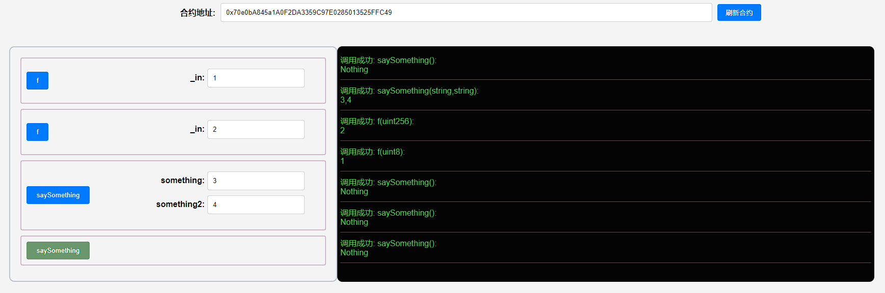

## 项目源码

[https://github.com/luode0320/solidity-demo](https://github.com/luode0320/solidity-demo)

## 重载

`Solidity`中允许函数进行重载（`overloading`），即名字相同但输入参数类型不同的函数可以同时存在，他们被视为不同的函数。

注意，`Solidity`不允许修饰器（`modifier`）重载。

### 函数重载

举个例子，我们可以定义两个都叫`saySomething()`的函数，一个没有任何参数，输出`"Nothing"`；

另一个接收一个`string`参数，输出这个`string`。

```solidity
function saySomething() public pure returns(string memory){
    return("Nothing");
}

function saySomething(string memory something) public pure returns(string memory){
    return(something);
}
```

最终重载函数在经过编译器编译后，由于不同的参数类型，都变成了不同的函数选择器（selector）。

关于函数选择器的具体内容后面会讲。

## 完整代码

```solidity
// SPDX-License-Identifier: MIT
pragma solidity ^0.8.21;

contract Overloading {
    function saySomething() public pure returns (string memory) {
        return ("Nothing");
    }

    function saySomething(
        string memory something
    ) public pure returns (string memory) {
        return (something);
    }

    function f(uint8 _in) public pure returns (uint8 out) {
        out = _in;
    }

    function f(uint256 _in) public pure returns (uint256 out) {
        out = _in;
    }
}

```

## 调试

修改 `.env` :

```
# 部署的合约名称
DEPLOY_CONTRACT_NAME=Overloading
```

启动本地网络节点:

```sh
yarn hardhat node
```

部署合约:

````sh
yarn hardhat run scripts/deploy.ts --network localhost
````

```sh
yarn run v1.22.22
$ E:\solidity-demo\16.函数重载\node_modules\.bin\hardhat run scripts/deploy.ts --network localhost
Compiled 1 Solidity file successfully (evm target: paris).
当前网络: localhost
_________________________启动部署________________________________
部署地址: 0xf39Fd6e51aad88F6F4ce6aB8827279cffFb92266
账户余额 balance(wei): 10000000000000000000000
账户余额 balance(eth): 10000.0
_________________________部署合约________________________________
合约地址: 0x5FbDB2315678afecb367f032d93F642f64180aa3
生成调试 html,请用 Live Server 调试: E:\solidity-demo\16.函数重载\index.html
Done in 3.24s.
```

启动 live server:调试



## 总结

这一讲，我们介绍了`Solidity`中函数重载的基本用法：名字相同但输入参数类型不同的函数可以同时存在，他们被视为不同的函数。