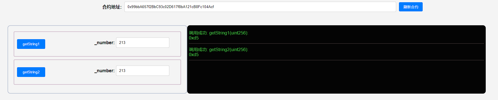

## 项目源码

[https://github.com/luode0320/solidity-demo](https://github.com/luode0320/solidity-demo)

## 库合约

库合约是一种特殊的合约，为了提升`Solidity`代码的复用性和减少`gas`而存在。

库合约是一系列的函数合集，由大神或者项目方创作，咱们站在巨人的肩膀上，会用就行了。

他和普通合约主要有以下几点不同：

1. 不能存在状态变量
2. 不能够继承或被继承
3. 不能接收以太币
4. 不可以被销毁

需要注意的是，库合约重的函数可见性如果被设置为`public`或者`external`，则在调用函数时会触发一次`delegatecall`。

而如果被设置为`internal`，则不会引起。

对于设置为`private`可见性的函数来说，其仅能在库合约中可见，在其他合约中不可用。

## Strings库合约

`Strings`库合约是将`uint256`类型转换为相应的`string`类型的代码库，样例代码如下：

```solidity
// 提供字符串转换功能的库
library Strings {
    // 存储十六进制字符的常量
    bytes16 private constant _HEX_SYMBOLS = "0123456789abcdef";

    /**
     * @dev 将一个无符号整数转换为其 ASCII 字符串十进制表示形式。
     *
     * @param value 要转换的无符号整数。
     * @return 一个表示该整数的字符串。
     */
    function toString(uint256 value) public pure returns (string memory) {
        // Inspired by OraclizeAPI's implementation - MIT licence
        // https://github.com/oraclize/ethereum-api/blob/b42146b063c7d6ee1358846c198246239e9360e8/oraclizeAPI_0.4.25.sol

        if (value == 0) {
            return "0";
        }
        uint256 temp = value;
        uint256 digits;
        // 计算数字的位数
        while (temp != 0) {
            digits++;
            temp /= 10;
        }
        // 创建一个足够大的字节数组来存储结果
        bytes memory buffer = new bytes(digits);
        // 逐位构建字符串
        while (value != 0) {
            digits -= 1;
            // 取模得到最后一位数字，并转换为 ASCII 字符
            buffer[digits] = bytes1(uint8(48 + uint256(value % 10)));
            // 更新值
            value /= 10;
        }
        // 将字节数组转换为字符串并返回
        return string(buffer);
    }

    /**
     * @dev 将一个无符号整数转换为其 ASCII 字符串十六进制表示形式。
     *
     * @param value 要转换的无符号整数。
     * @return 一个表示该整数的十六进制字符串。
     */
    function toHexString(uint256 value) public pure returns (string memory) {
        if (value == 0) {
            return "0x00";
        }
        uint256 temp = value;
        uint256 length = 0;
        // 计算十六进制表示的长度
        while (temp != 0) {
            length++;
            temp >>= 8;
        }
        // 使用固定长度的版本进行转换
        return toHexString(value, length);
    }

    /**
     * @dev 将一个无符号整数转换为其 ASCII 字符串十六进制表示形式，并指定固定长度。
     *
     * @param value 要转换的无符号整数。
     * @param length 要生成的字符串的长度。
     * @return 一个表示该整数的十六进制字符串。
     */
    function toHexString(uint256 value, uint256 length) public pure returns (string memory) {
        // 创建一个足够大的字节数组来存储结果，包括前缀 "0x"
        bytes memory buffer = new bytes(2 * length + 2);
        // 初始化字符串前缀 "0x"
        buffer[0] = "0";
        buffer[1] = "x";
        // 从右向左填充十六进制字符
        for (uint256 i = 2 * length + 1; i > 1; --i) {
            buffer[i] = _HEX_SYMBOLS[value & 0xf];
            // 右移四位以获取下一个十六进制位
            value >>= 4;
        }
        // 确保所有位都已正确填充
        require(value == 0, "Strings: hex length insufficient");
        // 将字节数组转换为字符串并返回
        return string(buffer);
    }
}
```

他主要包含两个函数，`toString()`将`uint256`转为`string`，`toHexString()`将`uint256`转换为`16进制`，在转换为`string`。

### 如何使用库合约

我们用`Strings`库合约的`toHexString()`来演示两种使用库合约中函数的办法。

1. 利用using for指令

   指令`using A for B;`可用于附加库合约（从库 A）到任何类型（B）。添加完指令后，库`A`中的函数会自动添加为`B`类型变量的成员，可以直接调用。

   注意：在调用的时候，这个变量会被当作第一个参数传递给函数：

```solidity
// 利用using for指令
// 也就是只要是 uint256 类型的变量, 都可以直接调用 Strings 库中的函数
using Strings for uint256;

function getString1(uint256 _number) public pure returns(string memory){
    // 库合约中的函数会自动添加为uint256型变量的成员, 可以直接调用, _number默认为 toHexString() 函数的第一个参数
    return _number.toHexString();
}
```

2. 通过库合约名称调用函数

```solidity
// 直接通过库合约名调用, 更加直观
function getString2(uint256 _number) public pure returns(string memory){
    return Strings.toHexString(_number);
}
```

## 完整代码

```solidity
// SPDX-License-Identifier: MIT
pragma solidity ^0.8.21;

import "@openzeppelin/contracts/utils/Strings.sol";

// 用函数调用另一个库合约
contract UseLibrary {
    // 利用using for操作使用库
    using Strings for uint256;

    function getString1(uint256 _number) public pure returns (string memory) {
        // 库函数会自动添加为uint256型变量的成员
        return _number.toHexString();
    }

    // 直接通过库合约名调用
    function getString2(uint256 _number) public pure returns (string memory) {
        return Strings.toHexString(_number);
    }
}
```

## 调试

修改 `.env` :

```
# 部署的合约名称
DEPLOY_CONTRACT_NAME=UseLibrary
```

启动本地网络节点:

```sh
yarn hardhat node
```

部署合约:

````sh
yarn hardhat run scripts/deploy.ts --network localhost
````

```sh
yarn run v1.22.22
$ E:\solidity-demo\17.库合约\node_modules\.bin\hardhat run scripts/deploy.ts --network localhost
Compiled 1 Solidity file successfully (evm target: paris).
当前网络: localhost
_________________________启动部署________________________________
部署地址: 0xf39Fd6e51aad88F6F4ce6aB8827279cffFb92266
账户余额 balance(wei): 9999996461442641820567
账户余额 balance(eth): 9999.996461442641820567
_________________________部署合约________________________________
合约地址: 0x99bbA657f2BbC93c02D617f8bA121cB8Fc104Acf
生成调试 html,请用 Live Server 调试: E:\solidity-demo\17.库合约\index.html
Done in 2.81s.
```



## hardhat部署本地库

```ts
    // 部署库合约
const libECDSA = await ethers.getContractFactory("ECDSA");
const libObj = await libECDSA.deploy()

// 获取合约工厂。
const contractFactory = await ethers.getContractFactory(contractName, {
    libraries: {
        ECDSA: libObj.target
    }
});
```

## 总结

这一讲，我们用`ERC721`的引用的库合约`Strings`为例介绍`Solidity`中的库合约（`Library`）。

99%的开发者都不需要自己去写库合约，会用大神写的就可以了。我们只需要知道什么情况该用什么库合约。

常用的有：

1. [Strings](https://github.com/OpenZeppelin/openzeppelin-contracts/blob/4a9cc8b4918ef3736229a5cc5a310bdc17bf759f/contracts/utils/Strings.sol)
   ：将`uint256`转换为`String`
2. [Address](https://github.com/OpenZeppelin/openzeppelin-contracts/blob/4a9cc8b4918ef3736229a5cc5a310bdc17bf759f/contracts/utils/Address.sol)
   ：判断某个地址是否为合约地址
3. [Create2](https://github.com/OpenZeppelin/openzeppelin-contracts/blob/4a9cc8b4918ef3736229a5cc5a310bdc17bf759f/contracts/utils/Create2.sol)
   ：更安全的使用`Create2 EVM opcode`
4. [Arrays](https://github.com/OpenZeppelin/openzeppelin-contracts/blob/4a9cc8b4918ef3736229a5cc5a310bdc17bf759f/contracts/utils/Arrays.sol)
   ：跟数组相关的库合约