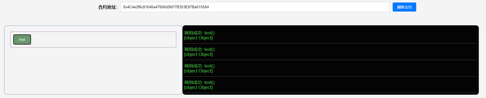

## 项目源码

[https://github.com/luode0320/solidity-demo](https://github.com/luode0320/solidity-demo)

## 导入合约

在Solidity中，`import`语句可以帮助我们在一个文件中引用另一个文件的内容，提高代码的可重用性和组织性。

本教程将向你介绍如何在Solidity中使用`import`语句。

## import用法

1. 通过源文件相对位置导入，例子：

文件结构
├── Import.sol
└── Yeye.sol

```solidity
// 通过文件相对位置import
import './Yeye.sol';
```

2. 通过`npm`的目录导入，例子：

```solidity
import '@openzeppelin/contracts/access/Ownable.sol';
```

3. 通过指定`全局符号`导入合约特定的全局符号，例子：

```solidity
import {Yeye} from './Yeye.sol';
```

## 完整代码

```solidity
// SPDX-License-Identifier: MIT
pragma solidity ^0.8.21;

// 通过文件相对位置import
import "./Yeye.sol";
// 通过`全局符号`导入特定的合约
import {Yeye} from "./Yeye.sol";
// 引用OpenZeppelin合约
import "@openzeppelin/contracts/utils/Address.sol";

contract Import {
    // 成功导入Address库
    using Address for address;
    // 声明yeye变量
    Yeye yeye = new Yeye();

    // 测试是否能调用yeye的函数
    function test() external {
        yeye.hip();
    }
}

```

```solidity
// SPDX-License-Identifier: MIT
pragma solidity ^0.8.21;

// 合约继承中的Yeye合约
contract Yeye {
    event Log(string msg);

    // 定义3个function: hip(), pop(), yeye()，Log值为Yeye。
    function hip() public virtual {
        emit Log("Yeye");
    }

    function pop() public virtual {
        emit Log("Yeye");
    }

    function yeye() public virtual {
        emit Log("Yeye");
    }
}
```

## 调试

修改 `.env` :

```
# 部署的合约名称
DEPLOY_CONTRACT_NAME=Import
```

启动本地网络节点:

```sh
yarn hardhat node
```

部署合约:

````sh
yarn hardhat run scripts/deploy.ts --network localhost
````

```sh
yarn run v1.22.22
$ E:\solidity-demo\18.Import导入\node_modules\.bin\hardhat run scripts/deploy.ts --network localhost
当前网络: localhost
_________________________启动部署________________________________
部署地址: 0xf39Fd6e51aad88F6F4ce6aB8827279cffFb92266
账户余额 balance(wei): 9999994617596501406437
账户余额 balance(eth): 9999.994617596501406437
_________________________部署合约________________________________
合约地址: 0x4C4a2f8c81640e47606d3fd77B353E87Ba015584
生成调试 html,请用 Live Server 调试: E:\solidity-demo\18.Import导入\index.html
Done in 2.16s.
```



## 总结

这一讲，我们介绍了利用`import`关键字导入外部源代码的方法。

通过`import`关键字，可以引用我们写的其他文件中的合约或者函数，也可以直接导入别人写好的代码，非常方便。