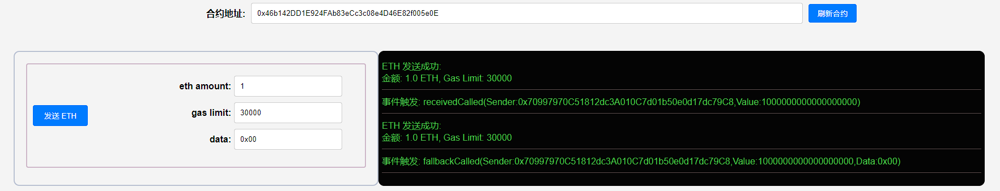

## 项目源码

[https://github.com/luode0320/solidity-demo](https://github.com/luode0320/solidity-demo)

## 接收ETH

`Solidity`支持两种特殊的回调函数，`receive()`和`fallback()`，他们主要在两种情况下被使用：

1. 接收ETH
2. 处理合约中不存在的函数调用（代理合约proxy contract）

注意⚠️：

- Solidity 0.6.x版本之前，语法上只有 `fallback()` 函数，用来接收用户发送的ETH时调用以及在被调用函数签名没有匹配到时，来调用。

- Solidity 0.6版本之后，Solidity才将 `fallback()` 函数拆分成 `receive()` 和 `fallback()` 两个函数。

我们这一讲主要讲接收ETH的情况。

## 接收ETH函数 receive

`receive()`函数是在合约收到`ETH`转账时被调用的函数。

- 一个合约最多有一个`receive()`函数，声明方式与一般函数不一样，不需要`function`关键字：

  ```solidity
  receive() external payable { 
  	... 
  }
  ```

- `receive()`函数不能有任何的参数，不能返回任何值，**必须包含`external`和`payable`**。

- **当合约接收ETH的时候，`receive()`会被触发。**

`receive()`最好不要执行太多的逻辑, 因为如果用`send`和`transfer`方法发送`ETH`的话，`gas`会限制在`2300`，`receive()`
复杂可能会触发`Out of Gas`报错；

如果用`call`就可以自定义`gas`执行更复杂的逻辑（这三种发送ETH的方法我们下一讲会讲到）。

我们可以在`receive()`里发送一个`event`，例如：

```solidity
// 定义事件
event Received(address Sender, uint Value);

// 接收ETH时释放Received事件
receive() external payable {	
	// 发送 eth 的是谁, 发了多少 eth
    emit Received(msg.sender, msg.value);
}
```

有些恶意合约，会在`receive()` 函数（老版本的话，就是 `fallback()` 函数）嵌入恶意消耗`gas`
的内容或者使得执行故意失败的代码，导致一些包含退款和转账逻辑的合约不能正常工作，因此写包含退款等逻辑的合约时候，一定要注意这种情况。

## 回退函数 fallback

`fallback()`函数会在调用合约不存在的函数时被触发。可用于接收ETH，也可以用于代理合约`proxy contract`。

- `fallback()`声明时不需要`function`关键字，**必须由`external`修饰，一般也会用`payable`修饰**，用于接收ETH:

  ```solidity
  fallback() external payable {
  	... 
  }
  ```

我们定义一个`fallback()`函数，被触发时候会释放`fallbackCalled`事件，并输出`msg.sender`，`msg.value`和`msg.data`:

```solidity
event fallbackCalled(address Sender, uint Value, bytes Data);

// fallback
fallback() external payable{
	// 发送 eth 的是谁, 发了多少 eth, 调用的数据是什么
    emit fallbackCalled(msg.sender, msg.value, msg.data);
}
```

## receive和fallback的区别

`receive`和`fallback`都能用于接收`ETH`，他们触发的规则如下：

```sh
触发fallback() 还是 receive()?
           接收ETH
              |
         msg.data是空？
            /  \
          是    否
          /      \
receive()存在?   fallback()
        / \
       是  否
      /     \
receive()   fallback()
```

- 合约接收`ETH`时，`msg.data`为空且存在`receive()`时，会触发`receive()`；

- `msg.data`不为空或不存在`receive()`时，会触发`fallback()`，此时`fallback()`必须为`payable`。

`receive()`和`payable fallback()`均不存在的时候，向合约**直接**发送`ETH`将会报错（你仍可以通过带有`payable`
的函数向合约发送`ETH`）。

## 完整代码

```solidity
// SPDX-License-Identifier: MIT
pragma solidity ^0.8.21;

contract Fallback {
    /* 触发fallback() 还是 receive()?
           接收ETH
              |
         msg.data是空？
            /  \
          是    否
          /      \
receive()存在?   fallback()
        / \
       是  否
      /     \
receive()  fallback   
    */

    // 定义事件
    event receivedCalled(address Sender, uint Value);
    event fallbackCalled(address Sender, uint Value, bytes Data);

    // 接收ETH时释放Received事件
    receive() external payable {
        emit receivedCalled(msg.sender, msg.value);
    }

    // fallback
    fallback() external payable{
        emit fallbackCalled(msg.sender, msg.value, msg.data);
    }
}
```

## 调试

修改 `.env` :

```
# 部署的合约名称
DEPLOY_CONTRACT_NAME=Fallback
```

启动本地网络节点:

```sh
yarn hardhat node
```

部署合约:

````sh
yarn hardhat run scripts/deploy.ts --network localhost
````

```sh
yarn run v1.22.22
$ E:\solidity-demo\19.receive和fallback接收ETH\node_modules\.bin\hardhat run scripts/deploy.ts --network localhost
当前网络: localhost
_________________________启动部署________________________________
部署地址: 0xf39Fd6e51aad88F6F4ce6aB8827279cffFb92266
账户余额 balance(wei): 9999993937195234231047
账户余额 balance(eth): 9999.993937195234231047
_________________________部署合约________________________________
合约地址: 0x8198f5d8F8CfFE8f9C413d98a0A55aEB8ab9FbB7
生成调试 html,请用 Live Server 调试: E:\solidity-demo\19.receive和fallback接收ETH\index.html
Done in 2.22s.
```



## 总结

这一讲，我介绍了`Solidity`中的两种特殊函数，`receive()`和`fallback()`，他们主要在两种情况下被使用，处理接收`ETH`
和代理合约`proxy contract`。