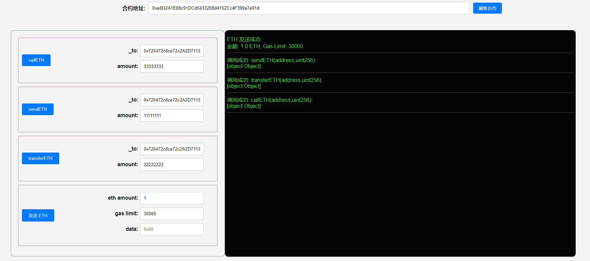
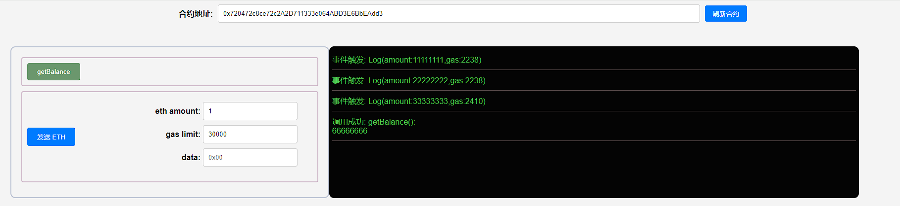

## 项目源码

[https://github.com/luode0320/solidity-demo](https://github.com/luode0320/solidity-demo)

## 发送ETH

`Solidity`有三种方法向其他合约发送`ETH`，他们是：`transfer()`，`send()`和`call()`，其中`call()`是被鼓励的用法。

## 接收ETH合约

我们先部署一个接收`ETH`合约`ReceiveETH`。

- `ReceiveETH`合约里有一个事件`Log`，记录收到的`ETH`数量和`gas`剩余。

- 还有两个函数，一个是`receive()`函数，收到`ETH`被触发，并发送`Log`事件；
- 另一个是查询合约`ETH`余额的`getBalance()`函数。

```solidity
contract ReceiveETH {
    // 收到eth事件，记录amount和gas
    event Log(uint amount, uint gas);
    
    // receive方法，接收eth时被触发
    receive() external payable{
        emit Log(msg.value, gasleft());
    }
    
    // 返回合约ETH余额
    function getBalance() view public returns(uint) {
        return address(this).balance;
    }
}
```

## 发送ETH合约

我们将实现三种方法向`ReceiveETH`合约发送`ETH`。

首先，先在发送ETH合约`SendETH`中实现`payable`的`构造函数`和`receive()`，让我们能够在部署时和部署后向合约转账。

```solidity
contract SendETH {
    // 构造函数，payable使得部署的时候可以转eth进去
    constructor() payable{}
    
    // receive方法，接收eth时被触发
    receive() external payable{}
}
```

### transfer

- 用法是 `接收方地址.transfer(发送ETH数额)`。
- `transfer()`的`gas`限制是`2300`，足够用于转账，但对方合约的`fallback()`或`receive()`函数不能实现太复杂的逻辑。
- `transfer()`如果转账失败，会自动`revert`（回滚交易）。

代码样例，注意里面的`_to`填`ReceiveETH`合约的地址，`amount`是`ETH`转账金额：

```solidity
// 用transfer()发送ETH
function transferETH(address payable _to, uint256 amount) external payable{
    _to.transfer(amount);
}
```

### send

- 用法是 `接收方地址.send(发送ETH数额)`。
- `send()`的`gas`限制是`2300`，足够用于转账，但对方合约的`fallback()`或`receive()`函数不能实现太复杂的逻辑。
- `send()`如果转账失败，不会`revert`（回滚交易）。
- `send()`的返回值是`bool`，代表着转账成功或失败，需要额外代码处理一下。

代码样例：

```solidity
error SendFailed(); // 用send发送ETH失败error

// send()发送ETH
function sendETH(address payable _to, uint256 amount) external payable{
    // 处理下send的返回值，如果失败，revert交易并发送error
    bool success = _to.send(amount);
    if(!success){
        revert SendFailed();
    }
}
```

### call

- 用法是 `接收方地址.call{value: 发送ETH数额}("")`。
- `call()`没有`gas`限制，可以支持对方合约`fallback()`或`receive()`函数实现复杂逻辑。
- `call()`如果转账失败，不会`revert`（回滚交易）。
- `call()`的返回值是`(bool, bytes)`，其中`bool`代表着转账成功或失败，需要额外代码处理一下。

代码样例：

```solidity
error CallFailed(); // 用call发送ETH失败error

// call()发送ETH
function callETH(address payable _to, uint256 amount) external payable{
    // 处理下call的返回值，如果失败，revert交易并发送error
    (bool success,) = _to.call{value: amount}("");
    if(!success){
        revert CallFailed();
    }
}
```

## 完整代码

```solidity
// SPDX-License-Identifier: MIT
pragma solidity ^0.8.21;

// 3种方法发送ETH
// - `call`没有`gas`限制，最为灵活，**是最提倡的方法**；
// - `transfer`有`2300 gas`限制，但是发送失败会自动`revert`交易，是次优选择；
// - `send`有`2300 gas`限制，而且发送失败不会自动`revert`交易，**几乎没有人用它**。

error SendFailed(); // 用send发送ETH失败error
error CallFailed(); // 用call发送ETH失败error

contract SendETH {
    // 构造函数，payable使得部署的时候可以转eth进去
    constructor() payable {}

    // receive方法，接收eth时被触发
    receive() external payable {}

    // 用transfer()发送ETH
    function transferETH(address payable _to, uint256 amount) external payable {
        _to.transfer(amount);
    }

    // send()发送ETH
    function sendETH(address payable _to, uint256 amount) external payable {
        // 处理下send的返回值，如果失败，revert交易并发送error
        bool success = _to.send(amount);
        if (!success) {
            revert SendFailed();
        }
    }

    // call()发送ETH
    function callETH(address payable _to, uint256 amount) external payable {
        // 处理下call的返回值，如果失败，revert交易并发送error
        (bool success, ) = _to.call{value: amount}("");
        if (!success) {
            revert CallFailed();
        }
    }
}

contract ReceiveETH {
    // 收到eth事件，记录amount和gas
    event Log(uint amount, uint gas);

    // receive方法，接收eth时被触发
    receive() external payable {
        emit Log(msg.value, gasleft());
    }

    // 返回合约ETH余额
    function getBalance() public view returns (uint) {
        return address(this).balance;
    }
}

```

## 调试

启动本地网络节点:

```sh
yarn hardhat node
```

部署接受者合约:

````sh
yarn hardhat run scripts/ReceiveETH.ts --network localhost
````

```sh
yarn run v1.22.22
$ E:\solidity-demo\20.发送ETH\node_modules\.bin\hardhat run scripts/ReceiveETH.ts --network localhost
当前网络: localhost
_________________________启动部署________________________________
部署地址: 0xf39Fd6e51aad88F6F4ce6aB8827279cffFb92266
账户余额 balance(wei): 9999990641374074572036
账户余额 balance(eth): 9999.990641374074572036
_________________________部署合约________________________________
合约地址: 0x720472c8ce72c2A2D711333e064ABD3E6BbEAdd3
生成调试 html,请用 Live Server 调试: E:\solidity-demo\20.发送ETH\ReceiveETH.html
Done in 2.32s.
```

部署发送者合约:

```sh
yarn hardhat run scripts/SendETH.ts --network localhost
```

```sh
yarn run v1.22.22
$ E:\solidity-demo\20.发送ETH\node_modules\.bin\hardhat run scripts/SendETH.ts --network localhost
当前网络: localhost
_________________________启动部署________________________________
部署地址: 0xf39Fd6e51aad88F6F4ce6aB8827279cffFb92266
账户余额 balance(wei): 9999990527041067940722
账户余额 balance(eth): 9999.990527041067940722
_________________________部署合约________________________________
合约地址: 0xe8D2A1E88c91DCd5433208d4152Cc4F399a7e91d
生成调试 html,请用 Live Server 调试: E:\solidity-demo\20.发送ETH\SendETH.html
Done in 2.27s.

```

发送者调试:



接收者调试:



## 总结

这一讲，我们介绍`Solidity`三种发送`ETH`的方法：`transfer`，`send`和`call`。

- `call`没有`gas`限制，最为灵活，**是最提倡的方法**；
- `transfer`有`2300 gas`限制，但是发送失败会自动`revert`交易，是次优选择；
- `send`有`2300 gas`限制，而且发送失败不会自动`revert`交易，**几乎没有人用它**。