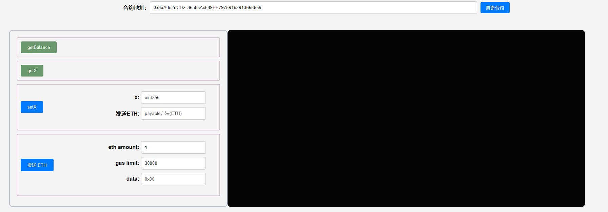
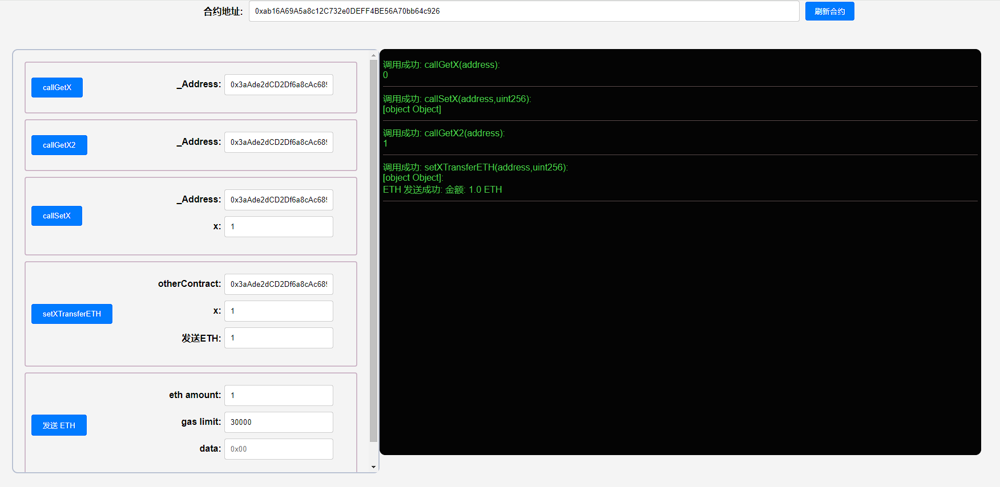
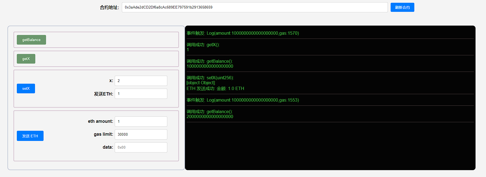

## 项目源码

[https://github.com/luode0320/solidity-demo](https://github.com/luode0320/solidity-demo)

## 调用已部署合约

在`Solidity`中，一个合约可以调用另一个合约的函数，这在构建复杂的DApps时非常有用。

本教程将会介绍如何在已知合约代码（或接口）和地址的情况下，调用已部署的合约。

## 目标合约

我们先写一个简单的合约`OtherContract`，用于被其他合约调用。

```solidity
contract OtherContract {
    uint256 private _x = 0; // 状态变量_x
    // 收到eth的事件，记录amount和gas
    event Log(uint amount, uint gas);
    
    // 返回合约ETH余额
    function getBalance() view public returns(uint) {
        return address(this).balance;
    }

    // 可以调整状态变量_x的函数，并且可以往合约转ETH (payable)
    function setX(uint256 x) external payable{
        _x = x;
        // 如果转入ETH，则释放Log事件
        if(msg.value > 0){
            emit Log(msg.value, gasleft());
        }
    }

    // 读取_x
    function getX() external view returns(uint x){
        x = _x;
    }
}
```

这个合约包含一个状态变量`_x`，一个事件`Log`在收到`ETH`时触发，三个函数：

- `getBalance()`: 返回合约`ETH`余额。
- `setX()`: `external payable`函数，可以设置`_x`的值，并向合约发送`ETH`。
- `getX()`: 读取`_x`的值。

## 调用OtherContract合约

我们可以利用合约的地址和合约代码（或接口）来创建合约的引用：

- `_Name(_Address)`，其中`_Name`是合约名，应与合约代码（或接口）中标注的合约名保持一致

- `_Address`是合约地址。然后用合约的引用来调用它的函数：`_Name(_Address).f()`，其中`f()`是要调用的函数

下面我们介绍4个调用合约的例子

### 1. 传入合约地址

我们可以在函数里传入目标合约地址，生成目标合约的引用，然后调用目标函数。以调用`OtherContract`合约的`setX`
函数为例，我们在新合约中写一个`callSetX`函数，传入已部署好的`OtherContract`合约地址`_Address`和`setX`的参数`x`：

```solidity
function callSetX(address _Address, uint256 x) external{
    OtherContract(_Address).setX(x);
}
```

### 2. 传入合约变量

我们可以直接在函数里传入合约的引用，只需要把上面参数的`address`类型改为目标合约名，比如`OtherContract`。

下面例子实现了调用目标合约的`getX()`函数。

**注意**：该函数参数`OtherContract _Address`底层类型仍然是`address`，生成的`ABI`中、调用`callGetX`时传入的参数都是`address`
类型

```solidity
function callGetX(OtherContract _Address) external view returns(uint x){
    x = _Address.getX();
}
```

### 3. 创建合约变量

我们可以创建合约变量，然后通过它来调用目标函数。下面例子，我们给变量`oc`存储了`OtherContract`合约的引用：

```solidity
function callGetX2(address _Address) external view returns(uint x){
    OtherContract oc = OtherContract(_Address);
    x = oc.getX();
}
```

### 4. 调用合约并发送`ETH`

如果目标合约的函数是`payable`的，那么我们可以通过调用它来给合约转账：

- `_Name(_Address).f{value: _Value}()`
- 其中`_Name`是合约名，`_Address`是合约地址，`f`是目标函数名，`_Value`是要转的`ETH`数额（以`wei`为单位）。

`OtherContract`合约的`setX`函数是`payable`的，在下面这个例子中我们通过调用`setX`来往目标合约转账。

```solidity
function setXTransferETH(address otherContract, uint256 x) payable external{
    OtherContract(otherContract).setX{value: msg.value}(x);
}
```

## 完整代码

```solidity
// SPDX-License-Identifier: MIT
pragma solidity ^0.8.21;

contract OtherContract {
    uint256 private _x = 0; // 状态变量x
    // 收到eth事件，记录amount和gas
    event Log(uint amount, uint gas);

    // 返回合约ETH余额
    function getBalance() public view returns (uint) {
        return address(this).balance;
    }

    // 可以调整状态变量_x的函数，并且可以往合约转ETH (payable)
    function setX(uint256 x) external payable {
        _x = x;
        // 如果转入ETH，则释放Log事件
        if (msg.value > 0) {
            emit Log(msg.value, gasleft());
        }
    }

    // 读取x
    function getX() external view returns (uint x) {
        x = _x;
    }
}

```

```solidity
// SPDX-License-Identifier: MIT
pragma solidity ^0.8.21;

import "./OtherContract.sol";

// 定义了一个名为 CallContract 的合约，该合约包含了与另一个合约 OtherContract 交互的方法。
contract CallContract {
    // 该函数用于调用 OtherContract 的 setX 方法，并设置 x 的值。
    // 参数:
    // - _Address: OtherContract 的地址。
    // - x: 设置的 x 值。
    function callSetX(address _Address, uint256 x) external {
        // 创建 OtherContract 的实例，并调用其 setX 方法。
        OtherContract(_Address).setX(x);
    }

    // 该函数用于从 OtherContract 获取 x 的值。
    // 参数:
    // - _Address: OtherContract 的实例。
    // 返回:
    // - x: OtherContract 中的 x 值。
    function callGetX(OtherContract _Address) external view returns (uint x) {
        // 直接从传入的 OtherContract 实例中获取 x 的值。
        x = _Address.getX();
    }

    // 该函数同样用于从 OtherContract 获取 x 的值，但通过地址创建 OtherContract 的实例。
    // 参数:
    // - _Address: OtherContract 的地址。
    // 返回:
    // - x: OtherContract 中的 x 值。
    function callGetX2(address _Address) external view returns (uint x) {
        OtherContract oc = OtherContract(_Address);
        x = oc.getX();
    }

    // 该函数用于调用 OtherContract 的 setX 方法，并在调用时发送一定数量的 ETH。
    // 参数:
    // - otherContract: OtherContract 的地址。
    // - x: 设置的 x 值。
    // 注释:
    // - 该函数是 payable 的，这意味着它可以接收 ETH。
    // - 在调用 setX 方法时，将 msg.value (即发送给该函数的 ETH 数量) 作为 value 参数传递。
    function setXTransferETH(
        address otherContract,
        uint256 x
    ) external payable {
        OtherContract(otherContract).setX{value: msg.value}(x);
    }
}

```

## 调试

启动本地网络节点:

```sh
yarn hardhat node
```

部署OtherContract合约:

````sh
yarn hardhat run scripts/OtherContract.ts --network localhost
````

```sh
yarn run v1.22.22
$ E:\solidity-demo\21.调用其他合约\node_modules\.bin\hardhat run scripts/OtherContract.ts --network localhost
当前网络: localhost
_________________________启动部署________________________________
部署地址: 0xf39Fd6e51aad88F6F4ce6aB8827279cffFb92266
账户余额 balance(wei): 9876987663081014977558
账户余额 balance(eth): 9876.987663081014977558
_________________________部署合约________________________________
合约地址: 0x3aAde2dCD2Df6a8cAc689EE797591b2913658659
生成调试 html,请用 Live Server 调试: E:\solidity-demo\21.调用其他合约\OtherContract.html
Done in 2.12s.
```



部署CallContract合约:

````sh
yarn hardhat run scripts/CallContract.ts --network localhost
````

```sh
yarn run v1.22.22
$ E:\solidity-demo\21.调用其他合约\node_modules\.bin\hardhat run scripts/CallContract.ts --network localhost
当前网络: localhost
_________________________启动部署________________________________
部署地址: 0xf39Fd6e51aad88F6F4ce6aB8827279cffFb92266
账户余额 balance(wei): 9876987498350013659710
账户余额 balance(eth): 9876.98749835001365971
_________________________部署合约________________________________
合约地址: 0xab16A69A5a8c12C732e0DEFF4BE56A70bb64c926
生成调试 html,请用 Live Server 调试: E:\solidity-demo\21.调用其他合约\CallContract.html
Done in 2.27s.
```


测试:





## 总结

这一讲，我们介绍了如何通过目标合约代码（或接口）和地址来创建合约的引用，从而调用目标合约的函数。