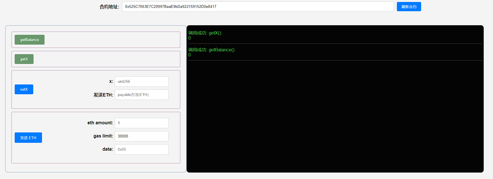
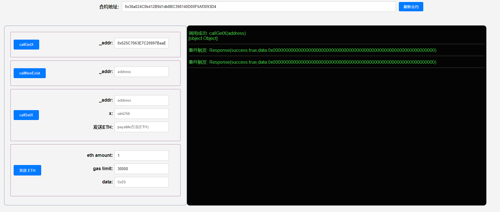
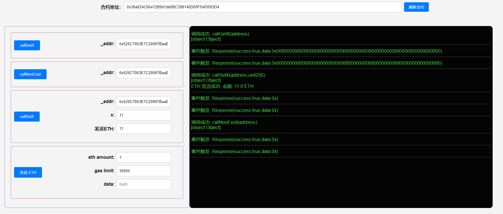
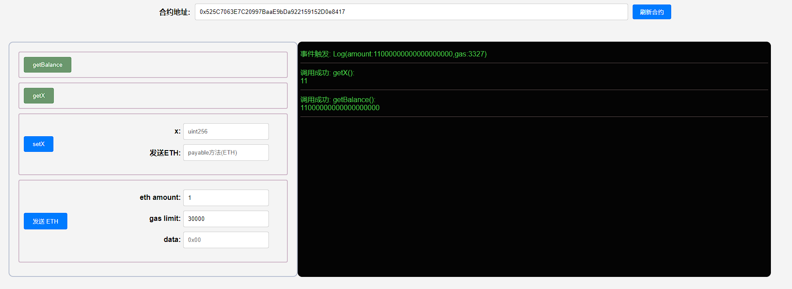

## 项目源码

[https://github.com/luode0320/solidity-demo](https://github.com/luode0320/solidity-demo)

## Call

`call` 是`address`类型的低级成员函数，它用来与其他合约交互。它的返回值为`(bool, bytes memory)`，分别对应`call`
是否成功以及目标函数的返回值。

- `call`是`Solidity`官方推荐的通过触发`fallback`或`receive`函数发送`ETH`的方法。
- **不推荐用`call`来调用另一个合约**，因为当你调用不安全合约的函数时，你就把主动权交给了它。
- 推荐的方法仍是**声明合约**
  变量后调用函数，见[第21讲：调用其他合约](https://github.com/AmazingAng/WTF-Solidity/tree/main/21_CallContract)
- 当我们不知道对方合约的源代码或`ABI`，就没法生成合约变量；这时，我们仍可以通过`call`调用对方合约的函数。

### 语法

`call`的使用规则如下：

```sh
目标合约地址.call(字节码);
```

其中`字节码`利用结构化编码函数`abi.encodeWithSignature`获得：

```sh
abi.encodeWithSignature("函数签名", 逗号分隔的具体参数)
```

`函数签名`为`"函数名（逗号分隔的参数类型）"`。例如`abi.encodeWithSignature("f(uint256,address)", _x, _addr)`。

另外`call`在调用合约时可以指定交易发送的`ETH`数额和`gas`数额：

```sh
目标合约地址.call{value:发送数额, gas:gas数额}(字节码);
```

看起来有点复杂，下面我们举个`call`应用的例子。

### 目标合约

我们先写一个简单的目标合约`OtherContract`并部署，代码与第21讲中基本相同，只是多了`fallback`函数。

```solidity
contract OtherContract {
    uint256 private _x = 0; // 状态变量x
    // 收到eth的事件，记录amount和gas
    event Log(uint amount, uint gas);
    
    fallback() external payable{}

    // 返回合约ETH余额
    function getBalance() view public returns(uint) {
        return address(this).balance;
    }

    // 可以调整状态变量_x的函数，并且可以往合约转ETH (payable)
    function setX(uint256 x) external payable{
        _x = x;
        // 如果转入ETH，则释放Log事件
        if(msg.value > 0){
            emit Log(msg.value, gasleft());
        }
    }

    // 读取x
    function getX() external view returns(uint x){
        x = _x;
    }
}
```

这个合约包含一个状态变量`x`，一个在收到`ETH`时触发的事件`Log`，三个函数：

- `getBalance()`: 返回合约`ETH`余额。
- `setX()`: `external payable`函数，可以设置`x`的值，并向合约发送`ETH`。
- `getX()`: 读取`x`的值。

### 利用`call`调用目标合约

#### 1. Response事件

我们写一个`Call`合约来调用目标合约函数。首先定义一个`Response`事件，输出`call`返回的`success`和`data`，方便我们观察返回值。

```solidity
// 定义Response事件，输出call返回的结果success和data
event Response(bool success, bytes data);
```

#### 2. 调用setX函数

我们定义`callSetX`函数来调用目标合约的`setX()`，转入`msg.value`数额的`ETH`，并释放`Response`事件输出`success`和`data`：

```solidity
function callSetX(address payable _addr, uint256 x) public payable {
    // call setX()，同时可以发送ETH
    (bool success, bytes memory data) = _addr.call{value: msg.value}(
        abi.encodeWithSignature("setX(uint256)", x)
    );

    emit Response(success, data); //释放事件
}
```

#### 3. 调用getX函数

下面我们调用`getX()`函数，它将返回目标合约`_x`的值，类型为`uint256`。我们可以利用`abi.decode`来解码`call`的返回值`data`
，并读出数值。

```solidity
function callGetX(address _addr) external returns(uint256){
    // call getX()
    (bool success, bytes memory data) = _addr.call(
        abi.encodeWithSignature("getX()")
    );

    emit Response(success, data); //释放事件
    return abi.decode(data, (uint256));
}
```

#### 4. 调用不存在的函数

如果我们给`call`输入的函数不存在于目标合约，那么目标合约的`fallback`函数会被触发。

```solidity
function callNonExist(address _addr) external{
    // call 不存在的函数
    (bool success, bytes memory data) = _addr.call(
        abi.encodeWithSignature("foo(uint256)")
    );

    emit Response(success, data); //释放事件
}
```

上面例子中，我们`call`了不存在的`foo`函数。`call`仍能执行成功，并返回`success`，但其实调用的目标合约`fallback`函数。

## 完整代码

```silidity
// SPDX-License-Identifier: MIT
pragma solidity ^0.8.21;

contract OtherContract {
    uint256 private _x = 0; // 状态变量_x，用于存储某个数值

    // 当合约接收到 ETH 时记录的事件，记录接收到的金额和剩余的 gas
    event Log(uint256 amount, uint256 gas);

    // fallback 函数允许合约在没有指定函数的情况下接收 ETH
    // 这是一个空的 fallback 函数，它可以接收 ETH 而不执行任何操作
    fallback() external payable {}

    // receive 函数是一个接收 ETH 的快捷方式，仅在接收 ETH 时调用
    // 它与 fallback 函数类似，但只处理以太币的接收
    receive() external payable {}

    // 返回合约当前持有的 ETH 余额
    function getBalance() public view returns (uint256) {
        // 返回合约地址的当前余额
        return address(this).balance;
    }

    // 设置状态变量 _x 的值，并允许同时向合约发送 ETH
    function setX(uint256 x) external payable {
        // 设置状态变量 _x 的值
        _x = x;

        // 如果有 ETH 发送到合约，则记录接收到的金额和剩余的 gas
        if (msg.value > 0) {
            // 触发 Log 事件，记录发送的 ETH 金额以及剩余的 gas
            emit Log(msg.value, gasleft());
        }
    }

    // 获取状态变量 _x 的当前值
    function getX() external view returns (uint256 x) {
        // 返回状态变量 _x 的值
        x = _x;
        return x;
    }
}

```

```solidity
// SPDX-License-Identifier: MIT
pragma solidity ^0.8.21;

contract Call {
    // Response 事件用于输出 `call` 的结果，包括成功与否 (`success`) 和返回数据 (`data`)
    event Response(bool success, bytes data);

    // 该函数用于调用另一个合约的 `setX` 方法，并可以选择发送 ETH
    function callSetX(address payable _addr, uint256 x) public payable {
        // 使用 low-level 的 `call` 调用另一个合约的 `setX` 方法，并发送一定数量的 ETH
        (bool success, bytes memory data) = _addr.call{value: msg.value}(
            abi.encodeWithSignature("setX(uint256)", x)
        );

        // 发射 Response 事件，记录调用的结果
        emit Response(success, data);
    }

    // 该函数用于调用另一个合约的 `getX` 方法，并返回结果
    function callGetX(address _addr) external returns (uint256) {
        // 使用 low-level 的 `call` 调用另一个合约的 `getX` 方法
        (bool success, bytes memory data) = _addr.call(
            abi.encodeWithSignature("getX()")
        );

        // 发射 Response 事件，记录调用的结果
        emit Response(success, data);

        // 解码返回的数据，将其转换为 uint256 类型，并返回
        return abi.decode(data, (uint256));
    }

    // 该函数尝试调用另一个合约中不存在的方法 `foo`
    function callNonExist(address _addr) external {
        // 尝试调用另一个合约中不存在的方法 `foo`
        (bool success, bytes memory data) = _addr.call(
            abi.encodeWithSignature("foo(uint256)")
        );

        // 发射 Response 事件，记录调用的结果
        emit Response(success, data);
    }
}

```

## 调试

启动本地网络节点:

```sh
yarn hardhat node
```

部署OtherContract合约:

````sh
yarn hardhat run scripts/OtherContract.ts --network localhost
````

```sh
yarn run v1.22.22
$ E:\solidity-demo\22.Call函数\node_modules\.bin\hardhat run scripts/OtherContract.ts --network localhost
Compiled 2 Solidity files successfully (evm target: paris).
当前网络: localhost
_________________________启动部署________________________________
部署地址: 0xf39Fd6e51aad88F6F4ce6aB8827279cffFb92266
账户余额 balance(wei): 9874987061665010166230
账户余额 balance(eth): 9874.98706166501016623
_________________________部署合约________________________________
合约地址: 0x525C7063E7C20997BaaE9bDa922159152D0e8417
生成调试 html,请用 Live Server 调试: E:\solidity-demo\22.Call函数\OtherContract.html
Done in 2.82s.
```



部署OtherContract合约:

````sh
yarn hardhat run scripts/Call.ts --network localhost
````

```sh
yarn run v1.22.22
$ E:\solidity-demo\22.Call函数\node_modules\.bin\hardhat run scripts/Call.ts --network localhost
Compiled 1 Solidity file successfully (evm target: paris).
当前网络: localhost
_________________________启动部署________________________________
部署地址: 0xf39Fd6e51aad88F6F4ce6aB8827279cffFb92266
账户余额 balance(wei): 9874986895210008834590
账户余额 balance(eth): 9874.98689521000883459
_________________________部署合约________________________________
合约地址: 0x38a024C0b412B9d1db8BC398140D00F5Af3093D4
生成调试 html,请用 Live Server 调试: E:\solidity-demo\22.Call函数\Call.html
Done in 2.62s.
```



测试:





## 总结

这一讲，我们介绍了如何用`call`这一低级函数来调用其他合约。`call`不是调用合约的推荐方法，因为不安全。

但他能让我们在不知道源代码和`ABI`的情况下调用目标合约，很有用。

