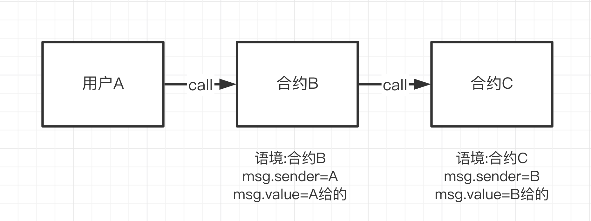

## 项目源码

[https://github.com/luode0320/solidity-demo](https://github.com/luode0320/solidity-demo)

## Delegatecall

`delegatecall`与`call`类似，是`Solidity`中地址类型的低级成员函数。`delegate`中是委托/代表的意思，那么`delegatecall`委托了什么？

`delegatecall` 在实际应用中并不常见，主要是因为它存在一定的安全风险，并且使用场景较为特殊。

## 解释

当用户`A`通过合约`B`来**`call`**合约`C`的时候，执行的是合约`C`的函数，`上下文`也是合约`C`的：

- `msg.sender`是`B`的地址，并且如果函数改变一些状态变量，产生的效果会作用于合约`C`的变量上。



而当用户`A`通过合约`B`来**`delegatecall`**合约`C`的时候，执行的是合约`C`的函数，但是`上下文`仍是合约`B`的：

- `msg.sender`是`A`的地址，并且如果函数改变一些状态变量，产生的效果会作用于合约`B`的变量上。


大家可以这样理解：

你在合约B里面有部分代币, 你想把这部分代币交给合约C帮你代理理财, 就是用**`delegatecall`**调用。

因为这个合约此时属于多个用户所有, 如果是你个人私有的合约, 那当然用 **`call`** 可以这样玩。

## 语法

`delegatecall`语法和`call`类似，也是：

```sh
目标合约地址.delegatecall(二进制编码);
```

其中`二进制编码`利用结构化编码函数`abi.encodeWithSignature`获得：

```sh
abi.encodeWithSignature("函数签名", 逗号分隔的具体参数)
```

`函数签名`为`"函数名（逗号分隔的参数类型）"`。例如`abi.encodeWithSignature("f(uint256,address)", _x, _addr)`。

和`call`不一样，`delegatecall`在调用合约时可以指定交易发送的`gas`，**但不能指定发送的`ETH`数额**

**注意**：

`delegatecall`有**安全隐患，使用时要保证当前合约和目标合约的状态变量存储结构相同，并且目标合约安全，不然会造成资产损失。**

`delegatecall`
是基于存储槽来操作状态变量的，而存储槽的分配取决于变量的类型和声明顺序，而不是变量名。因此，只要变量类型和声明顺序相同，即使变量名不同，`delegatecall`
也能正确地访问和修改状态变量。

**确保两个合约的状态变量的数量、排列顺序和类型完全相同!!**

## 什么情况下会用到`delegatecall`?

目前`delegatecall`主要有两个应用场景：

1. 代理合约（`Proxy Contract`）：将智能合约的存储合约和逻辑合约分开：代理合约（`Proxy Contract`
   ）存储所有相关的变量，并且保存逻辑合约的地址；所有函数存在逻辑合约（`Logic Contract`）里，通过`delegatecall`
   执行。当升级时，只需要将代理合约指向新的逻辑合约即可。
2. EIP-2535 Diamonds（钻石）：钻石是一个支持构建可在生产中扩展的模块化智能合约系统的标准。钻石是具有多个实施合约的代理合约。
   更多信息请查看：[钻石标准简介](https://eip2535diamonds.substack.com/p/introduction-to-the-diamond-standard)。

## `delegatecall`例子

调用结构：你（`A`）通过合约`B`调用目标合约`C`。

### 被调用的合约C

我们先写一个简单的目标合约`C`：

有两个`public`变量：`num`和`sender`，分别是`uint256`和`address`类型；

有一个函数，可以将`num`设定为传入的`_num`，并且将`sender`设为`msg.sender`。

```solidity
// 被调用的合约C
contract C {
    uint public num;
    address public sender;

    function setVars(uint _num) public payable {
        num = _num;
        sender = msg.sender;
    }
}
```

### 发起调用的合约B

首先，合约`B`必须和目标合约`C`的变量存储布局必须相同，两个变量，并且顺序为`num`和`sender`

```solidity
contract B {
    uint public num;
    address public sender;
}
```

接下来，我们分别用`call`和`delegatecall`来调用合约`C`的`setVars`函数，更好的理解它们的区别。

`callSetVars`函数通过`call`来调用`setVars`。它有两个参数`_addr`和`_num`，分别对应合约`C`的地址和`setVars`的参数。

```solidity
// 通过call来调用C的setVars()函数，将改变合约C里的状态变量
function callSetVars(address _addr, uint _num) external payable{
    // call setVars()
    (bool success, bytes memory data) = _addr.call(
        abi.encodeWithSignature("setVars(uint256)", _num)
    );
}
```

而`delegatecallSetVars`函数通过`delegatecall`来调用`setVars`。与上面的`callSetVars`函数相同，有两个参数`_addr`和`_num`
，分别对应合约`C`的地址和`setVars`的参数。

```solidity
// 通过delegatecall来调用C的setVars()函数，将改变合约B里的状态变量
function delegatecallSetVars(address _addr, uint _num) external payable{
    // delegatecall setVars()
    (bool success, bytes memory data) = _addr.delegatecall(
        abi.encodeWithSignature("setVars(uint256)", _num)
    );
}
```

## 完整代码

```solidity
// SPDX-License-Identifier: MIT
pragma solidity ^0.8.21;

// delegatecall和call类似，都是低级函数
// call: B call C, 上下文为 C (msg.sender = B, C中的状态变量受影响)
// delegatecall: B delegatecall C, 上下文为B (msg.sender = A, B中的状态变量受影响)
// 注意B和C的数据存储布局必须相同！变量类型、声明的前后顺序要相同，不然会搞砸合约。
import "hardhat/console.sol";

// 发起delegatecall的合约B
contract B {
    uint public num;
    address public sender;

    // 通过call来调用C的setVars()函数，将改变合约C里的状态变量
    function callSetVars(address _addr, uint _num) external payable {
        // call setVars()
        (bool success, ) = _addr.call(
            abi.encodeWithSignature("setVars(uint256)", _num)
        );
        console.log(success);
    }

    // 通过delegatecall来调用C的setVars()函数，将改变合约B里的状态变量
    function delegatecallSetVars(address _addr, uint _num) external payable {
        // delegatecall setVars()
        (bool success, ) = _addr.delegatecall(
            abi.encodeWithSignature("setVars(uint256)", _num)
        );
        console.log(success);
    }
}

```

```solidity
// SPDX-License-Identifier: MIT
pragma solidity ^0.8.21;

// delegatecall和call类似，都是低级函数
// call: B call C, 上下文为 C (msg.sender = B, C中的状态变量受影响)
// delegatecall: B delegatecall C, 上下文为B (msg.sender = A, B中的状态变量受影响)
// 注意B和C的数据存储布局必须相同！变量类型、声明的前后顺序要相同，不然会搞砸合约。

// 被调用的合约C
contract C {
    uint public num;
    address public sender;

    function setVars(uint _num) public payable {
        num = _num;
        sender = msg.sender;
    }
}

```

## 调试

启动本地网络节点:

```sh
yarn hardhat node
```

部署OtherContract合约:

````sh
yarn hardhat run scripts/B.ts --network localhost
````

```sh
yarn run v1.22.22
$ E:\solidity-demo\23.Delegatecall函数\node_modules\.bin\hardhat run scripts/B.ts --network localhost
Compiled 2 Solidity files successfully (evm target: paris).
当前网络: localhost
_________________________启动部署________________________________
部署地址: 0xf39Fd6e51aad88F6F4ce6aB8827279cffFb92266
账户余额 balance(wei): 9863985986996001568878
账户余额 balance(eth): 9863.985986996001568878
_________________________部署合约________________________________
合约地址: 0x8A93d247134d91e0de6f96547cB0204e5BE8e5D8
生成调试 html,请用 Live Server 调试: E:\solidity-demo\23.Delegatecall函数\B.html
Done in 3.28s.
```


部署OtherContract合约:

````sh
yarn hardhat run scripts/C.ts --network localhost
````

```sh
yarn run v1.22.22
$ E:\solidity-demo\23.Delegatecall函数\node_modules\.bin\hardhat run scripts/C.ts --network localhost
当前网络: localhost
_________________________启动部署________________________________
部署地址: 0xf39Fd6e51aad88F6F4ce6aB8827279cffFb92266
账户余额 balance(wei): 9863985588509998380990
账户余额 balance(eth): 9863.98558850999838099
_________________________部署合约________________________________
合约地址: 0x40918Ba7f132E0aCba2CE4de4c4baF9BD2D7D849
生成调试 html,请用 Live Server 调试: E:\solidity-demo\23.Delegatecall函数\C.html
Done in 2.30s.
```


测试:


## 总结

这一讲我们介绍了`Solidity`中的另一个低级函数`delegatecall`。

与`call`类似，它可以用来调用其他合约；不同点在于运行的上下文，`B call C`，上下文为`C`；而`B delegatecall C`，上下文为`B`。

目前`delegatecall`最大的应用是代理合约和`EIP-2535 Diamonds`（钻石）。