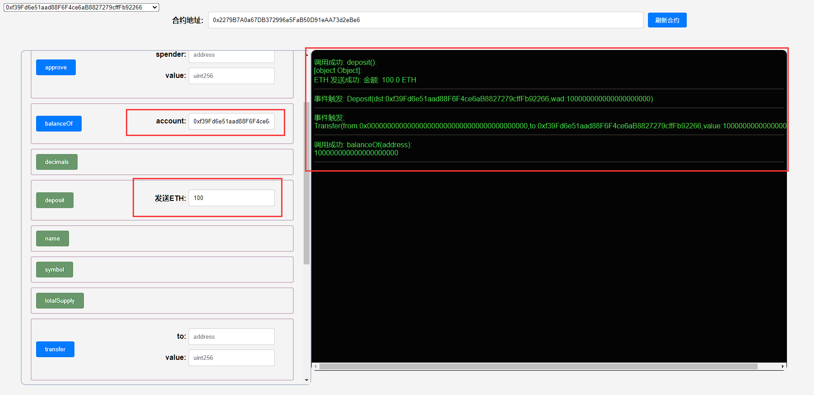
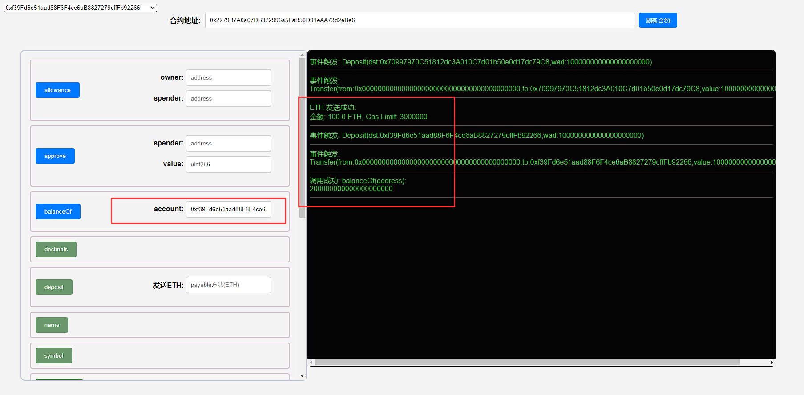

## 项目源码

[https://github.com/luode0320/solidity-demo](https://github.com/luode0320/solidity-demo)

## 什么是`WETH`？

这一讲，我们将学习`WETH`--带包装的`ETH`。


`WETH` (Wrapped ETH)是`ETH`的带包装版本。我们常见的`WETH`，`WBTC`，`WBNB`，都是带包装的原生代币。

那么我们为什么要包装它们？

在2015年，[ERC20](https://github.com/AmazingAng/WTF-Solidity/blob/main/20_SendETH/readme.md)
标准出现，该代币标准旨在为以太坊上的代币制定一套标准化的规则，从而简化了新代币的发布，并使区块链上的所有代币相互可比。

不幸的是，以太币本身并不符合`ERC20`标准。`WETH`的开发是为了提高区块链之间的互操作性 ，并使`ETH`可用于去中心化应用程序（dApps）。

它就像是给原生代币穿了一件智能合约做的衣服：

- 穿上衣服的时候，就变成了`WETH`，符合`ERC20`同质化代币标准，可以跨链，可以用于`dApp`；脱下衣服，它可1:1兑换`ETH`。

## `WETH`合约

目前在用的[主网WETH合约](https://rinkeby.etherscan.io/token/0xc778417e063141139fce010982780140aa0cd5ab?a=0xe16c1623c1aa7d919cd2241d8b36d9e79c1be2a2)
写于2015年，非常老，那时候solidity是0.4版本。我们用0.8版本重新写一个`WETH`。

`WETH`符合`ERC20`标准，它比普通的`ERC20`多了两个功能：

1. 存款：包装，用户将`ETH`存入`WETH`合约，并获得等量的`WETH`。
2. 取款：拆包装，用户销毁`WETH`，并获得等量的`ETH`。

### 继承

`WETH`符合`ERC20`代币标准，因此`WETH`合约继承了`ERC20`合约。

```solidity
// SPDX-License-Identifier: MIT
pragma solidity ^0.8.0;

import "@openzeppelin/contracts/token/ERC20/ERC20.sol";

contract WETH is ERC20 {
```

### 事件

`WETH`合约共有`2`个事件：

1. `Deposit`：存款事件，在存款的时候释放。
2. `Withdraw`：取款事件，在取款的时候释放。

```solidity
    // 事件：存款和取款
    event  Deposit(address indexed dst, uint wad);
    event  Withdrawal(address indexed src, uint wad);
```

### 函数

除了`ERC20`标准的函数外，`WETH`合约有`5`个函数：

- 构造函数：初始化`WETH`的名字和代号。

  ```solidity
      // 构造函数，初始化ERC20的名字和代号
      constructor() ERC20("WETH", "WETH"){
      }
  ```


- 回调函数：`fallback()`和`receive()`，当用户往`WETH`合约转`ETH`的时候，会自动触发`deposit()`存款函数，获得等量的`WETH`。

  ```solidity
      // 回调函数，当用户往WETH合约转ETH时，会触发deposit()函数
      fallback() external payable {
          deposit();
      }
      // 回调函数，当用户往WETH合约转ETH时，会触发deposit()函数
      receive() external payable {
          deposit();
      }
  ```


- `deposit()`：存款函数，当用户存入`ETH`时，给他铸造等量的`WETH`。

  ```solidity
      // 存款函数，当用户存入ETH时，给他铸造等量的WETH
      function deposit() public payable {
          _mint(msg.sender, msg.value);
          emit Deposit(msg.sender, msg.value);
      }
  ```


- `withdraw()`：取款函数，让用户销毁`WETH`，并归还等量的`ETH`。

  ```solidity
      // 提款函数，用户销毁WETH，取回等量的ETH
      function withdraw(uint amount) public {
          require(balanceOf(msg.sender) >= amount);
          _burn(msg.sender, amount);
          payable(msg.sender).transfer(amount);
          emit Withdrawal(msg.sender, amount);
      }
  ```

## 调试

启动本地网络节点:

```sh
yarn hardhat node
```

### 1.部署合约

````sh
yarn hardhat run scripts/deploy.ts --network localhost
````

```sh
yarn run v1.22.22
$ E:\solidity-demo\41.WETH\node_modules\.bin\hardhat run scripts/deploy.ts --network localhost
Compiled 6 Solidity files successfully (evm target: paris).
当前网络: localhost
_________________________启动部署________________________________
部署地址: 0xf39Fd6e51aad88F6F4ce6aB8827279cffFb92266
账户余额 balance(wei): 9999996471566840012046
账户余额 balance(eth): 9999.996471566840012046
_________________________部署合约________________________________
合约地址: 0x2279B7A0a67DB372996a5FaB50D91eAA73d2eBe6
生成调试 html,请用 Live Server 调试: E:\solidity-demo\41.WETH\index.html
Done in 3.04s.
```

### 2. 调用`deposit`，存入`1 ETH`，并查看`WETH`余额



### 3. 直接向`WETH`合约转入`1 ETH`，并查看`WETH`余额



### 4. 调用`withdraw`，取出`1.5 ETH`，并查看`WETH`余额

此时`WETH`余额为`0.5 WETH`。


## 总结

这一讲，我们介绍了`WETH`并实现了`WETH`合约。

它就像是给原生`ETH`穿了一件智能合约做的衣服：穿上衣服的时候，就变成了`WETH`，符合`ERC20`
同质化代币标准，可以跨链，可以用于`dApp`；

脱下衣服，它可以1:1兑换`ETH`。