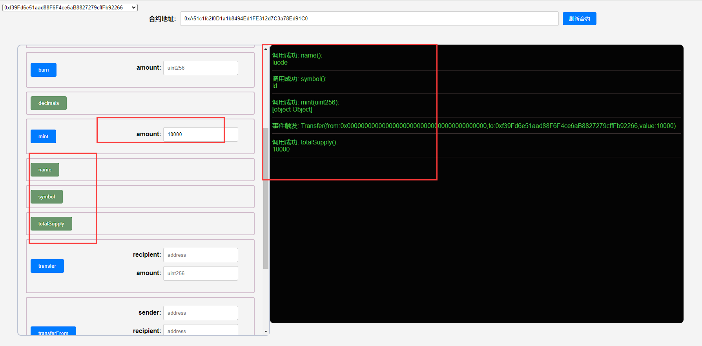
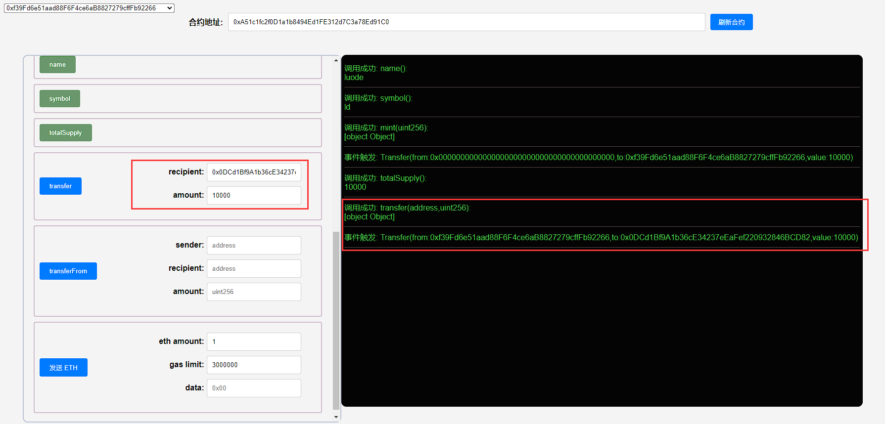
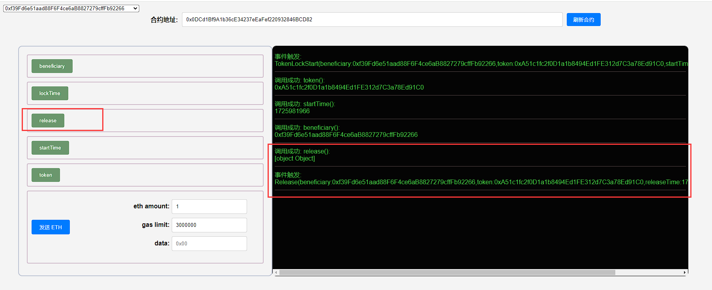
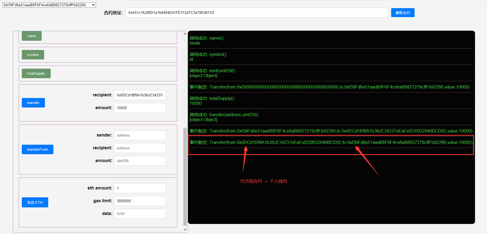

## 项目源码

[https://github.com/luode0320/solidity-demo](https://github.com/luode0320/solidity-demo)

## 代币锁

这一讲，我们介绍什么是流动性提供者`LP`代币，为什么要锁定流动性，并写一个简单的`ERC20`代币锁合约。


代币锁(Token Locker)是一种简单的时间锁合约，它可以把合约中的代币锁仓一段时间，受益人在锁仓期满后可以取走代币。

代币锁一般是用来锁仓流动性提供者`LP`代币的。

### 什么是`LP`代币？

区块链中，用户在去中心化交易所`DEX`上交易代币，例如`Uniswap`交易所。

`DEX`和中心化交易所(`CEX`)不同，去中心化交易所使用自动做市商(`AMM`)机制，需要用户或项目方提供资金池，以使得其他用户能够即时买卖。

简单来说，用户/项目方需要质押相应的币对（比如`ETH/DAI`）到资金池中，作为补偿，`DEX`会给他们铸造相应的流动性提供者`LP`
代币凭证，证明他们质押了相应的份额，供他们收取手续费。

### 为什么要锁定流动性？

如果项目方毫无征兆的撤出流动性池中的`LP`代币，那么投资者手中的代币就无法变现，直接归零了。这种行为也叫`rug-pull`
，仅2021年，各种`rug-pull`骗局从投资者那里骗取了价值超过28亿美元的加密货币。

但是如果`LP`代币是锁仓在代币锁合约中，在锁仓期结束以前，项目方无法撤出流动性池，也没办法`rug pull`。

因此代币锁可以防止项目方过早跑路（要小心锁仓期满跑路的情况）。

## 代币锁合约

下面，我们就写一个锁仓`ERC20`代币的合约`TokenLocker`。它的逻辑很简单：

- 开发者在部署合约时规定锁仓的时间，受益人地址，以及代币合约。
- 开发者将代币转入`TokenLocker`合约。
- 在锁仓期满，受益人可以取走合约里的代币。

### 事件

`TokenLocker`合约中共有`2`个事件。

- `TokenLockStart`：锁仓开始事件，在合约部署时释放，记录受益人地址，代币地址，锁仓起始时间，和结束时间。
- `Release`：代币释放事件，在受益人取出代币时释放，记录记录受益人地址，代币地址，释放代币时间，和代币数量。

```solidity
    // 事件
    event TokenLockStart(address indexed beneficiary, address indexed token, uint256 startTime, uint256 lockTime);
    event Release(address indexed beneficiary, address indexed token, uint256 releaseTime, uint256 amount);
```

### 状态变量

`TokenLocker`合约中共有`4`个状态变量。

- `token`：锁仓代币地址。
- `beneficiary`：受益人地址。
- `locktime`：锁仓时间(秒)。
- `startTime`：锁仓起始时间戳(秒)。

```solidity
   // 被锁仓的ERC20代币合约
IERC20 public immutable token;
// 受益人地址
address public immutable beneficiary;
// 锁仓时间(秒)
uint256 public immutable lockTime;
// 锁仓起始时间戳(秒)
uint256 public immutable startTime;
```

### 函数

`TokenLocker`合约中共有`2`个函数。

- 构造函数：初始化代币合约，受益人地址，以及锁仓时间。

  ```solidity
      /**
       * @dev 部署时间锁合约，初始化代币合约地址，受益人地址和锁仓时间。
       * @param token_: 被锁仓的ERC20代币合约
       * @param beneficiary_: 受益人地址
       * @param lockTime_: 锁仓时间(秒)
       */
      constructor(
          IERC20 token_,
          address beneficiary_,
          uint256 lockTime_
      ) {
          require(lockTime_ > 0, "TokenLock: lock time should greater than 0");
          token = token_;
          beneficiary = beneficiary_;
          lockTime = lockTime_;
          startTime = block.timestamp;
  
          emit TokenLockStart(beneficiary_, address(token_), block.timestamp, lockTime_);
      }
  ```


- `release()`：在锁仓期满后，将代币释放给受益人。需要受益人主动调用`release()`函数提取代币。

  ```solidity
      /**
       * @dev 在锁仓时间过后，将代币释放给受益人。
       */
      function release() public {
          require(block.timestamp >= startTime+lockTime, "TokenLock: current time is before release time");
  
          uint256 amount = token.balanceOf(address(this));
          require(amount > 0, "TokenLock: no tokens to release");
  
          token.transfer(beneficiary, amount);
  
          emit Release(msg.sender, address(token), block.timestamp, amount);
      }
  ```

## 调试

启动本地网络节点:

```sh
yarn hardhat node
```

### 1.部署 TokenVesting 合约 + ERC20 合约

````sh
yarn hardhat run scripts/ERC20.ts --network localhost
````

```sh
yarn run v1.22.22
$ E:\solidity-demo\44.代币锁\node_modules\.bin\hardhat run scripts/ERC20.ts --network localhost
Compiled 3 Solidity files successfully (evm target: paris).
当前网络: localhost
_________________________启动部署________________________________
部署地址: 0xf39Fd6e51aad88F6F4ce6aB8827279cffFb92266
账户余额 balance(wei): 9998994381540976044623
账户余额 balance(eth): 9998.994381540976044623
_________________________部署合约________________________________
合约地址: 0xA51c1fc2f0D1a1b8494Ed1FE312d7C3a78Ed91C0
生成调试 html,请用 Live Server 调试: E:\solidity-demo\44.代币锁\ERC20.html
Done in 2.92s.
```

修改TokenVesting.ts, 将构造函数的ERC20 合约填入(代币地址为`ERC20`合约地址，受益人为自己，锁仓期填`100`秒)。

```sh
yarn hardhat run scripts/TokenLocker.ts --network localhost
```

```sh
yarn run v1.22.22
$ E:\solidity-demo\44.代币锁\node_modules\.bin\hardhat run scripts/TokenLocker.ts --network localhost
当前网络: localhost
_________________________启动部署________________________________
部署地址: 0xf39Fd6e51aad88F6F4ce6aB8827279cffFb92266
账户余额 balance(wei): 9998993335255315502298
账户余额 balance(eth): 9998.993335255315502298
_________________________部署合约________________________________
合约地址: 0x0DCd1Bf9A1b36cE34237eEaFef220932846BCD82
生成调试 html,请用 Live Server 调试: E:\solidity-demo\44.代币锁\TokenLocker.html
Done in 2.06s.
```

### 2.ERC20合约，并给自己铸造`10000`枚代币。

铸造的代币还在ERC20合约中, 并未取出。

### 

### 3.将`10000`枚代币转入代币锁合约。



### 4.在锁仓期后调用`release()`函数，成功取出代币。





## 总结

这一讲，我们介绍了代币锁合约。项目方一般在`DEX`上提供流动性，供投资者交易。

项目方突然撤出`LP`会造成`rug-pull`，而将`LP`锁在代币锁合约中可以避免这种情况。