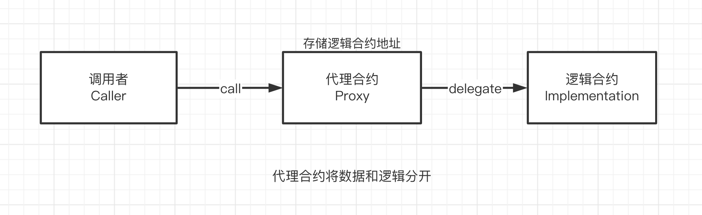

## 项目源码

[https://github.com/luode0320/solidity-demo](https://github.com/luode0320/solidity-demo)

## 代理模式

这一讲，我们介绍代理合约（Proxy
Contract）。教学代码由OpenZeppelin的[Proxy合约](https://github.com/OpenZeppelin/openzeppelin-contracts/blob/master/contracts/proxy/Proxy.sol)
简化而来。

`Solidity`合约部署在链上之后，代码是不可变的（immutable）。这样既有优点，也有缺点：

- 优点：安全，用户知道会发生什么（大部分时候）。
- 坏处：就算合约中存在bug，也不能修改或升级，只能部署新合约。但是新合约的地址与旧的不一样，且合约的数据也需要花费大量gas进行迁移。

有没有办法在合约部署后进行修改或升级呢？答案是有的，那就是**代理模式**。



代理模式将合约数据和逻辑分开，分别保存在不同合约中。我们拿上图中简单的代理合约为例

- 数据（状态变量）存储在代理合约中，而逻辑（函数）保存在另一个逻辑合约中。
- 代理合约（Proxy）通过`delegatecall`，将函数调用全权委托给逻辑合约（Implementation）执行，再把最终的结果返回给调用者（Caller）。

代理模式主要有两个好处：

1. 可升级：当我们需要升级合约的逻辑时，只需要将代理合约指向新的逻辑合约。
2. 省gas：如果多个合约复用一套逻辑，我们只需部署一个逻辑合约，然后再部署多个只保存数据的代理合约，指向逻辑合约。

**提示**：对`delegatecall`
不熟悉的朋友可以看下本教程[第23讲Delegatecall](https://github.com/AmazingAng/WTF-Solidity/tree/main/23_Delegatecall)。

## 代理合约

下面我们介绍一个简单的代理合约，它由OpenZeppelin的[Proxy合约](https://github.com/OpenZeppelin/openzeppelin-contracts/blob/master/contracts/proxy/Proxy.sol)
简化而来。

它有三个部分：代理合约`Proxy`，逻辑合约`Logic`，和一个调用示例`Caller`。

它的逻辑并不复杂：

- 首先部署逻辑合约`Logic`。
- 创建代理合约`Proxy`，状态变量`implementation`记录`Logic`逻辑合约地址。
- `Proxy`代理合约利用回调函数`fallback`，将所有调用委托给`Logic`合约
- 最后部署调用示例`Caller`合约，调用`Proxy`合约。
- **注意**：`Logic`合约和`Proxy`合约的状态变量存储结构相同，不然`delegatecall`会产生意想不到的行为，有安全隐患。

### 代理合约`Proxy`

`Proxy`合约不长，但是**用到了内联汇编，因此比较难理解**。它只有一个状态变量，一个构造函数，和一个回调函数。

状态变量`implementation`，在构造函数中初始化，用于保存`Logic`合约地址。

```solidity
// SPDX-License-Identifier: MIT
// wtf.academy
pragma solidity ^0.8.21;

import "hardhat/console.sol";

/**
 * @dev Proxy合约的所有调用都通过`delegatecall`操作码委托给另一个合约执行。后者被称为逻辑合约（Implementation）。
 *
 * 委托调用的返回值，会直接返回给Proxy的调用者
 */
contract Proxy {
    address public implementation; // 逻辑合约地址。implementation合约同一个位置的状态变量类型必须和Proxy合约的相同，不然会报错。

    /**
     * @dev 初始化逻辑合约地址
     */
    constructor(address implementation_){
        implementation = implementation_;
    }
```

`Proxy`的回调函数将外部对本合约的调用委托给 `Logic` 合约。这个回调函数很别致，它利用内联汇编（inline
assembly），让本来不能有返回值的回调函数有了返回值。其中用到的内联汇编操作码：

```solidity
    /**
     * @dev 回调函数，调用`_delegate()`函数将本合约的调用委托给 `implementation` 合约
     */
    fallback() external payable {
        _delegate();
    }

/**
 * @dev 将调用委托给逻辑合约运行
     */
    function _delegate() internal {
        console.log("Proxy: _delegate");
        address _implementation = implementation;
        assembly {
        // 将 msg.data 拷贝到内存里
        // calldatacopy 操作码的参数: 内存起始位置，calldata 起始位置，calldata 长度
        // 这里将整个 calldata 复制到内存的起始位置 0
            calldatacopy(0, 0, calldatasize())

        // 利用 delegatecall 调用 implementation 合约
        // delegatecall 操作码的参数：gas, 目标合约地址，input mem 起始位置，input mem 长度，output area mem 起始位置，output area mem 长度
        // output area 起始位置和长度位置，所以设为 0
        // delegatecall 成功返回 1，失败返回 0
            let result := delegatecall(
                gas(),
                _implementation,
                0,
                calldatasize(),
                0,
                0
            )

        // 将 return data 拷贝到内存
        // returndatacopy 操作码的参数：内存起始位置，returndata 起始位置，returndata 长度
        // 这里将整个 returndata 复制到内存的起始位置 0
            returndatacopy(0, 0, returndatasize())

        // 根据 delegatecall 的结果进行不同的处理
            switch result
            // 如果delegate call失败，revert
            case 0 {
                revert(0, returndatasize())
            }
            // 如果delegate call成功，返回mem起始位置为0，长度为returndatasize()的数据（格式为bytes）
            default {
                return (0, returndatasize())
            }
        }
    }
```

- `calldatacopy(t, f, s)`：将calldata（输入数据）从位置`f`开始复制`s`字节到mem（内存）的位置`t`。
- `delegatecall(g, a, in, insize, out, outsize)`：调用地址`a`的合约，输入为`mem[in..(in+insize))`
  ，输出为`mem[out..(out+outsize))`， 提供`g`wei的以太坊gas。这个操作码在错误时返回`0`，在成功时返回`1`。
- `returndatacopy(t, f, s)`：将returndata（输出数据）从位置`f`开始复制`s`字节到mem（内存）的位置`t`。
- `switch`：基础版`if/else`，不同的情况`case`返回不同值。可以有一个默认的`default`情况。
- `return(p, s)`：终止函数执行, 返回数据`mem[p..(p+s))`。
- `revert(p, s)`：终止函数执行, 回滚状态，返回数据`mem[p..(p+s))`。

### 逻辑合约`Logic`

这是一个非常简单的逻辑合约，只是为了演示代理合约。它包含`2`个变量，`1`个事件，`1`个函数：

- `implementation`：占位变量，与`Proxy`合约保持一致，防止插槽冲突。
- `x`：`uint`变量，被设置为`99`。
- `CallSuccess`事件：在调用成功时释放。
- `increment()`函数：会被`Proxy`合约调用，释放`CallSuccess`事件，并返回一个`uint`，它的`selector`为`0xd09de08a`
  。如果直接调用`increment()`会返回`100`，但是通过`Proxy`调用它会返回`1`，大家可以想想为什么？

```solidity
// SPDX-License-Identifier: MIT
// wtf.academy
pragma solidity ^0.8.21;

import "hardhat/console.sol";

/**
 * @dev 逻辑合约，执行被委托的调用
 */
contract Logic {
    address public implementation; // 与Proxy保持一致，防止插槽冲突
    uint public x = 99;

    event CallSuccess(uint increment);

    // 这个函数会释放LogicCalled并返回一个uint。ethers不会收到这个结果, 所以我们用event获取
    // 函数selector: 0xd09de08a
    function increment() external returns (uint) {
        console.log("Logic: increment");
        emit CallSuccess(x + 1);
        return x + 1;
    }
}

```

### 调用者合约`Caller`

`Caller`合约会演示如何调用一个代理合约，它也非常简单。

它有`1`个变量，`2`个函数：

- `proxy`：状态变量，记录代理合约地址。
- 构造函数：在部署合约时初始化`proxy`变量。
- `increase()`：利用`call`来调用代理合约的`increment()`函数，并返回一个`uint`。在调用时，我们利用`abi.encodeWithSignature()`
  获取了`increment()`函数的`selector`。在返回时，利用`abi.decode()`将返回值解码为`uint`类型。

```solidity
// SPDX-License-Identifier: MIT
// wtf.academy
pragma solidity ^0.8.21;

import "hardhat/console.sol";

/**
 * @dev Caller合约，调用代理合约，并获取执行结果
 */
contract Caller {
    address public proxy; // 代理合约地址
    event CallSuccess(uint increase);

    constructor(address proxy_) {
        proxy = proxy_;
    }

    // 通过代理合约调用 increase()函数
    function increase() external returns (uint) {
        (, bytes memory data) = proxy.call(
            abi.encodeWithSignature("increment()")
        );
        emit CallSuccess(abi.decode(data, (uint)));
        return abi.decode(data, (uint));
    }
}

```

## 调试

启动本地网络节点:

```sh
yarn hardhat node
```

### 1.部署`Logic`逻辑合约

````sh
yarn hardhat run scripts/Logic.ts --network localhost
````

```sh
yarn run v1.22.22
$ E:\solidity-demo\46.代理合约\node_modules\.bin\hardhat run scripts/Logic.ts --network localhost
Compiled 1 Solidity file successfully (evm target: paris).
当前网络: localhost
_________________________启动部署________________________________
部署地址: 0xf39Fd6e51aad88F6F4ce6aB8827279cffFb92266
账户余额 balance(wei): 9997977197219155392110
账户余额 balance(eth): 9997.97719721915539211
_________________________部署合约________________________________
合约地址: 0x986aaa537b8cc170761FDAC6aC4fc7F9d8a20A8C
生成调试 html,请用 Live Server 调试: E:\solidity-demo\46.代理合约\Logic.html
Done in 3.26s.
```

调用`Logic`合约的`increment()`函数，返回`100`。


### 2.部署`Proxy`合约，初始化时填入`Logic`合约地址。

```sh\
yarn hardhat run scripts/Proxy.ts --network localhost
```

```sh
yarn run v1.22.22
$ E:\solidity-demo\46.代理合约\node_modules\.bin\hardhat run scripts/Proxy.ts --network localhost
当前网络: localhost
_________________________启动部署________________________________
部署地址: 0xf39Fd6e51aad88F6F4ce6aB8827279cffFb92266
账户余额 balance(wei): 9997976855023152654542
账户余额 balance(eth): 9997.976855023152654542
_________________________部署合约________________________________
合约地址: 0xefc1aB2475ACb7E60499Efb171D173be19928a05
生成调试 html,请用 Live Server 调试: E:\solidity-demo\46.代理合约\Proxy.html
Done in 2.22s.
```

### 3.调用`Proxy`合约`increment()`函数，无返回值。


### 4.部署`Caller`合约，初始化时填入`Proxy`合约地址。

```sh
yarn hardhat run scripts/Caller.ts --network localhost
```

```sh
yarn run v1.22.22
$ E:\solidity-demo\46.代理合约\node_modules\.bin\hardhat run scripts/Caller.ts --network localhost
Compiled 1 Solidity file successfully (evm target: paris).
当前网络: localhost
_________________________启动部署________________________________
部署地址: 0xf39Fd6e51aad88F6F4ce6aB8827279cffFb92266
账户余额 balance(wei): 9997975821040144382678
账户余额 balance(eth): 9997.975821040144382678
_________________________部署合约________________________________
合约地址: 0xB377a2EeD7566Ac9fCb0BA673604F9BF875e2Bab
生成调试 html,请用 Live Server 调试: E:\solidity-demo\46.代理合约\Caller.html
Done in 3.36s.
```

### 5.调用`Caller`合约`increment()`函数，返回`1`。

为什么通过Proxy调用`increment()`会返回1呢？

- 当Caller合约通过Proxy合约来`delegatecall` Logic合约的时候，如果Logic合约函数改变或读取一些状态变量的时候都会在Proxy的对应变量上操作
- 而这里Proxy合约的`x`变量的值是0 (因为从来没有设置过`x`这个变量，即Proxy合约的storage区域所对应位置值为0)
- 所以通过Proxy调用`increment()`会返回1。


## 总结

这一讲，我们介绍了代理模式和简单的代理合约。

代理合约利用`delegatecall`将函数调用委托给了另一个逻辑合约，使得数据和逻辑分别由不同合约负责。并

且，它利用内联汇编黑魔法，让没有返回值的回调函数也可以返回数据。

下一讲，我们会介绍可升级代理合约。

教学用的合约由`OpenZeppelin`
中的合约简化而来，可能有安全问题，不要用于生产环境。用的时候最好直接复制[OpenZeppelin](https://github.com/OpenZeppelin/openzeppelin-contracts/tree/master/contracts/proxy)
的模版合约。