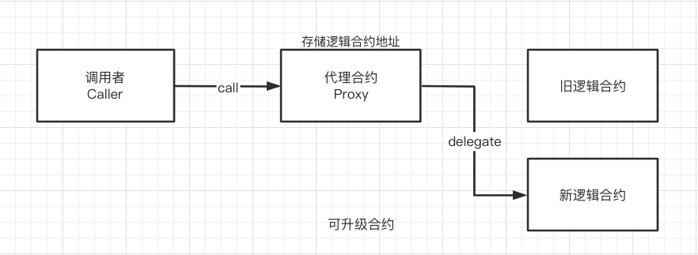
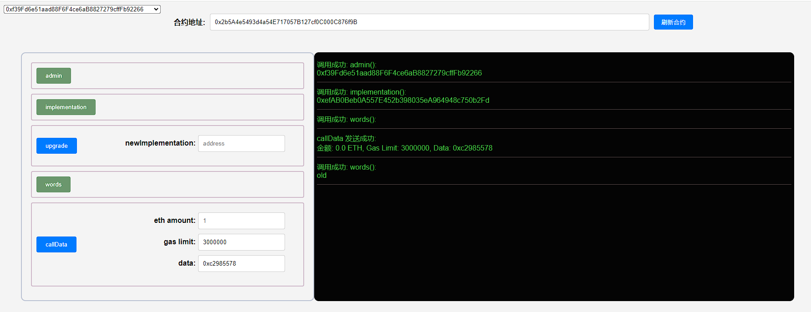
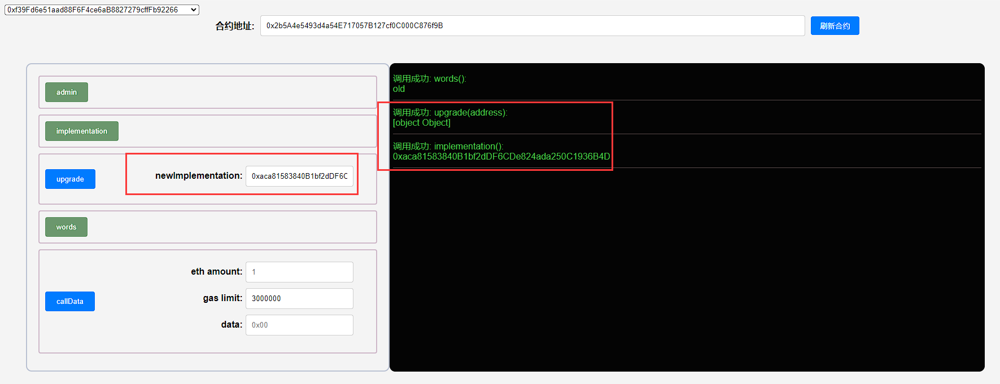
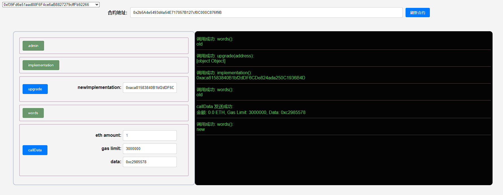

## 项目源码

[https://github.com/luode0320/solidity-demo](https://github.com/luode0320/solidity-demo)

## 可升级合约

这一讲，我们将介绍可升级合约（Upgradeable Contract）。教学用的合约由`OpenZeppelin`中的合约简化而来，可能有安全问题，不要用于生产环境。

如果你理解了代理合约，就很容易理解可升级合约。它就是一个可以更改逻辑合约的代理合约。



## 简单实现

下面我们实现一个简单的可升级合约，它包含`3`个合约：代理合约，旧的逻辑合约，和新的逻辑合约。

### 代理合约

这个代理合约比上一讲中的简单。我们没有在它的`fallback()`函数中使用`内联汇编`
，而仅仅用了`implementation.delegatecall(msg.data);`。

因此，回调函数没有返回值，但足够教学使用了。

它包含`3`个变量：

- `implementation`：逻辑合约地址。
- `admin`：admin地址。
- `words`：字符串，可以通过逻辑合约的函数改变。

```solidity
    address public implementation; // 逻辑合约地址
address public admin; // admin地址
string public words; // 字符串，可以通过逻辑合约的函数改变
```

它包含`3`个函数

- 构造函数：初始化admin和逻辑合约地址。

  ```solidity
      // 构造函数，初始化admin和逻辑合约地址
      constructor(address _implementation){
          admin = msg.sender;
          implementation = _implementation;
      }
  ```


- `fallback()`：回调函数，将调用委托给逻辑合约。

  ```solidity
      // fallback函数，将调用委托给逻辑合约
      fallback() external payable {
          (bool success, bytes memory data) = implementation.delegatecall(msg.data);
      }
  ```


- `upgrade()`：升级函数，改变逻辑合约地址，只能由`admin`调用。

  ```solidity
      // 升级函数，改变逻辑合约地址，只能由admin调用
      function upgrade(address newImplementation) external {
          require(msg.sender == admin);
          implementation = newImplementation;
      }
  ```

### 旧逻辑合约

这个逻辑合约包含`3`个状态变量，与保持代理合约一致，防止插槽冲突。它只有一个函数`foo()`，将代理合约中的`words`
的值改为`"old"`。

```solidity
// 逻辑合约1
contract Logic1 {
    // 状态变量和proxy合约一致，防止插槽冲突
    address public implementation;
    address public admin;
    string public words; // 字符串，可以通过逻辑合约的函数改变

    // 改变proxy中状态变量，选择器： 0xc2985578
    function foo() public {
        words = "old";
    }
}
```

### 新逻辑合约

这个逻辑合约包含`3`个状态变量，与保持代理合约一致，防止插槽冲突。它只有一个函数`foo()`，将代理合约中的`words`
的值改为`"new"`。

```solidity
// 逻辑合约2
contract Logic2 {
    // 状态变量和proxy合约一致，防止插槽冲突
    address public implementation;
    address public admin;
    string public words; // 字符串，可以通过逻辑合约的函数改变

    // 改变proxy中状态变量，选择器：0xc2985578
    function foo() public {
        words = "new";
    }
}
```

## 调试

启动本地网络节点:

```sh
yarn hardhat node
```

### 1.部署新旧逻辑合约

````sh
yarn hardhat run scripts/Logic1.ts --network localhost
````

```sh
Compiled 3 Solidity files successfully (evm target: paris).
合约名称: Logic1
当前网络: localhost
网络地址: http://127.0.0.1:8545
_________________________启动部署________________________________
部署地址: 0xf39Fd6e51aad88F6F4ce6aB8827279cffFb92266
账户余额 balance(wei): 9997974570995134382318
账户余额 balance(eth): 9997.974570995134382318
_________________________部署合约________________________________
合约地址: 0xefAB0Beb0A557E452b398035eA964948c750b2Fd
生成调试 html,请用 Live Server 调试: E:\solidity-demo\47.可升级合约\Logic1.html
Done in 2.78s.
```

```sh
yarn hardhat run scripts/Logic2.ts --network localhost
```

```sh
合约名称: Logic2
当前网络: localhost
网络地址: http://127.0.0.1:8545
_________________________启动部署________________________________
部署地址: 0xf39Fd6e51aad88F6F4ce6aB8827279cffFb92266
账户余额 balance(wei): 9997974176946131229926
账户余额 balance(eth): 9997.974176946131229926
_________________________部署合约________________________________
合约地址: 0xaca81583840B1bf2dDF6CDe824ada250C1936B4D
生成调试 html,请用 Live Server 调试: E:\solidity-demo\47.可升级合约\Logic2.html
Done in 2.06s.
```

### 2.部署可升级合约

构造函数将`implementation`地址指向旧逻辑合约

```sh
yarn hardhat run scripts/SimpleUpgrade.ts --network localhost
```

```sh
合约名称: SimpleUpgrade
当前网络: localhost
网络地址: http://127.0.0.1:8545
_________________________启动部署________________________________
部署地址: 0xf39Fd6e51aad88F6F4ce6aB8827279cffFb92266
账户余额 balance(wei): 9997970215642099539494
账户余额 balance(eth): 9997.970215642099539494
_________________________部署合约________________________________
合约地址: 0x2b5A4e5493d4a54E717057B127cf0C000C876f9B
生成调试 html,请用 Live Server 调试: E:\solidity-demo\47.可升级合约\SimpleUpgrade.html
Done in 2.07s.
```

### 3.利用选择器`0xc2985578`

在代理合约中调用旧逻辑合约`Logic1`的`foo()`函数，将`words`的值改为`"old"`。



### 4.指向新逻辑合约

调用`upgrade()`，将`implementation`地址指向新逻辑合约`Logic2`。



### 5.利用选择器`0xc2985578`

在代理合约中调用新逻辑合约`Logic2`的`foo()`函数，将`words`的值改为`"new"`。



## 总结

这一讲，我们介绍了一个简单的可升级合约。它是一个可以改变逻辑合约的代理合约，给不可更改的智能合约增加了升级功能。

但是，这个合约`有选择器冲突`
的问题，存在安全隐患。之后我们会介绍解决这一隐患的可升级合约标准：透明代理和通用可升级代理`UUPS`。