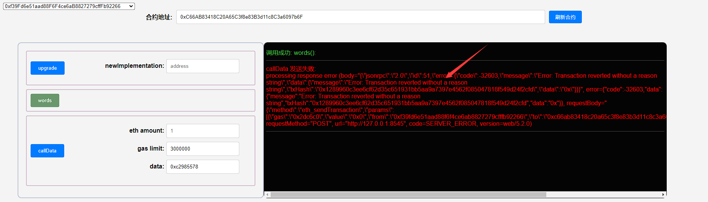
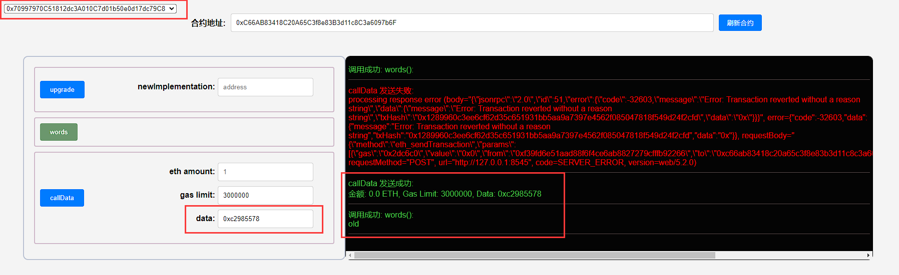
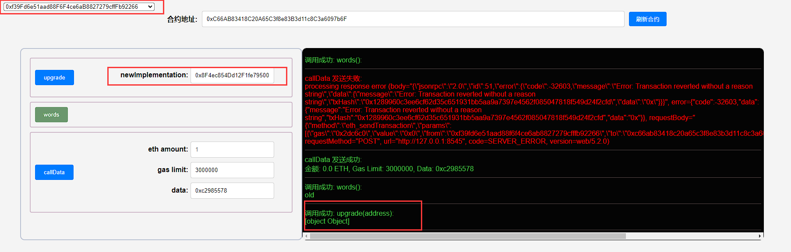
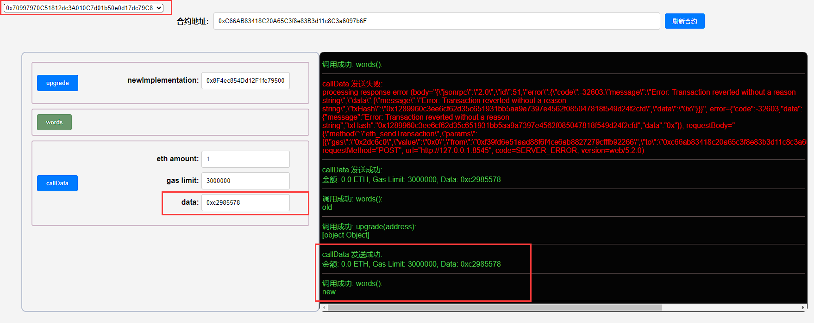

## 项目源码

[https://github.com/luode0320/solidity-demo](https://github.com/luode0320/solidity-demo)

## 选择器冲突

这一讲，我们将介绍代理合约的选择器冲突（Selector Clash），以及这一问题的解决方案：透明代理（Transparent Proxy）。

教学代码由`OpenZeppelin`
的[TransparentUpgradeableProxy](https://github.com/OpenZeppelin/openzeppelin-contracts/blob/master/contracts/proxy/transparent/TransparentUpgradeableProxy.sol)
简化而成，不应用于生产。

智能合约中，函数选择器（selector）是函数签名的哈希的前4个字节。

例如`mint(address account)`的选择器为`bytes4(keccak256("mint(address)"))`，也就是`0x6a627842`。

更多关于选择器的内容见 -> **solidity-进阶:14、函数选择器Selector**

由于函数选择器仅有4个字节，范围很小，因此两个不同的函数可能会有相同的选择器，例如下面两个函数：

```solidity
// 选择器冲突的例子
contract Foo {
    function burn(uint256) external {}

    function collate_propagate_storage(bytes16) external {}
}
```

示例中，函数`burn()`和`collate_propagate_storage()`的选择器都为`0x42966c68`，是一样的，这种情况被称为“选择器冲突”。

在这种情况下，`EVM`无法通过函数选择器分辨用户调用哪个函数，因此该合约无法通过编译。

由于代理合约和逻辑合约是两个合约，就算他们之间存在“选择器冲突”也可以正常编译，这可能会导致很严重的安全事故。

举个例子，**如果逻辑合约的`a`函数和代理合约的升级函数的选择器相同**，那么管理人就会在调用`a`函数的时候，将代理合约升级成一个黑洞合约，后果不堪设想。

目前，有两个可升级合约标准解决了这一问题：透明代理`Transparent Proxy`和通用可升级代理`UUPS`。

## 透明代理

透明代理的逻辑非常简单：管理员可能会因为“函数选择器冲突”，在调用逻辑合约的函数时，误调用代理合约的可升级函数。

那么限制管理员的权限，不让他调用任何逻辑合约的函数，就能解决冲突：

- 管理员变为工具人，仅能调用代理合约的可升级函数对合约升级，不能通过回调函数调用逻辑合约。
- 其它用户不能调用可升级函数，但是可以调用逻辑合约的函数。

### 代理合约

`fallback()`函数限制了管理员地址的调用。

它包含`3`个变量：

- `implementation`：逻辑合约地址。
- `admin`：admin地址。
- `words`：字符串，可以通过逻辑合约的函数改变。

```solidity
    address implementation; // logic合约地址
address admin; // 管理员
string public words; // 字符串，可以通过逻辑合约的函数改变
```

它包含`3`个函数

- 构造函数：初始化admin和逻辑合约地址。

  ```solidity
      // 构造函数，初始化admin和逻辑合约地址
      constructor(address _implementation){
          admin = msg.sender;
          implementation = _implementation;
      }
  ```


- `fallback()`：回调函数，将调用委托给逻辑合约，不能由`admin`调用。

  ```solidity
      // fallback函数，将调用委托给逻辑合约
      // 不能被admin调用，避免选择器冲突引发意外
      fallback() external payable {
          require(msg.sender != admin);
          (bool success, bytes memory data) = implementation.delegatecall(msg.data);
      }
  ```


- `upgrade()`：升级函数，改变逻辑合约地址，只能由`admin`调用。

  ```solidity
      // 升级函数，改变逻辑合约地址，只能由admin调用
      function upgrade(address newImplementation) external {
          if (msg.sender != admin) revert();
          implementation = newImplementation;
      }
  ```

### 逻辑合约

逻辑合约包含`3`个状态变量，与保持代理合约一致，防止插槽冲突；包含一个函数`foo()`，旧逻辑合约会将`words`的值改为`"old"`
，新的会改为`"new"`。

```solidity
// 旧逻辑合约
contract Logic1 {
    // 状态变量和proxy合约一致，防止插槽冲突
    address public implementation;
    address public admin;
    string public words; // 字符串，可以通过逻辑合约的函数改变

    // 改变proxy中状态变量，选择器： 0xc2985578
    function foo() public {
        words = "old";
    }
}

// 新逻辑合约
contract Logic2 {
    // 状态变量和proxy合约一致，防止插槽冲突
    address public implementation;
    address public admin;
    string public words; // 字符串，可以通过逻辑合约的函数改变

    // 改变proxy中状态变量，选择器：0xc2985578
    function foo() public {
        words = "new";
    }
}
```

## 调试

启动本地网络节点:

```sh
yarn hardhat node
```

### 1.部署新旧逻辑合约

````sh
yarn hardhat run scripts/Logic1.ts --network localhost
````

```sh
合约名称: Logic1
当前网络: localhost
网络地址: http://127.0.0.1:8545
_________________________启动部署________________________________
部署地址: 0xf39Fd6e51aad88F6F4ce6aB8827279cffFb92266
账户余额 balance(wei): 9997969458505093482398
账户余额 balance(eth): 9997.969458505093482398
_________________________部署合约________________________________
合约地址: 0x71089Ba41e478702e1904692385Be3972B2cBf9e
生成调试 html,请用 Live Server 调试: E:\solidity-demo\48.透明代理\Logic1.html
Done in 3.01s.
```

```sh
yarn hardhat run scripts/Logic2.ts --network localhost
```

```sh
合约名称: Logic2
当前网络: localhost
网络地址: http://127.0.0.1:8545
_________________________启动部署________________________________
部署地址: 0xf39Fd6e51aad88F6F4ce6aB8827279cffFb92266
账户余额 balance(wei): 9997969064456090330006
账户余额 balance(eth): 9997.969064456090330006
_________________________部署合约________________________________
合约地址: 0x8F4ec854Dd12F1fe79500a1f53D0cbB30f9b6134
生成调试 html,请用 Live Server 调试: E:\solidity-demo\48.透明代理\Logic2.html
Done in 2.07s.
```

### 2.部署透明代理合约

部署透明代理合约`TransparentProxy`，将`implementation`地址指向把旧逻辑合约。

```sh
yarn hardhat run scripts/TransparentProxy.ts --network localhost
```

```sh
合约名称: TransparentProxy
当前网络: localhost
网络地址: http://127.0.0.1:8545
_________________________启动部署________________________________
部署地址: 0xf39Fd6e51aad88F6F4ce6aB8827279cffFb92266
账户余额 balance(wei): 9997968670419087177710
账户余额 balance(eth): 9997.96867041908717771
_________________________部署合约________________________________
合约地址: 0xC66AB83418C20A65C3f8e83B3d11c8C3a6097b6F
生成调试 html,请用 Live Server 调试: E:\solidity-demo\48.透明代理\TransparentProxy.html
Done in 2.08s.
```

### 3.利用选择器`0xc2985578`

利用选择器`0xc2985578`，在代理合约中调用旧逻辑合约`Logic1`的`foo()`函数。调用将失败，因为管理员不能调用逻辑合约。



### 4.切换新钱包，利用选择器`0xc2985578`

切换新钱包，利用选择器`0xc2985578`，在代理合约中调用旧逻辑合约`Logic1`的`foo()`函数，将`words`的值改为`"old"`，调用将成功。



### 5.切换回管理员钱包，调用`upgrade()`升级

切换回管理员钱包，调用`upgrade()`，将`implementation`地址指向新逻辑合约`Logic2`。



### 6.切换新钱包，利用选择器`0xc2985578`

切换新钱包，利用选择器`0xc2985578`，在代理合约中调用新逻辑合约`Logic2`的`foo()`函数，将`words`的值改为`"new"`。



## 总结

这一讲，我们介绍了代理合约中的“选择器冲突”，以及如何利用透明代理避免这个问题。

透明代理的逻辑简单，通过限制管理员调用逻辑合约解决“选择器冲突”问题。

它也有缺点，每次用户调用函数时，都会多一步是否为管理员的检查，消耗更多gas。

**但瑕不掩瑜，透明代理仍是大多数项目方选择的方案。**

下一讲，我们会介绍省gas但是也更加复杂的通用可升级代理`UUPS`。