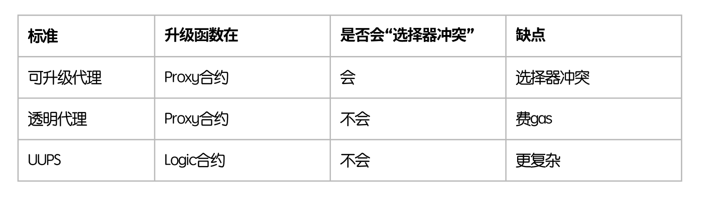
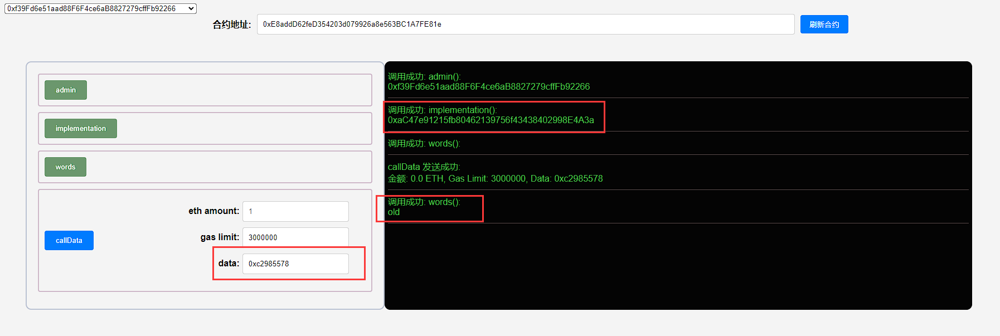
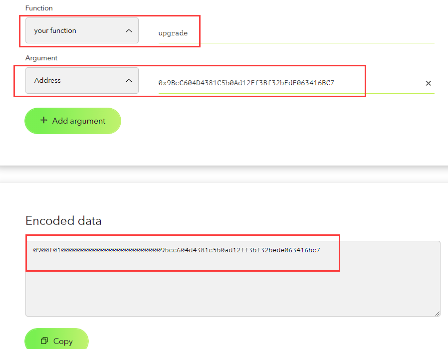
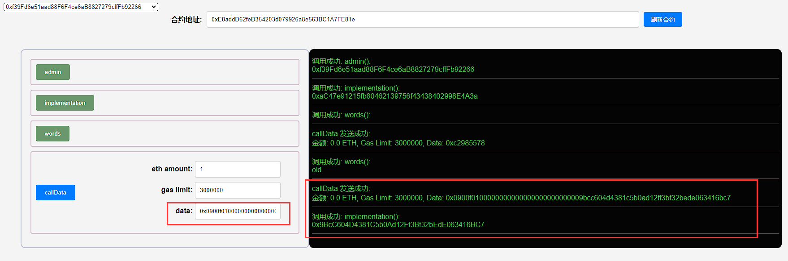
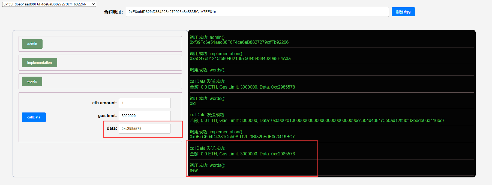

## 项目源码

[https://github.com/luode0320/solidity-demo](https://github.com/luode0320/solidity-demo)

## UUPS

这一讲，我们将介绍代理合约中选择器冲突（Selector Clash）的另一个解决办法：

通用可升级代理（UUPS，universal upgradeable proxy standard）。教学代码由`OpenZeppelin`的`UUPSUpgradeable`简化而成，不应用于生产。

我们在上一讲已经学习了"选择器冲突"（Selector Clash），即合约存在两个选择器相同的函数，可能会造成严重后果。作为透明代理的替代方案，UUPS也能解决这一问题。

UUPS（universal upgradeable proxy standard，通用可升级代理）将升级函数放在逻辑合约中。

这样一来，如果有其它函数与升级函数存在“选择器冲突”，编译时就会报错。

下表中概括了普通可升级合约，透明代理，和UUPS的不同点：



## UUPS合约

首先我们要复习一下Delegatecall：

- 如果用户A通过合约B（代理合约）去`delegatecall`调用合约C（逻辑合约），上下文仍是合约B的上下文，`msg.sender`仍是用户A而不是合约B。
- 因此，UUPS合约可以将升级函数放在逻辑合约中，并检查调用者是否为管理员。


### UUPS的代理合约

UUPS的代理合约看起来像是个不可升级的代理合约，非常简单，因为升级函数被放在了逻辑合约中。它包含`3`个变量：

- `implementation`：逻辑合约地址。
- `admin`：admin地址。
- `words`：字符串，可以通过逻辑合约的函数改变。

```solidity
    address public implementation; // 逻辑合约地址
address public admin; // admin地址
string public words; // 字符串，可以通过逻辑合约的函数改变
```

它包含`2`个函数

- 构造函数：初始化admin和逻辑合约地址。

  ```solidity
      // 构造函数，初始化admin和逻辑合约地址
      constructor(address _implementation){
          admin = msg.sender;
          implementation = _implementation;
      }
  ```


- `fallback()`：回调函数，将调用委托给逻辑合约。

  ```solidity
      // fallback函数，将调用委托给逻辑合约
      fallback() external payable {
          (bool success, bytes memory data) = implementation.delegatecall(msg.data);
      }
  ```

### UUPS的逻辑合约

UUPS逻辑合约包含`3`个状态变量，与保持代理合约一致，防止插槽冲突。它包含`2`个函数:

- `upgrade()`：升级函数，将改变逻辑合约地址`implementation`，只能由`admin`调用。
- `foo()`：旧UUPS逻辑合约会将`words`的值改为`"old"`，新的会改为`"new"`。

```solidity
// UUPS逻辑合约（升级函数写在逻辑合约内）
contract UUPS1 {
    // 状态变量和proxy合约一致，防止插槽冲突
    address public implementation;
    address public admin;
    string public words; // 字符串，可以通过逻辑合约的函数改变

    // 改变proxy中状态变量，选择器： 0xc2985578
    function foo() public {
        words = "old";
    }

    // 升级函数，改变逻辑合约地址，只能由admin调用。选择器：0x0900f010
    // UUPS中，逻辑合约中必须包含升级函数，不然就不能再升级了。
    function upgrade(address newImplementation) external {
        require(msg.sender == admin);
        implementation = newImplementation;
    }
}

// 新的UUPS逻辑合约
contract UUPS2 {
    // 状态变量和proxy合约一致，防止插槽冲突
    address public implementation;
    address public admin;
    string public words; // 字符串，可以通过逻辑合约的函数改变

    // 改变proxy中状态变量，选择器： 0xc2985578
    function foo() public {
        words = "new";
    }

    // 升级函数，改变逻辑合约地址，只能由admin调用。选择器：0x0900f010
    // UUPS中，逻辑合约中必须包含升级函数，不然就不能再升级了。
    function upgrade(address newImplementation) external {
        require(msg.sender == admin);
        implementation = newImplementation;
    }
}
```

## 调试

启动本地网络节点:

```sh
yarn hardhat node
```

### 1.部署UUPS新旧逻辑合约`UUPS1`和`UUPS2`

````sh
yarn hardhat run scripts/UUPS1.ts --network localhost
````

```sh
合约名称: UUPS1
当前网络: localhost
网络地址: http://127.0.0.1:8545
_________________________启动部署________________________________
部署地址: 0xf39Fd6e51aad88F6F4ce6aB8827279cffFb92266
账户余额 balance(wei): 9997968250465083818078
账户余额 balance(eth): 9997.968250465083818078
_________________________部署合约________________________________
合约地址: 0xaC47e91215fb80462139756f43438402998E4A3a
生成调试 html,请用 Live Server 调试: E:\solidity-demo\49.通用可升级代理\UUPS1.html
Done in 3.05s.
```

```sh
yarn hardhat run scripts/UUPS2.ts --network localhost
```

```sh
合约名称: UUPS2
当前网络: localhost
网络地址: http://127.0.0.1:8545
_________________________启动部署________________________________
部署地址: 0xf39Fd6e51aad88F6F4ce6aB8827279cffFb92266
账户余额 balance(wei): 9997967793870080165318
账户余额 balance(eth): 9997.967793870080165318
_________________________部署合约________________________________
合约地址: 0x9BcC604D4381C5b0Ad12Ff3Bf32bEdE063416BC7
生成调试 html,请用 Live Server 调试: E:\solidity-demo\49.通用可升级代理\UUPS2.html
Done in 2.13s.
```

### 2.部署UUPS代理合约`UUPSProxy`

部署UUPS代理合约`UUPSProxy`，将`implementation`地址指向旧逻辑合约`UUPS1`。

```sh
yarn hardhat run scripts/UUPSProxy.ts --network localhost
```

```sh
合约名称: UUPSProxy
当前网络: localhost
网络地址: http://127.0.0.1:8545
_________________________启动部署________________________________
部署地址: 0xf39Fd6e51aad88F6F4ce6aB8827279cffFb92266
账户余额 balance(wei): 9997965837689064515870
账户余额 balance(eth): 9997.96583768906451587
_________________________部署合约________________________________
合约地址: 0xE8addD62feD354203d079926a8e563BC1A7FE81e
生成调试 html,请用 Live Server 调试: E:\solidity-demo\49.通用可升级代理\UUPSProxy.html
Done in 2.22s.
```

### 3.利用选择器`0xc2985578`

利用选择器`0xc2985578`，在代理合约中调用旧逻辑合约`UUPS1`的`foo()`函数，将`words`的值改为`"old"`。



### 4.调用升级函数`upgrade()`

利用在线ABI编码器[HashEx](https://abi.hashex.org/)获得二进制编码，调用升级函数`upgrade()`，将`implementation`
地址指向新逻辑合约`UUPS2`。

```
UUPS2: 0x9BcC604D4381C5b0Ad12Ff3Bf32bEdE063416BC7
二进制编码(前缀加0x): 0x0900f0100000000000000000000000009bcc604d4381c5b0ad12ff3bf32bede063416bc7
```





### 5.利用选择器`0xc2985578`

利用选择器`0xc2985578`，在代理合约中调用新逻辑合约`UUPS2`的`foo()`函数，将`words`的值改为`"new"`。



## 总结

这一讲，我们介绍了代理合约“选择器冲突”的另一个解决方案：UUPS。

与透明代理不同，UUPS将升级函数放在了逻辑合约中，从而使得"选择器冲突"不能通过编译。相比透明代理，UUPS更省gas，但也更复杂。