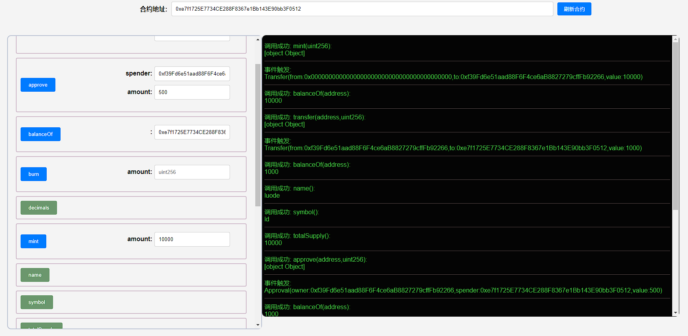
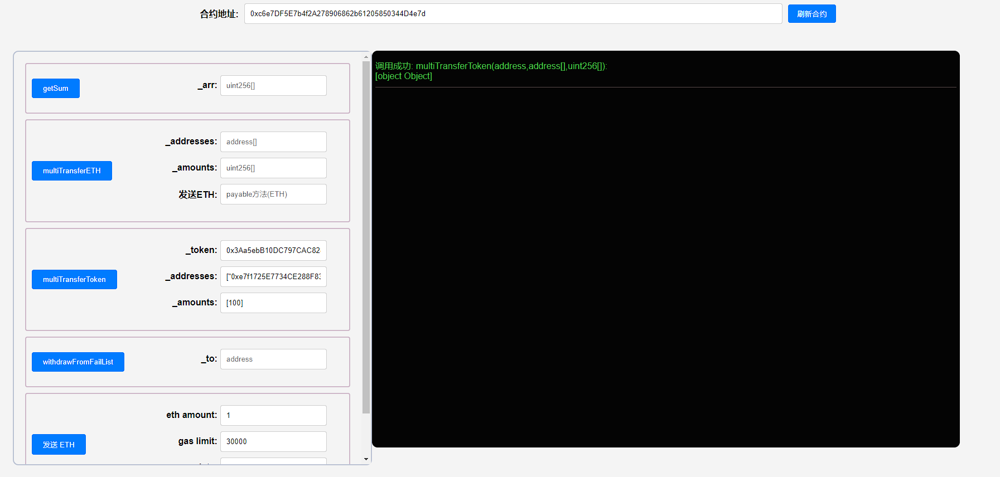
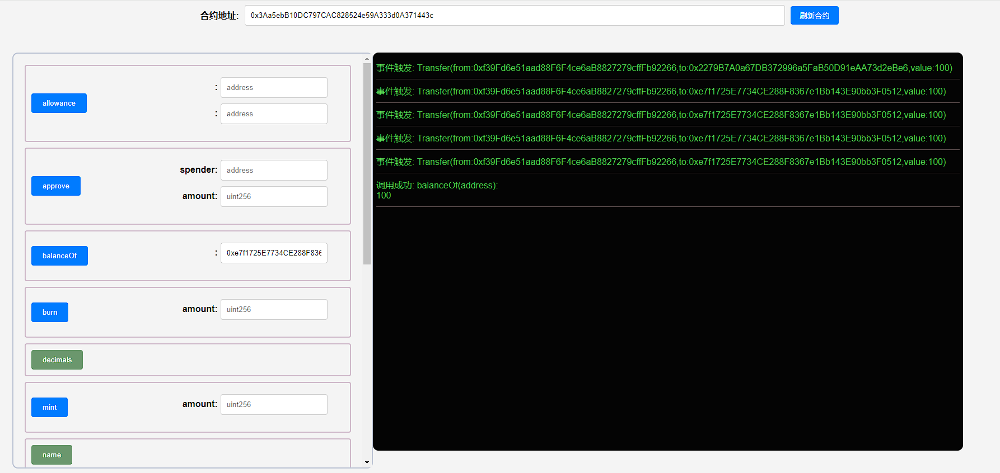

## 项目源码

[https://github.com/luode0320/solidity-demo](https://github.com/luode0320/solidity-demo)

## ERC20

`ERC20`是以太坊上的代币标准，来自2015年11月V神参与的[`EIP20`](https://eips.ethereum.org/EIPS/eip-20)。它实现了代币转账的基本逻辑：

- 账户余额(balanceOf())
- 转账(transfer())
- 授权转账(transferFrom())
- 授权(approve())
- 代币总供给(totalSupply())
- 授权转账额度(allowance())
- 代币信息（可选）：名称(name())，代号(symbol())，小数位数(decimals())

## IERC20

`IERC20`是`ERC20`代币标准的接口合约，规定了`ERC20`代币需要实现的函数和事件。

之所以需要定义接口，是因为有了规范后，就存在所有的`ERC20`代币都通用的函数名称，输入参数，输出参数。

在接口函数中，只需要定义函数名称，输入参数，输出参数，并不关心函数内部如何实现。

由此，函数就分为内部和外部两个内容，一个重点是实现，另一个是对外接口，约定共同数据。

这就是为什么需要`ERC20.sol`和`IERC20.sol`两个文件实现一个合约。

### 事件

`IERC20`定义了`2`个事件：`Transfer`事件和`Approval`事件，分别在转账和授权时被释放

```solidity
/**
 * @dev 释放条件：当 `value` 单位的货币从账户 (`from`) 转账到另一账户 (`to`)时.
 */
event Transfer(address indexed from, address indexed to, uint256 value);

/**
 * @dev 释放条件：当 `value` 单位的货币从账户 (`owner`) 授权给另一账户 (`spender`)时.
 */
event Approval(address indexed owner, address indexed spender, uint256 value);
```

### 函数

`IERC20`定义了`6`个函数，提供了转移代币的基本功能，并允许代币获得批准，以便其他链上第三方使用。

#### `totalSupply()`返回代币总供给

```solidity
/**
 * @dev 返回代币总供给.
 */
function totalSupply() external view returns (uint256);
```

#### `balanceOf()`返回账户余额

```solidity
/**
 * @dev 返回账户`account`所持有的代币数.
 */
function balanceOf(address account) external view returns (uint256);
```

#### `transfer()`转账

```ssolidity
/**
 * @dev 转账 `amount` 单位代币，从调用者账户到另一账户 `to`.
 *
 * 如果成功，返回 `true`.
 *
 * 释放 {Transfer} 事件.
 */
function transfer(address to, uint256 amount) external returns (bool);
```

#### `allowance()`返回授权额度

```solidity
/**
 * @dev 返回`owner`账户授权给`spender`账户的额度，默认为0。
 *
 * 当{approve} 或 {transferFrom} 被调用时，`allowance`会改变.
 */
function allowance(address owner, address spender) external view returns (uint256);
```

#### `approve()`授权

```solidity
/**
 * @dev 调用者账户给`spender`账户授权 `amount`数量代币。
 *
 * 如果成功，返回 `true`.
 *
 * 释放 {Approval} 事件.
 */
function approve(address spender, uint256 amount) external returns (bool);
```

#### `transferFrom()`授权转账

```solidity
/**
 * @dev 通过授权机制，从`from`账户向`to`账户转账`amount`数量代币。转账的部分会从调用者的`allowance`中扣除。
 *
 * 如果成功，返回 `true`.
 *
 * 释放 {Transfer} 事件.
 */
function transferFrom(
    address from,
    address to,
    uint256 amount
) external returns (bool);
```

## 实现ERC20

现在我们写一个`ERC20`，将`IERC20`规定的函数简单实现。

### 状态变量

我们需要状态变量来记录账户余额，授权额度和代币信息。

- 其中`balanceOf`, `allowance`和`totalSupply`为`public`类型，会自动生成一个同名`getter`函数
- 实现`IERC20`规定的`balanceOf()`, `allowance()`和`totalSupply()`。

- 而`name`, `symbol`, `decimals`则对应代币的名称，代币别名和小数位数。

**注意**：用`override`修饰`public`变量，会重写继承自父合约的与变量同名的`getter`函数，比如`IERC20`中的`balanceOf()`函数。

```solidity
mapping(address => uint256) public override balanceOf;

mapping(address => mapping(address => uint256)) public override allowance;

uint256 public override totalSupply;   // 代币总供给

string public name;   // 名称
string public symbol;  // 代币别名

uint8 public decimals = 18; // 小数位数
```

### 函数

#### 构造函数：初始化代币名称、代币别名。

```solidity
constructor(string memory name_, string memory symbol_){
    name = name_;
    symbol = symbol_;
}
```

#### `transfer()`函数：实现`IERC20`中的`transfer`函数，代币转账逻辑。

调用方扣除`amount`数量代币，接收方增加相应代币。土狗币会魔改这个函数，加入税收、分红、抽奖等逻辑。

```solidity
function transfer(address recipient, uint amount) public override returns (bool) {
    balanceOf[msg.sender] -= amount;
    balanceOf[recipient] += amount;
    emit Transfer(msg.sender, recipient, amount);
    return true;
}
```

#### `approve()`函数：实现`IERC20`中的`approve`函数，代币授权逻辑。

被授权方`spender`可以支配授权方的`amount`数量的代币。

`spender`可以是EOA账户，也可以是合约账户：当你用`uniswap`交易代币时，你需要将代币授权给`uniswap`合约。

```solidity
function approve(address spender, uint amount) public override returns (bool) {
    allowance[msg.sender][spender] = amount;
    emit Approval(msg.sender, spender, amount);
    return true;
}
```

#### `transferFrom()`函数：实现`IERC20`中的`transferFrom`函数，授权转账逻辑。

被授权方将授权方`sender`的`amount`数量的代币转账给接收方`recipient`。

```solidity
function transferFrom(
    address sender,
    address recipient,
    uint amount
) public override returns (bool) {
    allowance[sender][msg.sender] -= amount;
    balanceOf[sender] -= amount;
    balanceOf[recipient] += amount;
    emit Transfer(sender, recipient, amount);
    return true;
}
```

#### `mint()`函数：铸造代币函数，不在`IERC20`标准中。

这里为了教程方便，任何人可以铸造任意数量的代币，实际应用中会加权限管理，只有`owner`可以铸造代币：

```solidity
function mint(uint amount) external {
    balanceOf[msg.sender] += amount;
    totalSupply += amount;
    emit Transfer(address(0), msg.sender, amount);
}
```

#### `burn()`函数：销毁代币函数，不在`IERC20`标准中。

```solidity
function burn(uint amount) external {
    balanceOf[msg.sender] -= amount;
    totalSupply -= amount;
    emit Transfer(msg.sender, address(0), amount);
}
```

## 发行`ERC20`代币

有了`ERC20`标准后，在`ETH`链上发行代币变得非常简单。现在，我们发行属于我们的第一个代币。

- 运行`mint()`函数来给自己铸造一些代币。点击`mint`按钮，为自己铸造`100`个`WTF`代币。
- 利用`balanceOf()`函数来查询账户余额。输入我们当前的账户，可以看到余额变为`100`，铸造成功。
- 利用`transfer()`函数转账代币到当前合约账户。
- 利用`approve()`函数授权当前合约账户可以转账500代币。
- 利用`transferFrom()`函数从我的账户转账500到合约账户。

## 完整代码

```solidity
// SPDX-License-Identifier: MIT
// WTF Solidity by 0xAA

pragma solidity ^0.8.21;

import "./IERC20.sol";

contract ERC20 is IERC20 {
    mapping(address => uint256) public override balanceOf;

    mapping(address => mapping(address => uint256)) public override allowance;

    uint256 public override totalSupply; // 代币总供给

    string public name; // 名称
    string public symbol; // 符号

    uint8 public decimals = 18; // 小数位数

    // @dev 在合约部署的时候实现合约名称和符号
    constructor(string memory name_, string memory symbol_) {
        name = name_;
        symbol = symbol_;
    }

    // @dev 实现`transfer`函数，代币转账逻辑
    function transfer(
        address recipient,
        uint amount
    ) public override returns (bool) {
        balanceOf[msg.sender] -= amount;
        balanceOf[recipient] += amount;
        emit Transfer(msg.sender, recipient, amount);
        return true;
    }

    // @dev 实现 `approve` 函数, 代币授权逻辑
    function approve(
        address spender,
        uint amount
    ) public override returns (bool) {
        allowance[msg.sender][spender] = amount;
        emit Approval(msg.sender, spender, amount);
        return true;
    }

    // @dev 实现`transferFrom`函数，代币授权转账逻辑
    function transferFrom(
        address sender,
        address recipient,
        uint amount
    ) public override returns (bool) {
        allowance[sender][msg.sender] -= amount;
        balanceOf[sender] -= amount;
        balanceOf[recipient] += amount;
        emit Transfer(sender, recipient, amount);
        return true;
    }

    // @dev 铸造代币，从 `0` 地址转账给 调用者地址
    function mint(uint amount) external {
        balanceOf[msg.sender] += amount;
        totalSupply += amount;
        emit Transfer(address(0), msg.sender, amount);
    }

    // @dev 销毁代币，从 调用者地址 转账给  `0` 地址
    function burn(uint amount) external {
        balanceOf[msg.sender] -= amount;
        totalSupply -= amount;
        emit Transfer(msg.sender, address(0), amount);
    }
}

```

```solidity
// SPDX-License-Identifier: MIT
// WTF Solidity by 0xAA

pragma solidity ^0.8.21;

/**
 * @dev ERC20 接口合约.
 */
interface IERC20 {
    /**
     * @dev 释放条件：当 `value` 单位的货币从账户 (`from`) 转账到另一账户 (`to`)时.
     */
    event Transfer(address indexed from, address indexed to, uint256 value);

    /**
     * @dev 释放条件：当 `value` 单位的货币从账户 (`owner`) 授权给另一账户 (`spender`)时.
     */
    event Approval(address indexed owner, address indexed spender, uint256 value);

    /**
     * @dev 返回代币总供给.
     */
    function totalSupply() external view returns (uint256);

    /**
     * @dev 返回账户`account`所持有的代币数.
     */
    function balanceOf(address account) external view returns (uint256);

    /**
     * @dev 转账 `amount` 单位代币，从调用者账户到另一账户 `to`.
     *
     * 如果成功，返回 `true`.
     *
     * 释放 {Transfer} 事件.
     */
    function transfer(address to, uint256 amount) external returns (bool);

    /**
     * @dev 返回`owner`账户授权给`spender`账户的额度，默认为0。
     *
     * 当{approve} 或 {transferFrom} 被调用时，`allowance`会改变.
     */
    function allowance(address owner, address spender) external view returns (uint256);

    /**
     * @dev 调用者账户给`spender`账户授权 `amount`数量代币。
     *
     * 如果成功，返回 `true`.
     *
     * 释放 {Approval} 事件.
     */
    function approve(address spender, uint256 amount) external returns (bool);

    /**
     * @dev 通过授权机制，从`from`账户向`to`账户转账`amount`数量代币。转账的部分会从调用者的`allowance`中扣除。
     *
     * 如果成功，返回 `true`.
     *
     * 释放 {Transfer} 事件.
     */
    function transferFrom(
        address from,
        address to,
        uint256 amount
    ) external returns (bool);
}
```

## 调试

启动本地网络节点:

```sh
yarn hardhat node
```

部署合约:

````sh
yarn hardhat run scripts/deploy.ts --network localhost
````

```sh
yarn run v1.22.22
$ E:\solidity-demo\31.ERC20\node_modules\.bin\hardhat run scripts/deploy.ts --network localhost
当前网络: localhost
_________________________启动部署________________________________
部署地址: 0xf39Fd6e51aad88F6F4ce6aB8827279cffFb92266
账户余额 balance(wei): 9999999020734521484375
账户余额 balance(eth): 9999.999020734521484375
_________________________部署合约________________________________
合约地址: 0xe7f1725E7734CE288F8367e1Bb143E90bb3F0512
生成调试 html,请用 Live Server 调试: E:\solidity-demo\31.ERC20\index.html
Done in 2.05s.
```







## 总结

在这一讲，我们学习了以太坊上的`ERC20`标准及其实现，并且发行了我们的测试代币。

2015年底提出的`ERC20`代币标准极大的降低了以太坊上发行代币的门槛，并开启了`ICO`(首次币发行)
大时代。在投资时，仔细阅读项目的代币合约，可以有效避开貔貅，增加投资成功率。