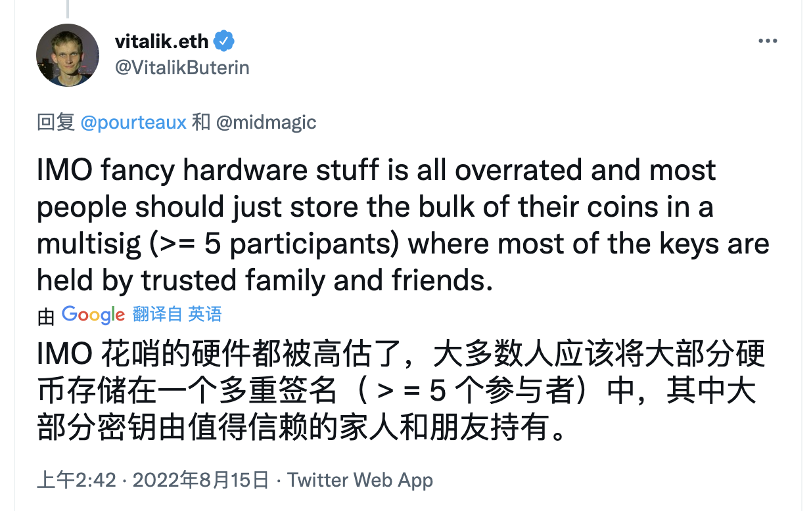
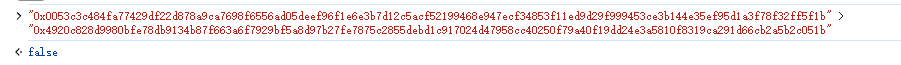

## 项目源码

[https://github.com/luode0320/solidity-demo](https://github.com/luode0320/solidity-demo)

## 多签钱包

V神曾说过，多签钱包要比硬件钱包更加安全（[推文](https://twitter.com/VitalikButerin/status/1558886893995134978?s=20&t=4WyoEWhwHNUtAuABEIlcRw)）。

这一讲，我们将介绍多签钱包，并且写一个极简版多签钱包合约。教学代码（150行代码）由gnosis safe合约（几千行代码）简化而成。



多签钱包是一种电子钱包，特点是交易被多个私钥持有者（多签人）授权后才能执行：

- 例如钱包由`3`个多签人管理，每笔交易需要至少`2`人签名授权。
- 多签钱包可以防止单点故障（私钥丢失，单人作恶），更加去中心化，更加安全，被很多DAO采用。

Gnosis
Safe多签钱包是以太坊最流行的多签钱包，管理近400亿美元资产，合约经过审计和实战测试，支持多链（以太坊，BSC，Polygon等），并提供丰富的DAPP支持。更多信息可以阅读[Gnosis Safe使用教程](https://peopledao.mirror.xyz/nFCBXda8B5ZxQVqSbbDOn2frFDpTxNVtdqVBXGIjj0s)。

## 多签钱包合约

在以太坊上的多签钱包其实是智能合约，属于合约钱包。下面我们写一个极简版多签钱包`MultisigWallet`合约，它的逻辑非常简单：

1. 设置多签人和门槛（链上）：部署多签合约时，我们需要初始化**多签人列表和执行门槛**（至少n个多签人签名授权后，交易才能执行）。Gnosis
   Safe多签钱包支持增加/删除多签人以及改变执行门槛，但在咱们的极简版中不考虑这一功能。
2. 创建交易（链下）：一笔待授权的交易包含以下内容
    - `to`：目标合约。
    - `value`：交易发送的以太坊数量。
    - `data`：calldata，包含调用函数的选择器和参数。
    - `nonce`：初始为`0`，随着多签合约每笔成功执行的交易递增的值，可以防止签名重放攻击。
    - `chainid`：链id，防止不同链的签名重放攻击。
3. 收集多签签名（链下）：将上一步的交易ABI编码并计算哈希，得到**交易哈希**，然后让**多签人签名**，并拼接到一起的到**打包签名

```
交易哈希: 0xc1b055cf8e78338db21407b425114a2e258b0318879327945b661bfdea570e66

多签人A签名: 0x014db45aa753fefeca3f99c2cb38435977ebb954f779c2b6af6f6365ba4188df542031ace9bdc53c655ad2d4794667ec2495196da94204c56b1293d0fbfacbb11c

多签人B签名: 0xbe2e0e6de5574b7f65cad1b7062be95e7d73fe37dd8e888cef5eb12e964ddc597395fa48df1219e7f74f48d86957f545d0fbce4eee1adfbaff6c267046ade0d81c

打包签名：
0x014db45aa753fefeca3f99c2cb38435977ebb954f779c2b6af6f6365ba4188df542031ace9bdc53c655ad2d4794667ec2495196da94204c56b1293d0fbfacbb11cbe2e0e6de5574b7f65cad1b7062be95e7d73fe37dd8e888cef5eb12e964ddc597395fa48df1219e7f74f48d86957f545d0fbce4eee1adfbaff6c267046ade0d81c
```

4. 调用多签合约的执行函数，验证签名并执行交易（链上）。

### 事件

`MultisigWallet`合约有`2`个事件，`ExecutionSuccess`和`ExecutionFailure`，分别在交易成功和失败时释放，参数为交易哈希。

```solidity
    event ExecutionSuccess(bytes32 txHash);    // 交易成功事件
    event ExecutionFailure(bytes32 txHash);    // 交易失败事件
```

### 状态变量

`MultisigWallet`合约有`5`个状态变量：

1. `owners`：多签持有人数组
2. `isOwner`：`address => bool`的映射，记录一个地址是否为多签持有人。
3. `ownerCount`：多签持有人数量
4. `threshold`：多签执行门槛，交易至少有n个多签人签名才能被执行。
5. `nonce`：初始为`0`，随着多签合约每笔成功执行的交易递增的值，可以防止签名重放攻击。

```solidity
    address[] public owners;                   // 多签持有人数组 
    mapping(address => bool) public isOwner;   // 记录一个地址是否为多签持有人
    uint256 public ownerCount;                 // 多签持有人数量
    uint256 public threshold;                  // 多签执行门槛，交易至少有n个多签人签名才能被执行。
    uint256 public nonce;                      // nonce，防止签名重放攻击
```

### 函数

`MultisigWallet`合约有`6`个函数：

1. 构造函数：调用`_setupOwners()`，初始化和**多签持有人和执行门槛**相关的变量。

   ```solidity
   // 构造函数，初始化owners, isOwner, ownerCount, threshold 
   constructor(        
       address[] memory _owners,
       uint256 _threshold
   ) {
       _setupOwners(_owners, _threshold);
   }
   ```

2. `_setupOwners()`：在合约部署时被构造函数调用，初始化`owners`，`isOwner`，`ownerCount`，`threshold`状态变量。

   传入的参数中，执行门槛需大于等于`1`且小于等于多签人数；多签地址不能为`0`地址且不能重复。

```solidity
    /// @dev 初始化owners, isOwner, ownerCount,threshold
    /// @param _owners: 多签持有人数组
    /// @param _threshold: 多签执行门槛，至少有几个多签人签署了交易
    function _setupOwners(
        address[] memory _owners,
        uint256 _threshold
    ) internal {
        // threshold没被初始化过
        require(threshold == 0, "WTF5000");
        // 多签执行门槛 小于 多签人数
        require(_threshold <= _owners.length, "WTF5001");
        // 多签执行门槛至少为1
        require(_threshold >= 1, "WTF5002");

        for (uint256 i = 0; i < _owners.length; i++) {
            address owner = _owners[i];
            // 多签人不能为0地址，不是本合约地址，不能重复
            require(
                owner != address(0) &&
                    owner != address(this) &&
                    !isOwner[owner],
                "WTF5003"
            );
            owners.push(owner);
            isOwner[owner] = true;
        }
        ownerCount = _owners.length;
        threshold = _threshold;
    }
```

3. `execTransaction()`：在收集足够的多签签名后，验证签名并执行交易。传入的参数为目标地址`to`，发送的以太坊数额`value`
   ，数据`data`，以及打包签名`signatures`
   。打包签名就是将收集的多签人对交易哈希的签名，按多签持有人地址从小到大顺序，打包到一个[bytes]
   数据中。这一步调用了`encodeTransactionData()`编码交易，调用了`checkSignatures()`检验签名是否有效、数量是否达到执行门槛。

   ```solidity
       /// @dev 在收集足够的多签签名后，执行交易
       /// @param to 目标合约地址
       /// @param value msg.value，支付的以太坊
       /// @param data calldata
       /// @param signatures 打包的签名，对应的多签地址由小到达，方便检查。 ({bytes32 r}{bytes32 s}{uint8 v}) (第一个多签的签名, 第二个多签的签名 ... )
       function execTransaction(
           address to,
           uint256 value,
           bytes memory data,
           bytes memory signatures
       ) public payable virtual returns (bool success) {
           // 编码交易数据，计算哈希
           bytes32 txHash = encodeTransactionData(
               to,
               value,
               data,
               nonce,
               block.chainid
           );
           console.log("txHash:");
           console.logBytes32(txHash);
   
           nonce++; // 增加nonce
           checkSignatures(txHash, signatures); // 检查签名
   
           // 利用call执行交易，并获取交易结果
           (success, ) = to.call{value: value}(data);
           require(success, "WTF5004");
           if (success) emit ExecutionSuccess(txHash);
           else emit ExecutionFailure(txHash);
       }
   ```

4. `checkSignatures()`
   ：检查签名和交易数据的哈希是否对应，数量是否达到门槛，若否，交易会revert。单个签名长度为65字节，因此打包签名的长度要长于`threshold * 65`
   。调用了`signatureSplit()`分离出单个签名。这个函数的大致思路：

    - 用 ecdsa 获取签名地址.
    - 利用 `currentOwner > lastOwner` 确定签名来自不同多签（多签地址递增）。
    - 利用`isOwner[currentOwner]`确定签名者为多签持有人。

   ```solidity
       /**
        * @dev 检查签名和交易数据是否对应。如果是无效签名，交易会revert
        * @param dataHash 交易数据哈希
        * @param signatures 几个多签签名打包在一起
        */
       function checkSignatures(
           bytes32 dataHash,
           bytes memory signatures
       ) public view {
           // 读取多签执行门槛
           uint256 _threshold = threshold;
           require(_threshold > 0, "WTF5005");
   
           // 检查签名长度足够长
           require(signatures.length >= _threshold * 65, "WTF5006");
   
           // 通过一个循环，检查收集的签名是否有效
           // 大概思路：
           // 1. 用ecdsa先验证签名是否有效
           // 2. 利用 currentOwner > lastOwner 确定签名来自不同多签（多签地址递增）
           // 3. 利用 isOwner[currentOwner] 确定签名者为多签持有人
           address lastOwner = address(0);
           address currentOwner;
           uint8 v;
           bytes32 r;
           bytes32 s;
           uint256 i;
           for (i = 0; i < _threshold; i++) {
               (v, r, s) = signatureSplit(signatures, i);
               // 利用ecrecover检查签名是否有效
               currentOwner = ecrecover(
                   keccak256(
                       abi.encodePacked(
                           "\x19Ethereum Signed Message:\n32",
                           dataHash
                       )
                   ),
                   v,
                   r,
                   s
               );
   
               console.log("currentOwner:");
               console.logAddress(currentOwner);
               console.log("lastOwner:");
               console.logAddress(lastOwner);
               require(
                   currentOwner > lastOwner && isOwner[currentOwner],
                   "WTF5007"
               );
               lastOwner = currentOwner;
           }
       }
   ```

5. `signatureSplit()`：将单个签名从打包的签名分离出来，参数分别为打包签名`signatures`和要读取的签名位置`pos`
   。利用了内联汇编，将签名的`r`，`s`，和`v`三个值分离出来。

   ```solidity
       /// 将单个签名从打包的签名分离出来
       /// @param sig 打包的多签
       /// @param pos 要读取的多签index.
       function signatureSplit(
           bytes memory sig,
           uint256 pos
       ) internal pure returns (uint8 v, bytes32 r, bytes32 s) {
           // 分割出第 index 个签名
           uint256 offset = pos * 65;
           assembly {
               r := mload(add(add(sig, 32), offset))
               s := mload(add(add(sig, 64), offset))
               v := byte(0, mload(add(add(sig, 96), offset)))
           }
       }
   ```

6. `encodeTransactionData()`：将交易数据打包并计算哈希，利用了`abi.encode()`和`keccak256()`
   函数。这个函数可以计算出一个交易的哈希，然后在链下让多签人签名并收集，再调用`execTransaction()`函数执行。

   ```solidity
       /// @dev 编码交易数据
       /// @param to 目标合约地址
       /// @param value msg.value，支付的以太坊
       /// @param data calldata
       /// @param _nonce 交易的nonce.
       /// @param chainid 链id
       /// @return 交易哈希bytes.
       function encodeTransactionData(
           address to,
           uint256 value,
           bytes memory data,
           uint256 _nonce,
           uint256 chainid
       ) public pure returns (bytes32) {
           bytes32 safeTxHash = keccak256(
               abi.encode(to, value, keccak256(data), _nonce, chainid)
           );
           return safeTxHash;
       }
   ```

## 调试

启动本地网络节点:

```sh
yarn hardhat node
```

### 1.部署合约

部署多签合约，`2`个多签地址，交易执行门槛设为`2`。

```solidity
多签地址1: 0xf39Fd6e51aad88F6F4ce6aB8827279cffFb92266
多签地址2: 0x70997970C51812dc3A010C7d01b50e0d17dc79C8
```

````sh
yarn hardhat run scripts/deploy.ts --network localhost
````

```sh
合约名称: MultisigWallet
当前网络: localhost
网络地址: http://127.0.0.1:8545
_________________________启动部署________________________________
部署地址: 0xf39Fd6e51aad88F6F4ce6aB8827279cffFb92266
账户余额 balance(wei): 9995962729056039646806
账户余额 balance(eth): 9995.962729056039646806
_________________________部署合约________________________________
合约地址: 0xAdE429ba898c34722e722415D722A70a297cE3a2
生成调试 html,请用 Live Server 调试: E:\solidity-demo\50.多签钱包\index.html
Done in 3.44s.
```

### 2.转账`1 ETH`到多签合约地址


### 3.编码并计算向多签地址1转账`1 ETH`的交易哈希

调用`encodeTransactionData()`，编码并计算合约向**多签地址1**转账`1 ETH`的交易哈希。

```
参数
to: 0xf39Fd6e51aad88F6F4ce6aB8827279cffFb92266
value: 1000000000000000000
data: 0x
_nonce: 0
chainid: 31337

结果
交易哈希： 0x84fba282c29c44c9a0e6dd2977e1ad65552462d16a7376fc18758fea53d65a2b
```


### 4.获得签名，两个钱包都要签

**这里稍微复杂, 请慢慢看**

#### 1.利用 F12 控制签名，内容输入上面的交易哈希，获得签名，两个钱包都要签。


- 下面的 js 一次性粘贴到 控制台中:

```sh
    // 以太签名消息
    const tx ="0x84fba282c29c44c9a0e6dd2977e1ad65552462d16a7376fc18758fea53d65a2b";

    // 对交易数据进行签名, ethers.utils.arrayify会使用以太 "\x19Ethereum Signed Message:\n32" 再次hash签名
    const signature = await signer.signMessage(ethers.utils.arrayify(tx));

    // 打印签名结果
    console.log(signature);
```


#### 2.切换账户, 重复另一个钱包, 重复执行js:


```js
    // 以太签名消息
    const tx ="0x84fba282c29c44c9a0e6dd2977e1ad65552462d16a7376fc18758fea53d65a2b";

    // 对交易数据进行签名, ethers.utils.arrayify会使用以太 "\x19Ethereum Signed Message:\n32" 再次hash签名
    const signature = await signer.signMessage(ethers.utils.arrayify(tx));

    // 打印签名结果
    console.log(signature);
```

#### 3.得到签名:

```
多签地址1的签名: 0x0053c3c484fa77429df22d878a9ca7698f6556ad05deef96f1e6e3b7d12c5acf52199468e947ecf34853f11ed9d29f999453ce3b144e35ef95d1a3f78f32ff5f1b

多签地址2的签名: 0x4920c828d9980bfe78db9134b87f663a6f7929bf5a8d97b27fe7875c2855debd1c917024d47958cc40250f79a40f19dd24e3a5810f8319ca291d66cb2a5b2c051b
```

#### 4.两个签名拼接到一起，得到打包签名(第二个地址去掉0x前缀再拼接):

- 注意: 因为签名是按照大小排序的, 所以组合是必须从来小到大拼接, 可以用 js , 简单判断。

```js
"0x0053c3c484fa77429df22d878a9ca7698f6556ad05deef96f1e6e3b7d12c5acf52199468e947ecf34853f11ed9d29f999453ce3b144e35ef95d1a3f78f32ff5f1b" > "0x4920c828d9980bfe78db9134b87f663a6f7929bf5a8d97b27fe7875c2855debd1c917024d47958cc40250f79a40f19dd24e3a5810f8319ca291d66cb2a5b2c051b"
```



- 所以我们的拼接方式是: **地址2的签名+地址1的签名**(去掉0x前缀)

```
0x4920c828d9980bfe78db9134b87f663a6f7929bf5a8d97b27fe7875c2855debd1c917024d47958cc40250f79a40f19dd24e3a5810f8319ca291d66cb2a5b2c051b0053c3c484fa77429df22d878a9ca7698f6556ad05deef96f1e6e3b7d12c5acf52199468e947ecf34853f11ed9d29f999453ce3b144e35ef95d1a3f78f32ff5f1b
```

### 5.调用`execTransaction()`函数执行交易

调用`execTransaction()`函数执行交易，将第3步中的交易参数和**打包签名**作为参数传入。可以看到交易执行成功，`ETH`被转出多签。


## 总结

这一讲，我们介绍了多签钱包，并写了一个极简版的多签钱包合约，仅有不到150行代码。

