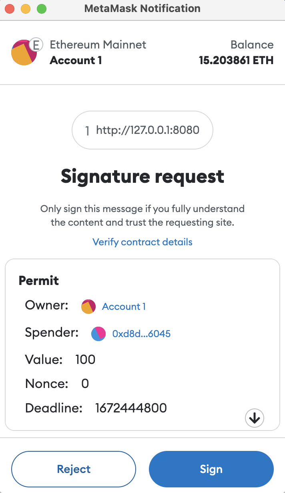
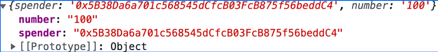
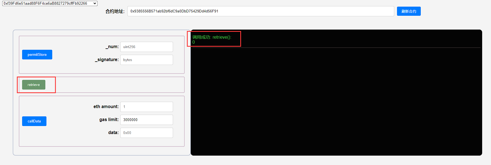
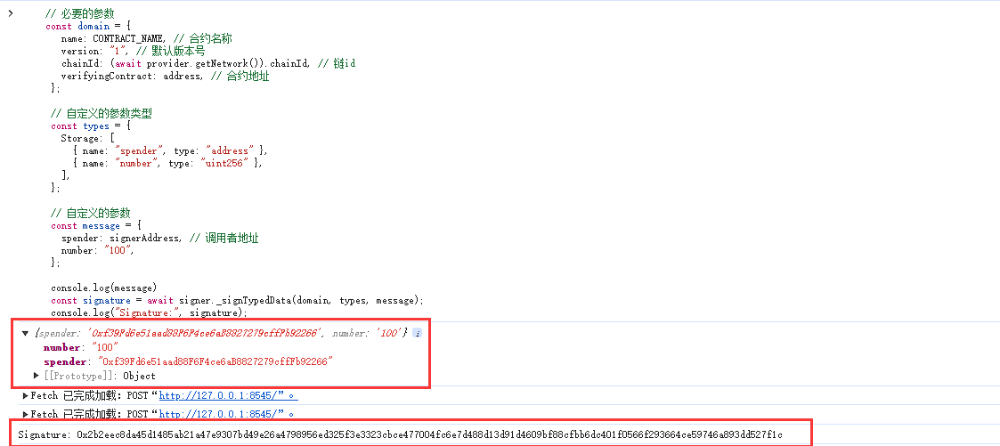
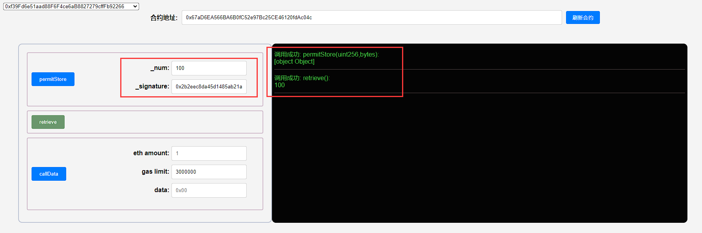

## 项目源码

[https://github.com/luode0320/solidity-demo](https://github.com/luode0320/solidity-demo)

## EIP712

这一讲，我们介绍一种更先进、安全的签名方法，EIP712 类型化数据签名。

之前我们介绍了EIP191 签名标准（**solidity-应用:7、数字签名Signature**） ，它可以给一段消息签名。

但是它过于简单，当签名数据比较复杂时，用户只能看到一串十六进制字符串（数据的哈希），无法核实签名内容是否与预期相符。


[EIP712类型化数据签名](https://eips.ethereum.org/EIPS/eip-712)是一种更高级、更安全的签名方法。当支持 EIP712 的 Dapp
请求签名时，钱包会展示签名消息的原始数据，用户可以在验证数据符合预期之后签名。



## EIP712 使用方法

EIP712 的应用一般包含链下签名（前端或脚本）和链上验证（合约）两部分，下面我们用一个简单的例子 `EIP712Storage` 来介绍 EIP712
的使用方法。

`EIP712Storage` 合约有一个状态变量 `number`，需要验证 EIP712 签名才可以更改。

### 链下签名

1. EIP712 签名必须包含一个 `EIP712Domain` 部分，它包含了合约的 name，version（一般约定为 “1”），chainId，和
   verifyingContract（验证签名的合约地址）。

   ```js
   EIP712Domain: [
       { name: "name", type: "string" },
       { name: "version", type: "string" },
       { name: "chainId", type: "uint256" },
       { name: "verifyingContract", type: "address" },
   ]
   ```

   这些信息会在用户签名时显示，并确保只有特定链的特定合约才能验证签名。你需要在脚本中传入相应参数。

   ```js
   const domain = {
       name: "EIP712Storage",
       version: "1",
       chainId: "1",
       verifyingContract: "0xf8e81D47203A594245E36C48e151709F0C19fBe8",
   };
   ```


2. 你需要根据使用场景自定义一个签名的数据类型，他要与合约匹配。在 `EIP712Storage` 例子中，我们定义了一个 `Storage`
   类型。它有两个成员:

    - `address` 类型的 `spender`，指定了可以修改变量的调用者；

    - `uint256` 类型的 `number`，指定了变量修改后的值。

   ```js
   const types = {
       Storage: [
           { name: "spender", type: "address" },
           { name: "number", type: "uint256" },
       ],
   };
   ```


3. 创建一个 `message` 变量，传入要被签名的类型化数据。

   ```js
   const message = {
       spender: "0x5B38Da6a701c568545dCfcB03FcB875f56beddC4",
       number: "100",
   };
   ```

   


4. 调用钱包对象的 `signTypedData()` 方法，传入前面步骤中的 `domain`，`types`，和 `message` 变量进行签名。

   ```js
   // 获得signer后调用signTypedData方法进行eip712签名
   const signature = await signer._signTypedData(domain, types, message);
   console.log("Signature:", signature);
   ```


### 链上验证

```solidity
// SPDX-License-Identifier: MIT
// By 0xAA 
pragma solidity ^0.8.0;

import "@openzeppelin/contracts/utils/cryptography/ECDSA.sol";

contract EIP712Storage {
```

接下来就是 `EIP712Storage` 合约部分，它需要验证签名，如果通过，则修改 `number` 状态变量。它有 `5` 个状态变量。

1. `EIP712DOMAIN_TYPEHASH`: `EIP712Domain` 的类型哈希，为常量。
2. `STORAGE_TYPEHASH`: `Storage` 的类型哈希，为常量。
3. `DOMAIN_SEPARATOR`: 这是混合在签名中的每个域 (Dapp) 的唯一值，由 `EIP712DOMAIN_TYPEHASH` 以及 `EIP712Domain` （name,
   version, chainId, verifyingContract）组成，在 `constructor()` 中初始化。
4. `number`: 合约中存储值的状态变量，可以被 `permitStore()` 方法修改。
5. `owner`: 合约所有者，在 `constructor()` 中初始化，在 `permitStore()` 方法中验证签名的有效性。

```solidity
    bytes32 private constant EIP712DOMAIN_TYPEHASH = keccak256("EIP712Domain(string name,string version,uint256 chainId,address verifyingContract)");
bytes32 private constant STORAGE_TYPEHASH = keccak256("Storage(address spender,uint256 number)");
bytes32 private DOMAIN_SEPARATOR;
uint256 number;
address owner;
```

另外，`EIP712Storage` 合约有 `3` 个函数。

1. 构造函数: 初始化 `DOMAIN_SEPARATOR` 和 `owner`。

   ```solidity
       constructor(){
           DOMAIN_SEPARATOR = keccak256(abi.encode(
               EIP712DOMAIN_TYPEHASH, // type hash
               keccak256(bytes("EIP712Storage")), // domain.name
               keccak256(bytes("1")), // domain.version
               block.chainid, // domain.chainId
               address(this) // domain.verifyingContract
           ));
           owner = msg.sender;
       }
   ```


2. `retrieve()`: 读取 `number` 的值。

   ```solidity
       /**
        * @dev Return value 
        * @return value of 'number'
        */
       function retrieve() public view returns (uint256){
           return number;
       } 
   ```


3. `permitStore`: 验证 EIP712 签名，并修改 `number` 的值。

   首先，它先将签名拆解为 `r`, `s`, `v`。然后用 `DOMAIN_SEPARATOR`, `STORAGE_TYPEHASH`, 调用者地址，和输入的 `_num`
   参数拼出签名的消息文本 `digest`。

   最后利用 `ECDSA` 的 `recover()` 方法恢复出签名者地址，如果签名有效，则更新 `number` 的值。

   ```solidity
      /**
        * @dev Store value in variable
        */
       function permitStore(uint256 _num, bytes memory _signature) public {
           // 检查签名长度，65是标准r,s,v签名的长度
           require(_signature.length == 65, "invalid signature length");
           bytes32 r;
           bytes32 s;
           uint8 v;
           // 目前只能用assembly (内联汇编)来从签名中获得r,s,v的值
           assembly {
               // 读取长度数据后的32 bytes
               r := mload(add(_signature, 0x20))
               // 读取之后的32 bytes
               s := mload(add(_signature, 0x40))
               // 读取最后一个byte
               v := byte(0, mload(add(_signature, 0x60)))
           }
   
           // 获取签名消息hash
           bytes32 digest = keccak256(abi.encodePacked(
               "\x19\x01",
               DOMAIN_SEPARATOR,
               keccak256(abi.encode(STORAGE_TYPEHASH, msg.sender, _num))
           )); 
           
           address signer = digest.recover(v, r, s); // 恢复签名者
           require(signer == owner, "EIP712Storage: Invalid signature"); // 检查签名
   
           // 修改状态变量
           number = _num;
       }
   ```

## 调试

启动本地网络节点:

```sh
yarn hardhat node
```

### 1.部署合约

````sh
yarn hardhat run scripts/deploy.ts --network localhost
````

```sh
合约名称: EIP712Storage
当前网络: localhost
网络地址: http://127.0.0.1:8545
_________________________启动部署________________________________
部署地址: 0xf39Fd6e51aad88F6F4ce6aB8827279cffFb92266
账户余额 balance(wei): 9995958186490003306278
账户余额 balance(eth): 9995.958186490003306278
_________________________部署合约________________________________
合约地址: 0x9385556B571ab92bf6dC9a0DbD75429Dd4d56F91
生成调试 html,请用 Live Server 调试: E:\solidity-demo\52.EIP712类型化数据签名\index.html
Done in 3.19s.
```



### 2.签名要使用部署合约的钱包

- 利用 F12 执行下面的 js, 获取签名:

```js
     // 必要的参数
const domain = {
    name: CONTRACT_NAME, // 合约名称
    version: "1", // 默认版本号
    chainId: (await provider.getNetwork()).chainId, // 链id
    verifyingContract: address, // 合约地址
};

// 自定义的参数类型: 类型的顺序是严格的, 与合约的验证顺序是一致的 (STORAGE_TYPEHASH, msg.sender, _num)
const types = {
    Storage: [
        {name: "spender", type: "address"},
        {name: "number", type: "uint256"},
    ],
};

// 自定义的参数
const message = {
    spender: signerAddress, // 调用者地址
    number: "100",
};

console.log(message)
const signature = await signer._signTypedData(domain, types, message);
console.log("Signature:", signature);
```



- 得到签名

  ```
  0x2b2eec8da45d1485ab21a47e9307bd49e26a4798956ed325f3e3323cbce477004fc6e7d488d13d91d4609bf88cfbb6dc401f0566f293664ce59746a893dd527f1c
  ```

### 3.修改 `number` 的值

调用合约的 `permitStore()` 方法，输入相应的 `_num` 和签名，修改 `number` 的值。

调用合约的 `retrieve()` 方法，看到 `number` 的值已经改变



## 总结

这一讲，我们介绍了 EIP712 类型化数据签名，一种更先进、安全的签名标准。

在请求签名时，钱包会展示签名消息的原始数据，用户可以在验证数据后签名。

该标准应用广泛，在 Metamask，Uniswap 代币对，DAI 稳定币等场景均有使用，希望大家好好掌握。