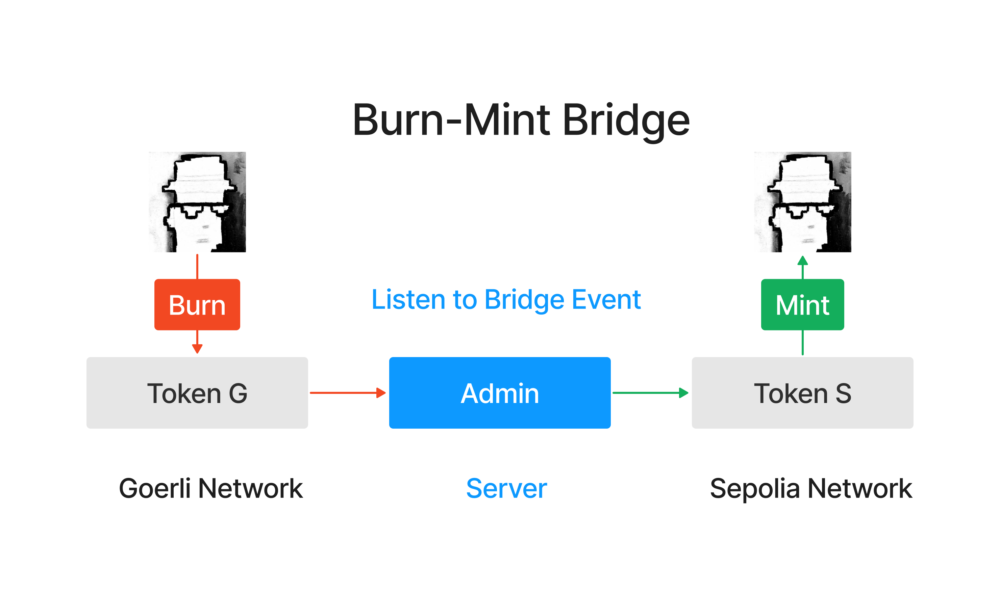
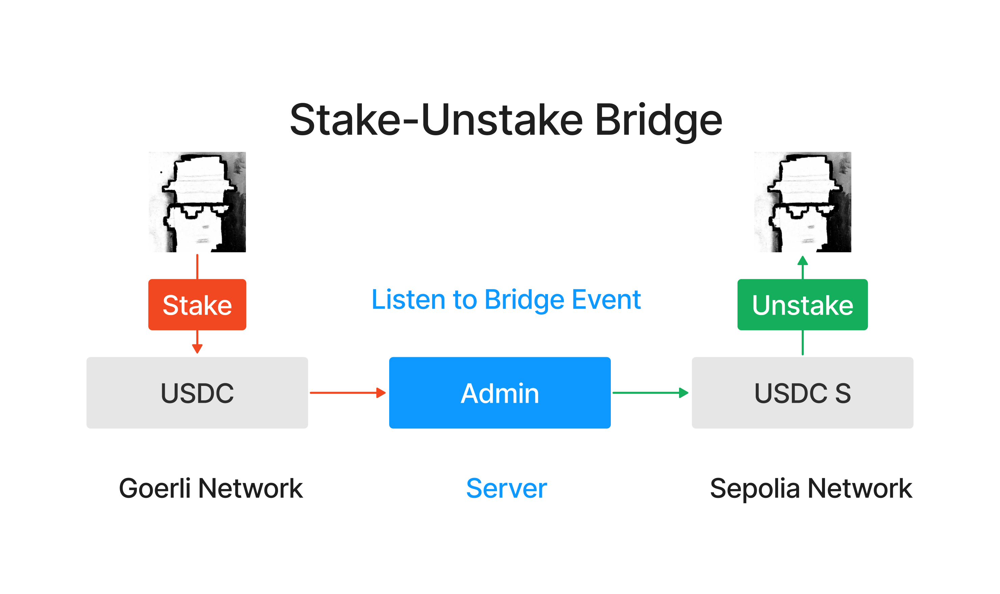
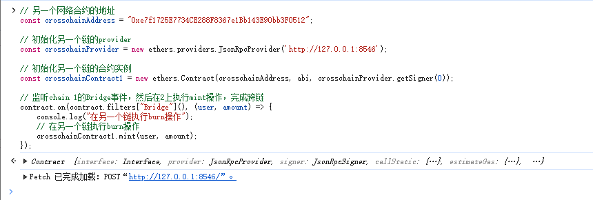
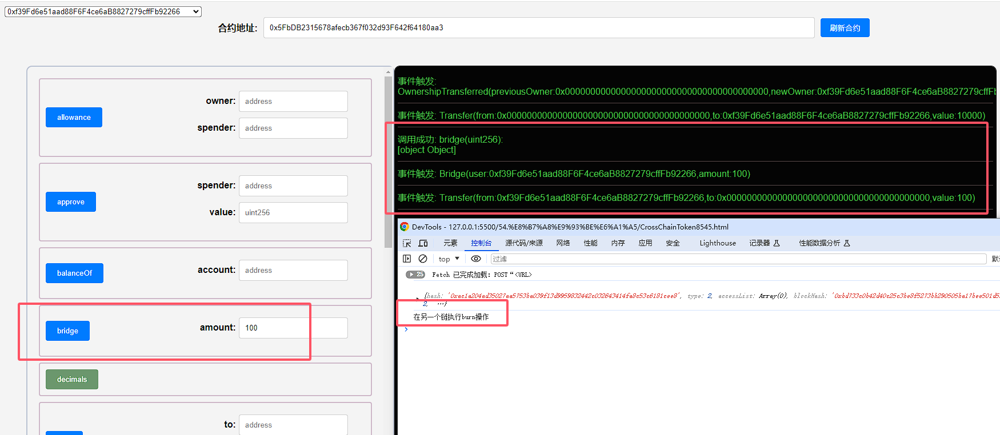
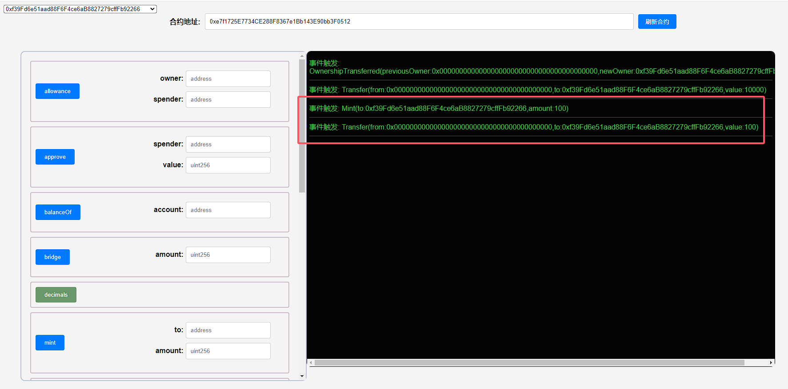
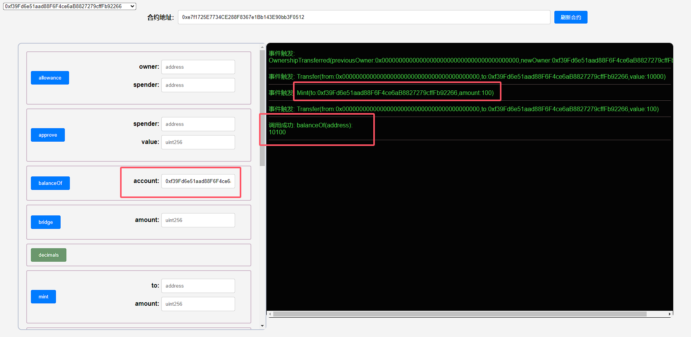

## 项目源码

[https://github.com/luode0320/solidity-demo](https://github.com/luode0320/solidity-demo)

## 什么是跨链桥

这一讲，我们介绍跨链桥，能将资产从一条区块链转移到另一条区块链的基础设施，并实现一个简单的跨链桥。

跨链桥是一种区块链协议，它允许在两个或多个区块链之间移动数字资产和信息。

例如，一个在以太坊主网上运行的ERC20代币，可以通过跨链桥转移到其他兼容以太坊的侧链或独立链。

同时，跨链桥不是区块链原生支持的，跨链操作需要可信第三方来执行，这也带来了风险。近两年，针对跨链桥的攻击已造成超过**20亿美元
**的用户资产损失。

## 跨链桥的种类

跨链桥主要有以下三种类型：

- **Burn/Mint**：在源链上销毁（burn）代币，然后在目标链上创建（mint）同等数量的代币。此方法好处是代币的总供应量保持不变，但是需要跨链桥拥有代币的铸造权限，
  **适合项目方搭建自己的跨链桥**。



- **Stake/Mint**：在源链上锁定（stake）代币，然后在目标链上创建（mint）同等数量的代币（凭证）。源链上的代币被锁定，当代币从目标链移回源链时再解锁。这是
  **一般跨链桥使用的方案**，不需要任何权限，但是风险也较大，当源链的资产被黑客攻击时，目标链上的凭证将变为空气。


- **Stake/Unstake**：在源链上锁定（stake）代币，然后在目标链上释放（unstake）同等数量的代币，在目标链上的代币可以随时兑换回源链的代币。这个方法需要跨链桥在两条链都有锁定的代币，门槛较高，
  **一般需要激励用户在跨链桥锁仓**。



## 3. 搭建一个简单的跨链桥

为了更好理解这个跨链桥，我们将搭建一个简单的跨链桥，并实现Goerli测试网和Sepolia测试网之间的ERC20代币转移。

我们使用的是burn/mint方式，源链上的代币将被销毁，并在目标链上创建。这个跨链桥由一个智能合约（部署在两条链上）和一个Ethers.js脚本组成。

> **请注意**，这是一个非常简单的跨链桥实现，仅用于教学目的。它没有处理一些可能出现的问题，如交易失败、链的重组等。在生产环境中，建议使用专业的跨链桥解决方案或其他经过充分测试和审计的框架。

### 3.1 跨链代币合约

首先，我们需要在 2个 测试网上部署一个ERC20代币合约，`CrossChainToken`。

这个合约中定义了代币的名字、符号和总供应量，还有一个用于跨链转移的`bridge()`函数。

```solidity
// SPDX-License-Identifier: MIT
pragma solidity ^0.8.20;

import "@openzeppelin/contracts/token/ERC20/ERC20.sol";
import "@openzeppelin/contracts/access/Ownable.sol";

contract CrossChainToken is ERC20, Ownable {
```

这个合约有三个主要的函数：

- `constructor()`: 构造函数，在部署合约时会被调用一次，用于初始化代币的名字、符号和总供应量。

  ```solidity
      /**
       * @param name Token Name
       * @param symbol Token Symbol
       * @param totalSupply Token Supply
       */
      constructor(
          string memory name,
          string memory symbol,
          uint256 totalSupply
      ) payable ERC20(name, symbol) Ownable(msg.sender) {
          _mint(msg.sender, totalSupply);
      }
  ```


- `bridge()`: 用户调用此函数进行跨链转移，它会销毁用户指定数量的代币，并释放`Bridge`事件。

  ```solidity
      /**
       * Bridge function
       * @param amount: burn amount of token on the current chain and mint on the other chain
       */
      function bridge(uint256 amount) public {
          _burn(msg.sender, amount);
          emit Bridge(msg.sender, amount);
      }
  ```


- `mint()`: 只有合约的所有者才能调用此函数，用于处理跨链事件，并释放`Mint`事件。当用户在另一条链调用`bridge()`
  函数销毁代币，脚本会监听`Bridge`事件，并给用户在目标链铸造代币。

  ```solidity
      /**
       * Mint function
       */
      function mint(address to, uint amount) external onlyOwner {
          _mint(to, amount);
          emit  Mint(to, amount);
      }
  ```

### 3.2 跨链脚本

有了代币合约之后，我们需要一个服务器来处理跨链事件。我们可以编写一个ethers.js脚本监听`Bridge`事件，当事件被触发时，在目标链上创建同样数量的代币。

但是: 监听合约事件通常是在同一个合约实例上进行的，这意味着你需要在同一实例上监听事件，并且事件是由同一个实例触发的

所以接下来, 我们将利用浏览器的 F12控制台来完成。

## 调试

启动本地2个网络节点:

```sh
yarn hardhat node --port 8545
yarn hardhat node --port 8546
```

### 1.部署同一个合约在2个网络

合约会自动给我们铸造 10000 枚代币。

````sh
# 注意需要调整 hardhat.config.ts localhost 的端口后执行
yarn hardhat run scripts/deploy8545.ts --network localhost
# 注意需要调整 hardhat.config.ts localhost 的端口后执行
yarn hardhat run scripts/deploy8546.ts --network localhost
````

```sh
合约名称: CrossChainToken
当前网络: localhost
网络地址: http://127.0.0.1:8545
_________________________启动部署________________________________
部署地址: 0xf39Fd6e51aad88F6F4ce6aB8827279cffFb92266
账户余额 balance(wei): 10000000000000000000000
账户余额 balance(eth): 10000.0
_________________________部署合约________________________________
合约地址: 0x5FbDB2315678afecb367f032d93F642f64180aa3
生成调试 html,请用 Live Server 调试: E:\solidity-demo\54.跨链桥\CrossChainToken8545.html
Done in 2.20s.
```

```sh
合约名称: CrossChainToken
当前网络: localhost
网络地址: http://127.0.0.1:8546
_________________________启动部署________________________________
部署地址: 0xf39Fd6e51aad88F6F4ce6aB8827279cffFb92266
账户余额 balance(wei): 9999998594998363281250
账户余额 balance(eth): 9999.99859499836328125
_________________________部署合约________________________________
合约地址: 0xe7f1725E7734CE288F8367e1Bb143E90bb3F0512
生成调试 html,请用 Live Server 调试: E:\solidity-demo\54.跨链桥\CrossChainToken8546.html
Done in 2.27s.
```

### 2.注入监听

在合约 1的F12中, 注入js:

```js
// 另一个网络合约的地址
const crosschainAddress = "0xe7f1725E7734CE288F8367e1Bb143E90bb3F0512";

// 初始化另一个链的provider
const crosschainProvider = new ethers.providers.JsonRpcProvider('http://127.0.0.1:8546');

// 初始化另一个链的合约实例
const crosschainContract1 = new ethers.Contract(crosschainAddress, abi, crosschainProvider.getSigner(0));

// 监听chain 1的Bridge事件，然后在2上执行mint操作，完成跨链
contract.on(contract.filters["Bridge"](), (user, amount) => {
    console.log("在另一个链执行burn操作");
    // 在另一个链执行burn操作
    crosschainContract1.mint(user, amount);
});
```

在合约 2的F12中, 注入js:

```js
// 另一个网络合约的地址
const crosschainAddress = "0x5FbDB2315678afecb367f032d93F642f64180aa3";

// 初始化另一个链的provider
const crosschainProvider = new ethers.providers.JsonRpcProvider('http://127.0.0.1:8545');

// 初始化另一个链的合约实例
const crosschainContract1 = new ethers.Contract(crosschainAddress, abi, crosschainProvider.getSigner(0));

// 监听chain 1的Bridge事件，然后在2上执行mint操作，完成跨链
contract.on(contract.filters["Bridge"](), (user, amount) => {
    console.log("在另一个链执行burn操作");
    // 在另一个链执行burn操作
    crosschainContract1.mint(user, amount);
});
```



### 3.调用网络 8545 链上代币合约的`bridge()`函数，跨链100枚代币

打开 F12 注意日志:



同时, 另一条链上, 会触发铸币的事件



### 发现代币余额变为10100枚，跨链成功

链上调用`balance()`查询余额，发现代币余额变为10100枚，跨链成功！



## 总结

这一讲我们介绍了跨链桥，它允许在两个或多个区块链之间移动数字资产和信息，方便用户在多链操作资产。

同时，它也有很大的风险，近两年针对跨链桥的攻击已造成超过**20亿美元**的用户资产损失。

在本教程中，我们搭建一个简单的跨链桥，并实现2网之间的ERC20代币转移。相信通过本教程，你对跨链桥会有更深的理解。

