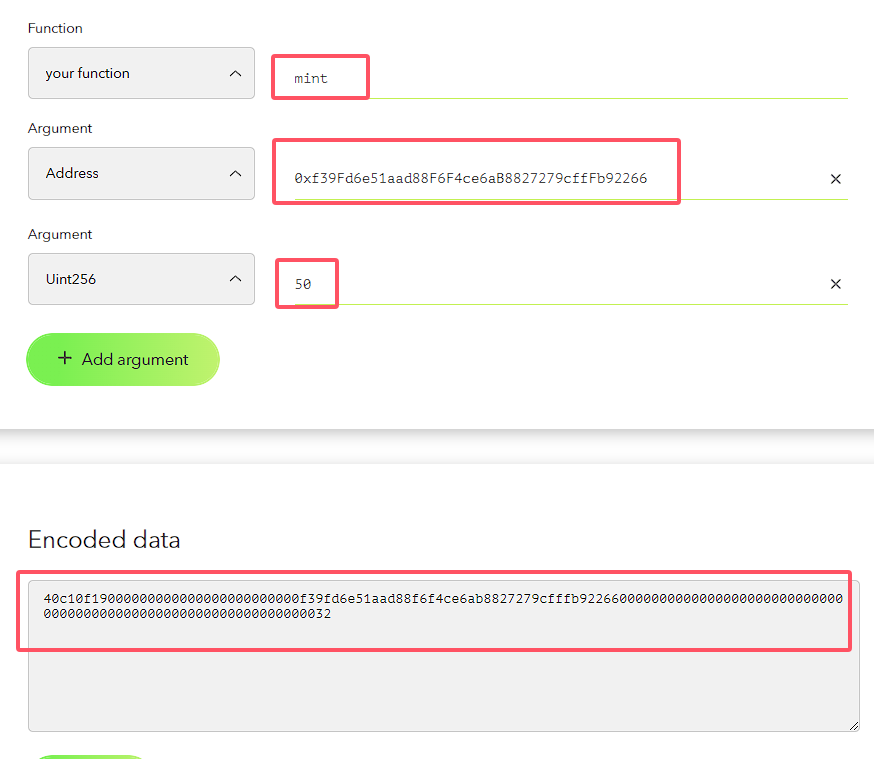
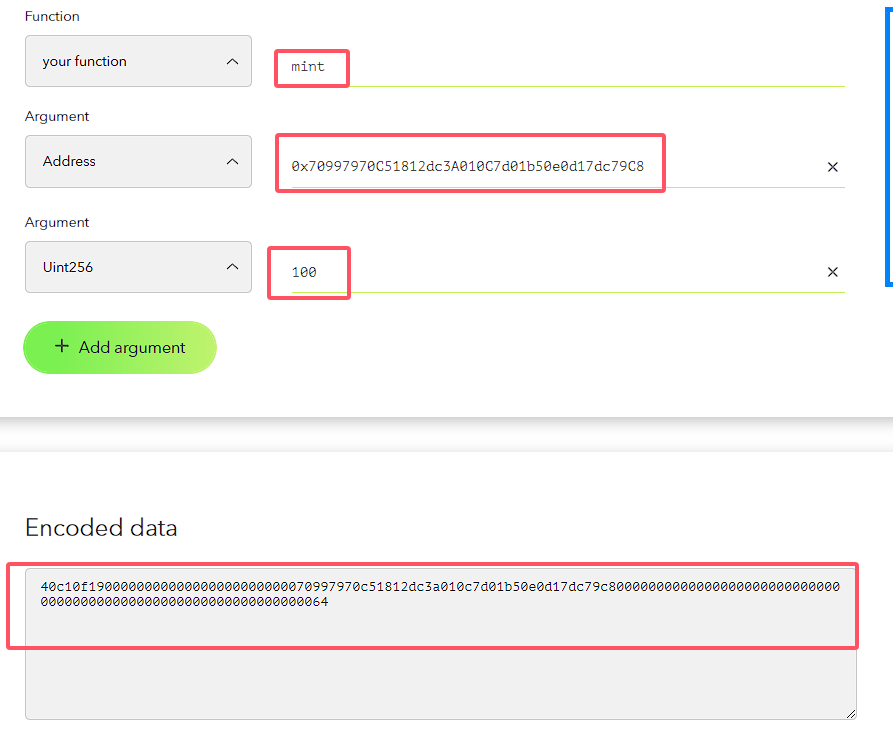
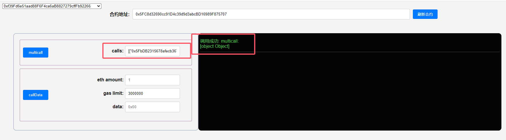
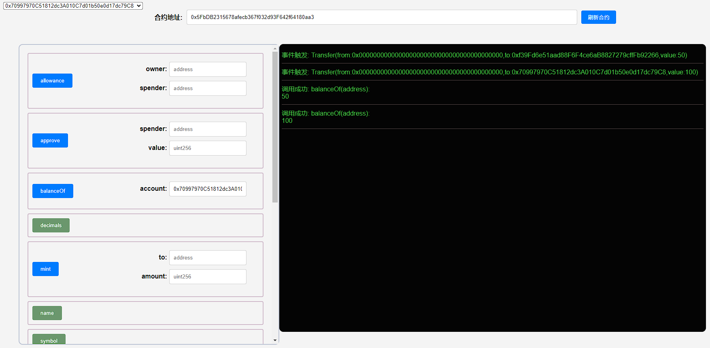

## 项目源码

[https://github.com/luode0320/solidity-demo](https://github.com/luode0320/solidity-demo)

## MultiCall

这一讲，我们将介绍 MultiCall 多重调用合约，它的设计目的在于一次交易中执行多个函数调用，这样可以显著降低交易费用并提高效率。

在Solidity中，MultiCall（多重调用）合约的设计能让我们在一次交易中执行多个函数调用。它的优点如下：

1. 方便性：MultiCall 能让你在一次交易中对不同合约的不同函数进行调用，同时这些调用还可以使用不同的参数。比如你可以一次性查询多个地址的ERC20代币余额。
2. 节省gas：MultiCall 能将多个交易合并成一次交易中的多个调用，从而节省gas。
3. 原子性：MultiCall 能让用户在一笔交易中执行所有操作，保证所有操作要么全部成功，要么全部失败，这样就保持了原子性。比如，你可以按照特定的顺序进行一系列的代币交易。

## MultiCall 合约

接下来让我们一起来研究一下MultiCall合约，它由 MakerDAO
的 [MultiCall](https://github.com/mds1/multicall/blob/main/src/Multicall3.sol) 简化而成。

MultiCall 合约定义了两个结构体:

- `Call`: 这是一个调用结构体，包含要调用的目标合约 `target`，指示是否允许调用失败的标记 `allowFailure`
  ，和要调用的字节码 `call data`。

  ```solidity
      // Call结构体，包含目标合约target，是否允许调用失败allowFailure，和call data
      struct Call {
          address target;
          bool allowFailure;
          bytes callData;
      }
  ```


- `Result`: 这是一个结果结构体，包含了指示调用是否成功的标记 `success`和调用返回的字节码 `return data`。

  ```solidity
      // Result结构体，包含调用是否成功和return data
      struct Result {
          bool success;
          bytes returnData;
      }
  ```

该合约只包含了一个函数，用于执行多重调用：

- `multicall()`: 这个函数的参数是一个由Call结构体组成的数组，这样做可以确保传入的target和data的长度一致。函数通过一个循环来执行多个调用，并在调用失败时回滚交易。

  ```solidity
      /// @notice 将多个调用（支持不同合约/不同方法/不同参数）合并到一次调用
      /// @param calls Call结构体组成的数组
      /// @return returnData Result结构体组成的数组
      function multicall(Call[] calldata calls) public returns (Result[] memory returnData) {
          uint256 length = calls.length;
          returnData = new Result[](length);
          Call calldata calli;
          
          // 在循环中依次调用
          for (uint256 i = 0; i < length; i++) {
              Result memory result = returnData[i];
              calli = calls[i];
              (result.success, result.returnData) = calli.target.call(calli.callData);
              // 如果 calli.allowFailure 和 result.success 均为 false，则 revert
              if (!(calli.allowFailure || result.success)){
                  revert("Multicall: call failed");
              }
          }
      }
  ```

## 调试

启动本地网络节点:

```sh
yarn hardhat node
```

### 1.部署合约

- 部署一个ERC20合约, 用于交易

````sh
yarn hardhat run scripts/MCERC20.ts --network localhost
````

```sh
合约名称: MCERC20
当前网络: localhost
网络地址: http://127.0.0.1:8545
_________________________启动部署________________________________
部署地址: 0xf39Fd6e51aad88F6F4ce6aB8827279cffFb92266
账户余额 balance(wei): 10000000000000000000000
账户余额 balance(eth): 10000.0
_________________________部署合约________________________________
合约地址: 0x5FbDB2315678afecb367f032d93F642f64180aa3
生成调试 html,请用 Live Server 调试: E:\solidity-demo\55.多重调用\MCERC20.html
Done in 12.31s.
```

- 部署多重调用合约

```sh
yarn hardhat run scripts/Multicall.ts --network localhost
```

```sh
合约名称: Multicall
当前网络: localhost
网络地址: http://127.0.0.1:8545
_________________________启动部署________________________________
部署地址: 0xf39Fd6e51aad88F6F4ce6aB8827279cffFb92266
账户余额 balance(wei): 9999997393397636844944
账户余额 balance(eth): 9999.997393397636844944
_________________________部署合约________________________________
合约地址: 0x5FC8d32690cc91D4c39d9d3abcBD16989F875707
生成调试 html,请用 Live Server 调试: E:\solidity-demo\55.多重调用\Multicall.html
Done in 2.19s.
```

### 2.获取要调用的`calldata`

我们的目的时, 用多重调用合约, 一次性为2个地址铸造代币。

我们会给2个地址分别铸造 50 和 100 单位的代币, 在这之前我们需要调用`mint()` , 现在我们只需要数据,
利用 [abi](https://abi.hashex.org/) 构造calldata:





**获得callData(未加 0x 前缀, 使用时需加上 0x 前缀):**

```
40c10f19000000000000000000000000f39fd6e51aad88f6f4ce6ab8827279cfffb922660000000000000000000000000000000000000000000000000000000000000032

40c10f1900000000000000000000000070997970c51812dc3a010c7d01b50e0d17dc79c80000000000000000000000000000000000000000000000000000000000000064
```

### 3.给2个地址分别铸造 50 和 100 单位的代币

利用 `MultiCall` 的 `multicall()` 函数调用ERC20代币合约的 `mint()` 函数，给2个地址分别铸造 50 和 100 单位的代币。

```sh
[["0x5FbDB2315678afecb367f032d93F642f64180aa3", true, "0x40c10f19000000000000000000000000f39fd6e51aad88f6f4ce6ab8827279cfffb922660000000000000000000000000000000000000000000000000000000000000032"], ["0x5FbDB2315678afecb367f032d93F642f64180aa3", false, "0x40c10f1900000000000000000000000070997970c51812dc3a010c7d01b50e0d17dc79c80000000000000000000000000000000000000000000000000000000000000064"]]
```





## 总结

这一讲，我们介绍了 MultiCall 多重调用合约，允许你在一次交易中执行多个函数调用。

要注意的是，不同的 MultiCall 合约在参数和执行逻辑上有 一些不同，使用时要仔细阅读源码。