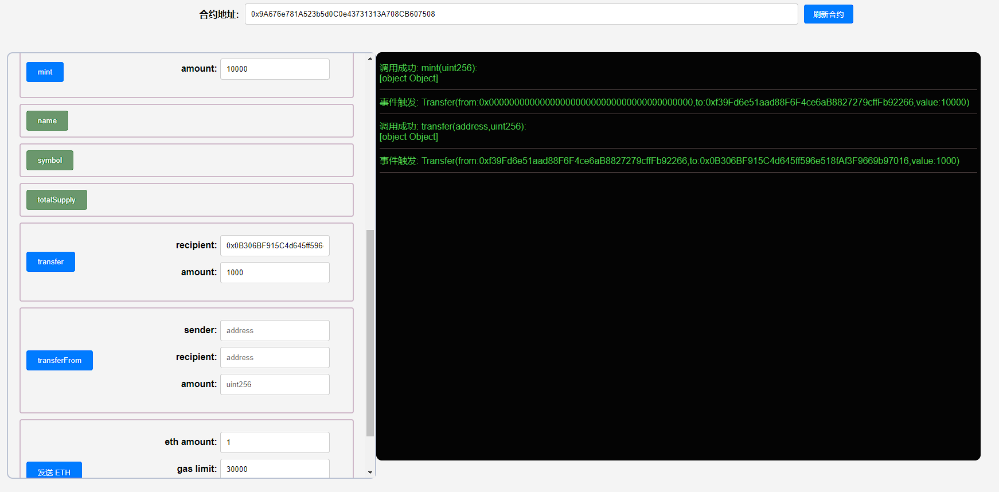
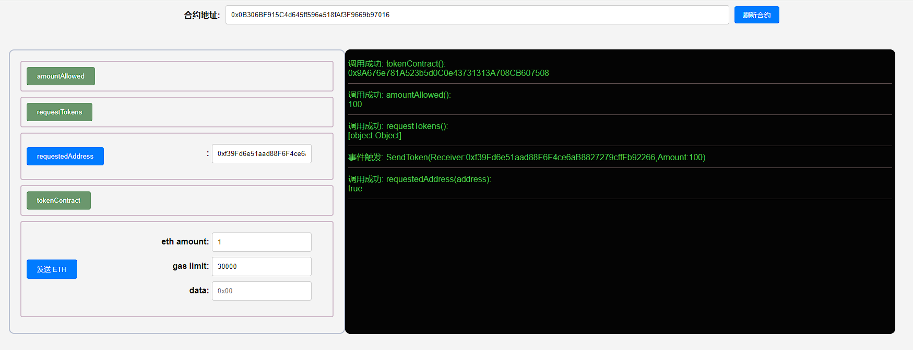

## 项目源码

[https://github.com/luode0320/solidity-demo](https://github.com/luode0320/solidity-demo)

## 代币水龙头

当人渴的时候，就要去水龙头接水；当人想要免费代币的时候，就要去代币水龙头领。代币水龙头就是让用户免费领代币的网站/应用。

最早的代币水龙头是比特币（BTC）水龙头：现在BTC一枚要$30,000，但是在2010年，BTC的价格只有不到$0.1，并且持有人很少。

为了扩大影响力，比特币社区的Gavin Andresen开发了BTC水龙头，让别人可以免费领BTC。

撸羊毛大家都喜欢，当时就有很多人去撸，一部分变为了BTC的信徒。BTC水龙头一共送出了超过19,700枚BTC，现在价值约6亿美元！

## ERC20水龙头合约

这里，我们实现一个简版的`ERC20`水龙头，逻辑非常简单：

我们将一些`ERC20`代币转到水龙头合约里，用户可以通过合约的`requestToken()`函数来领取`100`单位的代币，每个地址只能领一次。

### 状态变量

我们在水龙头合约中定义3个状态变量

- `amountAllowed`设定每次能领取代币数量（默认为`100`，不是一百枚，因为代币有小数位数）。
- `tokenContract`记录发放的`ERC20`代币合约地址。
- `requestedAddress`记录领取过代币的地址。

```solidity
uint256 public amountAllowed = 100; // 每次领 100 单位代币
address public tokenContract;   // token合约地址
mapping(address => bool) public requestedAddress;   // 记录领取过代币的地址
```

### 事件

水龙头合约中定义了1个`SendToken`事件，记录了每次领取代币的地址和数量，在`requestTokens()`函数被调用时释放。

```solidity
// SendToken事件    
event SendToken(address indexed Receiver, uint256 indexed Amount); 
```

### 函数

合约中只有两个函数：

- 构造函数：初始化`tokenContract`状态变量，确定发放的`ERC20`代币地址。

```solidity
// 部署时设定ERC20代币合约
constructor(address _tokenContract) {
  tokenContract = _tokenContract; // set token contract
}
```

- `requestTokens()`函数，用户调用它可以领取`ERC20`代币。

```solidity
// 用户领取代币函数
function requestTokens() external {
    require(!requestedAddress[msg.sender], "Can't Request Multiple Times!"); // 每个地址只能领一次
    IERC20 token = IERC20(tokenContract); // 创建IERC20合约对象
    require(token.balanceOf(address(this)) >= amountAllowed, "Faucet Empty!"); // 水龙头空了

    token.transfer(msg.sender, amountAllowed); // 发送token
    requestedAddress[msg.sender] = true; // 记录领取地址 
    
    emit SendToken(msg.sender, amountAllowed); // 释放SendToken事件
}
```

## 完整代码

```solidity
// SPDX-License-Identifier: MIT
// By 0xAA
pragma solidity ^0.8.21;

import "./IERC20.sol"; //import IERC20

// ERC20代币的水龙头合约
contract Faucet {
    uint256 public amountAllowed = 100; // 每次领 100单位代币
    address public tokenContract; // token合约地址
    mapping(address => bool) public requestedAddress; // 记录领取过代币的地址

    // SendToken事件
    event SendToken(address indexed Receiver, uint256 indexed Amount);

    // 部署时设定ERC20代币合约
    constructor(address _tokenContract) {
        tokenContract = _tokenContract; // set token contract
    }

    // 用户领取代币函数
    function requestTokens() external {
        require(!requestedAddress[msg.sender], "Can't Request Multiple Times!"); // 每个地址只能领一次
        IERC20 token = IERC20(tokenContract); // 创建IERC20合约对象
        require(
            token.balanceOf(address(this)) >= amountAllowed,
            "Faucet Empty!"
        ); // 水龙头空了

        token.transfer(msg.sender, amountAllowed); // 发送token
        requestedAddress[msg.sender] = true; // 记录领取地址

        emit SendToken(msg.sender, amountAllowed); // 释放SendToken事件
    }
}

```

```solidity
// SPDX-License-Identifier: MIT
// WTF Solidity by 0xAA

pragma solidity ^0.8.21;

import "./IERC20.sol";

contract ERC20 is IERC20 {
    mapping(address => uint256) public override balanceOf;

    mapping(address => mapping(address => uint256)) public override allowance;

    uint256 public override totalSupply; // 代币总供给

    string public name; // 名称
    string public symbol; // 符号

    uint8 public decimals = 18; // 小数位数

    // @dev 在合约部署的时候实现合约名称和符号
    constructor(string memory name_, string memory symbol_) {
        name = name_;
        symbol = symbol_;
    }

    // @dev 实现`transfer`函数，代币转账逻辑
    function transfer(
        address recipient,
        uint amount
    ) public override returns (bool) {
        balanceOf[msg.sender] -= amount;
        balanceOf[recipient] += amount;
        emit Transfer(msg.sender, recipient, amount);
        return true;
    }

    // @dev 实现 `approve` 函数, 代币授权逻辑
    function approve(
        address spender,
        uint amount
    ) public override returns (bool) {
        allowance[msg.sender][spender] = amount;
        emit Approval(msg.sender, spender, amount);
        return true;
    }

    // @dev 实现`transferFrom`函数，代币授权转账逻辑
    function transferFrom(
        address sender,
        address recipient,
        uint amount
    ) public override returns (bool) {
        allowance[sender][msg.sender] -= amount;
        balanceOf[sender] -= amount;
        balanceOf[recipient] += amount;
        emit Transfer(sender, recipient, amount);
        return true;
    }

    // @dev 铸造代币，从 `0` 地址转账给 调用者地址
    function mint(uint amount) external {
        balanceOf[msg.sender] += amount;
        totalSupply += amount;
        emit Transfer(address(0), msg.sender, amount);
    }

    // @dev 销毁代币，从 调用者地址 转账给  `0` 地址
    function burn(uint amount) external {
        balanceOf[msg.sender] -= amount;
        totalSupply -= amount;
        emit Transfer(msg.sender, address(0), amount);
    }
}

```

```solidity
// SPDX-License-Identifier: MIT
// WTF Solidity by 0xAA

pragma solidity ^0.8.21;

/**
 * @dev ERC20 接口合约.
 */
interface IERC20 {
    /**
     * @dev 释放条件：当 `value` 单位的货币从账户 (`from`) 转账到另一账户 (`to`)时.
     */
    event Transfer(address indexed from, address indexed to, uint256 value);

    /**
     * @dev 释放条件：当 `value` 单位的货币从账户 (`owner`) 授权给另一账户 (`spender`)时.
     */
    event Approval(
        address indexed owner,
        address indexed spender,
        uint256 value
    );

    /**
     * @dev 返回代币总供给.
     */
    function totalSupply() external view returns (uint256);

    /**
     * @dev 返回账户`account`所持有的代币数.
     */
    function balanceOf(address account) external view returns (uint256);

    /**
     * @dev 转账 `amount` 单位代币，从调用者账户到另一账户 `to`.
     *
     * 如果成功，返回 `true`.
     *
     * 释放 {Transfer} 事件.
     */
    function transfer(address to, uint256 amount) external returns (bool);

    /**
     * @dev 返回`owner`账户授权给`spender`账户的额度，默认为0。
     *
     * 当{approve} 或 {transferFrom} 被调用时，`allowance`会改变.
     */
    function allowance(
        address owner,
        address spender
    ) external view returns (uint256);

    /**
     * @dev 调用者账户给`spender`账户授权 `amount`数量代币。
     *
     * 如果成功，返回 `true`.
     *
     * 释放 {Approval} 事件.
     */
    function approve(address spender, uint256 amount) external returns (bool);

    /**
     * @dev 通过授权机制，从`from`账户向`to`账户转账`amount`数量代币。转账的部分会从调用者的`allowance`中扣除。
     *
     * 如果成功，返回 `true`.
     *
     * 释放 {Transfer} 事件.
     */
    function transferFrom(
        address from,
        address to,
        uint256 amount
    ) external returns (bool);
}

```

## 调试

启动本地网络节点:

```sh
yarn hardhat node
```

部署ERC20合约:

````sh
yarn hardhat run scripts/ERC20.ts --network localhost
````

```sh
yarn run v1.22.22
$ E:\solidity-demo\32.代币水龙头\node_modules\.bin\hardhat run scripts/ERC20.ts --network localhost
当前网络: localhost
_________________________启动部署________________________________
部署地址: 0xf39Fd6e51aad88F6F4ce6aB8827279cffFb92266
账户余额 balance(wei): 9999994563514258357350
账户余额 balance(eth): 9999.99456351425835735
_________________________部署合约________________________________
合约地址: 0x9A676e781A523b5d0C0e43731313A708CB607508
生成调试 html,请用 Live Server 调试: E:\solidity-demo\32.代币水龙头\ERC20.html
Done in 2.26s.
```

部署水龙头合约:

````sh
DEPLOY_ADDRESS="0x9A676e781A523b5d0C0e43731313A708CB607508" yarn hardhat run scripts/Faucet.ts --network localhost
````

```sh
yarn run v1.22.22
$ E:\solidity-demo\32.代币水龙头\node_modules\.bin\hardhat run scripts/ERC20.ts --network localhost
当前网络: localhost
_________________________启动部署________________________________
部署地址: 0xf39Fd6e51aad88F6F4ce6aB8827279cffFb92266
账户余额 balance(wei): 9999996574648921863947
账户余额 balance(eth): 9999.996574648921863947
_________________________部署合约________________________________
合约地址: 0x2279B7A0a67DB372996a5FaB50D91eAA73d2eBe6
生成调试 html,请用 Live Server 调试: E:\solidity-demo\32.代币水龙头\ERC20.html
Done in 2.07s.
```





## 总结

这一讲，我们介绍了代币水龙头的历史和`ERC20`水龙头合约。大家觉得下一个`BTC`水龙头会在哪里？