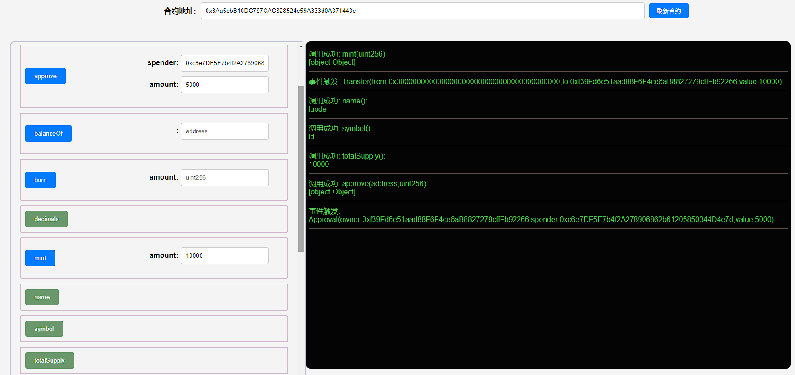

## 项目源码

[https://github.com/luode0320/solidity-demo](https://github.com/luode0320/solidity-demo)

## 空投 Airdrop

在币圈，最开心的一件事就是领空投，空手套白狼。这一讲，我们将学习如何使用智能合约发送`ERC20`代币空投。

空投是币圈中一种营销策略，项目方将代币免费发放给特定用户群体。

为了拿到空投资格，用户通常需要完成一些简单的任务，如测试产品、分享新闻、介绍朋友等。项目方通过空投可以获得种子用户，而用户可以获得一笔财富，两全其美。

因为每次接收空投的用户很多，项目方不可能一笔一笔的转账。利用智能合约批量发放`ERC20`代币，可以显著提高空投效率。

### 空投代币合约

`Airdrop`空投合约逻辑非常简单：利用循环，一笔交易将`ERC20`代币发送给多个地址。

合约中包含两个函数

- `getSum()`函数：计算此次发送代币的总数。

```solidity
// 数组求和函数
    function getSum(uint256[] calldata _arr) public pure returns (uint sum){
        for (uint i = 0; i < _arr.length; i++)
            sum = sum + _arr[i];
    }
```

- `multiTransferToken()`函数：发送`ERC20`代币空投，包含`3`个参数：
    - `_token`：代币合约地址（`address`类型）
    - `_addresses`：接收空投的用户地址数组（`address[]`类型）
    - `_amounts`：空投数量数组，对应`_addresses`里每个地址的数量（`uint[]`类型）

该函数有两个检查：第一个`require`检查了`_addresses`和`_amounts`两个数组长度是否相等；第二个`require`
检查了空投合约的授权额度大于要空投的代币数量总和。

```solidity
/// @notice 向多个地址转账ERC20代币，使用前需要先授权
///
/// @param _token 转账的ERC20代币地址
/// @param _addresses 空投地址数组
/// @param _amounts 代币数量数组（每个地址的空投数量）
    function multiTransferToken(
        address _token,
        address[] calldata _addresses,
        uint256[] calldata _amounts
    ) external {
        // 检查：_addresses和_amounts数组的长度相等
        require(_addresses.length == _amounts.length, "Lengths of Addresses and Amounts NOT EQUAL");
        IERC20 token = IERC20(_token); // 声明IERC合约变量
        uint _amountSum = getSum(_amounts); // 计算空投代币总量
        // 检查：授权代币数量 >= 空投代币总量
        require(token.allowance(msg.sender, address(this)) >= _amountSum, "Need Approve ERC20 token");

        // for循环，利用transferFrom函数发送空投
        for (uint8 i; i < _addresses.length; i++) {
            token.transferFrom(msg.sender, _addresses[i], _amounts[i]);
        }
    }
```

- `multiTransferETH()`函数：发送`ETH`空投，包含`2`个参数：
    - `_addresses`：接收空投的用户地址数组（`address[]`类型）
    - `_amounts`：空投数量数组，对应`_addresses`里每个地址的数量（`uint[]`类型）

```solidity
/// 向多个地址转账ETH
    function multiTransferETH(
        address payable[] calldata _addresses,
        uint256[] calldata _amounts
    ) public payable {
        // 检查：_addresses和_amounts数组的长度相等
        require(_addresses.length == _amounts.length, "Lengths of Addresses and Amounts NOT EQUAL");
        uint _amountSum = getSum(_amounts); // 计算空投ETH总量
        // 检查转入ETH等于空投总量
        require(msg.value == _amountSum, "Transfer amount error");
        // for循环，利用transfer函数发送ETH
        for (uint256 i = 0; i < _addresses.length; i++) {
            // 注释代码有Dos攻击风险, 并且transfer 也是不推荐写法
            // Dos攻击 具体参考 https://github.com/AmazingAng/WTF-Solidity/blob/main/S09_DoS/readme.md
            // _addresses[i].transfer(_amounts[i]);
            (bool success,) = _addresses[i].call{value: _amounts[i]}("");
            if (!success) {
                failTransferList[_addresses[i]] = _amounts[i];
            }
        }
    }
```

## 完整代码

```solidity
// SPDX-License-Identifier: MIT
// By 0xAA
pragma solidity ^0.8.21;

import "./IERC20.sol"; //import IERC20

/// @notice 向多个地址转账ERC20代币
contract Airdrop {
    mapping(address => uint) failTransferList;

    /// @notice 向多个地址转账ERC20代币，使用前需要先授权
    ///
    /// @param _token 转账的ERC20代币地址
    /// @param _addresses 空投地址数组
    /// @param _amounts 代币数量数组（每个地址的空投数量）
    function multiTransferToken(
        address _token,
        address[] calldata _addresses,
        uint256[] calldata _amounts
    ) external {
        // 检查：_addresses和_amounts数组的长度相等
        require(
            _addresses.length == _amounts.length,
            "Lengths of Addresses and Amounts NOT EQUAL"
        );
        IERC20 token = IERC20(_token); // 声明IERC合约变量
        uint _amountSum = getSum(_amounts); // 计算空投代币总量
        // 检查：授权代币数量 > 空投代币总量
        require(
            token.allowance(msg.sender, address(this)) > _amountSum,
            "Need Approve ERC20 token"
        );

        // for循环，利用transferFrom函数发送空投
        for (uint256 i; i < _addresses.length; i++) {
            token.transferFrom(msg.sender, _addresses[i], _amounts[i]);
        }
    }

    /// 向多个地址转账ETH
    function multiTransferETH(
        address payable[] calldata _addresses,
        uint256[] calldata _amounts
    ) public payable {
        // 检查：_addresses和_amounts数组的长度相等
        require(
            _addresses.length == _amounts.length,
            "Lengths of Addresses and Amounts NOT EQUAL"
        );
        uint _amountSum = getSum(_amounts); // 计算空投ETH总量
        // 检查转入ETH等于空投总量
        require(msg.value == _amountSum, "Transfer amount error");
        // for循环，利用transfer函数发送ETH
        for (uint256 i = 0; i < _addresses.length; i++) {
            // 注释代码有Dos攻击风险, 并且transfer 也是不推荐写法
            // Dos攻击 具体参考 https://github.com/AmazingAng/WTF-Solidity/blob/main/S09_DoS/readme.md
            // _addresses[i].transfer(_amounts[i]);
            (bool success,) = _addresses[i].call{value: _amounts[i]}("");
            if (!success) {
                failTransferList[_addresses[i]] = _amounts[i];
            }
        }
    }

    // 给空投失败提供主动操作机会
    function withdrawFromFailList(address _to) public {
        uint failAmount = failTransferList[msg.sender];
        require(failAmount > 0, "You are not in failed list");
        failTransferList[msg.sender] = 0;
        (bool success,) = _to.call{value: failAmount}("");
        require(success, "Fail withdraw");
    }

    // 数组求和函数
    function getSum(uint256[] calldata _arr) public pure returns (uint sum) {
        for (uint i = 0; i < _arr.length; i++) sum = sum + _arr[i];
    }
}

```

```solidity
// SPDX-License-Identifier: MIT
// WTF Solidity by 0xAA

pragma solidity ^0.8.21;

import "./IERC20.sol";

contract ERC20 is IERC20 {
    mapping(address => uint256) public override balanceOf;

    mapping(address => mapping(address => uint256)) public override allowance;

    uint256 public override totalSupply; // 代币总供给

    string public name; // 名称
    string public symbol; // 符号

    uint8 public decimals = 18; // 小数位数

    // @dev 在合约部署的时候实现合约名称和符号
    constructor(string memory name_, string memory symbol_) {
        name = name_;
        symbol = symbol_;
    }

    // @dev 实现`transfer`函数，代币转账逻辑
    function transfer(
        address recipient,
        uint amount
    ) public override returns (bool) {
        balanceOf[msg.sender] -= amount;
        balanceOf[recipient] += amount;
        emit Transfer(msg.sender, recipient, amount);
        return true;
    }

    // @dev 实现 `approve` 函数, 代币授权逻辑
    function approve(
        address spender,
        uint amount
    ) public override returns (bool) {
        allowance[msg.sender][spender] = amount;
        emit Approval(msg.sender, spender, amount);
        return true;
    }

    // @dev 实现`transferFrom`函数，代币授权转账逻辑
    function transferFrom(
        address sender,
        address recipient,
        uint amount
    ) public override returns (bool) {
        allowance[sender][msg.sender] -= amount;
        balanceOf[sender] -= amount;
        balanceOf[recipient] += amount;
        emit Transfer(sender, recipient, amount);
        return true;
    }

    // @dev 铸造代币，从 `0` 地址转账给 调用者地址
    function mint(uint amount) external {
        balanceOf[msg.sender] += amount;
        totalSupply += amount;
        emit Transfer(address(0), msg.sender, amount);
    }

    // @dev 销毁代币，从 调用者地址 转账给  `0` 地址
    function burn(uint amount) external {
        balanceOf[msg.sender] -= amount;
        totalSupply -= amount;
        emit Transfer(msg.sender, address(0), amount);
    }
}

```

```solidity
// SPDX-License-Identifier: MIT
// WTF Solidity by 0xAA

pragma solidity ^0.8.21;

/**
 * @dev ERC20 接口合约.
 */
interface IERC20 {
    /**
     * @dev 释放条件：当 `value` 单位的货币从账户 (`from`) 转账到另一账户 (`to`)时.
     */
    event Transfer(address indexed from, address indexed to, uint256 value);

    /**
     * @dev 释放条件：当 `value` 单位的货币从账户 (`owner`) 授权给另一账户 (`spender`)时.
     */
    event Approval(address indexed owner, address indexed spender, uint256 value);

    /**
     * @dev 返回代币总供给.
     */
    function totalSupply() external view returns (uint256);

    /**
     * @dev 返回账户`account`所持有的代币数.
     */
    function balanceOf(address account) external view returns (uint256);

    /**
     * @dev 转账 `amount` 单位代币，从调用者账户到另一账户 `to`.
     *
     * 如果成功，返回 `true`.
     *
     * 释放 {Transfer} 事件.
     */
    function transfer(address to, uint256 amount) external returns (bool);

    /**
     * @dev 返回`owner`账户授权给`spender`账户的额度，默认为0。
     *
     * 当{approve} 或 {transferFrom} 被调用时，`allowance`会改变.
     */
    function allowance(address owner, address spender) external view returns (uint256);

    /**
     * @dev 调用者账户给`spender`账户授权 `amount`数量代币。
     *
     * 如果成功，返回 `true`.
     *
     * 释放 {Approval} 事件.
     */
    function approve(address spender, uint256 amount) external returns (bool);

    /**
     * @dev 通过授权机制，从`from`账户向`to`账户转账`amount`数量代币。转账的部分会从调用者的`allowance`中扣除。
     *
     * 如果成功，返回 `true`.
     *
     * 释放 {Transfer} 事件.
     */
    function transferFrom(
        address from,
        address to,
        uint256 amount
    ) external returns (bool);
}
```

## 调试

启动本地网络节点:

```sh
yarn hardhat node
```

部署ERC20合约:

````sh
yarn hardhat run scripts/ERC20.ts --network localhost
````

```sh
yarn run v1.22.22
$ E:\solidity-demo\33.空投合约\node_modules\.bin\hardhat run scripts/ERC20.ts --network localhost
Compiled 3 Solidity files successfully (evm target: paris).
当前网络: localhost
_________________________启动部署________________________________
部署地址: 0xf39Fd6e51aad88F6F4ce6aB8827279cffFb92266
账户余额 balance(wei): 9999992813885843790042
账户余额 balance(eth): 9999.992813885843790042
_________________________部署合约________________________________
合约地址: 0x3Aa5ebB10DC797CAC828524e59A333d0A371443c
生成调试 html,请用 Live Server 调试: E:\solidity-demo\33.空投合约\ERC20.html
Done in 3.57s.
```

部署空投合约:

````sh
yarn hardhat run scripts/Airdrop.ts --network localhost
````

```sh
yarn run v1.22.22
$ E:\solidity-demo\33.空投合约\node_modules\.bin\hardhat run scripts/Airdrop.ts --network localhost
当前网络: localhost
_________________________启动部署________________________________
部署地址: 0xf39Fd6e51aad88F6F4ce6aB8827279cffFb92266
账户余额 balance(wei): 9999991864814544414892
账户余额 balance(eth): 9999.991864814544414892
_________________________部署合约________________________________
合约地址: 0xc6e7DF5E7b4f2A278906862b61205850344D4e7d
生成调试 html,请用 Live Server 调试: E:\solidity-demo\33.空投合约\Airdrop.html
Done in 2.56s.
```



## 总结

这一讲，我们介绍了如何使用`Solidity`写`ERC20`代币空投合约，极大增加空投效率。

