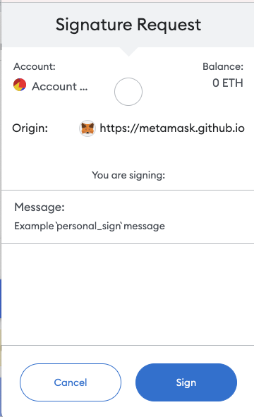
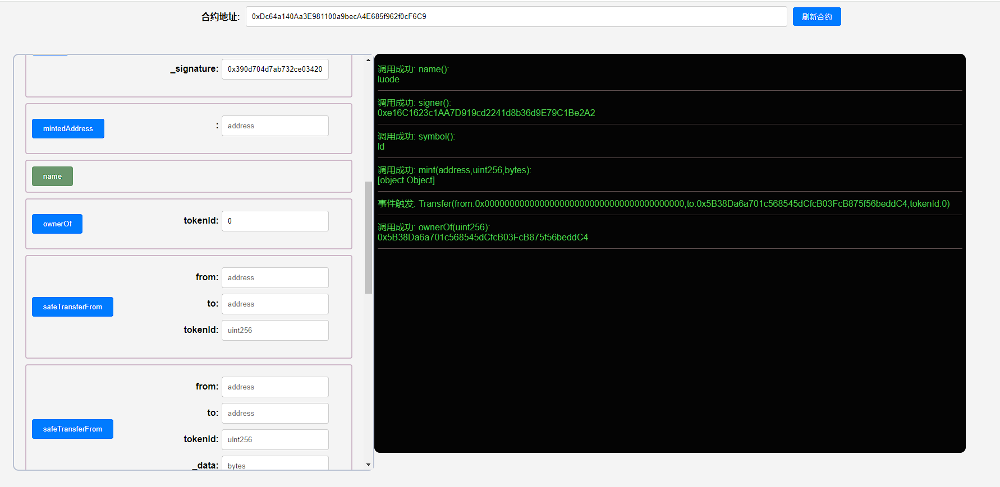

## 项目源码

[https://github.com/luode0320/solidity-demo](https://github.com/luode0320/solidity-demo)

## 数字签名

这一讲，我们将简单的介绍以太坊中的数字签名`ECDSA`，以及如何利用它发放`NFT`白名单。代码中的`ECDSA`库由`OpenZeppelin`
的同名库简化而成。

如果你用过`opensea`交易`NFT`，对签名就不会陌生。

下图是小狐狸（`metamask`）钱包进行签名时弹出的窗口，它可以证明你拥有私钥的同时不需要对外公布私钥。



以太坊使用的数字签名算法叫双椭圆曲线数字签名算法（`ECDSA`），基于双椭圆曲线“私钥-公钥”对的数字签名算法。

它主要起到了[三个作用](https://en.wikipedia.org/wiki/Digital_signature)：

1. **身份认证**：证明签名方是私钥的持有人。
2. **不可否认**：发送方不能否认发送过这个消息。
3. **完整性**：通过验证针对传输消息生成的数字签名，可以验证消息是否在传输过程中被篡改。

## `ECDSA`合约

`ECDSA`标准中包含两个部分：

1. 签名者利用`私钥`（隐私的）对`消息`（公开的）创建`签名`（公开的）。
2. 其他人使用`消息`（公开的）和`签名`（公开的）恢复签名者的`公钥`（公开的）并验证签名。 我们将配合`ECDSA`库讲解这两个部分。

本教程所用的`私钥`，`公钥`，`消息`，`以太坊签名消息`，`签名`如下所示：

```
私钥: 0x227dbb8586117d55284e26620bc76534dfbd2394be34cf4a09cb775d593b6f2b
公钥: 0xe16C1623c1AA7D919cd2241d8b36d9E79C1Be2A2
消息: 0x1bf2c0ce4546651a1a2feb457b39d891a6b83931cc2454434f39961345ac378c
以太坊签名消息: 0xb42ca4636f721c7a331923e764587e98ec577cea1a185f60dfcc14dbb9bd900b
签名: 0x390d704d7ab732ce034203599ee93dd5d3cb0d4d1d7c600ac11726659489773d559b12d220f99f41d17651b0c1c6a669d346a397f8541760d6b32a5725378b241c
```

### 创建签名

**1. 打包消息：** 在以太坊的`ECDSA`标准中，被签名的`消息`是一组数据的`keccak256`哈希，为`bytes32`类型。

我们可以把任何想要签名的内容利用`abi.encodePacked()`函数打包，然后用`keccak256()`计算哈希，作为`消息`。

我们例子中的`消息`是由一个`address`类型变量和一个`uint256`类型变量得到的：

```solidity
    /*
     * 将mint地址（address类型）和tokenId（uint256类型）拼成消息msgHash
     * _account: 0x5B38Da6a701c568545dCfcB03FcB875f56beddC4
     * _tokenId: 0
     * 对应的消息msgHash: 0x1bf2c0ce4546651a1a2feb457b39d891a6b83931cc2454434f39961345ac378c
     */
    function getMessageHash(address _account, uint256 _tokenId) public pure returns (bytes32){
        return keccak256(abi.encodePacked(_account, _tokenId));
    }
```

**2. 计算以太坊签名消息：** `消息`可以是能被执行的交易，也可以是其他任何形式。

为了避免用户误签了恶意交易，`EIP191`提倡在`消息`前加上`"\x19Ethereum Signed Message:\n32"`字符，并再做一次`keccak256`
哈希，作为`以太坊签名消息`。

经过`toEthSignedMessageHash()`函数处理后的消息，不能被用于执行交易:

```solidity
    /**
     * @dev 返回 以太坊签名消息
     * `hash`：消息
     * 遵从以太坊签名标准：https://eth.wiki/json-rpc/API#eth_sign[`eth_sign`]
     * 以及`EIP191`:https://eips.ethereum.org/EIPS/eip-191`
     * 添加"\x19Ethereum Signed Message:\n32"字段，防止签名的是可执行交易。
     */
    function toEthSignedMessageHash(bytes32 hash) public pure returns (bytes32) {
        // 哈希的长度为32
        return keccak256(abi.encodePacked("\x19Ethereum Signed Message:\n32", hash));
    }
```

处理后的消息为：

```
以太坊签名消息: 0xb42ca4636f721c7a331923e764587e98ec577cea1a185f60dfcc14dbb9bd900b
```

**到这里, 信息就处理完成了, 下面开始真正的用私钥签名!**

**3-1. 利用钱包签名：** 日常操作中，大部分用户都是通过这种方式进行签名。

在获取到需要签名的消息之后，我们需要使用`metamask`钱包进行签名。`metamask`的`personal_sign`方法会自动把`消息`
转换为`以太坊签名消息`，然后发起签名。

所以我们只需要输入`消息`和`签名者钱包account`即可。需要注意的是输入的`签名者钱包account`需要和`metamask`
当前连接的account一致才能使用。

因此首先把例子中的`私钥`导入到小狐狸钱包，然后打开浏览器的`console`页面：

`Chrome菜单-更多工具-开发者工具-Console`。在连接钱包的状态下（如连接opensea，否则会出现错误），依次输入以下指令进行签名：

```
ethereum.enable()
account = "0xe16C1623c1AA7D919cd2241d8b36d9E79C1Be2A2"
hash = "0x1bf2c0ce4546651a1a2feb457b39d891a6b83931cc2454434f39961345ac378c"
ethereum.request({method: "personal_sign", params: [account, hash]})
```

在返回的结果中（`Promise`的`PromiseResult`）可以看到创建好的签名。不同账户有不同的私钥，创建的签名值也不同。

利用教程的私钥创建的签名如下所示：

```
0x390d704d7ab732ce034203599ee93dd5d3cb0d4d1d7c600ac11726659489773d559b12d220f99f41d17651b0c1c6a669d346a397f8541760d6b32a5725378b241c
```

**3-2. 利用脚本签名：**

批量调用中更倾向于使用代码进行签名，以下是基于web3.py的实现。

```python
from web3 import Web3, HTTPProvider
from eth_account.messages import encode_defunct

private_key = "0x227dbb8586117d55284e26620bc76534dfbd2394be34cf4a09cb775d593b6f2b"
address = "0x5B38Da6a701c568545dCfcB03FcB875f56beddC4"
rpc = 'https://rpc.ankr.com/eth'
w3 = Web3(HTTPProvider(rpc))

#打包信息
msg = Web3.solidity_keccak(['address','uint256'], [address,0])
print(f"消息：{msg.hex()}")
#构造可签名信息
message = encode_defunct(hexstr=msg.hex())
#签名
signed_message = w3.eth.account.sign_message(message, private_key=private_key)
print(f"签名：{signed_message['signature'].hex()}")
```

使用 ethers.js 进行签名。

```js
const ethers = require('ethers');

// 设置私钥和地址
const privateKey = "0x227dbb8586117d55284e26620bc76534dfbd2394be34cf4a09cb775d593b6f2b";
const address = "0x5B38Da6a701c568545dCfcB03FcB875f56beddC4";
const rpcUrl = 'https://rpc.ankr.com/eth'; // http://127.0.0.1:8545

// 创建一个 provider
const provider = new ethers.providers.JsonRpcProvider(rpcUrl);

// 创建一个 signer
const wallet = new ethers.Wallet(privateKey, provider);

// 打包信息
const message = ethers.utils.solidityKeccak256(['address', 'uint256'], [address, 0]);
console.log(`消息：${message}`);

// 构造可签名信息
const hexMessage = ethers.utils.arrayify(message);

// 签名
const signature = await wallet.signMessage(hexMessage);
console.log(`签名：${signature}`);
```

运行的结果如下所示。计算得到的消息，签名和前面的案例一致。

```
消息：0x1bf2c0ce4546651a1a2feb457b39d891a6b83931cc2454434f39961345ac378c
签名：0x390d704d7ab732ce034203599ee93dd5d3cb0d4d1d7c600ac11726659489773d559b12d220f99f41d17651b0c1c6a669d346a397f8541760d6b32a5725378b241c
```

### 验证签名

为了验证签名，验证者需要拥有`消息`，`签名`，和签名使用的`公钥`。

我们能验证签名的原因是只有`私钥`的持有者才能够针对交易生成这样的签名，而别人不能。

**4. 通过签名和消息恢复公钥：**`签名`是由数学算法生成的。这里我们使用的是`rsv签名`，`签名`中包含`r, s, v`三个值的信息。

而后，我们可以通过`r, s, v`及`以太坊签名消息`来求得`公钥`。

下面的`recoverSigner()`函数实现了上述步骤，它利用`以太坊签名消息 _msgHash`和`签名 _signature`恢复`公钥`（使用了简单的内联汇编）：

```solidity
    // @dev 从_msgHash和签名_signature中恢复signer地址
    function recoverSigner(bytes32 _msgHash, bytes memory _signature) internal pure returns (address){
        // 检查签名长度，65是标准r,s,v签名的长度
        require(_signature.length == 65, "invalid signature length");
        bytes32 r;
        bytes32 s;
        uint8 v;
        // 目前只能用assembly (内联汇编)来从签名中获得r,s,v的值
        assembly {
        /*
        前32 bytes存储签名的长度 (动态数组存储规则)
        add(sig, 32) = sig的指针 + 32
        等效为略过signature的前32 bytes
        mload(p) 载入从内存地址p起始的接下来32 bytes数据
        */
        // 读取长度数据后的32 bytes
            r := mload(add(_signature, 0x20))
        // 读取之后的32 bytes
            s := mload(add(_signature, 0x40))
        // 读取最后一个byte
            v := byte(0, mload(add(_signature, 0x60)))
        }
        // 使用ecrecover(全局函数)：利用 msgHash 和 r,s,v 恢复 signer 地址
        return ecrecover(_msgHash, v, r, s);
    }
```

参数分别为：

```
// 以太坊签名消息
_msgHash：0xb42ca4636f721c7a331923e764587e98ec577cea1a185f60dfcc14dbb9bd900b
// 以太坊签名消息签名后的签名值
_signature：0x390d704d7ab732ce034203599ee93dd5d3cb0d4d1d7c600ac11726659489773d559b12d220f99f41d17651b0c1c6a669d346a397f8541760d6b32a5725378b241c
```

**5. 对比公钥并验证签名：** 接下来，我们只需要比对恢复的`公钥`与签名者公钥`_signer`是否相等：若相等，则签名有效；否则，签名无效：

```solidity
    /**
     * @dev 通过ECDSA，验证签名地址是否正确，如果正确则返回true
     * _msgHash为消息的hash
     * _signature为签名
     * _signer为签名地址
     */
    function verify(bytes32 _msgHash, bytes memory _signature, address _signer) internal pure returns (bool) {
        return recoverSigner(_msgHash, _signature) == _signer;
    }
```

参数分别为：

```
// 以太坊签名消息
_msgHash：0xb42ca4636f721c7a331923e764587e98ec577cea1a185f60dfcc14dbb9bd900b
// 以太坊签名消息签名后的签名值
_signature：0x390d704d7ab732ce034203599ee93dd5d3cb0d4d1d7c600ac11726659489773d559b12d220f99f41d17651b0c1c6a669d346a397f8541760d6b32a5725378b241c
// 公钥
_signer：0xe16C1623c1AA7D919cd2241d8b36d9E79C1Be2A2
```

## 利用签名发放白名单

`NFT`项目方可以利用`ECDSA`的这个特性发放白名单。由于签名是链下的，不需要`gas`，因此这种白名单发放模式比`Merkle Tree`模式还要经济。

方法非常简单，项目方利用项目方账户把白名单发放地址签名（可以加上地址可以铸造的`tokenId`）。

然后`mint`的时候利用`ECDSA`检验签名是否有效，如果有效，则给他`mint`。

`SignatureNFT`合约实现了利用签名发放`NFT`白名单。

### 状态变量

合约中共有两个状态变量：

- `signer`：`公钥`，项目方公开的公钥。
- `mintedAddress`是一个`mapping`，记录了已经`mint`过的地址。

### 函数

合约中共有4个函数：

- 构造函数初始化`NFT`的名称和代号，还有`ECDSA`的签名地址`signer`。
- `mint()`函数接受地址`address`，`tokenId`和`_signature`三个参数，验证签名是否有效：如果有效，则把`tokenId`的`NFT`
  铸造给`address`地址，并将它记录到`mintedAddress`。它调用了`getMessageHash()`，`ECDSA.toEthSignedMessageHash()`
  和`verify()`函数。
- `getMessageHash()`函数将`mint`地址（`address`类型）和`tokenId`（`uint256`类型）拼成`消息`。
- `verify()`函数调用了`ECDSA`库的`verify()`函数，来进行`ECDSA`签名验证。

```solidity
contract SignatureNFT is ERC721 {
    address immutable public signer; // 签名地址
    mapping(address => bool) public mintedAddress;   // 记录已经mint的地址

    // 构造函数，初始化NFT合集的名称、代号、签名地址
    constructor(string memory _name, string memory _symbol, address _signer)
    ERC721(_name, _symbol)
    {
        signer = _signer;
    }

    // 利用ECDSA验证签名并mint
    function mint(address _account, uint256 _tokenId, bytes memory _signature)
    external
    {
        bytes32 _msgHash = getMessageHash(_account, _tokenId); // 将_account和_tokenId打包消息
        bytes32 _ethSignedMessageHash = ECDSA.toEthSignedMessageHash(_msgHash); // 计算以太坊签名消息
        require(verify(_ethSignedMessageHash, _signature), "Invalid signature"); // ECDSA检验通过
        require(!mintedAddress[_account], "Already minted!"); // 地址没有mint过
        _mint(_account, _tokenId); // mint
        mintedAddress[_account] = true; // 记录mint过的地址
    }

    /*
     * 将mint地址（address类型）和tokenId（uint256类型）拼成消息msgHash
     * _account: 0x5B38Da6a701c568545dCfcB03FcB875f56beddC4
     * _tokenId: 0
     * 对应的消息: 0x1bf2c0ce4546651a1a2feb457b39d891a6b83931cc2454434f39961345ac378c
     */
    function getMessageHash(address _account, uint256 _tokenId) public pure returns (bytes32){
        return keccak256(abi.encodePacked(_account, _tokenId));
    }

    // ECDSA验证，调用ECDSA库的verify()函数
    function verify(bytes32 _msgHash, bytes memory _signature)
    public view returns (bool)
    {
        return ECDSA.verify(_msgHash, _signature, signer);
    }
}
```

## 调试

启动本地网络节点:

```sh
yarn hardhat node
```

部署合约:

````sh
yarn hardhat run scripts/deploy.ts --network localhost
````

```sh
yarn run v1.22.22
$ E:\solidity-demo\37.数字签名Signature\node_modules\.bin\hardhat run scripts/deploy.ts --network localhost
Compiled 1 Solidity file successfully (evm target: paris).
当前网络: localhost
_________________________启动部署________________________________
部署地址: 0xf39Fd6e51aad88F6F4ce6aB8827279cffFb92266
账户余额 balance(wei): 9999997539493765062629
账户余额 balance(eth): 9999.997539493765062629
_________________________部署合约________________________________
合约地址: 0xDc64a140Aa3E981100a9becA4E685f962f0cF6C9
生成调试 html,请用 Live Server 调试: E:\solidity-demo\37.数字签名Signature\index.html
Done in 3.15s.
```

- 调用`mint()`函数利用`ECDSA`验证签名并铸造，参数为：

```
// 消息的一部分
_account: 0x5B38Da6a701c568545dCfcB03FcB875f56beddC4
// 消息的一部分
_tokenId: 0
// 两个部分 以太坊签名消息签名后的签名值
_signature: 0x390d704d7ab732ce034203599ee93dd5d3cb0d4d1d7c600ac11726659489773d559b12d220f99f41d17651b0c1c6a669d346a397f8541760d6b32a5725378b241c
```

- 调用`ownerOf()`函数，可以看到`tokenId = 0`成功铸造给了地址`_account`，合约运行成功！



## 总结

这一讲，我们介绍了以太坊中的数字签名`ECDSA`，如何利用`ECDSA`创建和验证签名，还有`ECDSA`合约，以及如何利用它发放`NFT`白名单。

代码中的`ECDSA`库由`OpenZeppelin`
的[同名库](https://github.com/OpenZeppelin/openzeppelin-contracts/blob/master/contracts/utils/cryptography/ECDSA.sol)
简化而成。

- 由于签名是链下的，不需要`gas`，因此这种白名单发放模式比`Merkle Tree`模式还要经济；
- 但由于用户要请求中心化接口去获取签名，不可避免的牺牲了一部分去中心化；
- 额外还有一个好处是白名单可以动态变化，而不是提前写死在合约里面了，因为项目方的中心化后端接口可以接受任何新地址的请求并给予白名单签名。