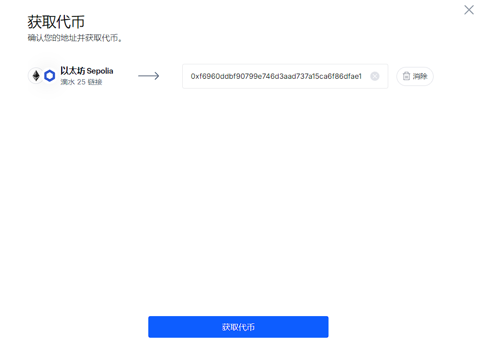

## 项目源码

[https://github.com/luode0320/solidity-demo](https://github.com/luode0320/solidity-demo)

## 随机数

很多以太坊上的应用都需要用到随机数，例如`NFT`随机抽取`tokenId`、抽盲盒、`gamefi`战斗中随机分胜负等等。

但是由于以太坊上所有数据都是公开透明（`public`）且确定性（`deterministic`）的，它没法像其他编程语言一样给开发者提供生成随机数的方法。

如果智能合约生成随机数的过程是不确定的，那么在不同的节点上执行的结果就会不同，这会导致共识失败。

这一讲我们将介绍链上（哈希函数）和链下（`chainlink`预言机）随机数生成的两种方法，并利用它们做一款`tokenId`随机铸造的`NFT`。

## 链上随机数生成

我们可以将一些链上的全局变量作为种子，利用`keccak256()`哈希函数来获取伪随机数。

这是因为哈希函数具有灵敏性和均一性，可以得到“看似”随机的结果。

下面的`getRandomOnchain()`函数利用全局变量`block.timestamp`，`msg.sender`和`blockhash(block.number-1)`作为种子来获取随机数：

```solidity
    /** 
    * 链上伪随机数生成
    * 利用keccak256()打包一些链上的全局变量/自定义变量
    * 返回时转换成uint256类型
    */
    function getRandomOnchain() public view returns(uint256){
        // remix运行blockhash会报错
        bytes32 randomBytes = keccak256(abi.encodePacked(block.timestamp, msg.sender, blockhash(block.number-1)));
        
        return uint256(randomBytes);
    }
```

**注意:**，这个方法并不安全：

- 首先，`block.timestamp`，`msg.sender`和`blockhash(block.number-1)`这些变量都是公开的，使用者可以预测出用这些种子生成出的随机数，并挑出他们想要的随机数执行合约。
- 其次，矿工可以操纵`blockhash`和`block.timestamp`，使得生成的随机数符合他的利益。

尽管如此，由于这种方法是最便捷的链上随机数生成方法，大量项目方依靠它来生成不安全的随机数，包括知名的项目`meebits`，`loots`等。

当然，这些项目也无一例外的被[攻击](https://forum.openzeppelin.com/t/understanding-the-meebits-exploit/8281)
了：攻击者可以铸造任何他们想要的稀有`NFT`，而非随机抽取。

## 链下随机数生成

我们可以在链下生成随机数，然后通过预言机把随机数上传到链上。

`Chainlink`提供`VRF`（可验证随机函数）服务，链上开发者可以支付`LINK`代币来获取随机数。

` Chainlink VRF`
有两个版本，第二个版本需要官网注册并预付费，比第一个版本多许多操作，需要花费更多的gas，但取消订阅后可以拿回剩余的Link，这里介绍第二个版本`Chainlink VRF V2`。

### `Chainlink VRF`使用步骤


### 1. 在`Chainlink VRF`上申请`Subscription`

在Chainlink VRF网站[这里](https://vrf.chain.link/)上创建一个`Subscription`，其中邮箱和项目名都是选填


### 2. 利用`Chainlink`水龙头获取测试网的`LINK`和`ETH`

创建完成后往`Subscription`中转入一些`Link`代币。测试网的`LINK`代币可以从[LINK水龙头](https://faucets.chain.link/)领取。



我们将用一个简单的合约介绍使用`Chainlink VRF`的步骤。`RandomNumberConsumer`合约可以向`VRF`
请求随机数，并存储在状态变量`randomWords`中。

为了使用`VRF`获取随机数，合约需要继承`VRFConsumerBaseV2`合约，并在构造函数中初始化`VRFCoordinatorV2Interface`
和`Subscription Id`。

**注意:** 不同链对应不同的参数，在[这里](https://docs.chain.link/vrf/v2/subscription/supported-networks)查询。

教程中我们使用`Sepolia`测试网。去 https://etherscan.io 区块链浏览器注册后获取API密钥

**4. 用户合约申请随机数**

用户可以调用从`VRFCoordinatorV2Interface`接口合约中的`requestRandomWords`函数申请随机数，并返回申请标识符`requestId`。

这个申请会传递给`VRF`合约。

**注意:** 合约部署后，需要把合约加入到`Subscription`的`Consumers`中，才能发送申请, 后面整体调试的时候会提。

**5. `Chainlink`
节点链下生成随机数和[数字签名](https://github.com/AmazingAng/WTF-Solidity/blob/main/37_Signature/readme.md)
，并发送给`VRF`合约**

**6. `VRF`合约验证签名有效性**

**7. 用户合约接收并使用随机数**

在`VRF`合约验证签名有效之后，会自动调用用户合约的回退函数`fulfillRandomness()`，将链下生成的随机数发送过来。

**用户要把消耗随机数的逻辑写在这里。**

**注意:** 用户申请随机数时调用的`requestRandomness()`和`VRF`合约返回随机数时调用的回退函数`fulfillRandomness()`
是两笔交易，调用者分别是用户合约和`VRF`合约，后者比前者晚几分钟（不同链延迟不一样）。

```solidity
    /**
     * VRF合约的回调函数，验证随机数有效之后会自动被调用
     * 消耗随机数的逻辑写在这里
     */
    function fulfillRandomWords(uint256 requestId, uint256[] memory s_randomWords) internal override {
        randomWords = s_randomWords;
    }
```

## `tokenId`随机铸造的`NFT`

这一节，我们将利用链上和链下随机数来做一款`tokenId`随机铸造的`NFT`。`Random`合约继承`ERC721`和`VRFConsumerBaseV2`合约。

```solidity
// SPDX-License-Identifier: MIT
pragma solidity ^0.8.21;

import "./ERC721.sol";

import {VRFConsumerBaseV2Plus} from "@chainlink/contracts/src/v0.8/vrf/dev/VRFConsumerBaseV2Plus.sol";
import {VRFV2PlusClient} from "@chainlink/contracts/src/v0.8/vrf/dev/libraries/VRFV2PlusClient.sol";

contract Random is ERC721, VRFConsumerBaseV2Plus {
```

### 状态变量

- NFT相关
    - `totalSupply`：`NFT`总供给。
    - `ids`：数组，用于计算可供`mint`的`tokenId`，见`pickRandomUniqueId()`函数。
    - `mintCount`：已经`mint`的数量。
- Chainlink VRF相关
    - `subscriptionId`：申请的`Subscription Id`(不要填错)
    - `vrfCoordinator`:`VRF`合约地址(不要填错)
    - `keyHash`:`VRF`唯一标识符。(不要填错)
    - `requestConfirmations`:确认块数
    - `callbackGasLimit`：`VRF`手续费。
    - `numWords`:请求的随机数个数
    - `requestId`:申请标识符
    - `requestToSender`：记录申请`VRF`用于铸造的用户地址。

```solidity
    // NFT相关
    uint256 public totalSupply = 100; // 总供给
    uint256[100] public ids; // 用于计算可供mint的tokenId
    uint256 public mintCount; // 已mint数量

    // chainlink VRF参数
    /**
     * 使用chainlink VRF，构造函数需要继承 VRFConsumerBaseV2
     * 不同链参数填的不一样
     * 网络: Sepolia测试网
     * https://docs.chain.link/vrf/v2-5/getting-started
     * https://docs.chain.link/vrf/v2-5/supported-networks#sepolia-testnet
     */
    uint256 subscriptionId; // 申请的`Subscription Id`
    address vrfCoordinator; // VRF 协调员
    bytes32 keyHash; // 密钥哈希
    uint16 requestConfirmations = 3; // 确认块数（数字大安全性高，一般填12）
    uint32 callbackGasLimit = 1_000_000; // `VRF`手续费。最大 2,500,000
    uint32 numWords = 1; // 请求的随机数个数, 一次可以得到的随机数个数 : 最大 500
    uint256 public requestId; // 申请标识符
    mapping(uint256 => address) public requestToSender; // 记录VRF申请标识对应铸造的用户地址。
```

### 构造函数

初始化继承的`VRFConsumerBaseV2`和`ERC721`合约的相关变量。

````solidity
    /**
     * 假设合约部署在 Sepolia 测试网络上，因此 VRF 协调器地址 (vrfCoordinator) 和密钥哈希 (s_keyHash) 已经作为常量定义在合约中。
     *
     * 通过继承 VRFConsumerBaseV2Plus，构造函数初始化了 VRF 协调器地址
     */
    constructor(
        uint256 _subscriptionId,
        address _vrfCoordinator,
        bytes32 _keyHash
    ) VRFConsumerBaseV2Plus(_vrfCoordinator) ERC721("luode", "ld") {
        // 设置合约的订阅 ID 为传入的参数值。
        // 这是 Chainlink VRF v2+ 的订阅 ID，合约将使用这个订阅 ID 来请求随机数
        // 这个订阅必须已经在 Chainlink 网络中创建，并且已经充值了足够的 LINK 代币，以确保合约可以成功请求随机数。
        subscriptionId = _subscriptionId;
        vrfCoordinator = _vrfCoordinator;
        keyHash = _keyHash;
    }
````

### 其他函数

除了构造函数以外，合约里还定义了`5`个函数。

- `pickRandomUniqueId()`：输入随机数，获取可供`mint`的`tokenId`。

  ```solidity
      /**
       * 输入uint256数字，返回一个可以mint的tokenId, random由预言机/获得
       */
      function pickRandomUniqueId(
          uint256 random
      ) private returns (uint256 tokenId) {
          //先计算减法，再计算++, 关注(a++，++a)区别
          uint256 len = totalSupply - mintCount++; // 可mint数量
          require(len > 0, "mint close"); // 所有tokenId被mint完了
          uint256 randomIndex = random % len; // 获取链上随机数
  
          //随机数取模，得到tokenId，作为数组下标，同时记录value为len-1，如果取模得到的值已存在，则tokenId取该数组下标的value
          tokenId = ids[randomIndex] != 0 ? ids[randomIndex] : randomIndex; // 获取tokenId
          ids[randomIndex] = ids[len - 1] == 0 ? len - 1 : ids[len - 1]; // 更新ids 列表
          ids[len - 1] = 0; // 删除最后一个元素，能返还gas
      }
  ```

- `getRandomOnchain()`：获取链上随机数（不安全）。

  ```solidity
      /**
       * 链上伪随机数生成
       *
       * 此函数尝试在以太坊链上生成一个伪随机数。
       * 生成随机数的过程中使用了链上的全局变量，如区块哈希、调用者的地址和区块时间戳。
       * 这些变量虽然提供了某种程度的随机性，但并不能保证绝对的安全性。
       *
       * 为了提高随机性，可以考虑添加更多的变量，如交易的 nonce 等。
       * 但请注意，这种方法本质上仍存在可预测性，尤其是在攻击者可以控制某些变量的情况下。
       *
       * 返回的随机数为 uint256 类型。
       */
      function getRandomOnchain() public view returns (uint256) {
          // 生成一个字节数组，包含三个变量：区块哈希、调用者的地址和区块时间戳
          bytes32 randomBytes = keccak256(
              abi.encodePacked(
                  blockhash(block.number - 1), // 上一个区块的哈希值
                  msg.sender, // 调用者的地址
                  block.timestamp // 当前区块的时间戳
              )
          );
          // 将生成的字节数组转换为 uint256 类型的随机数
          return uint256(randomBytes);
      }
  ```

- `mintRandomOnchain()`：利用链上随机数铸造`NFT`，调用了`getRandomOnchain()`和`pickRandomUniqueId()`。

  ```solidity
      // 利用链上伪随机数铸造NFT
      function mintRandomOnchain() public {
          uint256 _tokenId = pickRandomUniqueId(getRandomOnchain()); // 利用链上随机数生成tokenId
          _mint(msg.sender, _tokenId);
     }
  ```

- `mintRandomVRF()`：申请`Chainlink VRF`用于铸造随机数。由于使用随机数铸造的逻辑在回调函数`fulfillRandomness()`
  ，而回调函数的调用者是`VRF`合约，而非铸造`NFT`的用户，这里必须利用`requestToSender`状态变量记录`VRF`申请标识符对应的用户地址。

  ```solidity
      /**
       * 调用 VRF 获取随机数，并 mint NFT
       *
       * 此函数首先调用 VRF Coordinator 的 `requestRandomWords` 方法来请求随机数。
       * 消耗随机数的逻辑被写在 VRF 的回调函数 `fulfillRandomWords` 中。
       *
       * 在调用此函数之前，需要确保在 Subscriptions 中为 VRF 服务提供了足够的 LINK 代币。
       */
      function mintRandomVRF() public {
          // 向 VRF 协调器请求随机数。
          // 如果订阅未设置或资金不足，此操作将回退。
          requestId = s_vrfCoordinator.requestRandomWords(
              VRFV2PlusClient.RandomWordsRequest({
                  keyHash: keyHash, // 密钥哈希用于识别 VRF 订阅。
                  subId: subscriptionId, // 用于资助 VRF 请求的订阅 ID。
                  requestConfirmations: requestConfirmations, // 请求确认数
                  callbackGasLimit: callbackGasLimit, // 回调函数的最大 gas 限制。
                  numWords: numWords, // 请求的随机数数量。
                  extraArgs: VRFV2PlusClient._argsToBytes(
                      // 额外参数用于 VRF 请求。这里我们指定请求应该使用 LINK 代币支付。
                      VRFV2PlusClient.ExtraArgsV1({nativePayment: false})
                  )
              })
          );
  
          requestToSender[requestId] = msg.sender;
      }
  ```

- `fulfillRandomWords()`：`VRF`的回调函数，由`VRF`合约在验证随机数真实性后自动调用，用返回的链下随机数铸造`NFT`。

  ```solidity
  
      /**
       * VRF 的回调函数，由 VRF Coordinator 调用
       *
       * 此函数在 VRF Coordinator 返回随机数后被调用，用于处理随机数并 mint NFT。
       *
       * @param requestId 请求 ID，用于标识此次随机数请求
       * @param s_randomWords 包含随机数的数组, 有多少个随机数由之前的numWords控制
       */
      function fulfillRandomWords(
          uint256 _requestId,
          uint256[] memory s_randomWords
      ) internal override {
          address sender = requestToSender[_requestId]; // 从requestToSender中获取minter用户地址
          uint256 tokenId = pickRandomUniqueId(s_randomWords[0]); // 利用VRF返回的随机数生成tokenId
          _mint(sender, tokenId);
      }
  ```

## 调试

启动本地网络节点:

```sh
yarn hardhat node
```

### 1. 部署合约

此次我们要使用sepolia测试网, 进行部署。你需要填写好 `env` 测试网的keyJ

```
ETHERSCAN_API_KEY=<去 https://etherscan.io 区块链浏览器注册后的API密钥>
SUBSCRIPTION_ID=<去 https://vrf.chain.link/ 注册后的订阅ID>
```

部署合约:

````sh
yarn hardhat run scripts/deploy.ts --network sepolia
````

```sh
yarn run v1.22.22
$ E:\solidity-demo\39.链上随机数\node_modules\.bin\hardhat run scripts/deploy.ts --network sepolia
Compiled 9 Solidity files successfully (evm target: paris).
当前网络: sepolia
_________________________启动部署________________________________
部署地址: 0xf6960DdBF90799E746d3AaD737a15Ca6f86dfaE1
账户余额 balance(wei): 2238400666558652374
账户余额 balance(eth): 2.238400666558652374
_________________________部署合约________________________________
合约地址: 0xfc504Bd747ce1faEa801A7BA9aBeCD45a1505f27
生成调试 html,请用 Live Server 调试: E:\solidity-demo\39.链上随机数\index.html
Done in 13.82s.
```

### 2. 在`Consumers`中添加部署的合约地址, 转账Link


出现下面即可用。


### 3. 利用`Chainlink VRF`链下随机数铸造`NFT`

- 左侧橙色函数`mintRandomOnchain`利用链上伪随机数铸造NFT
- 需要等待一段时间, 我点了3次


- 打开 html 调试, 点击左侧橙色函数`mintRandomVRF`，利用`Chainlink VRF`链下随机数铸造交易就开始了

  **注意:** 采用`VRF`铸造`NFT`时，发起交易和铸造成功不在同一个区块

  [官网](https://vrf.chain.link/)

  


### 4. 取消订阅

当合约不使用后可以在`Chainlink VRF`上取消订阅，取出剩余的`LINK`代币。

## 总结

在`Solidity`中生成随机数没有其他编程语言那么容易。

这一讲我们将介绍链上（哈希函数）和链下（`chainlink`预言机）随机数生成的两种方法，并利用它们做一款`tokenId`随机铸造的`NFT`。

这两种方法各有利弊：

- 使用链上随机数高效，但是不安全；
- 而链下随机数生成依赖于第三方提供的预言机服务，比较安全，但是没那么简单经济。项目方要根据业务场景来选择适合自己的方案。

除此以外，还有一些组织在尝试RNG(Random Number Generation)的新鲜方式，如[randao](https://github.com/randao/randao)
就提出以DAO的模式来提供一个`on-chain`且`true randomness`的服务