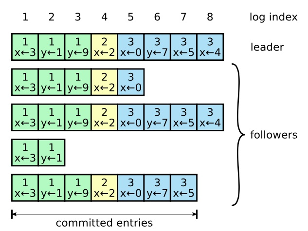

# 简介

> 在Hyperledger Fabric中，Orderer模块默认使用etcdraft共识机制来确保分布式系统的可靠性和一致性。
>


**Raft 是一种为了管理复制日志的一致性算法。**

# 工作原理

- 配置至少3个orderer排序节点作为raft共识的节点
- 集群中选举一个排序节点作为领导者。领导者负责接受客户端请求并管理到其他服务器的日志复制。
- 其他的排序节点不会接受请求, 就算接受到了请求也会重定向到leader领导者节点处理
- leader领导者节点会以日志的形式记录数据, 并强制同步给其他追随者节点, 并保证最终一致性
- 当leader领导者接收到大多数节点确认日志后, 会提交日志记录并响应成功消息给请求客户端

# 结论

fabric底层并没有自己写一套raft算法, 而是是用`go.etcd.io/raft`通用包的raft算法。

原理就是由一个leader主节点全权负责接收客户端的请求命令，并将命令作为日志条目复制给其他服务器，在确认安全的时候，将日志命令提交执行

从而达到多节点数据最终一致性的算法, 所以可以直接百度查看raft的底层原理即可, fabric底层并没有做深层次的处理

**如果你觉得简单说结论得不到信任, 请继续看下面的解析!**

# 源码位置

算法位于Fabric的`orderer/consensus/etcdraft`包下

在Orderer模块中，raft共识机制的实现主要涉及到以下文件：

- `orderer/consensus/etcdraft/consenter.go`：这是切换共识算法的接口, 主要是入口函数`HandleChain`
- `orderer/consensus/etcdraft/chain.go`：该文件定义了raft共识机制的核心结构体和发送消息的相关方法
- `orderer/consensus/etcdraft/node.go`: 该文件主要涉及raft节点的启动和节点接收消息的相关方法
- `orderer/consensus/etcdraft/storage.go`：该文件主要涉及raft存储wal日志和快照的相关方法

# 源码解析

> 直接分析的核心处理逻辑: `orderer/consensus/etcdraft/chain.go`

- 核心逻辑是`orderer/consensus/etcdraft/chain.go/Start`方法
- 阅读源码的逻辑应该是直接看`Start`方法
- 遇到不清楚的结构、方法和定义再深入
- 文章的顺序是直接分析`Start`方法

虽然我们知道了核心代码在`Start`方法, 但是这里我要指出orderer排序节点调用它的入口函数`HandleChain`(可以不深究)

**orderer/consensus/etcdraft/consenter.go/HandleChain**

```go
// HandleChain 返回一个新的Chain实例或在失败时返回错误
// metadata就是最新区块
func (c *Consenter) HandleChain(support consensus.ConsenterSupport, metadata *common.Metadata) (consensus.Chain, error) {
	m := &etcdraft.ConfigMetadata{}
	// 尝试反序列化共识元数据，如果失败则返回错误
	if err := proto.Unmarshal(support.SharedConfig().ConsensusMetadata(), m); err != nil {
		return nil, errors.Wrap(err, "反序列化共识元数据失败")
	}

	// 检查etcdraft配置选项是否为空
	if m.Options == nil {
		return nil, errors.New("etcdraft选项未提供")
	}

	// 判断是否为迁移场景（即元数据为空且链高度大于1）
	isMigration := (metadata == nil || len(metadata.Value) == 0) && (support.Height() > 1)
	if isMigration {
		c.Logger.Infof("在块高度=%d处, 区块元数据为空, 这表示共识类型迁移, 需要恢复数据", support.Height())
	}

	// 根据提供的元数据和配置元数据读取Raft元数据
	blockMetadata, err := ReadBlockMetadata(metadata, m)
	if err != nil {
		return nil, errors.Wrapf(err, "读取Raft元数据失败")
	}

	// 根据blockMetadata和配置元数据创建共识者映射表
	consenters := CreateConsentersMap(blockMetadata, m)

	// 检测并确定当前节点的ID
	id, err := c.detectSelfID(consenters)
	if err != nil {
		// 如果有系统通道，则使用InactiveChainRegistry跟踪应用通道的未来配置更新
		if c.InactiveChainRegistry != nil {
			c.InactiveChainRegistry.TrackChain(support.ChannelID(), support.Block(0), func() {
				// 回调创建一个新的共识链实例，通常在通道启动或重新配置时调用。
				c.ChainManager.CreateChain(support.ChannelID())
			})
			// 上报共识关系和状态的度量信息，用于监控和分析共识算法的工作状态。
			c.ChainManager.ReportConsensusRelationAndStatusMetrics(support.ChannelID(), types.ConsensusRelationConfigTracker, types.StatusInactive)
			return &inactive.Chain{Err: errors.Errorf("通道 %s 不由我服务", support.ChannelID())}, nil
		}

		// 如果没有系统通道，则应已创建跟随者
		return nil, errors.Wrap(err, "无系统通道，应已创建跟随者")
	}

	// 节点在这段时间内无领导的情况下开始怀疑自己被驱逐的阈值
	var evictionSuspicion time.Duration
	if c.EtcdRaftConfig.EvictionSuspicion == "" {
		c.Logger.Infof("未设置驱逐嫌疑，默认使用 %v : 节点在这段时间内无领导的情况下开始怀疑自己被驱逐的阈值", DefaultEvictionSuspicion)
		evictionSuspicion = DefaultEvictionSuspicion
	} else {
		evictionSuspicion, err = time.ParseDuration(c.EtcdRaftConfig.EvictionSuspicion)
		if err != nil {
			c.Logger.Panicf("解析 Consensus.EvictionSuspicion 失败: %s: %v", c.EtcdRaftConfig.EvictionSuspicion, err)
		}
	}

	// 解析心跳间隔时间，优先使用配置覆盖
	var tickInterval time.Duration
	if c.EtcdRaftConfig.TickIntervalOverride == "" {
		tickInterval, err = time.ParseDuration(m.Options.TickInterval)
		if err != nil {
			return nil, errors.Errorf("解析TickInterval (%s) 为时间间隔失败", m.Options.TickInterval)
		}
	} else {
		tickInterval, err = time.ParseDuration(c.EtcdRaftConfig.TickIntervalOverride)
		if err != nil {
			return nil, errors.WithMessage(err, "解析Consensus.TickIntervalOverride失败")
		}
		c.Logger.Infof("TickIntervalOverride已设置，覆盖通道配置的心跳间隔为 %v", tickInterval)
	}

	// 初始化Raft共识算法的选项配置
	// 这些配置项涵盖了RPC超时时间、Raft节点ID、时钟源、存储方式、日志记录器，
	// 以及Raft算法的具体参数，如选举超时倍数、心跳超时倍数、最大同时飞行中的区块数量、单条消息的最大尺寸、快照间隔大小等。
	// 此外，还包括了是否为迁移初始化、WAL和Snap目录的路径、节点驱逐嫌疑时间阈值等关键设置。
	opts := Options{ // 定义Raft共识算法的配置选项
		RPCTimeout:    c.OrdererConfig.General.Cluster.RPCTimeout, // RPC请求超时时间
		RaftID:        id,                                         // Raft节点的唯一ID
		Clock:         clock.NewClock(),                           // 创建新的时钟源，用于Raft算法中的时间计算
		MemoryStorage: raft.NewMemoryStorage(),                    // 使用内存存储方式，用于临时存储Raft状态
		Logger:        c.Logger,                                   // 日志记录器，用于记录Raft算法运行的日志信息

		// 下面的参数均为Raft算法的具体配置参数
		TickInterval:         tickInterval,                                                 // Tick事件的触发间隔时间
		ElectionTick:         int(m.Options.ElectionTick),                                  // 选举超时的Tick倍数
		HeartbeatTick:        int(m.Options.HeartbeatTick),                                 // 心跳超时的Tick倍数
		MaxInflightBlocks:    int(m.Options.MaxInflightBlocks),                             // 最大同时飞行中的区块数量
		MaxSizePerMsg:        uint64(support.SharedConfig().BatchSize().PreferredMaxBytes), // 单条消息的最大尺寸
		SnapshotIntervalSize: m.Options.SnapshotIntervalSize,                               // 快照间隔大小，决定何时生成快照

		// 下面的参数与共识状态和初始化相关
		BlockMetadata: blockMetadata, // 区块元数据
		Consenters:    consenters,    // 当前共识者列表

		// 下面的参数与迁移和持久化存储有关
		MigrationInit:     isMigration,                                              // 是否为迁移初始化
		WALDir:            path.Join(c.EtcdRaftConfig.WALDir, support.ChannelID()),  // WAL数据的存储目录
		SnapDir:           path.Join(c.EtcdRaftConfig.SnapDir, support.ChannelID()), // 快照数据的存储目录
		EvictionSuspicion: evictionSuspicion,                                        // 节点驱逐嫌疑时间阈值
		Cert:              c.Cert,                                                   // 当前节点的证书信息
		Metrics:           c.Metrics,                                                // 监控指标，用于性能监控
	}

	// 初始化RPC相关配置
	rpc := &cluster.RPC{
		Timeout:       c.OrdererConfig.General.Cluster.RPCTimeout,
		Logger:        c.Logger,
		Channel:       support.ChannelID(),
		Comm:          c.Communication,
		StreamsByType: cluster.NewStreamsByType(),
	}

	// 定义haltCallback，根据是否有系统通道，在检测到从集群中被驱逐后执行不同的回调操作
	var haltCallback func()
	if c.InactiveChainRegistry != nil {
		haltCallback = func() {
			c.InactiveChainRegistry.TrackChain(support.ChannelID(), nil, func() {
				// 回调创建一个新的共识链实例，通常在通道启动或重新配置时调用。
				c.ChainManager.CreateChain(support.ChannelID())
			})
			// 上报共识关系和状态的度量信息，用于监控和分析共识算法的工作状态。
			c.ChainManager.ReportConsensusRelationAndStatusMetrics(support.ChannelID(), types.ConsensusRelationConfigTracker, types.StatusInactive)
		}
	} else {
		// 将指定通道的共识链切换到跟随者(Follower)模式，通常在网络分区或节点疑似被驱逐时调用。
		haltCallback = func() { c.ChainManager.SwitchChainToFollower(support.ChannelID()) }
	}

	// 使用配置的参数创建新的Chain实例，用于处理特定通道上的交易和区块管理
	return NewChain(
		// 提供共识层支持接口，用于访问账本、状态数据库等底层服务
		support,
		// raft选项配置，可能包含一些高级配置项或回调函数
		opts,
		// 通信层，用于与网络中的其他节点进行通信
		c.Communication,
		// RPC服务，用于处理远程过程调用，提供外部访问接口
		rpc,
		// BCCSP实例，用于加密、签名和验证等安全相关操作
		c.BCCSP,
		// BlockPuller工厂函数，用于创建BlockPuller实例，负责从远程节点拉取区块数据
		func() (BlockPuller, error) {
			// 使用支持接口、标准Dialer、集群配置和BCCSP创建BlockPuller实例
			return NewBlockPuller(support, c.Dialer, c.OrdererConfig.General.Cluster, c.BCCSP)
		},
		// 停止回调函数，当链实例停止时会被调用，用于执行清理操作
		haltCallback,
		// 保留参数，可能用于未来扩展，目前设置为nil
		nil,
	)
}
```

- 最后的`return NewChain()`创建完成之后就会进入`Start`的核心方法了
- 如果你需要启动debug, 就在这个`orderer/consensus/etcdraft/consenter.go/HandleChain`方法处断点即可

- 如果你需要存证debug, 那么你可以通过存证一个数据在`orderer/consensus/etcdraft/chain.go/Order()`方法处断点即可

## Start()

```go
// Start 函数指示排序服务开始为链提供服务并保持其最新状态。
func (c *Chain) Start() {
	c.logger.Infof("启动 Raft 节点") // 日志记录，表明正在启动 Raft 节点。

	// 配置通信，如果配置失败，关闭 doneC 通道并返回，终止链的启动。
	if err := c.configureComm(); err != nil {
		c.logger.Errorf("启动链失败，正在中止: +%v", err)
		close(c.doneC)
		return
	}

	// 判断是否为加入现有链
	isJoin := c.support.Height() > 1
	if isJoin && c.opts.MigrationInit {
		// 如果是共识类型迁移，视为新节点启动而非加入。
		isJoin = false
		c.logger.Infof("检测到共识类型迁移, 正在现有通道上启动新的 Raft 节点, 高度=%d", c.support.Height())
	}

	// 调用 Node 的 start 方法，开始 Raft 节点的运行, 这里有接受其他节点消息的处理。
	c.Node.start(c.fresh, isJoin)

	// 关闭 startC 通道，表示链已经启动。
	close(c.startC)
	// 关闭 errorC 通道，表示链没有错误。
	close(c.errorC)

	// 启动垃圾回收协程，用于定期清理过期的快照和日志。
	go c.gc()
	// 启动主运行协程，负责处理提案、应用状态和通信等核心任务, 这里有发送给其他节点消息的处理。
	go c.run()

	// 创建一个 EvictionSuspector 实例，用于检测节点是否可能被驱逐。
	es := c.newEvictionSuspector()

	// 设置检查领导权状态的间隔，默认为 DefaultLeaderlessCheckInterval，可由选项覆盖。
	interval := DefaultLeaderlessCheckInterval
	if c.opts.LeaderCheckInterval != 0 {
		interval = c.opts.LeaderCheckInterval
	}

	// 创建并运行 PeriodicCheck 实例，定期检查并报告节点可能被驱逐的情况。
	c.periodicChecker = &PeriodicCheck{
		Logger:        c.logger,            // 日志记录器，用于记录 PeriodicCheck 的操作和状态。
		Report:        es.confirmSuspicion, // 当检测到可能被驱逐时，调用 es.confirmSuspicion 报告。
		ReportCleared: es.clearSuspicion,   // 当确定没有被驱逐风险时，调用 es.clearSuspicion 清除报警。
		CheckInterval: interval,            // 检查间隔，用于定期执行 Condition。
		Condition:     c.suspectEviction,   // 检测条件，用于判断节点是否可能被驱逐。
	}
	c.periodicChecker.Run() // 开始运行 PeriodicCheck，执行定期检查。
}
```

- 我们先看调用 Node 的 start 方法，开始 Raft 节点的运行

```go
// 调用 Node 的 start 方法，开始 Raft 节点的运行, 这里有接受其他节点消息的处理。
c.Node.start(c.fresh, isJoin)
```

```go

// 开始 Raft 节点的运行, 这里有接受其他节点消息的处理
// fresh: 用于标记这是不是一个全新的 raft 节点，初始启动时使用, 由是否存在共识日志文件判断
// join: 判断是否为全新启动或加入现有通道
func (n *node) start(fresh, join bool) {
	// 根据共识者的ID列表创建RaftPeers
	raftNodes := RaftNodes(n.metadata.ConsenterIds)
	n.logger.Debugf("正在启动 Raft 节点：节点数：%v", len(raftNodes))

	// 是否发起竞选成为领导者
	var campaign bool
	if fresh {
		// 判断是否为全新启动或加入现有通道
		if join {
			// 若加入现有通道，则不使用初始的raft列表
			raftNodes = nil
			n.logger.Info("正在启动 Raft 节点以加入现有通道")
		} else {
			n.logger.Info("正在启动 Raft 节点作为新通道的一部分")

			// 为了决定哪个节点应该发起竞选（成为第一个领导者），计算：
			// hash(通道ID) % 群集大小 + 1，选择该ID的节点作为竞选节点
			// 注意：此逻辑根据加密算法进行了分支处理，支持国密SM3

			// todo luode 进行国密sm3的改造
			switch factory.FactoryName {
			case factory.GuomiBasedFactoryName:
				sha := sm3.Sm3Sum([]byte(n.chainID))
				number, _ := proto.DecodeVarint(sha[24:])
				if n.config.ID == number%uint64(len(raftNodes))+1 {
					campaign = true
				}
			default:
				sha := sha256.Sum256([]byte(n.chainID))
				number, _ := proto.DecodeVarint(sha[24:])
				if n.config.ID == number%uint64(len(raftNodes))+1 {
					campaign = true
				}
			}
		}
		// 根据配置和节点列表启动或新建Raft节点
		n.Node = raft.StartNode(n.config, raftNodes)
	} else {
		n.logger.Info("重新启动raft节点")
		// 重启已有节点
		// RestartNode类似于StartNode ，但不采用对等体列表。
		// 将从存储中还原群集的当前成员身份。如果调用方具有现有状态机，则传入应用到它的最后一个日志索引; 否则使用零。
		n.Node = raft.RestartNode(n.config)
	}

	// 运行raft, 持久化raft共识的数据, 和发送/接受消息给raft的其他节点
	go n.run(campaign)
}
```

- 在最后的`raft.StartNode`这里我们可以知道, 实际上fabric层处理配置一些启动参数之外, 就是调用raft调用的算法包的
- 然后fabric编写了发送和接收消息的逻辑处理

```go
// 运行raft, 持久化raft共识的数据, 和发送/接受消息给raft的其他节点
go n.run(campaign)
```

```go
// 运行raft, 持久化raft共识的数据, 和发送/接受消息给raft的其他节点
// campaign: 是否发起竞选成为领导者
func (n *node) run(campaign bool) {
	// 计算选举超时时间
	electionTimeout := n.tickInterval.Seconds() * float64(n.config.ElectionTick)
	// 计算选举超时时间的一半
	halfElectionTimeout := electionTimeout / 2
	// 创建一个 Raft 时钟
	raftTicker := n.clock.NewTicker(n.tickInterval)
	// 如果存储中存在快照
	if s := n.storage.Snapshot(); !raft.IsEmptySnap(s) {
		// 将快照发送到 n.chain.snapC 通道
		n.chain.snapC <- &s
	}

	// 创建一个无缓冲的通道，用于通知选举结果
	elected := make(chan struct{})
	if campaign {
		n.logger.Infof("选取此节点参与选举领导者以启动活动")
		go func() {
			// 每隔两个 HeartbeatTimeout 心跳超时的时间尝试进行选举活动，直到出现领导者 - 要么此节点成功获取领导权，要么在此节点启动时已经存在其他领导者。
			// 我们可以更懒惰地执行此操作，并在转换为候选人状态后退出主动竞选（不是预候选人，因为其他节点可能尚未启动，在这种情况下，预投票消息将在接收方被丢弃）。
			// 但是目前没有明显的原因要懒惰。
			//
			// 使用 2*HeartbeatTick 心跳滴答是为了在网络延迟显著时避免过多的竞选活动，并且在这种极端情况下 Raft 术语保持前进。
			campaignTicker := n.clock.NewTicker(n.tickInterval * time.Duration(n.config.HeartbeatTick) * 2)
			defer campaignTicker.Stop()

			for {
				select {
				case <-campaignTicker.C():
					// Campaign使节点转换到候选状态并开始竞选以成为领导者
					n.Campaign(context.TODO()) // 发起选举活动
				case <-elected:
					return // 当选举结果通道收到信号时，退出协程
				case <-n.chain.doneC:
					return // 当链结束时，退出协程
				}
			}
		}()
	}

	for {
		select {
		case <-raftTicker.C():
			// 在触发 Raft 时钟时执行以下操作：

			// 在进行 Raft 时钟的下一次滴答之前，获取 Raft 状态，以便 `RecentActive` 属性尚未重置。
			status := n.Status()

			// 滴答将节点的内部逻辑时钟增加一个滴答心跳。选举超时和心跳超时以滴答为单位。
			n.Tick()                 // 执行 Raft 的滴答操作
			n.tracker.Check(&status) // 检查 Raft 的状态. 更新活跃节点的本地内存映射

		// 读取raft共识消息, 返回当前时间点状态的通道
		case rd := <-n.Ready():
			// Ready返回返回当前时间点状态的通道
			// 当从 `n.Ready()` 通道接收到数据时执行以下操作：

			// 记录开始存储的时间
			startStoring := n.clock.Now()

			// 如果存储失败，则记录错误并终止程序
			// Entries: 条目指定在发送消息之前要保存到稳定存储的数据实体
			// HardState: 在发送消息之前要保存到稳定存储的节点的当前状态
			// Snapshot: 快照指定要保存到稳定存储的快照
			if err := n.storage.Store(rd.Entries, rd.HardState, rd.Snapshot); err != nil {
				n.logger.Panicf("etcd/raft 数据持久化失败: %s", err)
			}

			// 计算存储持续的时间
			duration := n.clock.Since(startStoring).Seconds()
			// 记录存储持续时间的指标
			n.metrics.DataPersistDuration.Observe(float64(duration))
			if duration > halfElectionTimeout {
				n.logger.Warningf("共识 WAL 同步花费了 %v 秒, 并且网络配置为在 %v 秒后开始选举. 您的磁盘速度太慢, 可能会导致法定人数丢失并触发领导选举.", duration, electionTimeout)
			}

			if !raft.IsEmptySnap(rd.Snapshot) {
				// 如果快照不为空，则将其发送到 n.chain.snapC 通道
				n.chain.snapC <- &rd.Snapshot
			}

			// 加载 leaderChangeSubscription 领导者更改订阅
			lcs := n.leaderChangeSubscription.Load()

			if lcs != nil && rd.SoftState != nil {
				// 调用 leaderChangeSubscription 函数，传递当前的领导者 ID
				if l := atomic.LoadUint64(&rd.SoftState.Lead); l != raft.None {
					subscription := lcs.(func(uint64))
					subscription(l)
				}
			}

			// 跳过空的应用
			if len(rd.CommittedEntries) != 0 || rd.SoftState != nil {
				// 将应用的数据发送到 n.chain.applyC 通道, 节点接受到来自raft的其他节点的消息
				n.chain.applyC <- apply{rd.CommittedEntries, rd.SoftState}
			}

			// 当前节点是否正在进行选举, SoftState = 当前节点的状态
			if campaign && rd.SoftState != nil {
				// 使用原子操作获取 SoftState 中的 Lead 字段，即当前节点的领导者 ID
				leader := atomic.LoadUint64(&rd.SoftState.Lead)
				// 如果 leader 不等于 raft.None，表示当前节点已经有了领导者
				if leader != raft.None {
					n.logger.Infof("raft领导者 %d 存在, 退出选举活动", leader)
					campaign = false
					close(elected)
				}
			}

			// 已经处理完当前的 Ready 事件，可以继续处理下一个 Ready 事件
			n.Advance()

			// TODO(jay_guo) leader可以复制并行地写入磁盘
			// 给追随者和他们写到他们的磁盘。在论文中检查10.2.1
			// 将 Ready() 中的消息发送给其他节点。rd.Messages 是一个消息列表，其中包含了需要发送给其他节点的消息。这些消息可能包括附加日志条目、请求投票等
			// Messages: 消息指定在将条目提交到稳定存储之后要发送的出站消息。
			// 		Raft 算法的核心之一是通过日志复制来确保所有节点上的日志保持一致。
			// 		当领导者节点接收到客户端的请求后，会将该请求转化为日志条目并发送给其他节点，其他节点收到日志条目后会复制这些日志并在本地应用，从而保持所有节点上的日志一致。
			//
			// 		在 Raft 中，节点通过相互通信来进行领导者选举。
			//		当节点发现当前的领导者不可用时，会发起选举过程，节点之间会相互投票并选举出新的领导者。节点需要发送请求投票的消息给其他节点来参与选举过程。
			n.send(rd.Messages)

		case <-n.chain.haltC:
			// 当 `n.chain.haltC` 通道收到信号时执行以下操作：

			raftTicker.Stop()              // 停止 Raft 时钟
			n.Stop()                       // 停止 Raft 节点
			n.storage.Close()              // 关闭存储
			n.logger.Infof("Raft 共识节点已停止") // 打印日志，表示 Raft 节点已停止
			close(n.chain.doneC)           // 关闭 n.chain.doneC 通道，表示链已完成
			return                         // 退出函数
		}
	}
}
```

- 在这里fabric调用了raft的`Ready()`方法用来接收来自客户端请求的消息

- 除了启动raft和接受客户端消息的逻辑, 还有像raft节点发送消息的逻辑

```go
// 启动主运行协程，负责处理提案、应用状态和通信等核心任务, 这里有发送给其他节点消息的处理。
go c.run()
```

```go
// 启动主运行协程，负责处理提案、应用状态和通信等核心任务, 这里有发送给其他节点消息的处理。
func (c *Chain) run() {
	// 初始化ticker状态和定时器
	// ticking 用来标记定时器是否正在运行
	ticking := false
	// 使用clock创建一个定时器，初始设定为1秒后触发
	timer := c.clock.NewTimer(time.Second)
	// 确保定时器在开始前处于停止状态，若已启动则等待其完成并消费掉触发的事件
	if !timer.Stop() {
		<-timer.C()
	}

	// 定义启动定时器的辅助函数
	// 若定时器未运行，则设置新的超时时间并标记为运行中
	startTimer := func() {
		if !ticking {
			ticking = true
			// 重置定时器，使用共识批次处理超时时间作为新的超时期限
			timer.Reset(c.support.SharedConfig().BatchTimeout())
		}
	}

	// 定义停止定时器的辅助函数
	// 停止定时器并清空已到期但未处理的事件，同时更新ticker状态为未运行
	stopTimer := func() {
		if !timer.Stop() && ticking {
			// 若定时器无法停止（意味着它已经触发但事件未被消费），则消费掉这个事件
			<-timer.C()
		}
		ticking = false
	}

	// 初始化关键变量
	// soft 用于记录Raft的软状态信息，如当前领导者等
	var soft raft.SoftState
	// submitC 是交易提交通道，用于接收待排序的交易
	submitC := c.submitC

	// 初始化区块创建器实例，用于构造新的区块
	var bc *blockCreator
	// 初始化提案通道和取消函数，用于管理向Raft提交区块的过程
	// 用于发送待提议的区块
	var propC chan<- *common.Block
	// cancelProp 用于取消正在进行的提案过程
	var cancelProp context.CancelFunc
	// 初始化cancelProp为一个空操作函数，避免未定义错误
	cancelProp = func() {}

	// 定义领导者转变函数
	becomeLeader := func() (chan<- *common.Block, context.CancelFunc) {
		// 设置当前节点为领导者状态的监控指标
		c.Metrics.IsLeader.Set(1)
		// 重置当前节点正在处理的区块数量（飞行中的区块）
		c.blockInflight = 0
		// 标记此节点刚刚当选为领导者
		c.justElected = true
		// 当前节点成为领导者后，不再直接从submitC接收交易，因此将其设为nil
		submitC = nil
		// 创建一个新的区块提案通道，容量限制为允许的最大并发区块数
		ch := make(chan *common.Block, c.opts.MaxInflightBlocks)

		// 如果存在未完成的配置变更请求（ConfChange），则尝试继续推进该变更集合。是否有新的raft节点, 或者排除的节点
		if cc := c.getInFlightConfChange(); cc != nil {
			// 异步尝试向Raft节点提议配置变更。这一步需要在goroutine中执行，以避免阻塞其他关键操作，
			// 特别是在网络负载较高时，领导者可能因失去领导地位而阻塞。
			go func() {
				if err := c.Node.ProposeConfChange(context.TODO(), *cc); err != nil {
					c.logger.Warnf("向Raft节点提议配置更新失败: %s", err)
				}
			}()

			// 标记有配置变更正在进行，并设置配置变更飞行标志
			c.confChangeInProgress = cc
			c.configInflight = true
		}

		// 以领导者身份异步提议新区块到Raft共识中
		// 使用带取消功能的上下文，确保在必要时能优雅地停止提议过程
		ctx, cancel := context.WithCancel(context.Background())
		go func(ctx context.Context, propC <-chan *common.Block) {
			for {
				select {
				// 从通道接收待提议的区块
				case b := <-propC:
					// 序列化区块数据，准备提交给Raft
					data := protoutil.MarshalOrPanic(b)
					// 提议区块到Raft，若失败则记录错误并返回
					if err := c.Node.Propose(ctx, data); err != nil {
						c.logger.Errorf("向Raft提议区块[%d]失败，丢弃队列中%d个区块: %s", b.Header.Number, len(propC), err)
						return
					}
					// 成功提议后记录日志
					c.logger.Debugf("向Raft共识提议了区块[%d]", b.Header.Number)

				// 上下文被取消时，退出提议循环
				case <-ctx.Done():
					c.logger.Debugf("停止提议区块，队列中丢弃了%d个区块", len(propC))
					return
				}
			}
		}(ctx, ch)

		// 返回新创建的提案通道和取消函数，以便外部控制提议流程
		return ch, cancel
	}

	// becomeFollower 定义了一个转换到跟随者状态的操作流程。
	// 当节点不再是Raft集群的领导者时，需要执行以下操作：
	becomeFollower := func() {
		// 1. 调用cancelProp取消正在进行的提案上下文，停止任何待处理的区块提议操作。
		cancelProp()
		// 2. 重置blockInflight计数器，表示当前没有区块正处于飞行中（等待Raft共识确认）。
		c.blockInflight = 0
		// 3. 调用BlockCutter的Cut方法尝试切割并处理当前累积的交易批次，这通常是为确保跟随者状态下交易的有序处理。
		_ = c.support.BlockCutter().Cut()
		// 4. 停止之前启动的定时器，避免在跟随者状态下不必要的定时任务执行。
		stopTimer()
		// 5. 将交易提交通道submitC重置为默认的提交通道，跟随者直接通过此通道接收交易请求。
		submitC = c.submitC
		// 6. 将区块创建器实例bc设置为nil，因为在跟随者状态下不需要创建新的区块。
		bc = nil
		// 7. 更新监控指标，将IsLeader指标设置为0，表明当前节点不再是领导者。
		c.Metrics.IsLeader.Set(0)
	}

	for {
		select {
		// 接受raft消息
		case s := <-submitC:
			// 检查是否有空消息，这可能是由`WaitReady`调用触发的轮询
			if s == nil {
				continue
			}

			// 如果当前Raft状态为预候选人或候选状态，说明尚未选举出领导者，通知请求者当前无领导者
			if soft.RaftState == raft.StatePreCandidate || soft.RaftState == raft.StateCandidate {
				s.leader <- raft.None
				continue
			}

			// 通知请求者当前已知的领导者ID
			s.leader <- soft.Lead
			// 如果当前节点不是领导者，则跳过后续处理
			if soft.Lead != c.raftID {
				continue
			}

			// 对请求进行排序，得到批次切片以及是否有挂起的请求标识
			batches, pending, err := c.ordered(s.req)
			if err != nil {
				c.logger.Errorf("排序消息失败, 记录错误并继续处理下一个请求: %s", err)
				continue
			}

			// 如果没有挂起的请求且批次为空，直接跳过
			if !pending && len(batches) == 0 {
				continue
			}

			// 根据是否有挂起请求来决定是否启动或停止定时器
			if pending {
				startTimer() // 定时器已启动则此操作无效果
			} else {
				stopTimer()
			}

			c.propose(propC, bc, batches...) // 将批次数据封装并发送至Raft处理管道

			// 如果有配置变更正在进行中，暂停接受新的事务
			if c.configInflight {
				c.logger.Info("检测到配置事务，暂停接受新事务直至当前配置事务提交完成")
				submitC = nil
			} else if c.blockInflight >= c.opts.MaxInflightBlocks {
				c.logger.Debugf("飞行中的区块数量(%d)已达上限(%d)，暂停接受新的事务",
					c.blockInflight, c.opts.MaxInflightBlocks)
				submitC = nil
			}

		case app := <-c.applyC: // 接受来自其他节点的消息
			if app.soft != nil {
				newLeader := atomic.LoadUint64(&app.soft.Lead) // 使用原子操作加载新领导者
				if newLeader != soft.Lead {
					c.logger.Infof("Raft 共识节点的 leader 领导者发生改变: 从 %d -> 到 %d", soft.Lead, newLeader)
					c.Metrics.LeaderChanges.Add(1)

					atomic.StoreUint64(&c.lastKnownLeader, newLeader)

					// 如果新选举的的lead是当前节点, 则改变当前节点的状态为lead
					if newLeader == c.raftID {
						// 定义角色转变函数
						propC, cancelProp = becomeLeader() // 成为领导者
					}

					if soft.Lead == c.raftID {
						becomeFollower() // 成为跟随者
					}
				}

				// 检查是否发现新的领导者或候选者退出
				// foundLeader 用于判断是否发现新的领导者，条件为当前领导者为空且新领导者不为空
				foundLeader := soft.Lead == raft.None && newLeader != raft.None
				// quitCandidate 用于判断是否候选者退出，条件为 当前节点为候选者 且 新节点不是候选者
				quitCandidate := isCandidate(soft.RaftState) && !isCandidate(app.soft.RaftState)

				if foundLeader || quitCandidate {
					c.errorCLock.Lock()            // 加锁以保证并发安全
					c.errorC = make(chan struct{}) // 创建一个新的错误通道
					c.errorCLock.Unlock()          // 解锁
				}

				// 处理 节点为候选者 或 新领导者为空 的情况
				if isCandidate(app.soft.RaftState) || newLeader == raft.None {
					// 使用原子操作将最后已知领导者设置为 None
					atomic.StoreUint64(&c.lastKnownLeader, raft.None)
					select {
					case <-c.errorC:
					default:
						nodeCount := len(c.opts.BlockMetadata.ConsenterIds)
						// 只有在集群大小大于 2 时才关闭错误通道（以向前端信号传播/传递共识后端错误）
						// 否则无法将大小为 1 的集群扩展为 2 节点。
						if nodeCount > 2 {
							close(c.errorC) // 关闭错误通道
						} else {
							c.logger.Warningf("没有领导者存在，集群大小为 %d", nodeCount) // 记录警告日志，表示没有领导者存在
						}
					}
				}

				soft = raft.SoftState{Lead: newLeader, RaftState: app.soft.RaftState}

				// 通知外部观察者
				select {
				case c.observeC <- soft:
				default:
				}
			}

			// 用于处理 Raft 日志条目的应用。根据不同类型的日志条目进行相应的处理，包括写入区块、应用配置更改、处理快照等操作
			c.apply(app.entries)

			// 如果当前节点刚刚被选举为领导者
			if c.justElected {
				// 检查是否有消息（区块）还在传输中（即尚未应用）
				msgInflight := c.Node.lastIndex() > c.appliedIndex
				if msgInflight {
					// 如果有消息在传输中，新领导者应暂时不处理请求
					c.logger.Debugf("存在正在传输的区块，新当选的领导者不应立即处理客户端请求")
					continue // 继续下一轮循环，不处理当前请求
				}

				// 检查是否有配置变更（ConfChange）正处于传输中
				if c.configInflight {
					c.logger.Debugf("存在配置变更或配置区块正在传输中，新当选的领导者不应立即处理客户端请求")
					continue // 继续下一轮循环，不处理当前请求
				}

				// 如果上述条件都不满足，新领导者开始接受Raft请求
				c.logger.Infof("领导者已就绪，开始接受Raft客户端请求，当前最新区块编号为 [%d]", c.lastBlock.Header.Number)
				// 初始化一个新的blockCreator实例，用于创建新区块
				bc = &blockCreator{
					hash:   protoutil.BlockHeaderHash(c.lastBlock.Header), // 设置前一区块的哈希值
					number: c.lastBlock.Header.Number,                     // 设置新区块的起始区块编号
					logger: c.logger,                                      // 设置日志记录器
				}
				// 允许提交通道用于接收新的交易请求
				submitC = c.submitC
				// 标记领导者选举状态为已处理
				c.justElected = false
			} else if c.configInflight {
				// 如果有配置变更正在处理中，暂停接受新的交易请求
				c.logger.Info("由于存在配置变更或配置区块传输中，暂停处理新的交易请求")
				// 关闭提交通道，拒绝新的交易
				submitC = nil
			} else if c.blockInflight < c.opts.MaxInflightBlocks {
				// 如果当前飞行中的区块数量小于最大允许数，开放提交通道以接受新交易
				submitC = c.submitC
			}

		// 等待定时器触发或超时
		case <-timer.C():
			ticking = false // 标记定时器已结束

			// 调用BlockCutter来切分当前累积的消息批次
			batch := c.support.BlockCutter().Cut()
			// 检查切分后的批次是否为空
			if len(batch) == 0 {
				// 如果批次为空，这可能意味着出现了意外情况（比如没有待处理请求）
				c.logger.Warningf("批次定时器到期，但没有待处理的请求，这可能表示存在一个bug")
				continue // 继续下一次循环，等待新的事件或超时
			}

			// 记录日志，表示批次定时器到期，将创建新区块
			c.logger.Debugf("批次定时器到期，开始创建区块")
			// 调用propose方法，将批次数据发送给Raft进行共识处理
			c.propose(propC, bc, batch) // 将批次数据封装并发送至Raft处理管道

		// 处理接收到的快照通知
		case sn := <-c.snapC:
			// 检查快照索引是否非零，零索引的快照可能是用于触发追赶同步的特殊快照
			if sn.Metadata.Index != 0 {
				// 若快照索引小于等于已应用的索引，说明该快照已过时，无需处理
				if sn.Metadata.Index <= c.appliedIndex {
					c.logger.Debugf("跳过在索引 %d 处拍摄的快照，因为它落后于当前已应用的索引 %d", sn.Metadata.Index, c.appliedIndex)
					break // 继续处理下一个事件
				}

				// 更新配置状态和已应用索引至快照的对应值
				c.confState = sn.Metadata.ConfState
				c.appliedIndex = sn.Metadata.Index
			} else {
				// 特殊处理零索引快照，通常用于指示需要进行追赶同步
				c.logger.Infof("收到用于触发追赶同步的人工快照")
			}

			// 尝试从接收到的快照进行追赶恢复
			if err := c.catchUp(sn); err != nil {
				// 如果从快照恢复失败，则记录严重错误并终止进程
				c.logger.Panicf("从任期 %d 和索引 %d 处拍摄的快照恢复失败: %s",
					sn.Metadata.Term, sn.Metadata.Index, err)
			}

		// 当接收到 doneC 信号，表示应该停止服务
		case <-c.doneC:
			// 停止计时器，防止资源泄露
			stopTimer()
			// 取消提议（Propose）操作，确保在退出前不再接受新的提议处理
			cancelProp()

			// 确保 errorC 通道优雅关闭，避免对已关闭通道再次关闭
			select {
			// 如果 errorC 已经关闭，则什么都不做，直接跳过
			case <-c.errorC:
			// 否则，关闭 errorC 通道，防止悬挂的发送者
			default:
				close(c.errorC)
			}

			// 记录日志，表明服务请求已停止
			c.logger.Infof("停止处理请求")
			// 停止周期性检查器，释放相关资源
			c.periodicChecker.Stop()
			// 返回，结束当前的 goroutine 或函数执行
			return
		}
	}
}
```

- 这里由调用raft的`Propose`发送消息的函数

```go
// 接受raft消息
case s := <-submitC:
    ...
    c.propose(propC, bc, batches...) // 将批次数据封装并发送至Raft处理管道
```

```go
// 提议区块到Raft，若失败则记录错误并返回
if err := c.Node.Propose(ctx, data); err != nil {
    c.logger.Errorf("向Raft提议区块[%d]失败，丢弃队列中%d个区块: %s", b.Header.Number, len(propC), err)
    return
}
```

- 还有如果节点最为跟随着节点, 如何参与选举和成为领导者的逻辑

```go
case app := <-c.applyC: // 接受来自其他节点的消息
```

- 还有如果超过区别打包时间后, 怎么打包区块和发送到raft达成共识的逻辑

```go
		// 等待定时器触发或超时
		case <-timer.C():
			ticking = false // 标记定时器已结束

			// 调用BlockCutter来切分当前累积的消息批次
			batch := c.support.BlockCutter().Cut()
			// 检查切分后的批次是否为空
			if len(batch) == 0 {
				// 如果批次为空，这可能意味着出现了意外情况（比如没有待处理请求）
				c.logger.Warningf("批次定时器到期，但没有待处理的请求，这可能表示存在一个bug")
				continue // 继续下一次循环，等待新的事件或超时
			}

			// 记录日志，表示批次定时器到期，将创建新区块
			c.logger.Debugf("批次定时器到期，开始创建区块")
			// 调用propose方法，将批次数据发送给Raft进行共识处理
			c.propose(propC, bc, batch) // 将批次数据封装并发送至Raft处理管道

```

# 结尾

所以, 实际上fabric底层就是单纯调用raft算法, 利用leader领导者全权控制请求和向跟随着发送数据来保证数据一致性

# Raft原理了解

> Raft 是一种为了管理复制日志的一致性算法。

Raft是一种分布式一致性算法。

- 它被设计得易于理解, 解决了即使在出现故障时也可以让**多个服务器对共享状态达成一致**的问题。

- 共享状态: 通常是支持日志复制的数据结构。

- Raft的工作方式是在集群中选举一个领导者。领导者负责接受客户端请求并管理到其他服务器的日志复制。

- 数据只在一个方向流动: **从领导者到其他服务器**

Raft将一致性问题分解为三个子问题:

- 领导者选举: 现有领导者失效时，需要选举新的领导者；
- 日志复制: 领导者需要通过复制保持所有服务器的日志与自己的同步；
- 安全性: 如果其中一个服务器在特定索引上提交了日志条目，那么其他服务器不能在该索引应用不同的日志条目。

# Raft领导者选举

## Raft中的几种状态

在raft算法中，在任何时刻，每一个服务器节点都处于这三个状态之一：

- `Follower`: 追随者，跟随者都是被动的：他们**不会发送任何请求**，只是简单的响应来自领导者或者候选人的请求；

- `Candidate`: 候选人，如果跟随者接收不到消息，那么他就会变成候选人并发起一次选举，获得集群中大多数选票的候选人将成为领导者。

- `Leader`: 领导者，系统中只有一个领导人并且其他的节点全部都是跟随者，领导人处理所有的客户端请求

    - （如果一个客户端和跟随者联系，那么跟随者会把请求重定向给领导人）

来看下几个状态的关系:

#### 任期

Raft将时间划分为任意长度的任期(每4年一届的总统选举)

- 每个任期都以一次选举开始。如果一名候选人赢得选举，他在剩下的任期时间内仍然是领导者。

- 如果投票出现分歧，那么这个任期则没有领导者,及时结束。

- 任期号(第几届总统)单调递增。每个服务器存储当前任期号，并在每次通信中交换对比该任期编号。

- 如果一个服务器的当前任期号 小于 其他服务器，那么它将把当前任期更新为更大的值。
- 如果候选人或领导者发现其自己的任期已过期，则立即转化为追随者状态(变成普通人)。
- 如果服务器接收到带有过期任期号的请求，它将拒绝该请求。
    - 我们知道一个前提: 只有领导者才可以发送消息, 理论上跟随着不会发送任何请求
    - 所以如果服务器接收到带有过期任期号的请求, 就说明这个发送请求的领导者已经过期了, 这个请求将无效

#### leader选举

领导者定期向跟随者发送心跳，来维持自己的leader角色。

如果跟随者在一定的时间内没有接收到任何的消息，也就是选举超时，那么他就会认为系统中没有可用的领导者, 并且发起选举以选出新的领导者。

要开始一次选举过程，跟随者先要增加自己的当前任期号并且转换到候选人状态。

然后他会并行的向集群中的其他服务器节点发送请求投票的 RPCs 来给自己投票。

候选人的选举会有下面三种结果：

1、候选人自己赢得了选举；

- 票多,当选

2、其他服务成为了leader；

- 其他候选者票多, 当选

3、候选人中没有选出领导者，可能是多个跟随者同时成为候选人，然后选票被平均瓜分了，以至于没有候选人能获得最大的票数。

- 对于选举过程，对于选票被平均瓜分的情况，Raft算法使用**随机候选超时时间**的方法来确保很少会发生选票瓜分的情况
- 为了阻止选票起初就被瓜分，候选超时时间是从一个固定的区间（例如 150-300 毫秒）随机选择；
- 这个候选超时时间就是follower跟随着要等待成为candidate候选者的时间；
- 每一个候选人在开始一次选举的时候会重置一个随机候选的时间，也就是150-300中随机一个值；
- 这个时间结束之后follower跟随着变成candidate候选者开始选举，不同时候苏醒竞争leader，这样苏醒早的就有竞争优势；
- 这样大大减少了选票被平均瓜分的情况，如果选票还是被瓜分，就继续重新开始选举。

#### 日志复制

一旦leader被选举成功，就可以对客户端提供服务了。

客户端提交每一条命令都会被按顺序记录到leader的日志中，每一条命令都包含任期号（term）和顺序索引(index)

然后向其他节点 并行 发送AppendEntries RPC用以复制命令(如果命令丢失会不断重发)

当复制成功也就是大多数节点成功复制后，leader就会提交命令，将执行结果返回客户端

具体的流程：

- 所有的请求都先经过leader,每个请求首先以日志的形式保存在leader中，然后这时候日志的状态是 uncommited 未提交状态；
    - (就算客户端连接的是跟随着节点, 跟随者也会把请求重定向给领导者)

- 然后leader将这些更改的请求发送到follower跟随着；

- leader等待大多数的follower跟随着保存好日志之后确认提交(跟随着标记提交, 并没有提交)；

- leader领导者 commit 提交这些更改，提交这个信息到自己的状态机中，然后通知客户端更新的响应结果；

- 同时leader会不断的尝试通知follower去存储所有更新的信息(跟随着提交日志到本地)。


日志由有序编号（log index）的日志条目组成。每个日志条目包含它被创建时的任期号（term），和用于状态机执行的命令。

如果一个日志条目被复制到大多数服务器上，就被认为可以提交（commit）了。

- 由下图可以看到, 并不是所有跟随着都时时刻刻复制了所有日志的
- 也可能因为网络延迟的原因导致复制慢, 但是通过leader节点不停的通知跟随着复制, 达到最终一致性



Raft日志同步保证如下两点：

- 如果不同日志中的两个条目有着相同的索引和任期号，则它们所存储的命令是相同的；
- 如果不同日志中的两个条目有着相同的索引和任期号，则它们之前的所有条目都是完全一样的。

第一条特性: 源于Leader在一个任期号(term)内在给定的一个顺序索引(index)最多创建一条日志条目，同时该条目在日志中的位置也从来不会改变。

第二条特性：Raft算法在发送日志复制请求时会携带前置日志的任期号(term)和顺序索引(index)值，只有在前置日志匹配的情况下才能成功响应请求。

- 如果前置的任期号(term)和顺序索引(index)值不匹配，则说明当前的日志是不完整的, 当前节点的日志的最后一个日志条目并不是leader节点的最后一个。
- 为了兑现承诺二(它们之前的所有条目都是完全一样的)，Leader节点需要与该Follower节点向前追溯找到任期号(term)和顺序索引(
  index)匹配的那条日志
- 并使用Leader节点的日志强行覆盖该Follower此后的日志数据。

一般情况下，Leader和Followers的日志保持一致，因此AppendEntries一致性检查通常不会失败。

然而，Leader崩溃可能会导致日志不一致：

- 旧的Leader可能没有完全复制完日志中的所有条目。

    - 当旧的 Leader 在崩溃之前未能将所有日志条目成功复制给大多数节点时，可能会导致部分节点的日志状态不完整，从而造成日志不一致的情况。

- 一个Follower可能会丢失掉Leader上的一些条目，也有可能包含一些Leader没有的条目，也有可能两者都会发生。

    - 在 Leader 崩溃后，新选举出的 Leader 可能无法准确知道每个 Follower 的日志状态
    - 一些 Follower 日志可能 少于 新 Leader 上的日志条目, 日志同步落后于新的 leader
    - 一些 Follower 可能日志 多于 新 Leader 上的日志条目, 日志同步超前于新的 leader
        - 数据不一致怎么恢复到最新数据的问题在安全性部分会解释

为了解决这种情况，Raft 算法中引入了一致性检查机制，即 Leader 在向 Followers 发送 AppendEntries RPC
请求时会包含自己的当前任期号和日志条目的索引号等信息，以便 Followers 可以根据这些信息来检查自己的日志状态是否与 Leader
保持一致。

如果发现日志不一致，Followers 可以根据 Leader 提供的信息来进行日志同步，从而保持整个集群的数据一致性。

## 安全性

#### leader宕机，新的leader未同步前任commit的数据

leader宕机了，然后又选出了新的leader，但是新的leader没有同步完全前任commit的数据

而新leader节点引入了一致性检查机制, 又会强行覆盖集群中其它节点与自己冲突的日志数据, 会出现日志缺少的问题。

这种情况Raft会对参加选举的节点进行限制，只有包含已经commit日志的节点才有机会竞选成功

(也就是只有 顺序索引(index) 最大的那几个节点才能选举)

- 参选节点的任期号(term)值大于等于投票节点的任期号(term)值；
- 如果任期号(term)值相等，则参选节点的 顺序索引(index)  大于等于投票节点的 顺序索引(index) 值;
    - 当然这里有个细节: 并不一定是绝对最大的索引, 也可能会小于最大的索引
    - 因为这里的最大索引必须有一个前提条件, 就是大多数节点的最大索引, 如果只有少部分节点有最大也是不行的
    - 少部分说明了这个日志实际上是不被共识确认的, 此时这些不被确认的应被丢弃

这样就保证了新的leader节点的日志一定是数据最完整的节点。

#### leader在将日志复制给Follower节点之前宕机

如果在复制之前宕机，当然这时候消息处于 uncommitted 未提交状态，新选出的leader一定不包含这些日志信息

所以新的leader会强制覆盖follower中跟他冲突的日志，也就是刚刚宕机的leader，如果变成follower，他未同步的信息会被新的leader覆盖掉(
丢弃)。

尽管是丢弃日志, 但是因为leader宕机所有也不会响应给客户端成功的标识, 所以丢弃也没问题, 客户端可以重试发送

#### leader在将日志复制给Follower节点之间宕机

在复制的过程中宕机，会有两种情况：

- 只有少数的follower被同步到了；
- 大多数的follower被同步到了；

情况1：如果只有少数的follower被同步了，如果新的leader不是者几个少数节点之一, 不包含这些信息，新的leader会直接截断这些少数节点日志,
因为虽然太慢同步了最新的数据, 但是没有和大多数节点达成共识确认, 是可以被丢失的

情况2：Leader在复制的过程中宕机,所以肯定消息是没有commit的，新的leader属于大多数被同步的节点,
需要再次尝试将其日志复制给各个Follower节点，并依据自己的复制状态决定是否提交这些日志。

#### leader在响应客户端之前宕机

这种情况，我们根据上面的同步机制可以知道，消息肯定是committed状态的，新的leader肯定包含这个信息，但是新任Leader可能还未被通知该日志已经被提交，不过这个信息在之后一定会被新任Leader标记为committed。

不过对于客户端可能超时拿不到结果，认为本次消息失败了，客户端需要考虑重试/幂等。