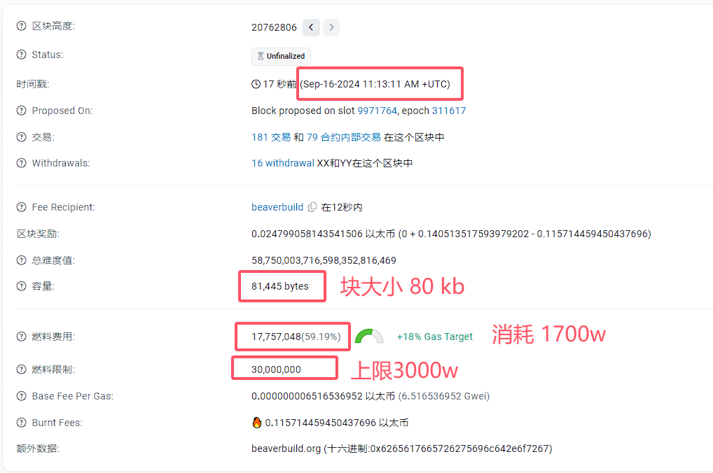

# 以太坊的平均块大小是多少？

截至2024年, 大约70KB，实际值取决于具体情况。

以太坊的块大小并不是以字节为单位直接限定的，而是**通过Gas Limit来间接控制**的。

# Gas Limit

Gas Limit是一个区块可以执行的最大Gas总量，Gas是用来计量执行智能合约和交易时所需的成本的一种计量单位。

因此，以太坊的“块大小”通常是用Gas Limit来衡量，而不是传统意义上的字节数。

以太坊的Gas Limit最初被设定在一个较低的水平，随着时间推移，社区可以通过硬分叉等方式来调整这个值。这意味着，随着网络需求的增长，社区可以选择提高Gas
Limit来容纳更多的交易。

**截至2024年初，以太坊的平均Gas Limit大约在1500万左右**，上限是3000万, 这取决于网络的需求和拥堵情况，实际的Gas
Limit可能会有所波动。

# 具体消耗

**一般来说，一笔以太坊交易至少需要21000 Gas**，这是执行交易的基础费用。

但是，复杂交易和智能合约的调用可能会消耗更多的Gas。此外，交易的数据负载（data payload）也会占用Gas，例如发送带有数据的有效载荷的交易可能会消耗更多Gas。

如果我们假设一个区块完全由简单的交易组成，那么理论上一个区块最多能包含的交易数量大约为 `Gas Limit / 基础Gas费用`。

**以1500万Gas Limit为例**

- 如果每个交易都只消耗21000 Gas
- 则一个区块最多可以包含大约 `15,000,000 / 21,000 ≈ 714` 笔简单的交易。

至于交易的实际数据大小，一笔交易的元数据（metadata）加上签名信息（signature）大约是几百字节 == 几百个 B。

如果假设每笔交易平均占用200字节（这只是估计值，实际数据大小会根据交易的具体内容有所不同），那么714笔交易将会占据约 `714 * 200 = 142,800`
字节，也就是大约142.8KB, 也就是 150kb。

