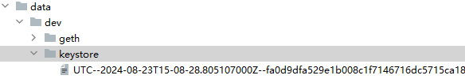

### geth客户端的帐户存储在哪里

在keystore目录中。

Geth 客户端的账户信息存储在其数据目录（`--datadir` 指定的目录）内的一个子目录中。

账户是以加密的形式存储的，每个账户都有一个对应的 keystore 文件。

keystore 文件是一个 JSON 格式的文件，其中包含了加密后的私钥和其他元数据。



### 存储位置

默认情况下，Geth 会在用户主目录下的 `.ethereum` 目录中存储其数据。具体位置取决于操作系统：

- **Linux**：`~/.ethereum`
- **macOS**：`~/Library/Ethereum`
- **Windows**：`%APPDATA%\Ethereum`

在这些目录下，账户信息存储在 `keystore` 子目录中。例如，在 Linux 系统上，账户文件通常位于：

```
~/.ethereum/keystore/
```

### 文件格式

每个账户都有一个对应的 keystore 文件，文件名通常形如 `UTC--<timestamp>--<address>`，其中 `<timestamp>`
是创建账户的时间戳，而 `<address>` 是该账户的地址。

假设你使用的是 Linux 系统，并且没有指定其他的 `--datadir`，那么你的账户文件可能位于：

```sh
~/.ethereum/keystore/UTC--2024-01-01T00-00-00.000000000Z--0x1234567890123456789012345678901234567890
```

这里的 `0x1234567890123456789012345678901234567890` 是该账户的地址。

### 访问账户

为了保护账户的安全，你需要提供密码才能解锁账户。你可以在 Geth 的控制台中使用 `personal.unlockAccount` 方法来解锁账户。

假设你想解锁一个账户，并且知道该账户的密码：

```js
// Geth 控制台示例
personal.unlockAccount(web3.eth.accounts[0], "your-password", 300)  // 解锁账户，并保持解锁状态 300 秒
```

### 导入新账户

如果你有一个账户的 keystore 文件，并且知道密码，你可以使用 `personal.importRawKey` 方法来导入账户。

```js
// 假设 keystore 文件的内容如下：
// {"address":"0x1234567890123456789012345678901234567890","crypto":{...}}
var keystoreContent = '{"address":"0x1234567890123456789012345678901234567890","crypto":{...}}';
var password = "your-password";

personal.importRawKey(keystoreContent, password);  // 导入账户
```

### 创建新账户

你也可以在 Geth 控制台中创建一个新的账户，并保存到 keystore 文件夹中。

```js
// 创建新账户并保存密码
var newPassword = "new-password";
personal.newAccount(newPassword);
```

### 总结

Geth 客户端的账户存储在其数据目录下的 `keystore` 子目录中，账户文件是加密的 keystore 文件。

为了使用账户，你需要知道账户的密码来解锁账户。

通过 Geth 的控制台，你可以管理账户，包括解锁账户、导入账户和创建新账户。

确保妥善保管密码，并保护好 keystore 文件，以免造成资金损失。