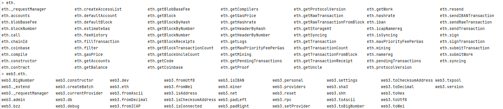
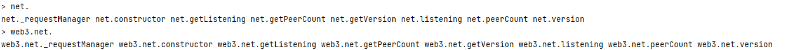
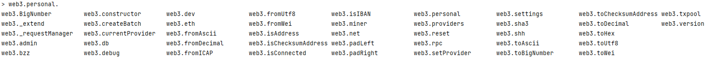
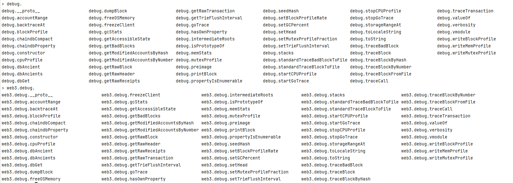
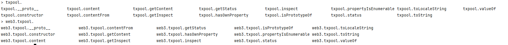

### 你知道geth的哪些API？

Admin、eth、miner、net、personal、shh、debug和txpool。

默认情况下，Geth 的 Admin API 并不是自动启用的，因为它包含了一些可能会影响节点安全性的管理功能。

Geth 提供了大量的 JSON-RPC API，这些 API 可以让你执行各种与以太坊区块链相关的操作，包括管理账户、发送交易、管理智能合约等。

### Web3 API

通用的起点, 可以调用所有api。

#### Web3 相关的 API

1. **web3_clientVersion**
    - 返回客户端的版本信息。
2. **web3_sha3**
    - 计算数据的 Keccak-256 哈希值。

### Eth API

#### 通用的以太坊 API

1. **eth_protocolVersion**
    - 返回客户端的协议版本。
2. **eth_syncing**
    - 检查客户端是否正在同步区块链。
3. **eth_coinbase**
    - 返回当前客户端挖矿所使用的账户地址。
4. **eth_mining**
    - 检查客户端是否正在进行挖矿。
5. **eth_hashrate**
    - 返回当前挖矿的哈希率。
6. **eth_gasPrice**
    - 返回当前建议的 gas 价格。
7. **eth_accounts**
    - 列出所有可用的账户。
8. **eth_blockNumber**
    - 返回当前区块链的区块高度。
9. **eth_getBalance**
    - 查询指定账户在指定区块高度下的余额。
10. **eth_getStorageAt**
    - 获取账户在指定区块高度下的存储槽。
11. **eth_getTransactionCount**
    - 获取账户在指定区块高度下的非空交易数。
12. **eth_getBlockByHash**
    - 通过区块哈希获取区块信息。
13. **eth_getBlockByNumber**
    - 通过区块高度获取区块信息。
14. **eth_getTransactionByHash**
    - 通过交易哈希获取交易信息。
15. **eth_getTransactionByBlockHashAndIndex**
    - 通过区块哈希和交易索引获取交易信息。
16. **eth_getTransactionByBlockNumberAndIndex**
    - 通过区块高度和交易索引获取交易信息。
17. **eth_getTransactionReceipt**
    - 获取指定交易的收据。
18. **eth_call**
    - 执行一个消息调用，返回执行结果。
19. **eth_estimateGas**
    - 估计执行一个消息调用所需的 gas。
20. **eth_sendTransaction**
    - 发送一个新交易。
21. **eth_sendRawTransaction**
    - 发送一个已签名的交易。
22. **eth_submitWork**
    - 提交挖矿工作。
23. **eth_submitHashrate**
    - 提交挖矿哈希率。
24. **eth_newFilter**
    - 创建一个新的过滤器对象，用于订阅日后的日志条目。
25. **eth_uninstallFilter**
    - 卸载一个过滤器。
26. **eth_getLogs**
    - 获取日志条目。
27. **eth_getWork**
    - 获取挖矿工作的数据。
28. **eth_submitWork**
    - 提交挖矿工作的结果。
29. **eth_newBlockFilter**
    - 创建一个新的过滤器对象，用于订阅新的区块。
30. **eth_newPendingTransactionFilter**
    - 创建一个新的过滤器对象，用于订阅新的未确认交易。
31. **eth_getFilterChanges**
    - 获取自上次调用此方法以来的过滤器更改。
32. **eth_getFilterLogs**
    - 获取所有匹配过滤器的日志条目。
33. **eth_getUncleByBlockHashAndIndex**
    - 通过区块哈希和叔块索引获取叔块信息。
34. **eth_getUncleByBlockNumberAndIndex**
    - 通过区块高度和叔块索引获取叔块信息。
35. **eth_getUncleCountByBlockHash**
    - 获取指定区块的叔块数量。
36. **eth_getUncleCountByBlockNumber**
    - 获取指定区块的叔块数量。
37. **eth_getCode**
    - 获取指定账户在指定区块高度下的代码。
38. **eth_sign**
    - 使用私钥对数据进行签名。
39. **eth_signTransaction**
    - 使用私钥对交易进行签名。
40. **eth_signTypedData**
    - 使用私钥对类型化的数据进行签名。

### Net API

#### 网络相关的 API

1. **net_version**
    - 返回网络ID。
2. **net_peerCount**
    - 返回当前连接的对等节点数量。
3. **net_listening**
    - 检查客户端是否正在监听网络。

### Personal API

只能用web3调用。

#### 与账户管理相关的 API

1. **personal_importRawKey**
    - 导入一个未加密的私钥。
2. **personal_listAccounts**
    - 列出所有已知账户。
3. **personal_lockAccount**
    - 锁定一个账户。
4. **personal_newAccount**
    - 创建一个新的加密账户。
5. **personal_sendTransaction**
    - 发送一个交易，需要账户解锁。
6. **personal_sign**
    - 使用私钥对数据进行签名。
7. **personal_unlockAccount**
    - 解锁一个账户。
8. **personal_updateAccount**
    - 更新账户密码。

### Admin API

默认情况下，Geth 的 Admin API 并不是自动启用的，因为它包含了一些可能会影响节点安全性的管理功能。

#### 管理节点相关的 API

1. **admin_addPeer**
    - 添加一个静态节点。
2. **admin_datadir**
    - 返回数据目录。
3. **admin_nodeInfo**
    - 返回节点信息。
4. **admin_peers**
    - 返回当前连接的对等节点列表。
5. **admin_setSolc**
    - 设置默认的 Solidity 编译器。
6. **admin_startRPC**
    - 启动一个 JSON-RPC 服务器。
7. **admin_startWS**
    - 启动一个 WebSocket 服务器。
8. **admin_stopRPC**
    - 停止 JSON-RPC 服务器。
9. **admin_stopWS**
    - 停止 WebSocket 服务器。

### Debug API

#### 调试相关的 API

1. **debug_backtraceAt**
    - 返回给定事务的回溯。
2. **debug_blockProfile**
    - 生成区块级别的性能分析报告。
3. **debug_cpuProfile**
    - 生成 CPU 级别的性能分析报告。
4. **debug_dumpBlock**
    - 导出一个区块的状态树。
5. **debug_freeOSMemory**
    - 释放操作系统内存。
6. **debug_gcStats**
    - 获取垃圾回收统计信息。
7. **debug_goTrace**
    - 生成 Go 级别的跟踪报告。
8. **debug_memStats**
    - 获取内存统计信息。
9. **debug_seedHash**
    - 获取挖矿种子哈希。
10. **debug_setBlockProfileRate**
    - 设置区块级别的性能分析速率。
11. **debug_setGCPercent**
    - 设置垃圾回收百分比。
12. **debug_setHead**
    - 设置当前头部区块。
13. **debug_startCPUProfile**
    - 开始 CPU 级别的性能分析。
14. **debug_startGoTrace**
    - 开始 Go 级别的跟踪。
15. **debug_stopCPUProfile**
    - 停止 CPU 级别的性能分析。
16. **debug_stopGoTrace**
    - 停止 Go 级别的跟踪。
17. **debug_traceBlockByNumber**
    - 跟踪一个区块的执行。
18. **debug_traceBlockByHash**
    - 跟踪一个区块的执行。
19. **debug_traceBlock**
    - 跟踪一个区块的执行。
20. **debug_traceTransaction**
    - 跟踪一个交易的执行。
21. **debug_tracingOn**
    - 开启追踪。
22. **debug_tracingOff**
    - 关闭追踪。

### Txpool API

#### 交易池相关的 API

1. **txpool_content**
    - 获取交易池的内容。
2. **txpool_inspect**
    - 获取交易池的状态信息。
3. **txpool_status**
    - 获取交易池的状态。

