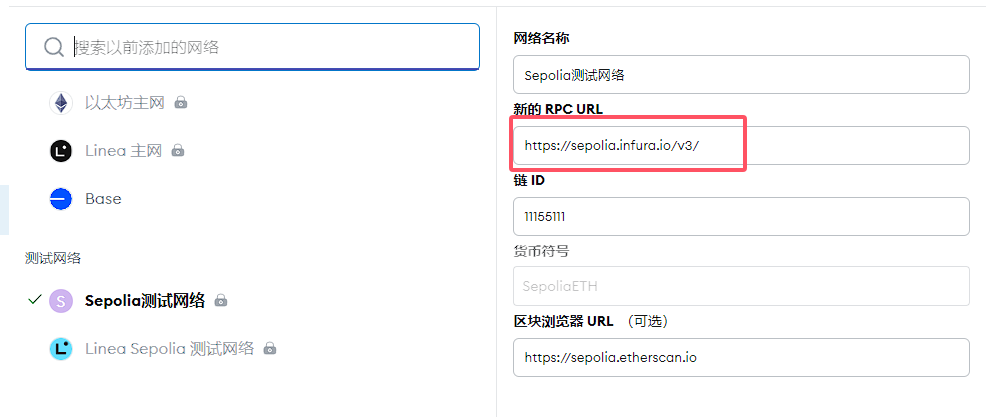

### Metamask使用哪个以太坊节点

使用infura.io。

MetaMask 默认情况下并不是直接连接到 Ethereum 节点，而是通过一个中间层来与 Ethereum 网络通信。

这个中间层被称为“Infura”。然而，用户可以选择更改默认设置，使用其他 Ethereum 节点服务。

### 默认设置：Infura

1. Infura：
    - Infura 是一个由 ConsenSys 提供的 API 服务，它可以作为一个中间层来与 Ethereum 网络交互。
    - 使用 Infura 的好处在于它提供了一个可靠的、托管的服务，可以减轻用户自己运行节点的压力。
    - Infura 通过 HTTPS 协议与 MetaMask 通信，确保了数据传输的安全性。

### 更改默认设置

如果你希望使用其他的 Ethereum 节点服务，MetaMask 提供了自定义 RPC 端点的功能。这允许用户连接到不同的节点，甚至是自己运行的全节点。

#### 如何更改 RPC 端点

1. **打开 MetaMask 设置**：
    - 在 MetaMask 插件中，点击右上角的三条横线图标，选择“Settings”（设置）。
2. **选择网络**：
    - 在设置页面中找到“Network”（网络）选项，选择你要使用的网络（如 Mainnet、Ropsten、Rinkeby、Goerli 等）。
3. **添加自定义网络**：
    - 点击“Add Network”（添加网络）按钮。
    - 在弹出的窗口中输入网络的详细信息，包括网络名称、RPC URL、Chain ID、Currency Symbol 和 Block Explorer URL。

