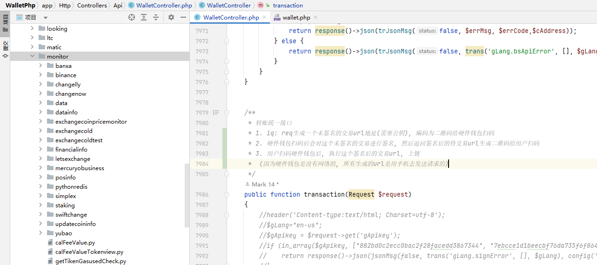
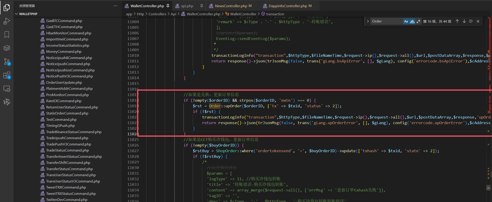

# 转账统一接口

1. iq: req生成一个未签名的交易url地址(需要公钥), 编码为二维码给硬件钱包扫码

2. 硬件钱包扫码后会对这个未签名的交易进行签名, 然后返回签名后的待交易url生成二维码给用户扫码

3. 用户扫码硬件钱包后, 执行这个签名后的交易url, 上链

   (因为硬件钱包是没有网络的, 所有生成的url是用手机去发送请求的)


```php
public function transaction(Request $request)
```




```
[2024-10-24 06:13:34] ServerDev.INFO: 转账统一接口,参数= {"cType":"SOL","cAddress":"Ey4cy88yzRbNU5ebjG4fFvEJ9EgbZYgjsQs6jdM2HbW6","dAddress":"8KqVjppirTCfqmztoYg12oxLMZcwUHFwaY62FeeZq3Rg","httpType":"req","amount":"180000000","agency":"10000.0","pubkey":"cf848c741d1989c0f779851b9ecbd6fdf9084d1382ed4da19163185dfc4fe46f","orderID":"ewtn6011d810a78e460a985df5e8dc286254","gLang":"zh-cn","newLange":"zh-cn","version":"v2","gVersion":"262","gJpushID":"dpD8NC7j1EpsvLVAoMeVYi:APA91bHvbe95kvYEBntYDqL4cOTsWyzicdry1KjESKLm1T7Q_KpHEijX1hOBUWpfhx_-rJ9cNrk3p1-ilL-G5TfJYrrff1IHuMNbp2S5PhMbcAswUZLcCxIf9SU9JIX7xD0D1VpZsi9X","gDeviceID":"497123C2-4B55-4BF7-8327-27DD095BBC66","gApikey":"59f5b60196e501c5861f1e305d0533fa","gPlatform":"iOS","walletType":"c_EC02_V3.12.0.2","currency":"USD","did":"540014004c00481400c5da04046a1d51"} 
[2024-10-24 06:13:34] ServerDev.INFO: addressDIDinfo-- ["[object] (App\\Models\\AddressLog: {\"id\":3692,\"ctype\":\"SOL\",\"address\":\"Ey4cy88yzRbNU5ebjG4fFvEJ9EgbZYgjsQs6jdM2HbW6\",\"did\":null,\"addresstype\":\"2\",\"ctime\":\"1660890189\",\"utime\":\"1660890189\"})"] 
[2024-10-24 06:13:34] ServerDev.INFO: 订单信息校验失败 {"cType":"SOL","cAddress":"Ey4cy88yzRbNU5ebjG4fFvEJ9EgbZYgjsQs6jdM2HbW6","dAddress":"8KqVjppirTCfqmztoYg12oxLMZcwUHFwaY62FeeZq3Rg","httpType":"req","amount":"180000000","agency":"10000.0","pubkey":"cf848c741d1989c0f779851b9ecbd6fdf9084d1382ed4da19163185dfc4fe46f","orderID":"ewtn6011d810a78e460a985df5e8dc286254","gLang":"zh-cn","newLange":"zh-cn","version":"v2","gVersion":"262","gJpushID":"dpD8NC7j1EpsvLVAoMeVYi:APA91bHvbe95kvYEBntYDqL4cOTsWyzicdry1KjESKLm1T7Q_KpHEijX1hOBUWpfhx_-rJ9cNrk3p1-ilL-G5TfJYrrff1IHuMNbp2S5PhMbcAswUZLcCxIf9SU9JIX7xD0D1VpZsi9X","gDeviceID":"497123C2-4B55-4BF7-8327-27DD095BBC66","gApikey":"59f5b60196e501c5861f1e305d0533fa","gPlatform":"iOS","walletType":"c_EC02_V3.12.0.2","currency":"USD","did":"540014004c00481400c5da04046a1d51"} 
[2024-10-24 06:13:34] ServerDev.INFO: 转账 transaction or transactionMax =  {"address":"Ey4cy88yzRbNU5ebjG4fFvEJ9EgbZYgjsQs6jdM2HbW6","status":false,"msg":"请稍候重试！","code":10001,"data":[]}
```


# 更新状态和tx



```php
//如果是兑换，更新订单信息
if (!empty($orderID) && strpos($orderID, 'ewtn') === 0) {
    $rst = Order::upOrder($orderID, ['tx' => $txid, 'status' => 2]);
    if (!$rst) {
        transactionLogInfo("transaction",$httpType,$fileNameTime,$request->ip(),$request->all(),$url,$postDataArray,$response,'upOrderError');
        return response()->json(trJsonMsg(false, trans('gLang.upOrderError', [], $gLang), config('errorcode.upOrderError'),$cAddress));
    }
}
```

